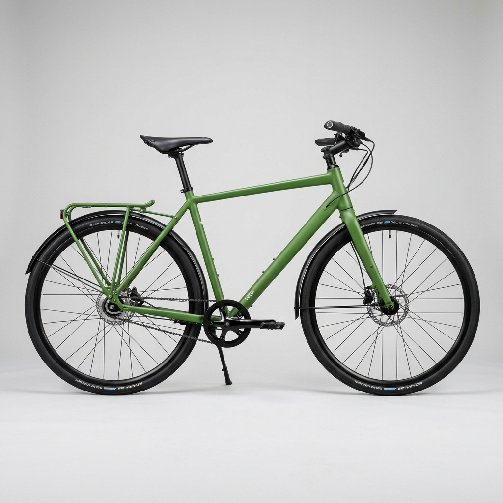
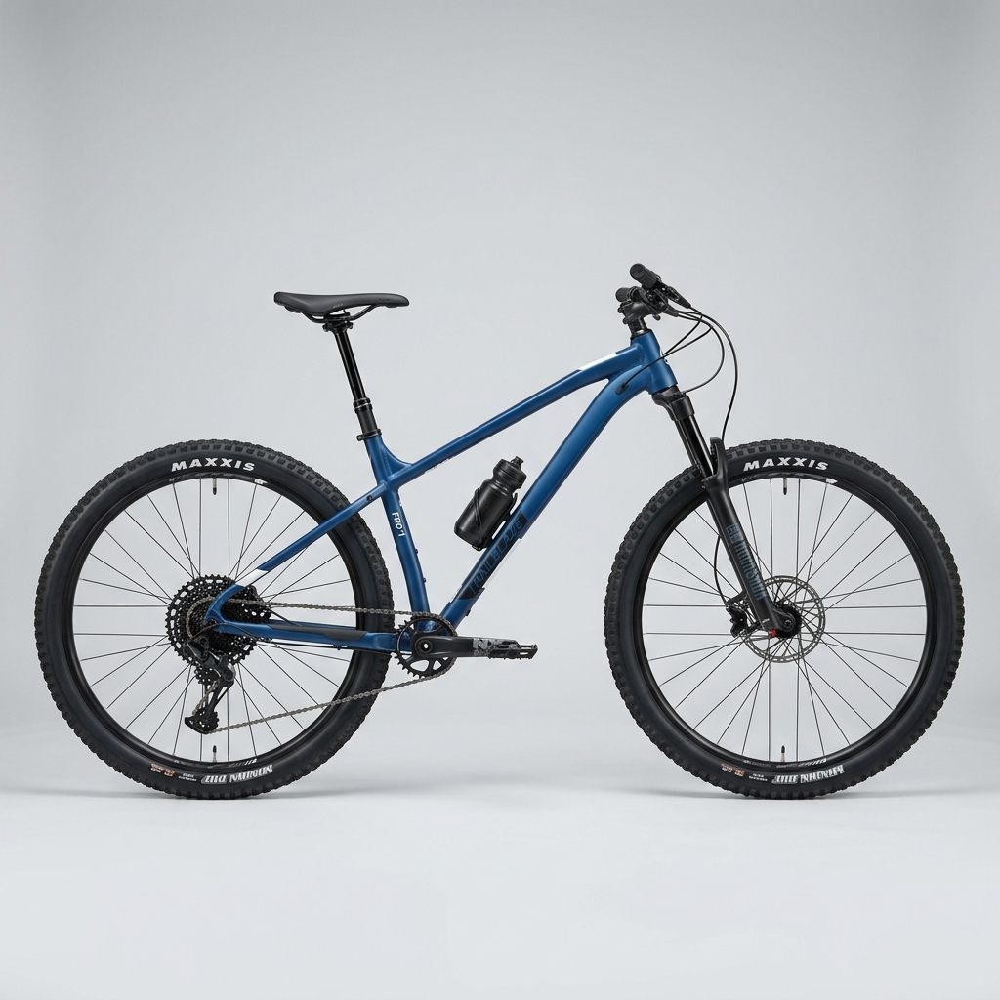

<!DOCTYPE html>
<html lang="en" data-theme="dark">

<head>
  <meta charset="UTF-8">
  <meta name="viewport" content="width=device-width, initial-scale=1.0">
  <meta name="description"
    content="RabtaChat Pro - Pakistan Ki Super App. A world-class messaging platform designed for Pakistan first, and then the global market. The future of communication with real-time AI translation, crystal-clear calls, and enterprise-grade security.">
  <meta name="keywords"
    content="Pakistan Ki Super App, AI messenger, live translation, video calls, chat, communication platform">
  <title>RabtaChat Pro — Pakistan Ki Super App</title>
  <link rel="preconnect" href="https://fonts.googleapis.com">
  <link
    href="https://fonts.googleapis.com/css2?family=Inter:wght@300;400;500;600;700;800;900&family=JetBrains+Mono:wght@400;500;600&display=swap"
    rel="stylesheet">
  <link rel="stylesheet" href="https://cdnjs.cloudflare.com/ajax/libs/font-awesome/6.5.1/css/all.min.css">
  <link href="https://cdn.jsdelivr.net/npm/tom-select@2.2.2/dist/css/tom-select.css" rel="stylesheet">
  
  
  <style>
    /* ═══════════════════════════════════════════════════════════════
   CSS CUSTOM PROPERTIES & DESIGN TOKENS
   ═══════════════════════════════════════════════════════════════ */
    :root {
      /* Dark Theme (default) */
      --bg-primary: #0a0a0f;
      --bg-secondary: #12121a;
      --bg-tertiary: #1a1a2e;
      --bg-panel: #161622;
      --bg-card: rgba(255, 255, 255, 0.03);
      --bg-card-hover: rgba(255, 255, 255, 0.06);
      --bg-glass: rgba(255, 255, 255, 0.05);
      --bg-glass-strong: rgba(255, 255, 255, 0.1);
      --bg-input: rgba(255, 255, 255, 0.05);
      --border-color: rgba(255, 255, 255, 0.08);
      --border-glow: rgba(99, 102, 241, 0.3);
      --text-primary: #ffffff;
      --text-secondary: rgba(255, 255, 255, 0.85);
      --text-tertiary: rgba(255, 255, 255, 0.65);
      --text-muted: rgba(255, 255, 255, 0.5);
      --accent-primary: #6366f1;
      --accent-secondary: #8b5cf6;
      --accent-tertiary: #a78bfa;
      --accent-gradient: linear-gradient(135deg, #6366f1, #8b5cf6, #a78bfa);
      --accent-gradient-h: linear-gradient(90deg, #6366f1, #8b5cf6, #a78bfa);
      --success: #10b981;
      --warning: #f59e0b;
      --danger: #ef4444;
      --info: #3b82f6;
      --shadow-sm: 0 2px 8px rgba(0, 0, 0, 0.3);
      --shadow-md: 0 4px 16px rgba(0, 0, 0, 0.4);
      --shadow-lg: 0 8px 32px rgba(0, 0, 0, 0.5);
      --shadow-xl: 0 16px 64px rgba(0, 0, 0, 0.6);
      --shadow-glow: 0 0 30px rgba(99, 102, 241, 0.15);
      --radius-sm: 8px;
      --radius-md: 12px;
      --radius-lg: 16px;
      --radius-xl: 24px;
      --radius-full: 9999px;
      --blur: 20px;
      --blur-strong: 40px;
      --transition-fast: 0.15s ease;
      --transition-normal: 0.3s ease;
      --transition-slow: 0.5s cubic-bezier(0.4, 0, 0.2, 1);
      --font-sans: 'Inter', -apple-system, BlinkMacSystemFont, sans-serif;
      --font-mono: 'JetBrains Mono', monospace;
      --sidebar-width: 320px;
      --header-height: 64px;
    }

    [data-theme="light"] {
      --bg-primary: #f8f9fc;
      --bg-secondary: #ffffff;
      --bg-tertiary: #eef0f6;
      --bg-panel: #ffffff;
      --bg-card: rgba(0, 0, 0, 0.02);
      --bg-card-hover: rgba(0, 0, 0, 0.04);
      --bg-glass: rgba(255, 255, 255, 0.7);
      --bg-glass-strong: rgba(255, 255, 255, 0.85);
      --bg-input: rgba(0, 0, 0, 0.04);
      --border-color: rgba(0, 0, 0, 0.08);
      --border-glow: rgba(99, 102, 241, 0.2);
      --text-primary: #1a1a2e;
      --text-secondary: rgba(26, 26, 46, 0.85);
      --text-tertiary: rgba(26, 26, 46, 0.65);
      --text-muted: rgba(26, 26, 46, 0.5);
      --shadow-sm: 0 2px 8px rgba(0, 0, 0, 0.06);
      --shadow-md: 0 4px 16px rgba(0, 0, 0, 0.08);
      --shadow-lg: 0 8px 32px rgba(0, 0, 0, 0.1);
      --shadow-xl: 0 16px 64px rgba(0, 0, 0, 0.12);
      --shadow-glow: 0 0 30px rgba(99, 102, 241, 0.08);
    }

    /* ═══════════════════════════════════════════════════════════════
   RESET & BASE
   ═══════════════════════════════════════════════════════════════ */
    *,
    *::before,
    *::after {
      margin: 0;
      padding: 0;
      box-sizing: border-box;
    }

    html {
      scroll-behavior: smooth;
      font-size: 16px;
    }

    body {
      font-family: var(--font-sans);
      background: var(--bg-primary);
      color: var(--text-primary);
      line-height: 1.6;
      overflow-x: hidden;
      -webkit-font-smoothing: antialiased;
      -moz-osx-font-smoothing: grayscale;
    }

    a {
      text-decoration: none;
      color: inherit;
    }

    button {
      cursor: pointer;
      border: none;
      background: none;
      font-family: inherit;
    }

    input,
    textarea,
    select {
      font-family: inherit;
      outline: none;
      border: none;
      background: none;
    }

    option {
      background: var(--bg-secondary);
      color: var(--text-primary);
    }

    ul,
    ol {
      list-style: none;
    }

    img {
      max-width: 100%;
      display: block;
    }

    ::-webkit-scrollbar {
      width: 6px;
    }

    ::-webkit-scrollbar-track {
      background: rgba(0, 0, 0, 0.03);
    }

    ::-webkit-scrollbar-thumb {
      background: var(--border-color);
      border-radius: 3px;
    }

    ::-webkit-scrollbar-thumb:hover {
      background: var(--text-tertiary);
    }

    ::selection {
      background: var(--accent-primary);
      color: #fff;
    }

    /* ═══════════════════════════════════════════════════════════════
   AURORA ANIMATED BACKGROUND
   ═══════════════════════════════════════════════════════════════ */
    .aurora-bg {
      position: fixed;
      top: 0;
      left: 0;
      width: 100%;
      height: 100%;
      z-index: -1;
      background: radial-gradient(circle at 10% 20%, rgba(99, 102, 241, 0.04) 0%, transparent 40%),
        radial-gradient(circle at 90% 80%, rgba(236, 72, 153, 0.04) 0%, transparent 40%),
        var(--bg-primary);
    }

    /* ═══════════════════════════════════════════════════════════════
   LOADING SCREEN
   ═══════════════════════════════════════════════════════════════ */
    #loading-screen {
      position: fixed;
      inset: 0;
      z-index: 100000;
      display: flex;
      align-items: center;
      justify-content: center;
      flex-direction: column;
      gap: 30px;
      background: var(--bg-primary);
      transition: opacity 0.5s, visibility 0.5s;
    }

    #loading-screen.hidden {
      opacity: 0;
      visibility: hidden;
      pointer-events: none;
    }

    .loader-logo {
      font-size: 2.5rem;
      font-weight: 800;
      background: var(--accent-gradient);
      -webkit-background-clip: text;
      -webkit-text-fill-color: transparent;
      animation: pulse-glow 2s ease-in-out infinite;
    }

    .loader-bar {
      width: 200px;
      height: 3px;
      background: var(--bg-glass);
      border-radius: 3px;
      overflow: hidden;
    }

    .loader-bar-fill {
      width: 0%;
      height: 100%;
      background: var(--accent-gradient-h);
      border-radius: 3px;
      animation: load-bar 2s ease-in-out forwards;
    }

    @keyframes load-bar {
      0% {
        width: 0%
      }

      50% {
        width: 70%
      }

      100% {
        width: 100%
      }
    }

    @keyframes pulse-glow {

      0%,
      100% {
        filter: drop-shadow(0 0 10px rgba(99, 102, 241, 0.3));
      }

      50% {
        filter: drop-shadow(0 0 25px rgba(99, 102, 241, 0.6));
      }
    }

    /* ═══════════════════════════════════════════════════════════════
   GLASS CARD
   ═══════════════════════════════════════════════════════════════ */
    .glass-card {
      background: var(--bg-glass);
      backdrop-filter: blur(var(--blur));
      -webkit-backdrop-filter: blur(var(--blur));
      border: 1px solid var(--border-color);
      border-radius: var(--radius-lg);
      transition: all var(--transition-normal);
    }

    .glass-card:hover {
      background: var(--bg-glass-strong);
      border-color: var(--border-glow);
      box-shadow: var(--shadow-glow);
      transform: translateY(-2px);
    }

    /* ═══════════════════════════════════════════════════════════════
   BUTTONS
   ═══════════════════════════════════════════════════════════════ */
    .btn {
      display: inline-flex;
      align-items: center;
      justify-content: center;
      gap: 8px;
      padding: 12px 28px;
      border-radius: var(--radius-full);
      font-weight: 600;
      font-size: 0.9rem;
      transition: all var(--transition-normal);
      position: relative;
      overflow: hidden;
    }

    .btn::before {
      content: '';
      position: absolute;
      inset: 0;
      opacity: 0;
      background: linear-gradient(45deg, transparent, rgba(255, 255, 255, 0.1), transparent);
      transition: opacity 0.3s;
    }

    .btn:hover::before {
      opacity: 1;
    }

    .btn-primary {
      background: var(--accent-gradient);
      color: #fff;
      box-shadow: 0 4px 20px rgba(99, 102, 241, 0.3);
    }

    .btn-primary:hover {
      box-shadow: 0 6px 30px rgba(99, 102, 241, 0.5);
      transform: translateY(-2px);
    }

    .btn-secondary {
      background: var(--bg-glass);
      color: var(--text-primary);
      border: 1px solid var(--border-color);
    }

    .btn-secondary:hover {
      background: var(--bg-glass-strong);
      border-color: var(--border-glow);
    }

    .btn-ghost {
      color: var(--text-secondary);
    }

    .btn-ghost:hover {
      color: var(--text-primary);
      background: var(--bg-glass);
    }

    .btn-icon {
      width: 40px;
      height: 40px;
      padding: 0;
      border-radius: var(--radius-full);
      display: flex;
      align-items: center;
      justify-content: center;
      background: var(--bg-glass);
      color: var(--text-secondary);
      border: 1px solid var(--border-color);
      transition: all var(--transition-normal);
    }

    .btn-icon:hover {
      color: var(--text-primary);
      background: var(--bg-glass-strong);
      border-color: var(--border-glow);
      transform: scale(1.05);
    }

    .btn-lg {
      padding: 16px 36px;
      font-size: 1rem;
    }

    .btn-sm {
      padding: 8px 18px;
      font-size: 0.8rem;
    }

    /* ═══════════════════════════════════════════════════════════════
   INPUTS
   ═══════════════════════════════════════════════════════════════ */
    .input-group {
      position: relative;
      margin-bottom: 20px;
    }

    .input-group input,
    .input-group textarea {
      width: 100%;
      padding: 14px 16px;
      padding-left: 44px;
      background: var(--bg-input);
      border: 1px solid var(--border-color);
      border-radius: var(--radius-md);
      color: var(--text-primary);
      font-size: 0.95rem;
      transition: all var(--transition-normal);
    }

    .input-group input:focus,
    .input-group textarea:focus {
      border-color: var(--accent-primary);
      box-shadow: 0 0 0 3px rgba(99, 102, 241, 0.15);
      background: var(--bg-glass-strong);
    }

    .input-group .input-icon {
      position: absolute;
      left: 14px;
      top: 50%;
      transform: translateY(-50%);
      color: var(--text-tertiary);
      font-size: 0.95rem;
      transition: color var(--transition-normal);
    }

    .input-group input:focus+.input-icon,
    .input-group input:focus~.input-icon {
      color: var(--accent-primary);
    }

    .input-group label {
      display: block;
      margin-bottom: 6px;
      font-size: 0.85rem;
      color: var(--text-secondary);
      font-weight: 500;
    }

    .input-group input::placeholder {
      color: var(--text-muted);
    }

    .input-group input[type="file"] {
      padding: 8px 12px;
      background: var(--bg-input);
      border: 1px solid var(--border-color);
      border-radius: var(--radius-md);
      color: var(--text-secondary);
      font-size: 0.85rem;
      cursor: pointer;
      height: auto;
    }

    .input-group input[type="file"]::file-selector-button {
      background: var(--accent-gradient);
      border: none;
      border-radius: var(--radius-sm);
      color: #fff;
      padding: 6px 12px;
      cursor: pointer;
      transition: all var(--transition-fast);
      font-weight: 600;
      font-size: 0.8rem;
      margin-right: 12px;
      box-shadow: 0 2px 6px rgba(99, 102, 241, 0.2);
    }

    .input-group input[type="file"]::file-selector-button:hover {
      transform: translateY(-1px);
      box-shadow: 0 4px 12px rgba(99, 102, 241, 0.4);
    }

    /* ═══════════════════════════════════════════════════════════════
   BADGES & TAGS
   ═══════════════════════════════════════════════════════════════ */
    .badge {
      display: inline-flex;
      align-items: center;
      gap: 4px;
      padding: 4px 10px;
      border-radius: var(--radius-full);
      font-size: 0.7rem;
      font-weight: 600;
      text-transform: uppercase;
      letter-spacing: 0.5px;
    }

    .badge-primary {
      background: rgba(99, 102, 241, 0.15);
      color: var(--accent-primary);
    }

    .badge-success {
      background: rgba(16, 185, 129, 0.15);
      color: var(--success);
    }

    .badge-warning {
      background: rgba(245, 158, 11, 0.15);
      color: var(--warning);
    }

    .badge-danger {
      background: rgba(239, 68, 68, 0.15);
      color: var(--danger);
    }

    .badge-dot {
      width: 6px;
      height: 6px;
      border-radius: 50%;
    }

    .badge-dot.online {
      background: var(--success);
      box-shadow: 0 0 8px var(--success);
    }

    .badge-dot.offline {
      background: var(--text-muted);
    }

    .badge-dot.busy {
      background: var(--danger);
      box-shadow: 0 0 8px var(--danger);
    }

    .unread-badge {
      min-width: 20px;
      height: 20px;
      display: flex;
      align-items: center;
      justify-content: center;
      background: var(--accent-primary);
      color: #fff;
      border-radius: var(--radius-full);
      font-size: 0.7rem;
      font-weight: 700;
      padding: 0 6px;
    }

    /* ═══════════════════════════════════════════════════════════════
   AVATAR
   ═══════════════════════════════════════════════════════════════ */
    .avatar {
      position: relative;
      width: 44px;
      height: 44px;
      border-radius: var(--radius-full);
      overflow: hidden;
      flex-shrink: 0;
      background: var(--accent-gradient);
      display: flex;
      align-items: center;
      justify-content: center;
      font-weight: 700;
      font-size: 1rem;
      color: #fff;
    }

    .avatar img {
      width: 100%;
      height: 100%;
      object-fit: cover;
    }

    .avatar .status-dot {
      position: absolute;
      bottom: 1px;
      right: 1px;
      width: 12px;
      height: 12px;
      border-radius: 50%;
      border: 2px solid var(--bg-secondary);
    }

    .avatar-sm {
      width: 32px;
      height: 32px;
      font-size: 0.75rem;
    }

    .avatar-lg {
      width: 56px;
      height: 56px;
      font-size: 1.3rem;
    }

    .avatar-xl {
      width: 80px;
      height: 80px;
      font-size: 1.8rem;
    }

    .avatar-xxl {
      width: 120px;
      height: 120px;
      font-size: 2.5rem;
    }

    .avatar-group {
      display: flex;
    }

    .avatar-group .avatar {
      margin-left: -12px;
      border: 2px solid var(--bg-secondary);
    }

    .avatar-group .avatar:first-child {
      margin-left: 0;
    }

    /* ═══════════════════════════════════════════════════════════════
   SKELETON LOADING
   ═══════════════════════════════════════════════════════════════ */
    .skeleton {
      background: linear-gradient(90deg, var(--bg-glass) 25%, var(--bg-glass-strong) 50%, var(--bg-glass) 75%);
      background-size: 200% 100%;
      animation: shimmer 1.5s infinite;
      border-radius: var(--radius-sm);
    }

    @keyframes shimmer {
      0% {
        background-position: 200% 0
      }

      100% {
        background-position: -200% 0
      }
    }

    /* ═══════════════════════════════════════════════════════════════
   PAGE TRANSITIONS
   ═══════════════════════════════════════════════════════════════ */
    .page {
      display: none;
      opacity: 0;
      animation: none;
      min-height: 100vh;
    }

    .page.active {
      display: block;
      opacity: 1;
      animation: pageIn 0.4s cubic-bezier(0.4, 0, 0.2, 1);
    }

    @keyframes pageIn {
      0% {
        opacity: 0;
        transform: translateY(20px);
      }

      100% {
        opacity: 1;
        transform: translateY(0);
      }
    }

    @keyframes fadeIn {
      0% {
        opacity: 0
      }

      100% {
        opacity: 1
      }
    }

    @keyframes slideUp {
      0% {
        opacity: 0;
        transform: translateY(40px);
      }

      100% {
        opacity: 1;
        transform: translateY(0);
      }
    }

    @keyframes slideIn {
      0% {
        opacity: 0;
        transform: translateX(-30px);
      }

      100% {
        opacity: 1;
        transform: translateX(0);
      }
    }

    @keyframes scaleIn {
      0% {
        opacity: 0;
        transform: scale(0.9);
      }

      100% {
        opacity: 1;
        transform: scale(1);
      }
    }

    @keyframes float {

      0%,
      100% {
        transform: translateY(0);
      }

      50% {
        transform: translateY(-10px);
      }
    }

    /* ═══════════════════════════════════════════════════════════════
   TOOLTIP
   ═══════════════════════════════════════════════════════════════ */
    .tooltip {
      position: relative;
    }

    .tooltip::after {
      content: attr(data-tip);
      position: absolute;
      bottom: 120%;
      left: 50%;
      transform: translateX(-50%) scale(0.8);
      padding: 6px 12px;
      background: var(--bg-tertiary);
      color: var(--text-primary);
      border-radius: var(--radius-sm);
      font-size: 0.75rem;
      white-space: nowrap;
      opacity: 0;
      pointer-events: none;
      transition: all var(--transition-fast);
      border: 1px solid var(--border-color);
    }

    .tooltip:hover::after {
      opacity: 1;
      transform: translateX(-50%) scale(1);
    }

    /* ═══════════════════════════════════════════════════════════════
   MODAL / OVERLAY
   ═══════════════════════════════════════════════════════════════ */
    .modal-overlay {
      position: fixed;
      inset: 0;
      z-index: 10000;
      display: none;
      align-items: center;
      justify-content: center;
      padding: 20px;
      background: rgba(0, 0, 0, 0.6);
      backdrop-filter: blur(8px);
      animation: fadeIn 0.2s;
    }

    .modal-overlay.active {
      display: flex;
    }

    .modal {
      background: var(--bg-secondary);
      border: 1px solid var(--border-color);
      border-radius: var(--radius-xl);
      padding: 32px;
      max-width: 500px;
      width: 100%;
      box-shadow: var(--shadow-xl);
      animation: scaleIn 0.3s cubic-bezier(0.4, 0, 0.2, 1);
      max-height: 90vh;
      overflow-y: auto;
    }

    .modal-header {
      display: flex;
      align-items: center;
      justify-content: space-between;
      margin-bottom: 24px;
    }

    .modal-title {
      font-size: 1.3rem;
      font-weight: 700;
    }

    /* ═══════════════════════════════════════════════════════════════
   TOAST NOTIFICATIONS
   ═══════════════════════════════════════════════════════════════ */
    #toast-container {
      position: fixed;
      top: 20px;
      right: 20px;
      z-index: 99999;
      display: flex;
      flex-direction: column;
      gap: 10px;
    }

    .toast {
      display: flex;
      align-items: center;
      gap: 12px;
      padding: 14px 20px;
      border-radius: var(--radius-md);
      background: var(--bg-secondary);
      border: 1px solid var(--border-color);
      box-shadow: var(--shadow-lg);
      min-width: 300px;
      animation: slideToast 0.4s cubic-bezier(0.4, 0, 0.2, 1);
      backdrop-filter: blur(20px);
    }

    .toast.removing {
      animation: slideToastOut 0.3s forwards;
    }

    @keyframes slideToast {
      0% {
        opacity: 0;
        transform: translateX(100%)
      }

      100% {
        opacity: 1;
        transform: translateX(0)
      }
    }

    @keyframes slideToastOut {
      0% {
        opacity: 1;
        transform: translateX(0)
      }

      100% {
        opacity: 0;
        transform: translateX(100%)
      }
    }

    .toast-icon {
      font-size: 1.2rem;
      flex-shrink: 0;
    }

    .toast-content {
      flex: 1;
    }

    .toast-title {
      font-weight: 600;
      font-size: 0.9rem;
    }

    .toast-message {
      font-size: 0.8rem;
      color: var(--text-secondary);
      margin-top: 2px;
    }

    .toast-close {
      color: var(--text-tertiary);
      cursor: pointer;
      padding: 4px;
    }

    .toast.success .toast-icon {
      color: var(--success);
    }

    .toast.error .toast-icon {
      color: var(--danger);
    }

    .toast.warning .toast-icon {
      color: var(--warning);
    }

    .toast.info .toast-icon {
      color: var(--info);
    }

    /* ═══════════════════════════════════════════════════════════════
   NAVIGATION BAR (Landing)
   ═══════════════════════════════════════════════════════════════ */
    .nav {
      position: fixed;
      top: 0;
      left: 0;
      right: 0;
      z-index: 1000;
      padding: 0 40px;
      height: var(--header-height);
      display: flex;
      align-items: center;
      justify-content: space-between;
      background: rgba(10, 10, 15, 0.8);
      backdrop-filter: blur(20px);
      border-bottom: 1px solid var(--border-color);
      transition: all var(--transition-normal);
    }

    [data-theme="light"] .nav {
      background: rgba(255, 255, 255, 0.85);
    }

    .nav.scrolled {
      box-shadow: var(--shadow-md);
    }

    .nav-brand {
      display: flex;
      align-items: center;
      gap: 10px;
      font-size: 1.4rem;
      font-weight: 800;
      cursor: pointer;
    }

    .nav-brand-icon {
      width: 36px;
      height: 36px;
      background: var(--accent-gradient);
      border-radius: var(--radius-sm);
      display: flex;
      align-items: center;
      justify-content: center;
      font-size: 1.1rem;
      color: #fff;
    }

    .nav-brand span {
      background: var(--accent-gradient);
      -webkit-background-clip: text;
      -webkit-text-fill-color: transparent;
    }

    .nav-links {
      display: flex;
      align-items: center;
      gap: 32px;
    }

    .nav-links a {
      font-size: 0.9rem;
      color: var(--text-secondary);
      font-weight: 500;
      transition: color var(--transition-normal);
      position: relative;
    }

    .nav-links a:hover {
      color: var(--text-primary);
    }

    .nav-links a::after {
      content: '';
      position: absolute;
      bottom: -4px;
      left: 0;
      width: 0;
      height: 2px;
      background: var(--accent-gradient-h);
      transition: width var(--transition-normal);
      border-radius: 1px;
    }

    .nav-links a:hover::after {
      width: 100%;
    }

    .nav-actions {
      display: flex;
      align-items: center;
      gap: 12px;
    }

    .theme-toggle {
      width: 40px;
      height: 40px;
      border-radius: var(--radius-full);
      display: flex;
      align-items: center;
      justify-content: center;
      background: var(--bg-glass);
      border: 1px solid var(--border-color);
      color: var(--text-secondary);
      cursor: pointer;
      transition: all var(--transition-normal);
    }

    .theme-toggle:hover {
      color: var(--text-primary);
      border-color: var(--border-glow);
    }

    .mobile-menu-btn {
      display: none;
    }

    /* ═══════════════════════════════════════════════════════════════
   HERO SECTION
   ═══════════════════════════════════════════════════════════════ */
    .hero {
      min-height: 100vh;
      display: flex;
      align-items: center;
      justify-content: center;
      text-align: center;
      padding: 120px 40px 80px;
      position: relative;
      overflow: hidden;
    }

    .hero-content {
      max-width: 800px;
      z-index: 2;
    }

    .hero-badge {
      display: inline-flex;
      align-items: center;
      gap: 8px;
      padding: 8px 20px;
      border-radius: var(--radius-full);
      background: rgba(99, 102, 241, 0.1);
      border: 1px solid rgba(99, 102, 241, 0.2);
      font-size: 0.85rem;
      color: var(--accent-tertiary);
      font-weight: 500;
      margin-bottom: 24px;
      animation: slideUp 0.6s ease-out;
    }

    .hero-badge .pulse {
      width: 8px;
      height: 8px;
      background: var(--accent-primary);
      border-radius: 50%;
      animation: pulse 2s infinite;
    }

    @keyframes pulse {

      0%,
      100% {
        opacity: 1;
        transform: scale(1)
      }

      50% {
        opacity: 0.5;
        transform: scale(1.5)
      }
    }

    .hero h1 {
      font-size: clamp(2.5rem, 6vw, 4.5rem);
      font-weight: 900;
      line-height: 1.1;
      margin-bottom: 20px;
      letter-spacing: -0.03em;
      animation: slideUp 0.6s ease-out 0.1s both;
    }

    .hero h1 .gradient-text {
      background: var(--accent-gradient);
      -webkit-background-clip: text;
      -webkit-text-fill-color: transparent;
    }

    .hero p {
      font-size: clamp(1rem, 2vw, 1.25rem);
      color: var(--text-secondary);
      max-width: 600px;
      margin: 0 auto 40px;
      line-height: 1.7;
      animation: slideUp 0.6s ease-out 0.2s both;
    }

    .hero-buttons {
      display: flex;
      gap: 16px;
      justify-content: center;
      flex-wrap: wrap;
      animation: slideUp 0.6s ease-out 0.3s both;
    }

    .hero-stats {
      display: flex;
      gap: 48px;
      justify-content: center;
      margin-top: 60px;
      animation: slideUp 0.6s ease-out 0.4s both;
    }

    .hero-stat {
      text-align: center;
    }

    .hero-stat .number {
      font-size: 2.2rem;
      font-weight: 800;
      background: var(--accent-gradient);
      -webkit-background-clip: text;
      -webkit-text-fill-color: transparent;
    }

    .hero-stat .label {
      font-size: 0.85rem;
      color: var(--text-tertiary);
      margin-top: 4px;
    }

    .hero-visual {
      position: absolute;
      width: 100%;
      height: 100%;
      top: 0;
      left: 0;
      pointer-events: none;
    }

    .hero-visual .floating-card {
      position: absolute;
      background: var(--bg-glass);
      backdrop-filter: blur(20px);
      border: 1px solid var(--border-color);
      border-radius: var(--radius-lg);
      padding: 16px 20px;
      animation: float 6s ease-in-out infinite;
      box-shadow: var(--shadow-lg);
    }

    .hero-visual .floating-card:nth-child(1) {
      top: 20%;
      left: 5%;
      animation-delay: 0s;
    }

    .hero-visual .floating-card:nth-child(2) {
      top: 30%;
      right: 5%;
      animation-delay: -2s;
    }

    .hero-visual .floating-card:nth-child(3) {
      bottom: 25%;
      left: 8%;
      animation-delay: -4s;
    }

    .hero-visual .floating-card:nth-child(4) {
      bottom: 20%;
      right: 8%;
      animation-delay: -1s;
    }

    .floating-card-icon {
      font-size: 1.5rem;
      margin-bottom: 6px;
    }

    .floating-card-text {
      font-size: 0.8rem;
      color: var(--text-secondary);
      font-weight: 500;
    }

    /* ═══════════════════════════════════════════════════════════════
   SECTIONS (Landing)
   ═══════════════════════════════════════════════════════════════ */
    .section {
      padding: 100px 40px;
      position: relative;
    }

    .section-header {
      text-align: center;
      max-width: 600px;
      margin: 0 auto 60px;
    }

    .section-header .overline {
      font-size: 0.8rem;
      font-weight: 600;
      text-transform: uppercase;
      letter-spacing: 2px;
      color: var(--accent-primary);
      margin-bottom: 12px;
    }

    .section-header h2 {
      font-size: clamp(1.8rem, 4vw, 2.8rem);
      font-weight: 800;
      line-height: 1.2;
      margin-bottom: 16px;
    }

    .section-header p {
      color: var(--text-secondary);
      font-size: 1.05rem;
    }

    .container {
      max-width: 1200px;
      margin: 0 auto;
    }

    /* Features Grid */
    .features-grid {
      display: grid;
      grid-template-columns: repeat(auto-fit, minmax(300px, 1fr));
      gap: 24px;
    }

    .feature-card {
      padding: 32px;
      border-radius: var(--radius-xl);
      background: var(--bg-glass);
      border: 1px solid var(--border-color);
      transition: all var(--transition-normal);
      position: relative;
      overflow: hidden;
    }

    .feature-card::before {
      content: '';
      position: absolute;
      inset: 0;
      opacity: 0;
      background: linear-gradient(135deg, rgba(99, 102, 241, 0.05), transparent);
      transition: opacity var(--transition-normal);
    }

    .feature-card:hover {
      border-color: var(--border-glow);
      transform: translateY(-4px);
      box-shadow: var(--shadow-glow);
    }

    .feature-card:hover::before {
      opacity: 1;
    }

    .feature-icon {
      width: 56px;
      height: 56px;
      border-radius: var(--radius-md);
      display: flex;
      align-items: center;
      justify-content: center;
      font-size: 1.3rem;
      margin-bottom: 20px;
      position: relative;
      z-index: 1;
    }

    .feature-icon.purple {
      background: rgba(99, 102, 241, 0.15);
      color: #6366f1;
    }

    .feature-icon.blue {
      background: rgba(59, 130, 246, 0.15);
      color: #3b82f6;
    }

    .feature-icon.green {
      background: rgba(16, 185, 129, 0.15);
      color: #10b981;
    }

    .feature-icon.orange {
      background: rgba(245, 158, 11, 0.15);
      color: #f59e0b;
    }

    .feature-icon.pink {
      background: rgba(236, 72, 153, 0.15);
      color: #ec4899;
    }

    .feature-icon.cyan {
      background: rgba(6, 182, 212, 0.15);
      color: #06b6d4;
    }

    .feature-card h3 {
      font-size: 1.15rem;
      font-weight: 700;
      margin-bottom: 10px;
      position: relative;
      z-index: 1;
    }

    .feature-card p {
      color: var(--text-secondary);
      font-size: 0.9rem;
      line-height: 1.6;
      position: relative;
      z-index: 1;
    }

    /* Translation Demo */
    .translation-demo {
      max-width: 800px;
      margin: 0 auto;
      padding: 40px;
      border-radius: var(--radius-xl);
      background: var(--bg-glass);
      border: 1px solid var(--border-color);
    }

    .translation-demo-header {
      display: flex;
      align-items: center;
      justify-content: space-between;
      margin-bottom: 24px;
      gap: 16px;
      flex-wrap: wrap;
    }

    .lang-selector {
      display: flex;
      align-items: center;
      gap: 8px;
      padding: 10px 18px;
      background: var(--bg-input);
      border-radius: var(--radius-full);
      font-size: 0.9rem;
      border: 1px solid var(--border-color);
    }

    .lang-selector select {
      color: var(--text-primary);
      font-weight: 500;
      background: transparent;
      font-size: 0.9rem;
    }

    .swap-btn {
      width: 44px;
      height: 44px;
      border-radius: 50%;
      background: var(--accent-gradient);
      color: #fff;
      display: flex;
      align-items: center;
      justify-content: center;
      transition: transform var(--transition-normal);
    }

    .swap-btn:hover {
      transform: rotate(180deg);
    }

    .translation-boxes {
      display: grid;
      grid-template-columns: 1fr 1fr;
      gap: 20px;
    }

    .translation-box {
      padding: 20px;
      border-radius: var(--radius-md);
      background: var(--bg-input);
      border: 1px solid var(--border-color);
      min-height: 120px;
    }

    .translation-box textarea {
      width: 100%;
      height: 100px;
      resize: none;
      color: var(--text-primary);
      font-size: 1rem;
      line-height: 1.6;
    }

    .translation-box .lang-label {
      font-size: 0.75rem;
      color: var(--text-tertiary);
      margin-bottom: 8px;
      text-transform: uppercase;
      letter-spacing: 1px;
      font-weight: 600;
    }

    /* Stats Counter */
    .stats-section {
      background: var(--bg-glass);
      border-top: 1px solid var(--border-color);
      border-bottom: 1px solid var(--border-color);
    }

    .stats-grid {
      display: grid;
      grid-template-columns: repeat(4, 1fr);
      gap: 40px;
      text-align: center;
    }

    .stat-item .stat-number {
      font-size: 3rem;
      font-weight: 800;
      background: var(--accent-gradient);
      -webkit-background-clip: text;
      -webkit-text-fill-color: transparent;
    }

    .stat-item .stat-label {
      font-size: 0.9rem;
      color: var(--text-secondary);
      margin-top: 8px;
    }

    /* Testimonials */
    .testimonials-grid {
      display: grid;
      grid-template-columns: repeat(auto-fit, minmax(340px, 1fr));
      gap: 24px;
    }

    .testimonial-card {
      padding: 32px;
      border-radius: var(--radius-xl);
      background: var(--bg-glass);
      border: 1px solid var(--border-color);
      transition: all var(--transition-normal);
    }

    .testimonial-card:hover {
      border-color: var(--border-glow);
      transform: translateY(-3px);
    }

    .testimonial-stars {
      color: #f59e0b;
      margin-bottom: 16px;
      font-size: 0.9rem;
    }

    .testimonial-text {
      color: var(--text-secondary);
      font-size: 0.95rem;
      line-height: 1.7;
      margin-bottom: 20px;
      font-style: italic;
    }

    .testimonial-author {
      display: flex;
      align-items: center;
      gap: 12px;
    }

    .testimonial-name {
      font-weight: 600;
      font-size: 0.95rem;
    }

    .testimonial-role {
      font-size: 0.8rem;
      color: var(--text-tertiary);
    }

    /* Pricing */
    .pricing-grid {
      display: grid;
      grid-template-columns: repeat(auto-fit, minmax(300px, 1fr));
      gap: 24px;
      max-width: 1000px;
      margin: 0 auto;
    }

    .pricing-card {
      padding: 40px 32px;
      border-radius: var(--radius-xl);
      background: var(--bg-glass);
      border: 1px solid var(--border-color);
      text-align: center;
      transition: all var(--transition-normal);
      position: relative;
    }

    .pricing-card.popular {
      border-color: var(--accent-primary);
      box-shadow: var(--shadow-glow);
      transform: scale(1.02);
    }

    .pricing-card.popular::before {
      content: 'Most Popular';
      position: absolute;
      top: -12px;
      left: 50%;
      transform: translateX(-50%);
      padding: 4px 16px;
      border-radius: var(--radius-full);
      background: var(--accent-gradient);
      color: #fff;
      font-size: 0.75rem;
      font-weight: 600;
    }

    .pricing-card:hover {
      border-color: var(--border-glow);
      transform: translateY(-4px);
    }

    .pricing-card.popular:hover {
      transform: scale(1.02) translateY(-4px);
    }

    .pricing-name {
      font-size: 1.1rem;
      font-weight: 600;
      margin-bottom: 8px;
    }

    .pricing-price {
      font-size: 3rem;
      font-weight: 800;
      margin-bottom: 8px;
    }

    .pricing-price span {
      font-size: 1rem;
      font-weight: 400;
      color: var(--text-tertiary);
    }

    .pricing-desc {
      color: var(--text-secondary);
      font-size: 0.9rem;
      margin-bottom: 24px;
    }

    .pricing-features {
      text-align: left;
      margin-bottom: 32px;
    }

    .pricing-features li {
      padding: 8px 0;
      font-size: 0.9rem;
      color: var(--text-secondary);
      display: flex;
      align-items: center;
      gap: 10px;
    }

    .pricing-features li i {
      color: var(--success);
      font-size: 0.85rem;
    }

    /* FAQ */
    .faq-list {
      max-width: 700px;
      margin: 0 auto;
    }

    .faq-item {
      border-bottom: 1px solid var(--border-color);
      overflow: hidden;
    }

    .faq-question {
      width: 100%;
      padding: 20px 0;
      display: flex;
      align-items: center;
      justify-content: space-between;
      font-size: 1rem;
      font-weight: 600;
      color: var(--text-primary);
      text-align: left;
      transition: color var(--transition-normal);
    }

    .faq-question:hover {
      color: var(--accent-primary);
    }

    .faq-question i {
      transition: transform var(--transition-normal);
      color: var(--text-tertiary);
    }

    .faq-item.open .faq-question i {
      transform: rotate(180deg);
    }

    .faq-answer {
      max-height: 0;
      overflow: hidden;
      transition: max-height 0.4s ease, padding 0.4s ease;
    }

    .faq-item.open .faq-answer {
      max-height: 200px;
      padding-bottom: 20px;
    }

    .faq-answer p {
      color: var(--text-secondary);
      font-size: 0.9rem;
      line-height: 1.7;
    }

    /* Newsletter */
    .newsletter-box {
      max-width: 600px;
      margin: 0 auto;
      padding: 48px;
      border-radius: var(--radius-xl);
      background: var(--bg-glass);
      border: 1px solid var(--border-color);
      text-align: center;
    }

    .newsletter-box h3 {
      font-size: 1.5rem;
      font-weight: 700;
      margin-bottom: 12px;
    }

    .newsletter-box p {
      color: var(--text-secondary);
      margin-bottom: 24px;
    }

    .newsletter-form {
      display: flex;
      gap: 12px;
      max-width: 400px;
      margin: 0 auto;
    }

    .newsletter-form input {
      flex: 1;
      padding: 14px 18px;
      background: var(--bg-input);
      border: 1px solid var(--border-color);
      border-radius: var(--radius-full);
      color: var(--text-primary);
    }

    /* Footer */
    .footer {
      padding: 60px 40px 30px;
      border-top: 1px solid var(--border-color);
    }

    .footer-grid {
      display: grid;
      grid-template-columns: 2fr repeat(3, 1fr);
      gap: 40px;
      max-width: 1200px;
      margin: 0 auto 40px;
    }

    .footer-brand {}

    .footer-brand p {
      color: var(--text-secondary);
      font-size: 0.9rem;
      margin-top: 12px;
      max-width: 280px;
    }

    .footer-links h4 {
      font-weight: 600;
      margin-bottom: 16px;
      font-size: 0.9rem;
    }

    .footer-links a {
      display: block;
      padding: 4px 0;
      color: var(--text-secondary);
      font-size: 0.85rem;
      transition: color var(--transition-normal);
    }

    .footer-links a:hover {
      color: var(--accent-primary);
    }

    .footer-bottom {
      text-align: center;
      padding-top: 30px;
      border-top: 1px solid var(--border-color);
      max-width: 1200px;
      margin: 0 auto;
      display: flex;
      align-items: center;
      justify-content: space-between;
    }

    .footer-bottom p {
      font-size: 0.8rem;
      color: var(--text-tertiary);
    }

    .footer-socials {
      display: flex;
      gap: 12px;
    }

    .footer-socials a {
      width: 36px;
      height: 36px;
      border-radius: 50%;
      display: flex;
      align-items: center;
      justify-content: center;
      background: var(--bg-glass);
      border: 1px solid var(--border-color);
      color: var(--text-secondary);
      transition: all var(--transition-normal);
    }

    .footer-socials a:hover {
      color: var(--accent-primary);
      border-color: var(--border-glow);
    }

    /* ═══════════════════════════════════════════════════════════════
   AUTH PAGES
   ═══════════════════════════════════════════════════════════════ */
    .auth-page {
      min-height: 100vh;
      display: flex;
      align-items: center;
      justify-content: center;
      padding: 40px;
    }

    .auth-container {
      width: 100%;
      max-width: 440px;
    }

    .auth-card {
      padding: 40px;
      border-radius: var(--radius-xl);
      background: var(--bg-glass);
      border: 1px solid var(--border-color);
      backdrop-filter: blur(var(--blur));
    }

    .auth-header {
      text-align: center;
      margin-bottom: 32px;
    }

    .auth-header .auth-logo {
      width: 56px;
      height: 56px;
      border-radius: var(--radius-md);
      background: var(--accent-gradient);
      display: flex;
      align-items: center;
      justify-content: center;
      font-size: 1.5rem;
      color: #fff;
      margin: 0 auto 16px;
    }

    .auth-header h2 {
      font-size: 1.5rem;
      font-weight: 700;
      margin-bottom: 6px;
    }

    .auth-header p {
      color: var(--text-secondary);
      font-size: 0.9rem;
    }

    .auth-divider {
      display: flex;
      align-items: center;
      gap: 16px;
      margin: 24px 0;
    }

    .auth-divider::before,
    .auth-divider::after {
      content: '';
      flex: 1;
      height: 1px;
      background: var(--border-color);
    }

    .auth-divider span {
      font-size: 0.8rem;
      color: var(--text-tertiary);
    }

    .social-login {
      display: grid;
      grid-template-columns: repeat(4, 1fr);
      gap: 10px;
      margin-bottom: 24px;
    }

    .social-btn {
      height: 44px;
      border-radius: var(--radius-md);
      display: flex;
      align-items: center;
      justify-content: center;
      background: var(--bg-input);
      border: 1px solid var(--border-color);
      color: var(--text-secondary);
      font-size: 1.1rem;
      transition: all var(--transition-normal);
    }

    .social-btn:hover {
      border-color: var(--border-glow);
      color: var(--text-primary);
      transform: translateY(-1px);
    }

    .auth-footer {
      text-align: center;
      margin-top: 24px;
      font-size: 0.9rem;
      color: var(--text-secondary);
    }

    .auth-footer a {
      color: var(--accent-primary);
      font-weight: 600;
    }

    .auth-footer a:hover {
      text-decoration: underline;
    }

    .remember-row {
      display: flex;
      align-items: center;
      justify-content: space-between;
      margin-bottom: 20px;
      font-size: 0.85rem;
    }

    .remember-row label {
      display: flex;
      align-items: center;
      gap: 8px;
      color: var(--text-secondary);
      cursor: pointer;
    }

    .remember-row a {
      color: var(--accent-primary);
    }

    .checkbox-custom {
      width: 18px;
      height: 18px;
      border-radius: 4px;
      border: 1px solid var(--border-color);
      display: flex;
      align-items: center;
      justify-content: center;
      transition: all var(--transition-normal);
      background: var(--bg-input);
      flex-shrink: 0;
    }

    .checkbox-custom.checked {
      background: var(--accent-primary);
      border-color: var(--accent-primary);
    }

    .checkbox-custom.checked::after {
      content: '✓';
      color: #fff;
      font-size: 0.7rem;
    }

    /* ═══════════════════════════════════════════════════════════════
   APP LAYOUT (Chat, Dashboard, etc.)
   ═══════════════════════════════════════════════════════════════ */
    .app-layout {
      display: flex;
      height: 100vh;
      overflow: hidden;
    }

    .app-sidebar-rail {
      width: 68px;
      background: var(--bg-secondary);
      border-right: 1px solid var(--border-color);
      display: flex;
      flex-direction: column;
      align-items: center;
      padding: 16px 0;
      gap: 4px;
      flex-shrink: 0;
    }

    .rail-logo {
      width: 42px;
      height: 42px;
      border-radius: var(--radius-sm);
      background: var(--accent-gradient);
      display: flex;
      align-items: center;
      justify-content: center;
      color: #fff;
      font-size: 1.1rem;
      font-weight: 700;
      margin-bottom: 20px;
      cursor: pointer;
    }

    .rail-btn {
      width: 44px;
      height: 44px;
      border-radius: var(--radius-md);
      display: flex;
      align-items: center;
      justify-content: center;
      color: var(--text-tertiary);
      font-size: 1.1rem;
      transition: all var(--transition-normal);
      position: relative;
    }

    .rail-btn:hover {
      color: var(--text-primary);
      background: var(--bg-glass);
    }

    .rail-btn.active {
      color: var(--accent-primary);
      background: rgba(99, 102, 241, 0.1);
    }

    .rail-btn.active::before {
      content: '';
      position: absolute;
      left: -12px;
      width: 3px;
      height: 20px;
      background: var(--accent-primary);
      border-radius: 0 3px 3px 0;
    }

    .rail-btn .badge-count {
      position: absolute;
      top: 4px;
      right: 4px;
      min-width: 16px;
      height: 16px;
      border-radius: 50%;
      background: var(--danger);
      color: #fff;
      font-size: 0.6rem;
      display: flex;
      align-items: center;
      justify-content: center;
      font-weight: 700;
    }

    .rail-bottom {
      margin-top: auto;
      display: flex;
      flex-direction: column;
      gap: 4px;
      align-items: center;
    }

    /* Sidebar Panel */
    .app-sidebar {
      width: var(--sidebar-width);
      background: var(--bg-secondary);
      border-right: 1px solid var(--border-color);
      display: flex;
      flex-direction: column;
      flex-shrink: 0;
      overflow: hidden;
    }

    .sidebar-header {
      padding: 20px;
      display: flex;
      align-items: center;
      justify-content: space-between;
      flex-shrink: 0;
    }

    .sidebar-header h2 {
      font-size: 1.3rem;
      font-weight: 700;
    }

    .sidebar-search {
      padding: 0 16px 12px;
      flex-shrink: 0;
    }

    .search-box {
      display: flex;
      align-items: center;
      gap: 10px;
      padding: 10px 14px;
      background: var(--bg-input);
      border-radius: var(--radius-md);
      border: 1px solid var(--border-color);
      transition: border-color var(--transition-normal);
    }

    .search-box:focus-within {
      border-color: var(--accent-primary);
    }

    .search-box i {
      color: var(--text-tertiary);
      font-size: 0.9rem;
    }

    .search-box input {
      flex: 1;
      color: var(--text-primary);
      font-size: 0.9rem;
    }

    .sidebar-tabs {
      display: flex;
      padding: 0 16px;
      gap: 4px;
      flex-shrink: 0;
      margin-bottom: 8px;
    }

    .sidebar-tab {
      flex: 1;
      padding: 8px;
      text-align: center;
      font-size: 0.8rem;
      font-weight: 600;
      color: var(--text-tertiary);
      border-radius: var(--radius-sm);
      transition: all var(--transition-normal);
    }

    .sidebar-tab:hover {
      color: var(--text-secondary);
    }

    .sidebar-tab.active {
      color: var(--accent-primary);
      background: rgba(99, 102, 241, 0.1);
    }

    /* Chat List */
    .chat-list {
      flex: 1;
      overflow-y: auto;
      padding: 4px 8px;
    }

    .chat-item {
      display: flex;
      align-items: center;
      gap: 12px;
      padding: 12px;
      border-radius: var(--radius-md);
      cursor: pointer;
      transition: all var(--transition-normal);
      position: relative;
    }

    .chat-item:hover {
      background: var(--bg-glass);
    }

    .chat-item.active {
      background: rgba(99, 102, 241, 0.1);
    }

    .chat-item-content {
      flex: 1;
      min-width: 0;
    }

    .chat-item-top {
      display: flex;
      align-items: center;
      justify-content: space-between;
    }

    .chat-item-name {
      font-weight: 600;
      font-size: 0.9rem;
    }

    .chat-item-time {
      font-size: 0.7rem;
      color: var(--text-tertiary);
      flex-shrink: 0;
    }

    .chat-item-bottom {
      display: flex;
      align-items: center;
      justify-content: space-between;
      margin-top: 3px;
    }

    .chat-item-msg {
      font-size: 0.8rem;
      color: var(--text-tertiary);
      white-space: nowrap;
      overflow: hidden;
      text-overflow: ellipsis;
      max-width: 180px;
    }

    .chat-item-msg i {
      margin-right: 4px;
      font-size: 0.7rem;
    }

    /* Main Chat Area */
    .chat-main {
      flex: 1;
      display: flex;
      flex-direction: column;
      background: var(--bg-primary);
      position: relative;
      overflow: hidden;
    }

    .chat-header {
      height: var(--header-height);
      padding: 0 24px;
      display: flex;
      align-items: center;
      justify-content: space-between;
      background: var(--bg-secondary);
      border-bottom: 1px solid var(--border-color);
      flex-shrink: 0;
    }

    .chat-header-info {
      display: flex;
      align-items: center;
      gap: 12px;
    }

    .chat-header-name {
      font-weight: 600;
    }

    .chat-header-status {
      font-size: 0.8rem;
      color: var(--success);
    }

    .chat-header-actions {
      display: flex;
      gap: 4px;
    }

    /* Messages Area */
    .messages-area {
      flex: 1;
      overflow-y: auto;
      padding: 24px;
      display: flex;
      flex-direction: column;
      gap: 4px;
    }

    .message-group {
      display: flex;
      gap: 8px;
      max-width: 70%;
      animation: slideUp 0.3s ease;
    }

    .message-group.sent {
      align-self: flex-end;
      flex-direction: row-reverse;
    }

    .message-bubble {
      padding: 12px 18px;
      border-radius: 20px;
      position: relative;
      font-size: 0.95rem;
      line-height: 1.6;
      box-shadow: 0 2px 6px rgba(0, 0, 0, 0.05);
      letter-spacing: 0.1px;
    }

    .message-group.received .message-bubble {
      background: var(--bg-glass-strong);
      border: 1px solid var(--border-color);
      border-bottom-left-radius: 4px;
      backdrop-filter: blur(10px);
    }

    .message-group.sent .message-bubble {
      background: var(--accent-primary);
      color: #fff;
      border-bottom-right-radius: 4px;
      box-shadow: 0 4px 12px rgba(99, 102, 241, 0.2);
    }

    .message-text-content {
      font-weight: 450;
      color: inherit;
    }

    .message-time {
      font-size: 0.65rem;
      color: var(--text-muted);
      margin-top: 4px;
      display: flex;
      align-items: center;
      gap: 4px;
    }

    .message-group.sent .message-time {
      justify-content: flex-end;
      color: rgba(255, 255, 255, 0.6);
    }

    .message-date-divider {
      text-align: center;
      padding: 16px 0;
    }

    .message-date-divider span {
      padding: 6px 16px;
      border-radius: var(--radius-full);
      background: var(--bg-glass);
      border: 1px solid var(--border-color);
      font-size: 0.75rem;
      color: var(--text-tertiary);
    }

    .message-translated {
      margin-top: 10px;
      padding-top: 10px;
      border-top: 1px solid rgba(255, 255, 255, 0.15);
      font-size: 0.95rem;
      opacity: 0.95;
      line-height: 1.6;
    }

    [data-theme="light"] .message-translated {
      border-top-color: rgba(0, 0, 0, 0.08);
    }

    .message-translated .translate-label {
      font-size: 0.7rem;
      color: var(--accent-tertiary);
      margin-bottom: 4px;
      display: flex;
      align-items: center;
      gap: 4px;
      text-transform: uppercase;
      letter-spacing: 0.5px;
      font-weight: 600;
    }

    [data-theme="light"] .message-translated .translate-label {
      color: var(--accent-primary);
    }

    /* Speaker Button Styling */
    .message-speak-btn {
      position: absolute;
      right: 8px;
      top: 10px;
      width: 26px;
      height: 26px;
      border-radius: 50%;
      background: rgba(255, 255, 255, 0.05);
      border: 1px solid rgba(255, 255, 255, 0.1);
      color: var(--text-secondary);
      opacity: 0;
      cursor: pointer;
      display: flex;
      align-items: center;
      justify-content: center;
      font-size: 0.8rem;
      transition: all var(--transition-fast);
      backdrop-filter: blur(4px);
      z-index: 2;
    }

    .message-bubble:hover .message-speak-btn,
    .message-speak-btn.speaking {
      opacity: 0.7;
    }

    .message-speak-btn:hover {
      opacity: 1 !important;
      transform: scale(1.1);
      background: rgba(255, 255, 255, 0.12);
      border-color: rgba(255, 255, 255, 0.2);
      color: var(--text-primary);
    }

    .message-group.sent .message-speak-btn {
      background: rgba(255, 255, 255, 0.12);
      border-color: rgba(255, 255, 255, 0.15);
      color: rgba(255, 255, 255, 0.8);
    }

    .message-group.sent .message-speak-btn:hover {
      background: rgba(255, 255, 255, 0.25);
      border-color: rgba(255, 255, 255, 0.3);
      color: #fff;
    }

    .message-speak-btn.speaking {
      color: var(--accent-tertiary) !important;
      background: rgba(99, 102, 241, 0.15) !important;
      border-color: rgba(99, 102, 241, 0.3) !important;
      animation: speakPulse 1.5s infinite ease-in-out;
      opacity: 1 !important;
    }

    .message-group.sent .message-speak-btn.speaking {
      color: #fff !important;
      background: rgba(255, 255, 255, 0.25) !important;
      border-color: rgba(255, 255, 255, 0.4) !important;
    }

    @keyframes speakPulse {
      0% {
        transform: scale(1);
        box-shadow: 0 0 0 0 rgba(99, 102, 241, 0.4);
      }

      50% {
        transform: scale(1.08);
        box-shadow: 0 0 8px 2px rgba(99, 102, 241, 0.2);
      }

      100% {
        transform: scale(1);
        box-shadow: 0 0 0 0 rgba(99, 102, 241, 0.4);
      }
    }

    @keyframes speakPulseSent {
      0% {
        transform: scale(1);
        box-shadow: 0 0 0 0 rgba(255, 255, 255, 0.4);
      }

      50% {
        transform: scale(1.08);
        box-shadow: 0 0 8px 2px rgba(255, 255, 255, 0.2);
      }

      100% {
        transform: scale(1);
        box-shadow: 0 0 0 0 rgba(255, 255, 255, 0.4);
      }
    }

    .message-group.sent .message-speak-btn.speaking {
      animation: speakPulseSent 1.5s infinite ease-in-out;
    }

    @media (max-width: 768px) {
      .message-speak-btn {
        opacity: 0.5;
      }
    }

    /* Chat Input */
    .chat-input-area {
      padding: 16px 24px;
      background: var(--bg-secondary);
      border-top: 1px solid var(--border-color);
      flex-shrink: 0;
    }

    .chat-input-container {
      display: flex;
      align-items: flex-end;
      gap: 12px;
      padding: 12px 16px;
      background: var(--bg-input);
      border-radius: var(--radius-lg);
      border: 1px solid var(--border-color);
      transition: border-color var(--transition-normal);
    }

    .chat-input-container:focus-within {
      border-color: var(--accent-primary);
    }

    .chat-input-actions {
      display: flex;
      gap: 4px;
    }

    .chat-input-actions button {
      width: 36px;
      height: 36px;
      border-radius: var(--radius-full);
      display: flex;
      align-items: center;
      justify-content: center;
      color: var(--text-tertiary);
      transition: all var(--transition-normal);
    }

    .chat-input-actions button:hover {
      color: var(--text-primary);
      background: var(--bg-glass);
    }

    #chat-input {
      flex: 1;
      resize: none;
      color: var(--text-primary);
      font-size: 0.9rem;
      min-height: 24px;
      max-height: 120px;
      line-height: 1.5;
      padding: 6px 0;
    }

    #chat-input::placeholder {
      color: var(--text-muted);
    }

    .send-btn {
      width: 40px;
      height: 40px;
      border-radius: var(--radius-full);
      background: var(--accent-gradient);
      color: #fff;
      display: flex;
      align-items: center;
      justify-content: center;
      transition: all var(--transition-normal);
      flex-shrink: 0;
    }

    .send-btn:hover {
      transform: scale(1.05);
      box-shadow: 0 4px 15px rgba(99, 102, 241, 0.4);
    }

    .typing-indicator {
      padding: 8px 24px;
      font-size: 0.8rem;
      color: var(--text-tertiary);
      display: none;
      align-items: center;
      gap: 8px;
    }

    .typing-dots {
      display: flex;
      gap: 3px;
    }

    .typing-dots span {
      width: 5px;
      height: 5px;
      background: var(--text-tertiary);
      border-radius: 50%;
      animation: typingDot 1.4s ease-in-out infinite;
    }

    .typing-dots span:nth-child(2) {
      animation-delay: 0.2s;
    }

    .typing-dots span:nth-child(3) {
      animation-delay: 0.4s;
    }

    @keyframes typingDot {

      0%,
      60%,
      100% {
        transform: translateY(0)
      }

      30% {
        transform: translateY(-5px)
      }
    }

    /* Empty Chat State */
    .empty-chat {
      flex: 1;
      display: flex;
      align-items: center;
      justify-content: center;
      flex-direction: column;
      gap: 16px;
      text-align: center;
      padding: 40px;
    }

    .empty-chat-icon {
      width: 120px;
      height: 120px;
      border-radius: 50%;
      background: var(--bg-glass);
      display: flex;
      align-items: center;
      justify-content: center;
      font-size: 3rem;
      color: var(--accent-primary);
      margin-bottom: 8px;
      animation: float 4s ease-in-out infinite;
    }

    .empty-chat h3 {
      font-size: 1.3rem;
      font-weight: 700;
    }

    .empty-chat p {
      color: var(--text-secondary);
      max-width: 400px;
    }

    /* ═══════════════════════════════════════════════════════════════
   STORIES
   ═══════════════════════════════════════════════════════════════ */
    .stories-bar {
      padding: 16px;
      display: flex;
      gap: 16px;
      overflow-x: auto;
      border-bottom: 1px solid var(--border-color);
      flex-shrink: 0;
    }

    .story-item {
      display: flex;
      flex-direction: column;
      align-items: center;
      gap: 6px;
      cursor: pointer;
      flex-shrink: 0;
    }

    .story-ring {
      width: 60px;
      height: 60px;
      border-radius: 50%;
      padding: 3px;
      background: var(--accent-gradient);
      transition: transform var(--transition-normal);
    }

    .story-item:hover .story-ring {
      transform: scale(1.08);
    }

    .story-ring .avatar {
      width: 100%;
      height: 100%;
    }

    .story-add .story-ring {
      background: var(--bg-glass);
      border: 2px dashed var(--border-color);
      display: flex;
      align-items: center;
      justify-content: center;
      padding: 0;
    }

    .story-name {
      font-size: 0.7rem;
      color: var(--text-secondary);
      max-width: 60px;
      overflow: hidden;
      text-overflow: ellipsis;
      white-space: nowrap;
    }

    /* Story Viewer */
    .story-viewer {
      position: fixed;
      inset: 0;
      z-index: 10001;
      background: rgba(0, 0, 0, 0.95);
      display: none;
      align-items: center;
      justify-content: center;
    }

    .story-viewer.active {
      display: flex;
    }

    .story-viewer-content {
      width: 100%;
      max-width: 420px;
      height: 90vh;
      max-height: 740px;
      border-radius: var(--radius-xl);
      overflow: hidden;
      position: relative;
      background: var(--bg-tertiary);
    }

    .story-progress {
      display: flex;
      gap: 3px;
      padding: 12px 12px 0;
      position: absolute;
      top: 0;
      left: 0;
      right: 0;
      z-index: 2;
    }

    .story-progress-bar {
      flex: 1;
      height: 3px;
      border-radius: 3px;
      background: rgba(255, 255, 255, 0.2);
      overflow: hidden;
    }

    .story-progress-bar .fill {
      width: 0%;
      height: 100%;
      background: #fff;
      border-radius: 3px;
      transition: width 0.1s linear;
    }

    .story-progress-bar.complete .fill {
      width: 100%;
    }

    .story-progress-bar.active .fill {
      animation: storyProgress 5s linear forwards;
    }

    @keyframes storyProgress {
      0% {
        width: 0%
      }

      100% {
        width: 100%
      }
    }

    .story-header {
      display: flex;
      align-items: center;
      gap: 10px;
      padding: 20px 12px 12px;
      position: absolute;
      top: 12px;
      left: 0;
      right: 0;
      z-index: 2;
    }

    .story-header-name {
      color: #fff;
      font-weight: 600;
      font-size: 0.9rem;
    }

    .story-header-time {
      color: rgba(255, 255, 255, 0.5);
      font-size: 0.75rem;
    }

    .story-close {
      margin-left: auto;
      color: #fff;
      font-size: 1.2rem;
      cursor: pointer;
    }

    .story-body {
      width: 100%;
      height: 100%;
      display: flex;
      align-items: center;
      justify-content: center;
      background: linear-gradient(135deg, #1a1a2e, #16213e);
      font-size: 1.2rem;
      color: #fff;
      padding: 60px 20px;
      text-align: center;
      line-height: 1.6;
    }

    /* Stories Grid Feed CSS */
    .story-feed-card {
      height: 260px;
      border-radius: var(--radius-lg);
      border: 1px solid var(--border-color);
      overflow: hidden;
      position: relative;
      cursor: pointer;
      background: var(--bg-glass);
      transition: all var(--transition-normal);
    }

    .story-feed-card:hover {
      transform: translateY(-5px) scale(1.02);
      border-color: var(--border-glow);
      box-shadow: var(--shadow-glow);
    }

    .story-feed-card-bg {
      position: absolute;
      inset: 0;
      display: flex;
      align-items: center;
      justify-content: center;
      padding: 20px;
      text-align: center;
      font-size: 0.95rem;
      font-weight: 600;
      color: #fff;
      z-index: 1;
    }

    .story-feed-card-header {
      position: absolute;
      top: 12px;
      left: 12px;
      display: flex;
      align-items: center;
      gap: 8px;
      z-index: 2;
    }

    .story-feed-card-header .avatar {
      border: 2px solid var(--accent-primary);
      width: 32px;
      height: 32px;
      font-size: 0.8rem;
    }

    .story-feed-card-name {
      color: #fff;
      font-size: 0.8rem;
      font-weight: 600;
      text-shadow: 0 1px 4px rgba(0, 0, 0, 0.5);
    }

    .story-feed-card-time {
      position: absolute;
      bottom: 12px;
      left: 12px;
      font-size: 0.7rem;
      color: rgba(255, 255, 255, 0.7);
      z-index: 2;
      text-shadow: 0 1px 4px rgba(0, 0, 0, 0.5);
    }

    .story-theme-option {
      width: 36px;
      height: 36px;
      border-radius: 50%;
      cursor: pointer;
      border: 2px solid transparent;
      transition: all var(--transition-fast);
    }

    .story-theme-option.active {
      border-color: #fff;
      transform: scale(1.1);
    }

    /* ═══════════════════════════════════════════════════════════════
   VIDEO CALL
   ═══════════════════════════════════════════════════════════════ */
    .video-call-page {
      height: 100vh;
      background: #0a0a0f;
      display: flex;
      flex-direction: column;
      position: relative;
    }

    .video-grid {
      flex: 1;
      display: grid;
      gap: 8px;
      padding: 8px;
      grid-template-columns: repeat(auto-fit, minmax(300px, 1fr));
    }

    .video-tile {
      border-radius: var(--radius-lg);
      overflow: hidden;
      background: var(--bg-tertiary);
      position: relative;
      display: flex;
      align-items: center;
      justify-content: center;
    }

    .video-tile video {
      width: 100%;
      height: 100%;
      object-fit: cover;
      position: absolute;
      top: 0;
      left: 0;
      z-index: 1;
    }

    .video-tile .participant-avatar {
      width: 80px;
      height: 80px;
      border-radius: 50%;
      background: var(--accent-gradient);
      display: flex;
      align-items: center;
      justify-content: center;
      font-size: 2rem;
      color: #fff;
      font-weight: 700;
      position: relative;
      z-index: 2;
    }

    .video-tile .participant-name {
      position: absolute;
      bottom: 12px;
      left: 12px;
      padding: 4px 12px;
      border-radius: var(--radius-sm);
      background: rgba(0, 0, 0, 0.6);
      backdrop-filter: blur(8px);
      font-size: 0.8rem;
      color: #fff;
      font-weight: 500;
      display: flex;
      align-items: center;
      gap: 6px;
      z-index: 2;
    }

    .video-tile .tile-actions {
      position: absolute;
      top: 12px;
      right: 12px;
      display: flex;
      gap: 6px;
      z-index: 2;
    }

    .video-tile .tile-badge {
      padding: 4px 8px;
      border-radius: var(--radius-sm);
      background: rgba(0, 0, 0, 0.5);
      font-size: 0.7rem;
      color: #fff;
    }

    .live-caption-bar {
      position: absolute;
      bottom: 80px;
      left: 50%;
      transform: translateX(-50%);
      max-width: 600px;
      width: 90%;
      padding: 12px 20px;
      border-radius: var(--radius-md);
      background: rgba(0, 0, 0, 0.7);
      backdrop-filter: blur(10px);
      color: #fff;
      font-size: 0.9rem;
      text-align: center;
      display: flex;
      flex-direction: column;
      gap: 4px;
    }

    .live-caption-bar .caption-original {
      opacity: 0.6;
      font-size: 0.8rem;
    }

    .live-caption-bar .caption-translated {
      font-weight: 600;
    }

    .video-controls {
      display: flex;
      align-items: center;
      justify-content: center;
      gap: 16px;
      padding: 16px;
      background: rgba(0, 0, 0, 0.5);
      backdrop-filter: blur(20px);
    }

    .video-control-btn {
      width: 52px;
      height: 52px;
      border-radius: 50%;
      display: flex;
      align-items: center;
      justify-content: center;
      background: rgba(255, 255, 255, 0.1);
      color: #fff;
      font-size: 1.1rem;
      border: 1px solid rgba(255, 255, 255, 0.1);
      transition: all var(--transition-normal);
    }

    .video-control-btn:hover {
      background: rgba(255, 255, 255, 0.2);
      transform: scale(1.05);
    }

    .video-control-btn.active {
      background: var(--accent-primary);
      border-color: var(--accent-primary);
    }

    .video-control-btn.danger {
      background: var(--danger);
      border-color: var(--danger);
    }

    .video-control-btn.danger:hover {
      background: #dc2626;
    }

    .video-control-btn-dropdown {
      position: relative;
      display: inline-block;
    }

    .resolution-menu {
      position: absolute;
      bottom: 64px;
      left: 50%;
      transform: translateX(-50%);
      background: var(--bg-secondary);
      border: 1px solid var(--border-color);
      border-radius: var(--radius-md);
      padding: 8px;
      min-width: 145px;
      display: none;
      flex-direction: column;
      gap: 4px;
      box-shadow: var(--shadow-xl);
      backdrop-filter: blur(10px);
      z-index: 1000;
    }

    .resolution-menu.active {
      display: flex;
    }

    .resolution-btn {
      padding: 8px 12px;
      font-size: 0.8rem;
      text-align: left;
      color: var(--text-secondary);
      border-radius: var(--radius-sm);
      transition: all var(--transition-fast);
      cursor: pointer;
      border: none;
      background: none;
      width: 100%;
    }

    .resolution-btn:hover {
      background: var(--bg-glass-strong);
      color: var(--text-primary);
    }

    .resolution-btn.active {
      background: rgba(99, 102, 241, 0.15);
      color: var(--accent-primary);
      font-weight: 600;
    }

    .video-meeting-info {
      position: absolute;
      top: 16px;
      left: 50%;
      transform: translateX(-50%);
      display: flex;
      align-items: center;
      gap: 12px;
      padding: 8px 16px;
      border-radius: var(--radius-full);
      background: rgba(0, 0, 0, 0.5);
      backdrop-filter: blur(10px);
      border: 1px solid rgba(255, 255, 255, 0.1);
    }

    .video-meeting-info .meeting-timer {
      color: #fff;
      font-size: 0.85rem;
      font-weight: 600;
      font-family: var(--font-mono);
    }

    .video-meeting-info .meeting-status {
      display: flex;
      align-items: center;
      gap: 6px;
      color: var(--success);
      font-size: 0.8rem;
    }

    .video-meeting-info .meeting-status .dot {
      width: 6px;
      height: 6px;
      background: var(--success);
      border-radius: 50%;
      animation: pulse 2s infinite;
    }

    /* Responsive adjustments for overflow menus */
    .chat-header-dropdown-container {
      position: relative;
      display: inline-block;
    }

    .chat-header-menu {
      display: none;
    }

    .chat-header-menu.active {
      display: flex !important;
    }

    .video-controls {
      position: relative;
    }

    .video-controls-overflow-menu {
      position: absolute;
      bottom: 80px;
      right: 50%;
      transform: translateX(50%);
      background: rgba(10, 10, 15, 0.95);
      border: 1px solid var(--border-color);
      border-radius: var(--radius-lg);
      padding: 12px;
      display: none;
      grid-template-columns: repeat(4, 1fr);
      gap: 10px;
      box-shadow: var(--shadow-xl);
      backdrop-filter: blur(20px);
      z-index: 1001;
      width: max-content;
      max-width: 320px;
    }

    .video-controls-overflow-menu.active {
      display: grid;
    }

    .video-controls-overflow-menu .video-control-btn {
      width: 46px;
      height: 46px;
      font-size: 1rem;
    }

    .video-controls-overflow-menu .video-control-btn-dropdown {
      display: inline-block;
    }

    @media (max-width: 768px) {

      /* Hide minor controls in video call, show overflow three-dot */
      .video-controls .responsive-hide {
        display: none !important;
      }

      .video-controls .overflow-trigger {
        display: flex !important;
      }

      /* Chat Header Actions responsive hide */
      .chat-header-actions .responsive-hide {
        display: none !important;
      }

      .chat-header-menu-mobile-only {
        display: flex !important;
      }
    }

    /* ═══════════════════════════════════════════════════════════════
   PROFILE PAGE
   ═══════════════════════════════════════════════════════════════ */
    .profile-page {
      padding: 0;
    }

    .profile-cover {
      height: 200px;
      background: linear-gradient(135deg, #1a1a3e, #2d1b69, #1a1a3e);
      position: relative;
      overflow: hidden;
    }

    .profile-cover::after {
      content: '';
      position: absolute;
      inset: 0;
      background: linear-gradient(180deg, transparent 60%, var(--bg-primary));
    }

    .profile-info {
      max-width: 800px;
      margin: -60px auto 0;
      padding: 0 24px;
      position: relative;
      z-index: 2;
    }

    .profile-top {
      display: flex;
      align-items: flex-end;
      gap: 20px;
      margin-bottom: 24px;
    }

    .profile-avatar-wrap {
      flex-shrink: 0;
    }

    .profile-avatar-wrap .avatar-xxl {
      border: 4px solid var(--bg-primary);
    }

    .profile-details {
      flex: 1;
    }

    .profile-name-row {
      display: flex;
      align-items: center;
      gap: 8px;
      flex-wrap: wrap;
    }

    .profile-name {
      font-size: 1.5rem;
      font-weight: 800;
    }

    .verified-badge {
      color: var(--accent-primary);
      font-size: 1.1rem;
    }

    .profile-username {
      color: var(--text-secondary);
      font-size: 0.9rem;
    }

    .profile-bio {
      color: var(--text-secondary);
      margin-top: 8px;
      font-size: 0.9rem;
      max-width: 500px;
    }

    .profile-stats-row {
      display: flex;
      gap: 24px;
      margin-top: 16px;
    }

    .profile-stat-item {
      text-align: center;
    }

    .profile-stat-item .num {
      font-weight: 700;
      font-size: 1.1rem;
    }

    .profile-stat-item .lbl {
      font-size: 0.8rem;
      color: var(--text-tertiary);
    }

    .profile-actions {
      display: flex;
      gap: 8px;
      margin-left: auto;
    }

    .profile-tabs {
      display: flex;
      gap: 0;
      border-bottom: 1px solid var(--border-color);
      max-width: 800px;
      margin: 24px auto 0;
      padding: 0 24px;
    }

    .profile-tab {
      padding: 12px 24px;
      font-size: 0.9rem;
      font-weight: 600;
      color: var(--text-tertiary);
      border-bottom: 2px solid transparent;
      transition: all var(--transition-normal);
    }

    .profile-tab:hover {
      color: var(--text-secondary);
    }

    .profile-tab.active {
      color: var(--accent-primary);
      border-bottom-color: var(--accent-primary);
    }

    .profile-content {
      max-width: 800px;
      margin: 24px auto;
      padding: 0 24px;
    }

    /* ═══════════════════════════════════════════════════════════════
   SETTINGS PAGE
   ═══════════════════════════════════════════════════════════════ */
    .settings-layout {
      display: flex;
      height: 100vh;
    }

    .settings-nav {
      width: 260px;
      background: var(--bg-secondary);
      border-right: 1px solid var(--border-color);
      padding: 24px 16px;
      overflow-y: auto;
      flex-shrink: 0;
    }

    .settings-nav-title {
      font-size: 1.2rem;
      font-weight: 700;
      padding: 0 12px;
      margin-bottom: 24px;
    }

    .settings-nav-group {
      margin-bottom: 20px;
    }

    .settings-nav-group-title {
      font-size: 0.7rem;
      text-transform: uppercase;
      letter-spacing: 1px;
      color: var(--text-muted);
      padding: 0 12px;
      margin-bottom: 8px;
      font-weight: 600;
    }

    .settings-nav-item {
      display: flex;
      align-items: center;
      gap: 10px;
      padding: 10px 12px;
      border-radius: var(--radius-sm);
      font-size: 0.9rem;
      color: var(--text-secondary);
      transition: all var(--transition-normal);
      cursor: pointer;
    }

    .settings-nav-item:hover {
      background: var(--bg-glass);
      color: var(--text-primary);
    }

    .settings-nav-item.active {
      background: rgba(99, 102, 241, 0.1);
      color: var(--accent-primary);
    }

    .settings-nav-item i {
      width: 20px;
      text-align: center;
    }

    .settings-content {
      flex: 1;
      padding: 32px;
      overflow-y: auto;
    }

    .settings-mobile-header {
      position: sticky;
      top: -32px;
      margin: -32px -32px 24px -32px;
      padding: 16px 32px;
      background: var(--bg-primary);
      border-bottom: 1px solid var(--border-color);
      z-index: 100;
      display: none;
      align-items: center;
      gap: 12px;
    }

    .filter-item:hover {
      background: var(--bg-glass) !important;
      color: var(--text-primary) !important;
    }

    .filter-item.active {
      background: rgba(99, 102, 241, 0.1) !important;
      color: var(--accent-primary) !important;
      font-weight: 600;
    }

    .settings-section {
      max-width: 600px;
      margin-bottom: 40px;
    }

    .settings-section h3 {
      font-size: 1.1rem;
      font-weight: 700;
      margin-bottom: 6px;
    }

    .settings-section p {
      color: var(--text-secondary);
      font-size: 0.85rem;
      margin-bottom: 20px;
    }

    .setting-row {
      display: flex;
      align-items: center;
      justify-content: space-between;
      padding: 16px 0;
      border-bottom: 1px solid var(--border-color);
    }

    .setting-info {
      flex: 1;
    }

    .setting-info .setting-label {
      font-weight: 500;
      font-size: 0.9rem;
    }

    .setting-info .setting-desc {
      font-size: 0.8rem;
      color: var(--text-tertiary);
      margin-top: 2px;
    }

    .toggle-switch {
      width: 44px;
      height: 24px;
      border-radius: 12px;
      background: var(--bg-glass-strong);
      cursor: pointer;
      position: relative;
      transition: background var(--transition-normal);
      border: 1px solid var(--border-color);
    }

    .toggle-switch::after {
      content: '';
      position: absolute;
      top: 2px;
      left: 2px;
      width: 18px;
      height: 18px;
      border-radius: 50%;
      background: var(--text-secondary);
      transition: all var(--transition-normal);
    }

    .toggle-switch.active {
      background: var(--accent-primary);
      border-color: var(--accent-primary);
    }

    .toggle-switch.active::after {
      left: 22px;
      background: #fff;
    }

    /* ═══════════════════════════════════════════════════════════════
   ONBOARDING
   ═══════════════════════════════════════════════════════════════ */
    .onboarding-overlay {
      position: fixed;
      inset: 0;
      z-index: 10002;
      background: rgba(0, 0, 0, 0.8);
      backdrop-filter: blur(20px);
      display: none;
      align-items: center;
      justify-content: center;
    }

    .onboarding-overlay.active {
      display: flex;
    }

    .onboarding-card {
      max-width: 500px;
      width: 90%;
      padding: 48px;
      background: var(--bg-secondary);
      border-radius: var(--radius-xl);
      border: 1px solid var(--border-color);
      text-align: center;
      animation: scaleIn 0.4s cubic-bezier(0.4, 0, 0.2, 1);
    }

    .onboarding-icon {
      width: 80px;
      height: 80px;
      border-radius: 50%;
      background: rgba(99, 102, 241, 0.1);
      display: flex;
      align-items: center;
      justify-content: center;
      font-size: 2rem;
      color: var(--accent-primary);
      margin: 0 auto 24px;
      animation: float 4s ease-in-out infinite;
    }

    .onboarding-card h2 {
      font-size: 1.5rem;
      font-weight: 700;
      margin-bottom: 12px;
    }

    .onboarding-card p {
      color: var(--text-secondary);
      margin-bottom: 32px;
      line-height: 1.6;
    }

    .onboarding-dots {
      display: flex;
      gap: 8px;
      justify-content: center;
      margin-bottom: 24px;
    }

    .onboarding-dot {
      width: 8px;
      height: 8px;
      border-radius: 50%;
      background: var(--bg-glass-strong);
      transition: all var(--transition-normal);
    }

    .onboarding-dot.active {
      width: 24px;
      border-radius: 4px;
      background: var(--accent-primary);
    }

    /* ═══════════════════════════════════════════════════════════════
   EMOJI PICKER
   ═══════════════════════════════════════════════════════════════ */
    .emoji-picker {
      position: absolute;
      bottom: 80px;
      left: 24px;
      width: 340px;
      background: var(--bg-secondary);
      border: 1px solid var(--border-color);
      border-radius: var(--radius-lg);
      box-shadow: var(--shadow-xl);
      display: none;
      overflow: hidden;
      z-index: 100;
    }

    .emoji-picker.active {
      display: block;
      animation: scaleIn 0.2s ease;
    }

    .emoji-picker-header {
      padding: 12px;
      border-bottom: 1px solid var(--border-color);
    }

    .emoji-picker-header input {
      width: 100%;
      padding: 8px 12px;
      background: var(--bg-input);
      border: 1px solid var(--border-color);
      border-radius: var(--radius-sm);
      color: var(--text-primary);
      font-size: 0.85rem;
    }

    .emoji-grid {
      display: grid;
      grid-template-columns: repeat(8, 1fr);
      gap: 2px;
      padding: 12px;
      max-height: 250px;
      overflow-y: auto;
    }

    .emoji-item {
      width: 100%;
      aspect-ratio: 1;
      display: flex;
      align-items: center;
      justify-content: center;
      font-size: 1.4rem;
      border-radius: var(--radius-sm);
      cursor: pointer;
      transition: background var(--transition-fast);
    }

    .emoji-item:hover {
      background: var(--bg-glass-strong);
    }

    /* ═══════════════════════════════════════════════════════════════
   RABTATOK (REELS) STYLES
   ═══════════════════════════════════════════════════════════════ */
    .reel-slide {
      scroll-snap-align: start;
      width: 100%;
      height: 100%;
      position: relative;
      background: #000;
      display: flex;
      align-items: center;
      justify-content: center;
      flex-shrink: 0;
    }

    .reel-video {
      width: 100%;
      height: 100%;
      object-fit: contain;
    }

    .reel-overlay-right {
      position: absolute;
      right: 16px;
      bottom: 80px;
      display: flex;
      flex-direction: column;
      align-items: center;
      gap: 20px;
      z-index: 10;
    }

    .reel-action-btn {
      display: flex;
      flex-direction: column;
      align-items: center;
      color: #fff;
      cursor: pointer;
      background: none;
      border: none;
      font-size: 1.6rem;
      text-shadow: 0 2px 4px rgba(0, 0, 0, 0.8);
      transition: all var(--transition-fast);
    }

    .reel-action-btn:hover {
      transform: scale(1.1);
    }

    .reel-action-btn span {
      font-size: 0.72rem;
      margin-top: 4px;
      font-weight: 700;
      text-shadow: 0 1px 3px rgba(0, 0, 0, 0.9);
    }

    .reel-overlay-bottom {
      position: absolute;
      left: 16px;
      bottom: 24px;
      right: 80px;
      color: #fff;
      z-index: 10;
      text-shadow: 0 2px 6px rgba(0, 0, 0, 0.9);
      text-align: left;
    }

    .reel-username {
      font-weight: 700;
      font-size: 0.98rem;
      margin-bottom: 6px;
      display: flex;
      align-items: center;
      gap: 8px;
    }

    .reel-desc {
      font-size: 0.85rem;
      line-height: 1.4;
      margin-bottom: 6px;
    }

    .reel-music {
      font-size: 0.75rem;
      display: flex;
      align-items: center;
      gap: 6px;
      opacity: 0.85;
    }

    /* Comment items in modal */
    .reel-comment-item {
      display: flex;
      gap: 10px;
      align-items: flex-start;
      font-size: 0.82rem;
      margin-bottom: 8px;
    }

    .reel-comment-user {
      font-weight: 700;
      color: var(--accent-tertiary);
      white-space: nowrap;
    }

    .reel-comment-text {
      color: var(--text-primary);
      word-break: break-word;
    }

    /* Vertical Shopping Reels Extra Styling */
    .reel-top-controls {
      position: absolute;
      top: 16px;
      left: 16px;
      right: 16px;
      display: flex;
      justify-content: space-between;
      align-items: center;
      z-index: 12;
      pointer-events: auto;
    }

    .reel-control-icon-btn {
      background: none;
      border: none;
      color: #fff;
      font-size: 1.25rem;
      cursor: pointer;
      filter: drop-shadow(0 2px 4px rgba(0, 0, 0, 0.6));
      opacity: 0.85;
      transition: all var(--transition-fast);
      width: 36px;
      height: 36px;
      display: flex;
      align-items: center;
      justify-content: center;
      border-radius: 50%;
    }

    .reel-control-icon-btn:hover {
      opacity: 1;
      background: rgba(255, 255, 255, 0.15);
      transform: scale(1.1);
    }

    .reel-product-overlay {
      position: absolute;
      left: 16px;
      bottom: 140px;
      z-index: 12;
      display: flex;
      flex-direction: column;
      align-items: flex-start;
      cursor: pointer;
      pointer-events: auto;
    }

    .reel-product-box {
      background: rgba(255, 255, 255, 0.92);
      backdrop-filter: blur(10px);
      padding: 5px;
      border-radius: 12px;
      border: 1px solid rgba(255, 255, 255, 0.4);
      box-shadow: 0 8px 32px rgba(0, 0, 0, 0.3);
      display: flex;
      flex-direction: column;
      align-items: center;
      transition: all var(--transition-fast);
      animation: pulseGlow 2.5s infinite;
    }

    .reel-product-box:hover {
      transform: scale(1.05);
      box-shadow: 0 12px 40px rgba(0, 0, 0, 0.45);
    }

    .reel-product-img {
      width: 56px;
      height: 72px;
      object-fit: cover;
      border-radius: 8px;
      margin-bottom: 4px;
      box-shadow: 0 2px 8px rgba(0, 0, 0, 0.15);
    }

    .reel-product-badge {
      background: #fff;
      border: 1px solid #ddd;
      border-radius: 6px;
      padding: 2px 8px;
      font-size: 0.65rem;
      font-weight: 700;
      color: #111;
      display: flex;
      align-items: center;
      gap: 4px;
      width: max-content;
      box-shadow: 0 1px 3px rgba(0, 0, 0, 0.1);
    }

    .reel-audio-disc {
      width: 38px;
      height: 38px;
      border-radius: 50%;
      background: radial-gradient(circle, #333 0%, #111 80%);
      display: flex;
      align-items: center;
      justify-content: center;
      animation: spin 5s linear infinite;
      border: 2px solid #fff;
      box-shadow: 0 4px 12px rgba(0, 0, 0, 0.5);
    }

    .reel-progress-container {
      position: absolute;
      bottom: 0;
      left: 0;
      width: 100%;
      height: 5px;
      background: rgba(255, 255, 255, 0.25);
      z-index: 15;
      cursor: pointer;
    }

    .reel-progress-container:hover {
      height: 7px;
    }

    .reel-progress-bar {
      height: 100%;
      background: #ff2d55;
      width: 0%;
      box-shadow: 0 0 8px #ff2d55;
    }

    .reel-caption-overlay {
      position: absolute;
      bottom: 95px;
      left: 16px;
      right: 80px;
      background: rgba(0, 0, 0, 0.65);
      backdrop-filter: blur(10px);
      padding: 8px 12px;
      border-radius: 8px;
      color: #fff;
      font-size: 0.85rem;
      line-height: 1.45;
      border: 1px solid rgba(255, 255, 255, 0.1);
      z-index: 11;
      font-weight: 500;
      pointer-events: none;
      display: none;
      text-shadow: 0 1px 2px rgba(0, 0, 0, 0.4);
    }

    .reel-slide.virtual-fullscreen {
      position: fixed !important;
      top: 0 !important;
      left: 0 !important;
      width: 100vw !important;
      height: 100vh !important;
      z-index: 99999 !important;
      background: #000 !important;
      max-width: none !important;
    }

    .reel-slide.virtual-fullscreen .reel-video {
      max-height: 100vh !important;
    }

    .reels-product-drawer {
      position: absolute;
      bottom: 0;
      left: 50%;
      transform: translate(-50%, 100%);
      width: 100%;
      max-width: 440px;
      height: 60%;
      background: rgba(18, 18, 26, 0.96);
      backdrop-filter: blur(20px);
      border-top: 1px solid rgba(255, 255, 255, 0.1);
      border-radius: 20px 20px 0 0;
      z-index: 200;
      display: flex;
      flex-direction: column;
      box-shadow: 0 -10px 40px rgba(0, 0, 0, 0.6);
      transition: transform 0.35s cubic-bezier(0.4, 0, 0.2, 1);
    }

    .reels-product-drawer.active {
      transform: translate(-50%, 0);
    }

    .reel-product-card {
      background: rgba(255, 255, 255, 0.03);
      border: 1px solid rgba(255, 255, 255, 0.06);
      border-radius: 14px;
      padding: 12px;
      display: flex;
      gap: 12px;
      align-items: center;
      transition: all var(--transition-fast);
    }

    .reel-product-card:hover {
      background: rgba(255, 255, 255, 0.06);
      border-color: rgba(99, 102, 241, 0.25);
      transform: translateY(-1px);
    }

    .reel-product-details {
      flex: 1;
      display: flex;
      flex-direction: column;
      text-align: left;
    }

    .reel-product-title {
      font-size: 0.85rem;
      font-weight: 600;
      color: var(--text-primary);
      margin-bottom: 4px;
    }

    .reel-product-rating {
      font-size: 0.72rem;
      color: #ffb000;
      margin-bottom: 6px;
      display: flex;
      align-items: center;
      gap: 4px;
    }

    .reel-product-price-row {
      display: flex;
      align-items: center;
      gap: 8px;
    }

    .reel-product-price {
      font-size: 0.95rem;
      font-weight: 700;
      color: var(--text-primary);
    }

    .reel-product-orig-price {
      font-size: 0.78rem;
      text-decoration: line-through;
      color: var(--text-muted);
    }

    .reel-product-discount {
      font-size: 0.7rem;
      font-weight: 700;
      color: #10b981;
      background: rgba(16, 185, 129, 0.1);
      padding: 2px 6px;
      border-radius: 4px;
    }

    @keyframes pulseGlow {
      0% {
        transform: scale(1);
        box-shadow: 0 4px 12px rgba(0, 0, 0, 0.25);
      }

      50% {
        transform: scale(1.02);
        box-shadow: 0 8px 24px rgba(99, 102, 241, 0.25);
        border-color: rgba(99, 102, 241, 0.4);
      }

      100% {
        transform: scale(1);
        box-shadow: 0 4px 12px rgba(0, 0, 0, 0.25);
      }
    }

    @keyframes spin {
      from {
        transform: rotate(0deg);
      }

      to {
        transform: rotate(360deg);
      }
    }

    .mobile-tablet-only {
      display: none !important;
    }

    /* ═══════════════════════════════════════════════════════════════
   RABTATOKUPLOAD MODAL — CAMERA, FILTERS, BIO
   ═══════════════════════════════════════════════════════════════ */
    .reel-upload-tabs {
      display: flex;
      gap: 4px;
      background: var(--bg-glass);
      border-radius: var(--radius-full);
      padding: 4px;
      margin-bottom: 16px;
    }

    .reel-upload-tab {
      flex: 1;
      padding: 10px 16px;
      border-radius: var(--radius-full);
      font-size: 0.82rem;
      font-weight: 600;
      color: var(--text-tertiary);
      background: transparent;
      cursor: pointer;
      transition: all var(--transition-normal);
      display: flex;
      align-items: center;
      justify-content: center;
      gap: 6px;
    }

    .reel-upload-tab.active {
      background: var(--accent-gradient);
      color: #fff;
      box-shadow: 0 2px 12px rgba(99, 102, 241, 0.3);
    }

    .reel-upload-tab:hover:not(.active) {
      color: var(--text-primary);
      background: var(--bg-glass-strong);
    }

    .reel-upload-tab-panel { display: none; }
    .reel-upload-tab-panel.active { display: block; }

    .reel-camera-preview {
      position: relative;
      width: 100%;
      aspect-ratio: 9 / 12;
      max-height: 280px;
      border-radius: var(--radius-md);
      overflow: hidden;
      background: #000;
      margin-bottom: 12px;
    }

    .reel-camera-preview video {
      width: 100%;
      height: 100%;
      object-fit: cover;
    }

    .reel-camera-controls {
      position: absolute;
      bottom: 12px;
      left: 50%;
      transform: translateX(-50%);
      display: flex;
      align-items: center;
      gap: 16px;
      z-index: 3;
    }

    .reel-rec-btn {
      width: 60px;
      height: 60px;
      border-radius: 50%;
      border: 4px solid #fff;
      background: rgba(255, 255, 255, 0.15);
      cursor: pointer;
      display: flex;
      align-items: center;
      justify-content: center;
      transition: all 0.2s;
      position: relative;
    }

    .reel-rec-btn::after {
      content: '';
      width: 28px;
      height: 28px;
      border-radius: 50%;
      background: #ef4444;
      transition: all 0.25s;
    }

    .reel-rec-btn.recording {
      border-color: #ef4444;
      animation: recPulse 1.2s ease-in-out infinite;
    }

    .reel-rec-btn.recording::after {
      border-radius: 6px;
      width: 22px;
      height: 22px;
      background: #ef4444;
    }

    @keyframes recPulse {
      0%, 100% { box-shadow: 0 0 0 0 rgba(239, 68, 68, 0.4); }
      50% { box-shadow: 0 0 0 12px rgba(239, 68, 68, 0); }
    }

    .reel-rec-timer {
      position: absolute;
      top: 12px;
      left: 50%;
      transform: translateX(-50%);
      background: rgba(239, 68, 68, 0.85);
      color: #fff;
      padding: 4px 14px;
      border-radius: var(--radius-full);
      font-size: 0.8rem;
      font-weight: 700;
      font-family: var(--font-mono);
      display: none;
      align-items: center;
      gap: 6px;
      z-index: 3;
    }

    .reel-rec-timer .rec-dot {
      width: 8px;
      height: 8px;
      border-radius: 50%;
      background: #fff;
      animation: blink 1s step-start infinite;
    }

    @keyframes blink {
      50% { opacity: 0; }
    }

    .reel-filter-bar {
      display: flex;
      gap: 6px;
      overflow-x: auto;
      padding: 8px 0;
      margin-bottom: 12px;
      -ms-overflow-style: none;
      scrollbar-width: none;
    }

    .reel-filter-bar::-webkit-scrollbar { display: none; }

    .reel-filter-pill {
      flex-shrink: 0;
      padding: 6px 14px;
      border-radius: var(--radius-full);
      font-size: 0.72rem;
      font-weight: 600;
      background: var(--bg-glass);
      color: var(--text-secondary);
      border: 1px solid var(--border-color);
      cursor: pointer;
      transition: all var(--transition-fast);
      white-space: nowrap;
    }

    .reel-filter-pill:hover {
      background: var(--bg-glass-strong);
      color: var(--text-primary);
    }

    .reel-filter-pill.active {
      background: var(--accent-gradient);
      color: #fff;
      border-color: transparent;
      box-shadow: 0 2px 8px rgba(99, 102, 241, 0.3);
    }

    /* CSS Video Filters */
    .vf-none { filter: none; }
    .vf-grayscale { filter: grayscale(100%); }
    .vf-sepia { filter: sepia(80%); }
    .vf-vintage { filter: sepia(40%) contrast(1.1) brightness(0.9) saturate(1.3); }
    .vf-warm { filter: saturate(1.4) brightness(1.05) hue-rotate(-10deg); }
    .vf-cool { filter: saturate(0.9) brightness(1.05) hue-rotate(20deg); }
    .vf-neon { filter: contrast(1.3) saturate(1.8) brightness(1.1); }
    .vf-blur { filter: blur(1.5px) brightness(1.05); }
    .vf-contrast { filter: contrast(1.5) brightness(0.95); }
    .vf-saturate { filter: saturate(2.2); }
    .vf-dramatic { filter: contrast(1.4) brightness(0.8) saturate(1.5); }
    .vf-dreamy { filter: blur(0.5px) brightness(1.15) saturate(1.2) contrast(0.9); }

    .reel-upload-preview {
      width: 100%;
      max-height: 200px;
      border-radius: var(--radius-md);
      overflow: hidden;
      background: #000;
      margin-bottom: 12px;
      display: none;
    }

    .reel-upload-preview video {
      width: 100%;
      height: 100%;
      object-fit: cover;
    }

    .reel-bio-section {
      display: flex;
      flex-direction: column;
      gap: 10px;
      padding: 12px;
      background: var(--bg-glass);
      border: 1px solid var(--border-color);
      border-radius: var(--radius-md);
      margin-bottom: 12px;
    }

    .reel-bio-row {
      display: flex;
      align-items: center;
      gap: 8px;
    }

    .reel-bio-row i {
      width: 18px;
      text-align: center;
      color: var(--accent-tertiary);
      font-size: 0.85rem;
    }

    .reel-bio-row input,
    .reel-bio-row select {
      flex: 1;
      padding: 8px 10px;
      background: var(--bg-input);
      border: 1px solid var(--border-color);
      border-radius: var(--radius-sm);
      color: var(--text-primary);
      font-size: 0.82rem;
    }

    .reel-bio-row select {
      cursor: pointer;
    }

    .reel-caption-wrap {
      position: relative;
      margin-bottom: 12px;
    }

    .reel-caption-wrap textarea {
      width: 100%;
      min-height: 60px;
      resize: none;
      padding: 10px 12px;
      padding-bottom: 24px;
      background: var(--bg-input);
      border: 1px solid var(--border-color);
      border-radius: var(--radius-md);
      color: var(--text-primary);
      font-size: 0.88rem;
      transition: border-color var(--transition-fast);
    }

    .reel-caption-wrap textarea:focus {
      border-color: var(--accent-primary);
      box-shadow: 0 0 0 3px rgba(99, 102, 241, 0.12);
    }

    .reel-caption-wrap .char-count {
      position: absolute;
      bottom: 6px;
      right: 10px;
      font-size: 0.68rem;
      color: var(--text-muted);
    }

    .reel-caption-wrap .char-count.warn {
      color: var(--warning);
    }

    .reel-caption-wrap .char-count.over {
      color: var(--danger);
    }

    .reel-caption-required {
      font-size: 0.72rem;
      color: var(--danger);
      margin-top: -8px;
      margin-bottom: 8px;
      display: none;
    }

    /* ═══════════════════════════════════════════════════════════════
   RESPONSIVE
   ═══════════════════════════════════════════════════════════════ */
    @media (max-width: 1024px) {
      .mobile-tablet-only {
        display: inline-flex !important;
      }

      .nav-links {
        display: none;
      }

      .mobile-menu-btn {
        display: flex;
      }

      .hero-visual .floating-card {
        display: none;
      }

      .stats-grid {
        grid-template-columns: repeat(2, 1fr);
      }

      .footer-grid {
        grid-template-columns: 1fr 1fr;
      }

      .video-grid {
        grid-template-columns: 1fr 1fr;
      }

      /* ── Hide icon sidebar rail on tablet/mobile ── */
      .app-sidebar-rail {
        display: none !important;
      }

      /* Mobile/Tablet: Toggle between sidebar (chats list) and chat-main */
      .app-layout:not(.show-chat-main) .app-sidebar {
        display: flex !important;
        width: 100% !important;
      }

      .app-layout:not(.show-chat-main) .chat-main {
        display: none !important;
      }

      .app-layout.show-chat-main .app-sidebar {
        display: none !important;
      }

      .app-layout.show-chat-main .chat-main {
        display: flex !important;
        width: 100% !important;
      }

      /* Show bottom nav bar on tablet/mobile */
      .mobile-bottom-nav {
        display: flex !important;
      }

      /* Add bottom padding so content not hidden behind nav */
      .app-sidebar,
      .chat-main {
        padding-bottom: 64px;
      }
    }

    @media (max-width: 768px) {
      .section {
        padding: 60px 20px;
      }

      .nav {
        padding: 0 20px;
      }

      .hero {
        padding: 100px 20px 60px;
      }

      .hero-stats {
        gap: 24px;
        flex-wrap: wrap;
      }

      .hero-buttons {
        flex-direction: column;
        align-items: center;
      }

      .translation-boxes {
        grid-template-columns: 1fr;
      }

      .stats-grid {
        grid-template-columns: 1fr 1fr;
        gap: 20px;
      }

      .pricing-grid {
        grid-template-columns: 1fr;
      }

      .footer-grid {
        grid-template-columns: 1fr;
      }

      .footer-bottom {
        flex-direction: column;
        gap: 12px;
      }

      .chat-header {
        padding: 0 12px;
      }

      .messages-area {
        padding: 12px;
      }

      .chat-input-area {
        padding: 12px;
      }

      .message-group {
        max-width: 88%;
      }

      .profile-top {
        flex-direction: column;
        align-items: center;
        text-align: center;
      }

      .profile-actions {
        margin-left: 0;
      }

      .settings-nav {
        display: none;
      }

      .settings-mobile-header {
        display: flex !important;
      }

      .video-grid {
        grid-template-columns: 1fr;
      }
    }

    @media (max-width: 480px) {
      .hero h1 {
        font-size: 2rem;
      }

      .social-login {
        grid-template-columns: repeat(2, 1fr);
      }

      .auth-card {
        padding: 24px;
      }
    }

    /* ═══════════════════════════════════════════════════════════════
   MOBILE BOTTOM NAV BAR
   ═══════════════════════════════════════════════════════════════ */
    .mobile-bottom-nav {
      display: none;
      position: fixed;
      bottom: 0;
      left: 0;
      right: 0;
      z-index: 9000;
      height: 62px;
      background: var(--bg-secondary);
      border-top: 1px solid var(--border-color);
      align-items: center;
      justify-content: space-around;
      padding: 0 8px;
      backdrop-filter: blur(20px);
      box-shadow: 0 -4px 20px rgba(0, 0, 0, 0.2);
    }

    .mob-nav-btn {
      display: flex;
      flex-direction: column;
      align-items: center;
      justify-content: center;
      gap: 3px;
      padding: 8px 12px;
      border-radius: 12px;
      color: var(--text-tertiary);
      font-size: 0.6rem;
      font-weight: 600;
      transition: all 0.2s;
      cursor: pointer;
      position: relative;
      min-width: 52px;
    }

    .mob-nav-btn i {
      font-size: 1.2rem;
    }

    .mob-nav-btn:hover,
    .mob-nav-btn.active {
      color: var(--accent-primary);
      background: rgba(99, 102, 241, 0.1);
    }

    .mob-nav-btn .mob-badge {
      position: absolute;
      top: 4px;
      right: 8px;
      min-width: 16px;
      height: 16px;
      border-radius: 50%;
      background: var(--danger);
      color: #fff;
      font-size: 0.58rem;
      display: flex;
      align-items: center;
      justify-content: center;
      font-weight: 700;
    }

    /* ═══════════════════════════════════════════════════════════════
   UTILITIES
   ═══════════════════════════════════════════════════════════════ */
    .text-gradient {
      background: var(--accent-gradient);
      -webkit-background-clip: text;
      -webkit-text-fill-color: transparent;
    }

    .flex {
      display: flex;
    }

    .flex-col {
      flex-direction: column;
    }

    .items-center {
      align-items: center;
    }

    .justify-between {
      justify-content: space-between;
    }

    .gap-sm {
      gap: 8px;
    }

    .gap-md {
      gap: 16px;
    }

    .mt-auto {
      margin-top: auto;
    }

    .text-center {
      text-align: center;
    }

    .w-full {
      width: 100%;
    }

    .hidden {
      display: none !important;
    }

    /* Mobile Menu */
    .mobile-menu {
      position: fixed;
      inset: 0;
      z-index: 10001;
      background: var(--bg-primary);
      display: none;
      flex-direction: column;
      padding: 80px 40px 40px;
    }

    .mobile-menu.active {
      display: flex;
    }

    .mobile-menu a {
      padding: 16px 0;
      font-size: 1.2rem;
      font-weight: 600;
      color: var(--text-secondary);
      border-bottom: 1px solid var(--border-color);
      transition: color var(--transition-normal);
    }

    .mobile-menu a:hover {
      color: var(--text-primary);
    }

    .mobile-menu-close {
      position: absolute;
      top: 20px;
      right: 20px;
      width: 44px;
      height: 44px;
      border-radius: 50%;
      display: flex;
      align-items: center;
      justify-content: center;
      color: var(--text-secondary);
      font-size: 1.2rem;
    }

    /* Notification Center */
    .notification-panel {
      position: fixed;
      right: -400px;
      top: 0;
      bottom: 0;
      width: 380px;
      background: var(--bg-secondary);
      border-left: 1px solid var(--border-color);
      z-index: 9998;
      transition: right 0.4s cubic-bezier(0.4, 0, 0.2, 1);
      display: flex;
      flex-direction: column;
    }

    .notification-panel.open {
      right: 0;
    }

    .notification-panel-header {
      padding: 20px;
      display: flex;
      align-items: center;
      justify-content: space-between;
      border-bottom: 1px solid var(--border-color);
    }

    .notification-item {
      display: flex;
      gap: 12px;
      padding: 16px 20px;
      border-bottom: 1px solid var(--border-color);
      transition: background var(--transition-normal);
      cursor: pointer;
    }

    .notification-item:hover {
      background: var(--bg-glass);
    }

    .notification-item.unread {
      background: rgba(99, 102, 241, 0.05);
    }

    .notification-icon {
      width: 40px;
      height: 40px;
      border-radius: var(--radius-sm);
      display: flex;
      align-items: center;
      justify-content: center;
      flex-shrink: 0;
      font-size: 0.9rem;
    }

    .notification-text {
      flex: 1;
    }

    .notification-text p {
      font-size: 0.85rem;
      line-height: 1.4;
    }

    .notification-text .notif-time {
      font-size: 0.7rem;
      color: var(--text-tertiary);
      margin-top: 4px;
    }

    /* Tom Select overrides for Theme Support */
    .ts-control {
      background: var(--bg-input) !important;
      color: var(--text-primary) !important;
      border: 1px solid var(--border-color) !important;
      border-radius: var(--radius-md) !important;
      padding: 12px !important;
      min-height: 48px;
    }

    .ts-control input {
      color: var(--text-primary) !important;
    }

    .ts-dropdown {
      background: var(--bg-secondary) !important;
      color: var(--text-primary) !important;
      border: 1px solid var(--border-color) !important;
      border-radius: var(--radius-md) !important;
      box-shadow: var(--shadow-lg) !important;
      z-index: 9999 !important;
    }

    .ts-dropdown .option {
      color: var(--text-primary) !important;
      padding: 8px 12px;
    }

    .ts-dropdown .option.active,
    .ts-dropdown .option:hover {
      background: var(--bg-card-hover) !important;
      color: var(--text-primary) !important;
    }

    .ts-wrapper.single .ts-control:after {
      border-color: var(--text-primary) transparent transparent transparent !important;
    }
  </style>
</head>

<body>
  <!-- ═══════════════════════════════════════════════════════════════
     AURORA BACKGROUND
     ═══════════════════════════════════════════════════════════════ -->
  

  <!-- ═══════════════════════════════════════════════════════════════
     LOADING SCREEN
     ═══════════════════════════════════════════════════════════════ -->
  

    
⚡ RabtaChat Pro

    

      

    

    
Initializing AI Systems...

  

  <!-- ═══════════════════════════════════════════════════════════════
     TOAST CONTAINER
     ═══════════════════════════════════════════════════════════════ -->
  

  <!-- ═══════════════════════════════════════════════════════════════
     ONBOARDING
     ═══════════════════════════════════════════════════════════════ -->
  

    

      
<i class="fas fa-rocket"></i>

      <h2 id="onboarding-title">Welcome to RabtaChat Pro</h2>
      
The world's most advanced AI-powered messaging platform with real-time translation,
        crystal-clear calls, and enterprise-grade security.

      

        

        

        

        

      

      

        <button class="btn btn-secondary" id="onboarding-skip">Skip</button>
        <button class="btn btn-primary" id="onboarding-next">Next <i class="fas fa-arrow-right"></i></button>
      

    

  

  <!-- ═══════════════════════════════════════════════════════════════
     MOBILE MENU
     ═══════════════════════════════════════════════════════════════ -->
  

    <button class="mobile-menu-close" onclick="document.getElementById('mobile-menu').classList.remove('active')">
      <i class="fas fa-times"></i>
    </button>
    <a href="#" onclick="navigateTo('landing')">Home</a>
    <a href="#" onclick="navigateTo('landing')">Features</a>
    <a href="#" onclick="navigateTo('landing')">Pricing</a>
    <a href="#" onclick="navigateTo('login')">Login</a>
    <a href="#" onclick="navigateTo('signup')">Sign Up</a>
  

  <!-- ═══════════════════════════════════════════════════════════════
     NOTIFICATION PANEL
     ═══════════════════════════════════════════════════════════════ -->
  

    

      <h3 style="font-weight:700">Notifications</h3>
      <button class="btn-ghost btn-sm" onclick="showToast('Notifications','All marked as read','success')">Mark all
        read</button>
    

    

      
<i
          class="fas fa-message"></i>

      

        
<strong>Sarah Chen</strong> sent you a message in <strong>Design Team</strong>

        2 min ago
      

    

    

      
<i class="fas fa-phone"></i>
      

      

        
Missed call from <strong>Alex Rivera</strong>

        15 min ago
      

    

    

      
<i class="fas fa-star"></i>
      

      

        
<strong>Emma Watson</strong> reacted ❤️ to your story

        1 hour ago
      

    

    

      
<i
          class="fas fa-user-plus"></i>

      

        
<strong>James Miller</strong> sent you a friend request

        3 hours ago
      

    

    

      
<i class="fas fa-globe"></i>
      

      

        
AI translated 142 messages in <strong>Global Team</strong>

        5 hours ago
      

    

  

  <!-- ═══════════════════════════════════════════════════════════════
     STORY VIEWER
     ═══════════════════════════════════════════════════════════════ -->
  

    

      

      

        
S

        

          
Sarah Chen

          
2h ago

        

        <button class="story-close" onclick="closeStory()"><i class="fas fa-times"></i></button>
      

      

        ✨ Just launched the new AI translation feature! Breaking language barriers one message at a time 🌍
      

    

  

  <!-- ═══════════════════════════════════════════════════════════════
     EMOJI PICKER
     ═══════════════════════════════════════════════════════════════ -->
  

    

      <input type="text" placeholder="Search emoji..." oninput="filterEmojis(this.value)">
    

    

  

  <!-- ═══════════════════════════════════════════════════════════════
     PAGE: LANDING
     ═══════════════════════════════════════════════════════════════ -->
  

    <!-- Navigation -->
    <nav class="nav" id="main-nav">
      

        
<i class="fas fa-bolt"></i>

        RabtaChat Pro
      

      

        <a href="#features">Features</a>
        <a href="#translation">Translation</a>
        <a href="#pricing">Pricing</a>
        <a href="#testimonials">Reviews</a>
        <a href="#faq">FAQ</a>
      

      

        <button class="theme-toggle" onclick="toggleTheme()" data-tip="Toggle Theme">
          <i class="fas fa-moon" id="theme-icon"></i>
        </button>
        <button class="btn btn-ghost" onclick="navigateTo('login')">Login</button>
        <button class="btn btn-primary btn-sm" onclick="navigateTo('signup')">Get Started</button>
        <button class="mobile-menu-btn btn-icon"
          onclick="document.getElementById('mobile-menu').classList.add('active')">
          <i class="fas fa-bars"></i>
        </button>
      

    </nav>

    <!-- Hero Section -->
    <section class="hero">
      

        

          
🌍

          
Live Translation

        

        

          
🔒

          
E2E Encrypted

        

        

          
🤖

          
AI Powered

        

        

          
📹

          
HD Video Calls

        

      

      

        

          
          Pakistan Ki Super App
        

        <h1>
          Pakistan Ki 
          Super App
        </h1>
        

          A world-class messaging platform designed for Pakistan first, and then the global market. Break language
          barriers with real-time AI translation, crystal-clear calls, and enterprise-grade security that makes every
          conversation seamless.
        

        

          <button class="btn btn-primary btn-lg" onclick="navigateTo('signup')">
            <i class="fas fa-rocket"></i> Start Free Trial
          </button>
          <button class="btn btn-secondary btn-lg" onclick="navigateTo('chat')">
            <i class="fas fa-play"></i> Live Demo
          </button>
        

        

          

            
0

            
Million Users

          

          

            
0

            
Languages

          

          

            
0

            
% Uptime

          

          

            
0

            
Billion Messages/day

          

        

      

    </section>

    <!-- Features Section -->
    <section class="section" id="features">
      

        

          
Features

          <h2>Everything You Need, Reimagined</h2>
          
Combining the best of every platform with breakthrough AI capabilities

        

        

          

            
<i class="fas fa-language"></i>

            <h3>AI Live Translation</h3>
            
Real-time translation in 120+ languages during chats, calls, and video meetings. Break every language
              barrier instantly.

          

          

            
<i class="fas fa-shield-halved"></i>

            <h3>Military-Grade Security</h3>
            
End-to-end encryption, zero-knowledge architecture, and advanced threat detection powered by AI.

          

          

            
<i class="fas fa-video"></i>

            <h3>Crystal Clear Calls</h3>
            
HD video calls with AI noise cancellation, virtual backgrounds, live captions, and breakout rooms.

          

          

            
<i class="fas fa-brain"></i>

            <h3>AI Smart Compose</h3>
            
Context-aware message suggestions, grammar correction, tone adjustment, and smart replies powered by AI.
            

          

          

            
<i class="fas fa-users"></i>

            <h3>Communities & Channels</h3>
            
Build thriving communities with channels, threads, polls, events, and powerful moderation tools.

          

          

            
<i class="fas fa-briefcase"></i>

            <h3>Business Suite</h3>
            
CRM integration, customer support inbox, AI chatbots, catalog management, and payment processing.

          

        

      

    </section>

    <!-- AI Translation Demo Section -->
    <section class="section" id="translation"
      style="background:var(--bg-glass);border-top:1px solid var(--border-color);border-bottom:1px solid var(--border-color)">
      

        

          
AI Translation

          <h2>Break Language Barriers Instantly</h2>
          
Experience real-time AI translation across 120+ languages

        

        

          

            

              <i class="fas fa-globe"></i>
              <select id="source-lang">
                <option>Afrikaans</option>
                <option>Albanian</option>
                <option>Amharic</option>
                <option>Arabic</option>
                <option>Armenian</option>
                <option>Azerbaijani</option>
                <option>Basque</option>
                <option>Belarusian</option>
                <option>Bengali</option>
                <option>Bosnian</option>
                <option>Bulgarian</option>
                <option>Catalan</option>
                <option>Cebuano</option>
                <option>Chichewa</option>
                <option>Chinese</option>
                <option>Corsican</option>
                <option>Croatian</option>
                <option>Czech</option>
                <option>Danish</option>
                <option>Dutch</option>
                <option>English</option>
                <option>Esperanto</option>
                <option>Estonian</option>
                <option>Filipino</option>
                <option>Finnish</option>
                <option>French</option>
                <option>Frisian</option>
                <option>Galician</option>
                <option>Georgian</option>
                <option>German</option>
                <option>Greek</option>
                <option>Gujarati</option>
                <option>Haitian Creole</option>
                <option>Hausa</option>
                <option>Hawaiian</option>
                <option>Hebrew</option>
                <option>Hindi</option>
                <option>Hmong</option>
                <option>Hungarian</option>
                <option>Icelandic</option>
                <option>Igbo</option>
                <option>Indonesian</option>
                <option>Irish</option>
                <option>Italian</option>
                <option>Japanese</option>
                <option>Javanese</option>
                <option>Kannada</option>
                <option>Kazakh</option>
                <option>Khmer</option>
                <option>Kinyarwanda</option>
                <option>Korean</option>
                <option>Kurdish</option>
                <option>Kyrgyz</option>
                <option>Lao</option>
                <option>Latin</option>
                <option>Latvian</option>
                <option>Lithuanian</option>
                <option>Luxembourgish</option>
                <option>Macedonian</option>
                <option>Malagasy</option>
                <option>Malay</option>
                <option>Malayalam</option>
                <option>Maltese</option>
                <option>Maori</option>
                <option>Marathi</option>
                <option>Mongolian</option>
                <option>Myanmar</option>
                <option>Nepali</option>
                <option>Norwegian</option>
                <option>Odia</option>
                <option>Pashto</option>
                <option>Persian</option>
                <option>Polish</option>
                <option>Portuguese</option>
                <option>Punjabi</option>
                <option>Romanian</option>
                <option>Russian</option>
                <option>Samoan</option>
                <option>Scots Gaelic</option>
                <option>Serbian</option>
                <option>Sesotho</option>
                <option>Shona</option>
                <option>Sindhi</option>
                <option>Sinhala</option>
                <option>Slovak</option>
                <option>Slovenian</option>
                <option>Somali</option>
                <option>Spanish</option>
                <option>Sundanese</option>
                <option>Swahili</option>
                <option>Swedish</option>
                <option>Tajik</option>
                <option>Tamil</option>
                <option>Tatar</option>
                <option>Telugu</option>
                <option>Thai</option>
                <option>Turkish</option>
                <option>Turkmen</option>
                <option>Ukrainian</option>
                <option>Urdu</option>
                <option>Uyghur</option>
                <option>Uzbek</option>
                <option>Vietnamese</option>
                <option>Welsh</option>
                <option>Xhosa</option>
                <option>Yiddish</option>
                <option>Yoruba</option>
                <option>Zulu</option>
              </select>
            

            <button class="swap-btn" onclick="swapLanguages()"><i class="fas fa-right-left"></i></button>
            

              <i class="fas fa-globe"></i>
              <select id="target-lang">
                <option>Afrikaans</option>
                <option>Albanian</option>
                <option>Amharic</option>
                <option>Arabic</option>
                <option>Armenian</option>
                <option>Azerbaijani</option>
                <option>Basque</option>
                <option>Belarusian</option>
                <option>Bengali</option>
                <option>Bosnian</option>
                <option>Bulgarian</option>
                <option>Catalan</option>
                <option>Cebuano</option>
                <option>Chichewa</option>
                <option>Chinese</option>
                <option>Corsican</option>
                <option>Croatian</option>
                <option>Czech</option>
                <option>Danish</option>
                <option>Dutch</option>
                <option>English</option>
                <option>Esperanto</option>
                <option>Estonian</option>
                <option>Filipino</option>
                <option>Finnish</option>
                <option>French</option>
                <option>Frisian</option>
                <option>Galician</option>
                <option>Georgian</option>
                <option>German</option>
                <option>Greek</option>
                <option>Gujarati</option>
                <option>Haitian Creole</option>
                <option>Hausa</option>
                <option>Hawaiian</option>
                <option>Hebrew</option>
                <option>Hindi</option>
                <option>Hmong</option>
                <option>Hungarian</option>
                <option>Icelandic</option>
                <option>Igbo</option>
                <option>Indonesian</option>
                <option>Irish</option>
                <option>Italian</option>
                <option>Japanese</option>
                <option>Javanese</option>
                <option>Kannada</option>
                <option>Kazakh</option>
                <option>Khmer</option>
                <option>Kinyarwanda</option>
                <option>Korean</option>
                <option>Kurdish</option>
                <option>Kyrgyz</option>
                <option>Lao</option>
                <option>Latin</option>
                <option>Latvian</option>
                <option>Lithuanian</option>
                <option>Luxembourgish</option>
                <option>Macedonian</option>
                <option>Malagasy</option>
                <option>Malay</option>
                <option>Malayalam</option>
                <option>Maltese</option>
                <option>Maori</option>
                <option>Marathi</option>
                <option>Mongolian</option>
                <option>Myanmar</option>
                <option>Nepali</option>
                <option>Norwegian</option>
                <option>Odia</option>
                <option>Pashto</option>
                <option>Persian</option>
                <option>Polish</option>
                <option>Portuguese</option>
                <option>Punjabi</option>
                <option>Romanian</option>
                <option>Russian</option>
                <option>Samoan</option>
                <option>Scots Gaelic</option>
                <option>Serbian</option>
                <option>Sesotho</option>
                <option>Shona</option>
                <option>Sindhi</option>
                <option>Sinhala</option>
                <option>Slovak</option>
                <option>Slovenian</option>
                <option>Somali</option>
                <option>Spanish</option>
                <option>Sundanese</option>
                <option>Swahili</option>
                <option>Swedish</option>
                <option>Tajik</option>
                <option>Tamil</option>
                <option>Tatar</option>
                <option>Telugu</option>
                <option>Thai</option>
                <option>Turkish</option>
                <option>Turkmen</option>
                <option>Ukrainian</option>
                <option>Urdu</option>
                <option>Uyghur</option>
                <option>Uzbek</option>
                <option>Vietnamese</option>
                <option>Welsh</option>
                <option>Xhosa</option>
                <option>Yiddish</option>
                <option>Yoruba</option>
                <option>Zulu</option>
              </select>
            

          

          

            

              
Source

              <textarea id="source-text" placeholder="Type or paste text here..."
                oninput="simulateTranslation()">Hello! How are you doing today? Welcome to RabtaChat Pro, the future of communication.</textarea>
            

            

              
Translation

              

                ¡Hola! ¿Cómo estás hoy? Bienvenido a RabtaChat Pro, el futuro de la comunicación.
              

            

          

          

            

              <i class="fas fa-bolt"></i> AI Powered
              <i class="fas fa-clock"></i> Real-time
            

            

              <button class="btn btn-secondary btn-sm"
                onclick="showToast('Translation','Text copied to clipboard','success')">
                <i class="fas fa-copy"></i> Copy
              </button>
              <button class="btn btn-secondary btn-sm" onclick="showToast('Translation','Playing audio...','info')">
                <i class="fas fa-volume-up"></i> Listen
              </button>
            

          

        

      

    </section>

    <!-- Stats Section -->
    <section class="section stats-section">
      

        

          

            
0M+

            
Active Users

          

          

            
2B+

            
Messages Daily

          

          

            
120+

            
Languages

          

          

            
99.9%

            
Uptime SLA

          

        

      

    </section>

    <!-- Testimonials -->
    <section class="section" id="testimonials">
      

        

          
Testimonials

          <h2>Loved by Teams Worldwide</h2>
          
See what our users have to say about RabtaChat Pro

        

        

          

            
<i class="fas fa-star"></i><i class="fas fa-star"></i><i
                class="fas fa-star"></i><i class="fas fa-star"></i><i class="fas fa-star"></i>

            
"RabtaChat Pro's AI translation is a game-changer. Our team across 12 countries
              communicates seamlessly now. It's like having a universal translator from sci-fi."

            

              
M

              

                
Maria Schmidt

                
CTO, TechGlobal Inc.

              

            

          

          

            
<i class="fas fa-star"></i><i class="fas fa-star"></i><i
                class="fas fa-star"></i><i class="fas fa-star"></i><i class="fas fa-star"></i>

            
"The video call quality is unmatched. Live captions with translation during our
              global meetings have made us 3x more productive."

            

              
J

              

                
James Park

                
CEO, InnovateCo

              

            

          

          

            
<i class="fas fa-star"></i><i class="fas fa-star"></i><i
                class="fas fa-star"></i><i class="fas fa-star"></i><i class="fas fa-star"></i>

            
"Switched our entire enterprise from Slack + Zoom to RabtaChat Pro. The AI
              features alone save us 50+ hours per week across the organization."

            

              
A

              

                
Aisha Patel

                
VP Engineering, ScaleUp

              

            

          

        

      

    </section>

    <!-- Pricing -->
    <section class="section" id="pricing"
      style="background:var(--bg-glass);border-top:1px solid var(--border-color);border-bottom:1px solid var(--border-color)">
      

        

          
Pricing

          <h2>Simple, Transparent Pricing</h2>
          
Start free. Scale as you grow. No hidden fees.

        

        

          

            
Free

            
$0/mo

            
For personal use

            <ul class="pricing-features">
              <li><i class="fas fa-check"></i> Unlimited messaging</li>
              <li><i class="fas fa-check"></i> Voice & video calls</li>
              <li><i class="fas fa-check"></i> 5 AI translations/day</li>
              <li><i class="fas fa-check"></i> 2GB cloud storage</li>
              <li><i class="fas fa-check"></i> Basic encryption</li>
            </ul>
            <button class="btn btn-secondary w-full" onclick="navigateTo('signup')">Get Started</button>
          

          

            
Pro

            
$12/mo

            
For professionals

            <ul class="pricing-features">
              <li><i class="fas fa-check"></i> Everything in Free</li>
              <li><i class="fas fa-check"></i> Unlimited AI translation</li>
              <li><i class="fas fa-check"></i> 100GB cloud storage</li>
              <li><i class="fas fa-check"></i> Smart Compose & AI tools</li>
              <li><i class="fas fa-check"></i> Priority support</li>
              <li><i class="fas fa-check"></i> Custom themes</li>
            </ul>
            <button class="btn btn-primary w-full" onclick="navigateTo('signup')">Start Free Trial</button>
          

          

            
Enterprise

            
$39/user/mo

            
For organizations

            <ul class="pricing-features">
              <li><i class="fas fa-check"></i> Everything in Pro</li>
              <li><i class="fas fa-check"></i> Unlimited storage</li>
              <li><i class="fas fa-check"></i> Admin dashboard</li>
              <li><i class="fas fa-check"></i> SSO & SAML</li>
              <li><i class="fas fa-check"></i> API access & webhooks</li>
              <li><i class="fas fa-check"></i> Dedicated support</li>
            </ul>
            <button class="btn btn-secondary w-full" onclick="navigateTo('signup')">Contact Sales</button>
          

        

      

    </section>

    <!-- FAQ -->
    <section class="section" id="faq">
      

        

          
FAQ

          <h2>Frequently Asked Questions</h2>
        

        

          

            <button class="faq-question" onclick="toggleFAQ(this)">
              How does the AI live translation work?
              <i class="fas fa-chevron-down"></i>
            </button>
            

              
RabtaChat Pro uses advanced neural machine translation models to translate messages, voice, and video
                calls in real-time. Our AI processes speech and text with sub-second latency, supporting 120+ languages
                with contextual understanding for natural, accurate translations.

            

          

          

            <button class="faq-question" onclick="toggleFAQ(this)">
              Is RabtaChat Pro secure?
              <i class="fas fa-chevron-down"></i>
            </button>
            

              
Absolutely. We use end-to-end encryption for all messages and calls, zero-knowledge architecture for
                cloud backups, and AI-powered threat detection. We're SOC 2 Type II certified and GDPR compliant.

            

          

          

            <button class="faq-question" onclick="toggleFAQ(this)">
              Can I use RabtaChat Pro for my business?
              <i class="fas fa-chevron-down"></i>
            </button>
            

              
Yes! Our Enterprise plan includes admin dashboards, team management, CRM integration, AI chatbots, API
                access, SSO, and dedicated support. Perfect for businesses of all sizes.

            

          

          

            <button class="faq-question" onclick="toggleFAQ(this)">
              What platforms are supported?
              <i class="fas fa-chevron-down"></i>
            </button>
            

              
RabtaChat Pro is available on Web (PWA), Windows, macOS, Linux, iOS, and Android. All platforms sync
                seamlessly in real-time with multi-device support.

            

          

          

            <button class="faq-question" onclick="toggleFAQ(this)">
              Is there a free plan?
              <i class="fas fa-chevron-down"></i>
            </button>
            

              
Yes! Our free plan includes unlimited messaging, voice & video calls, 5 AI translations per day, and
                2GB cloud storage. No credit card required to get started.

            

          

        

      

    </section>

    <!-- Newsletter -->
    <section class="section">
      

        

          <h3>Stay in the Loop ✨</h3>
          
Get the latest updates, features, and AI insights delivered to your inbox.

          

            <input type="email" placeholder="Enter your email" id="newsletter-email">
            <button class="btn btn-primary" onclick="subscribeNewsletter()">Subscribe</button>
          

        

      

    </section>

    <!-- Footer -->
    <footer class="footer">
      

        

          

            
<i class="fas fa-bolt"></i>

            RabtaChat Pro
          

          
The world's most advanced AI-powered messaging and translation platform.

        

        

          <h4>Product</h4>
          <a href="#">Features</a>
          <a href="#">Pricing</a>
          <a href="#">Security</a>
          <a href="#">Enterprise</a>
          <a href="#">API</a>
        

        

          <h4>Company</h4>
          <a href="#">About</a>
          <a href="#">Blog</a>
          <a href="#">Careers</a>
          <a href="#">Press</a>
          <a href="#">Contact</a>
        

        

          <h4>Resources</h4>
          <a href="#">Documentation</a>
          <a href="#">Help Center</a>
          <a href="#">Community</a>
          <a href="#">Status</a>
          <a href="#">Legal</a>
        

      

      

        
&copy; 2026 RabtaChat Pro. All rights reserved.

        

          <a href="#"><i class="fab fa-twitter"></i></a>
          <a href="#"><i class="fab fa-github"></i></a>
          <a href="#"><i class="fab fa-linkedin"></i></a>
          <a href="#"><i class="fab fa-discord"></i></a>
          <a href="#"><i class="fab fa-youtube"></i></a>
        

      

    </footer>
  

  <!-- ═══════════════════════════════════════════════════════════════
     PAGE: LOGIN
     ═══════════════════════════════════════════════════════════════ -->
  

    

      

        

          

            
<i class="fas fa-bolt"></i>

            <h2 id="login-title">Welcome to RabtaChat Pro</h2>
            
Enter your name to begin

          

          <!-- Step 1 -->
          

            <form onsubmit="handleLoginStep1(event)">
              

                <input type="text" placeholder="Full Name" required id="login-name">
                <i class="input-icon fas fa-user"></i>
              

              <button type="submit" class="btn btn-primary w-full btn-lg">
                Next <i class="fas fa-arrow-right" style="margin-left:8px"></i>
              </button>
            </form>
          

          <!-- Step 2 -->
          

            <form onsubmit="handleLoginStep2(event)">
              

                <input type="text" placeholder="Username" required id="login-username">
                <i class="input-icon fas fa-at"></i>
              

              

                <button type="button" class="btn btn-secondary w-full btn-lg" onclick="goToLoginStep(1)">
                  Back
                </button>
                <button type="submit" class="btn btn-primary w-full btn-lg">
                  Next <i class="fas fa-arrow-right" style="margin-left:8px"></i>
                </button>
              

            </form>
          

          <!-- Step 3 (Country Selection) -->
          

            <form onsubmit="handleLoginStep3(event)">
              

                <label
                  style="display:block;margin-bottom:8px;font-size:0.85rem;color:var(--text-secondary);font-weight:600;">Select
                  Your Country</label>
                <select id="login-country" required
                  style="width:100%; padding:12px; background:var(--bg-input); border:1px solid var(--border-color); color:var(--text-primary); border-radius:var(--radius-md); font-size:0.9rem; outline:none; cursor:pointer;">
                  <option value="Afghanistan">Afghanistan 🇦🇫</option>
                  <option value="Albania">Albania 🇦🇱</option>
                  <option value="Algeria">Algeria 🇩🇿</option>
                  <option value="Andorra">Andorra 🇦🇩</option>
                  <option value="Angola">Angola 🇦🇴</option>
                  <option value="Antigua and Barbuda">Antigua and Barbuda 🇦🇬</option>
                  <option value="Argentina">Argentina 🇦🇷</option>
                  <option value="Armenia">Armenia 🇦🇲</option>
                  <option value="Australia">Australia 🇦🇺</option>
                  <option value="Austria">Austria 🇦🇹</option>
                  <option value="Azerbaijan">Azerbaijan 🇦🇿</option>
                  <option value="Bahamas">Bahamas 🇧🇸</option>
                  <option value="Bahrain">Bahrain 🇧🇭</option>
                  <option value="Bangladesh">Bangladesh 🇧🇩</option>
                  <option value="Barbados">Barbados 🇧🇧</option>
                  <option value="Belarus">Belarus 🇧🇾</option>
                  <option value="Belgium">Belgium 🇧🇪</option>
                  <option value="Belize">Belize 🇧🇿</option>
                  <option value="Benin">Benin 🇧🇯</option>
                  <option value="Bhutan">Bhutan 🇧🇹</option>
                  <option value="Bolivia">Bolivia 🇧🇴</option>
                  <option value="Bosnia and Herzegovina">Bosnia and Herzegovina 🇧🇦</option>
                  <option value="Botswana">Botswana 🇧🇼</option>
                  <option value="Brazil">Brazil 🇧🇷</option>
                  <option value="Brunei">Brunei 🇧🇳</option>
                  <option value="Bulgaria">Bulgaria 🇧🇬</option>
                  <option value="Burkina Faso">Burkina Faso 🇧🇫</option>
                  <option value="Burundi">Burundi 🇧🇮</option>
                  <option value="Cabo Verde">Cabo Verde 🇨🇻</option>
                  <option value="Cambodia">Cambodia 🇰🇭</option>
                  <option value="Cameroon">Cameroon 🇨🇲</option>
                  <option value="Canada">Canada 🇨🇦</option>
                  <option value="Central African Republic">Central African Republic 🇨🇫</option>
                  <option value="Chad">Chad 🇹🇩</option>
                  <option value="Chile">Chile 🇨🇱</option>
                  <option value="China">China 🇨🇳</option>
                  <option value="Colombia">Colombia 🇨🇴</option>
                  <option value="Comoros">Comoros 🇰🇲</option>
                  <option value="Congo">Congo 🇨🇬</option>
                  <option value="Costa Rica">Costa Rica 🇨🇷</option>
                  <option value="Croatia">Croatia 🇭🇷</option>
                  <option value="Cuba">Cuba 🇨🇺</option>
                  <option value="Cyprus">Cyprus 🇨🇾</option>
                  <option value="Czechia">Czechia 🇨🇿</option>
                  <option value="Denmark">Denmark 🇩🇰</option>
                  <option value="Djibouti">Djibouti 🇩🇯</option>
                  <option value="Dominica">Dominica 🇩🇲</option>
                  <option value="Dominican Republic">Dominican Republic 🇩🇴</option>
                  <option value="Ecuador">Ecuador 🇪🇨</option>
                  <option value="Egypt">Egypt 🇪🇬</option>
                  <option value="El Salvador">El Salvador 🇸🇻</option>
                  <option value="Equatorial Guinea">Equatorial Guinea 🇬🇶</option>
                  <option value="Eritrea">Eritrea 🇪🇷</option>
                  <option value="Estonia">Estonia 🇪🇪</option>
                  <option value="Eswatini">Eswatini 🇸🇿</option>
                  <option value="Ethiopia">Ethiopia 🇪🇹</option>
                  <option value="Fiji">Fiji 🇫🇯</option>
                  <option value="Finland">Finland 🇫🇮</option>
                  <option value="France">France 🇫🇷</option>
                  <option value="Gabon">Gabon 🇬🇦</option>
                  <option value="Gambia">Gambia 🇬🇲</option>
                  <option value="Georgia">Georgia 🇬🇪</option>
                  <option value="Germany">Germany 🇩🇪</option>
                  <option value="Ghana">Ghana 🇬🇭</option>
                  <option value="Greece">Greece 🇬🇷</option>
                  <option value="Grenada">Grenada 🇬🇩</option>
                  <option value="Guatemala">Guatemala 🇬🇹</option>
                  <option value="Guinea">Guinea 🇬🇳</option>
                  <option value="Guinea-Bissau">Guinea-Bissau 🇬🇼</option>
                  <option value="Guyana">Guyana 🇬🇾</option>
                  <option value="Haiti">Haiti 🇭🇹</option>
                  <option value="Honduras">Honduras 🇭🇳</option>
                  <option value="Hungary">Hungary 🇭🇺</option>
                  <option value="Iceland">Iceland 🇮🇸</option>
                  <option value="India">India 🇮🇳</option>
                  <option value="Indonesia">Indonesia 🇮🇩</option>
                  <option value="Iran">Iran 🇮🇷</option>
                  <option value="Iraq">Iraq 🇮🇶</option>
                  <option value="Ireland">Ireland 🇮🇪</option>
                  <option value="Israel">Israel 🇮🇱</option>
                  <option value="Italy">Italy 🇮🇹</option>
                  <option value="Jamaica">Jamaica 🇯🇲</option>
                  <option value="Japan">Japan 🇯🇵</option>
                  <option value="Jordan">Jordan 🇯🇴</option>
                  <option value="Kazakhstan">Kazakhstan 🇰🇿</option>
                  <option value="Kenya">Kenya 🇰🇪</option>
                  <option value="Kiribati">Kiribati 🇰🇮</option>
                  <option value="Kuwait">Kuwait 🇰🇼</option>
                  <option value="Kyrgyzstan">Kyrgyzstan 🇰🇬</option>
                  <option value="Laos">Laos 🇱🇦</option>
                  <option value="Latvia">Latvia 🇱🇻</option>
                  <option value="Lebanon">Lebanon 🇱🇧</option>
                  <option value="Lesotho">Lesotho 🇱🇸</option>
                  <option value="Liberia">Liberia 🇱🇷</option>
                  <option value="Libya">Libya 🇱🇾</option>
                  <option value="Liechtenstein">Liechtenstein 🇱🇮</option>
                  <option value="Lithuania">Lithuania 🇱🇹</option>
                  <option value="Luxembourg">Luxembourg 🇱🇺</option>
                  <option value="Madagascar">Madagascar 🇲🇬</option>
                  <option value="Malawi">Malawi 🇲🇼</option>
                  <option value="Malaysia">Malaysia 🇲🇾</option>
                  <option value="Maldives">Maldives 🇲🇻</option>
                  <option value="Mali">Mali 🇲🇱</option>
                  <option value="Malta">Malta 🇲🇹</option>
                  <option value="Marshall Islands">Marshall Islands 🇲🇭</option>
                  <option value="Mauritania">Mauritania 🇲🇷</option>
                  <option value="Mauritius">Mauritius 🇲🇺</option>
                  <option value="Mexico">Mexico 🇲🇽</option>
                  <option value="Micronesia">Micronesia 🇫🇲</option>
                  <option value="Moldova">Moldova 🇲🇩</option>
                  <option value="Monaco">Monaco 🇲🇨</option>
                  <option value="Mongolia">Mongolia 🇲🇳</option>
                  <option value="Montenegro">Montenegro 🇲🇪</option>
                  <option value="Morocco">Morocco 🇲🇦</option>
                  <option value="Mozambique">Mozambique 🇲🇿</option>
                  <option value="Myanmar">Myanmar 🇲🇲</option>
                  <option value="Namibia">Namibia 🇳🇦</option>
                  <option value="Nauru">Nauru 🇳🇷</option>
                  <option value="Nepal">Nepal 🇳🇵</option>
                  <option value="Netherlands">Netherlands 🇳🇱</option>
                  <option value="New Zealand">New Zealand 🇳🇿</option>
                  <option value="Nicaragua">Nicaragua 🇳🇮</option>
                  <option value="Niger">Niger 🇳🇪</option>
                  <option value="Nigeria">Nigeria 🇳🇬</option>
                  <option value="North Korea">North Korea 🇰🇵</option>
                  <option value="North Macedonia">North Macedonia 🇲🇰</option>
                  <option value="Norway">Norway 🇳🇴</option>
                  <option value="Oman">Oman 🇴🇲</option>
                  <option value="Pakistan">Pakistan 🇵🇰</option>
                  <option value="Palau">Palau 🇵🇼</option>
                  <option value="Palestine State">Palestine State 🇵🇸</option>
                  <option value="Panama">Panama 🇵🇦</option>
                  <option value="Papua New Guinea">Papua New Guinea 🇵🇬</option>
                  <option value="Paraguay">Paraguay 🇵🇾</option>
                  <option value="Peru">Peru 🇵🇪</option>
                  <option value="Philippines">Philippines 🇵🇭</option>
                  <option value="Poland">Poland 🇵🇱</option>
                  <option value="Portugal">Portugal 🇵🇹</option>
                  <option value="Qatar">Qatar 🇶🇦</option>
                  <option value="Romania">Romania 🇷🇴</option>
                  <option value="Russia">Russia 🇷🇺</option>
                  <option value="Rwanda">Rwanda 🇷🇼</option>
                  <option value="Saint Kitts and Nevis">Saint Kitts and Nevis 🇰🇳</option>
                  <option value="Saint Lucia">Saint Lucia 🇱🇨</option>
                  <option value="Saint Vincent and the Grenadines">Saint Vincent and the Grenadines 🇻🇨</option>
                  <option value="Samoa">Samoa 🇼🇸</option>
                  <option value="San Marino">San Marino 🇸🇲</option>
                  <option value="Sao Tome and Principe">Sao Tome and Principe 🇸🇹</option>
                  <option value="Saudi Arabia">Saudi Arabia 🇸🇦</option>
                  <option value="Senegal">Senegal 🇸🇳</option>
                  <option value="Serbia">Serbia 🇷🇸</option>
                  <option value="Seychelles">Seychelles 🇸🇨</option>
                  <option value="Sierra Leone">Sierra Leone 🇸🇱</option>
                  <option value="Singapore">Singapore 🇸🇬</option>
                  <option value="Slovakia">Slovakia 🇸🇰</option>
                  <option value="Slovenia">Slovenia 🇸🇮</option>
                  <option value="Solomon Islands">Solomon Islands 🇸🇧</option>
                  <option value="Somalia">Somalia 🇸🇴</option>
                  <option value="South Africa">South Africa 🇿🇦</option>
                  <option value="South Korea">South Korea 🇰🇷</option>
                  <option value="South Sudan">South Sudan 🇸🇸</option>
                  <option value="Spain">Spain 🇪🇸</option>
                  <option value="Sri Lanka">Sri Lanka 🇱🇰</option>
                  <option value="Sudan">Sudan 🇸🇩</option>
                  <option value="Suriname">Suriname 🇸🇷</option>
                  <option value="Sweden">Sweden 🇸🇪</option>
                  <option value="Switzerland">Switzerland 🇨🇭</option>
                  <option value="Syria">Syria 🇸🇾</option>
                  <option value="Tajikistan">Tajikistan 🇹🇯</option>
                  <option value="Tanzania">Tanzania 🇹🇿</option>
                  <option value="Thailand">Thailand 🇹🇭</option>
                  <option value="Timor-Leste">Timor-Leste 🇹🇱</option>
                  <option value="Togo">Togo 🇹🇬</option>
                  <option value="Tonga">Tonga 🇹🇴</option>
                  <option value="Trinidad and Tobago">Trinidad and Tobago 🇹🇹</option>
                  <option value="Tunisia">Tunisia 🇹🇳</option>
                  <option value="Turkey">Turkey 🇹🇷</option>
                  <option value="Turkmenistan">Turkmenistan 🇹🇲</option>
                  <option value="Tuvalu">Tuvalu 🇹🇻</option>
                  <option value="Uganda">Uganda 🇺🇬</option>
                  <option value="Ukraine">Ukraine 🇺🇦</option>
                  <option value="United Arab Emirates">United Arab Emirates 🇦🇪</option>
                  <option value="United Kingdom">United Kingdom 🇬🇧</option>
                  <option value="United States">United States 🇺🇸</option>
                  <option value="Uruguay">Uruguay 🇺🇾</option>
                  <option value="Uzbekistan">Uzbekistan 🇺🇿</option>
                  <option value="Vanuatu">Vanuatu 🇻🇺</option>
                  <option value="Venezuela">Venezuela 🇻🇪</option>
                  <option value="Vietnam">Vietnam 🇻🇳</option>
                  <option value="Yemen">Yemen 🇾🇪</option>
                  <option value="Zambia">Zambia 🇿🇲</option>
                  <option value="Zimbabwe">Zimbabwe 🇿🇼</option>
                  <option value="Other">Other 🌐</option>
                </select>
              

              

                <button type="button" class="btn btn-secondary w-full btn-lg" onclick="goToLoginStep(2)">
                  Back
                </button>
                <button type="submit" class="btn btn-primary w-full btn-lg">
                  Next <i class="fas fa-arrow-right" style="margin-left:8px"></i>
                </button>
              

            </form>
          

          <!-- Step 4 -->
          

            <form onsubmit="handleLoginComplete(event)">
              

                <input type="password" placeholder="Password" required id="login-password">
                <i class="input-icon fas fa-lock"></i>
              

              

                <input type="password" placeholder="Confirm Password" required id="login-confirm-password">
                <i class="input-icon fas fa-lock"></i>
              

              

                <button type="button" class="btn btn-secondary w-full btn-lg" onclick="goToLoginStep(3)">
                  Back
                </button>
                <button type="submit" class="btn btn-primary w-full btn-lg">
                  <i class="fas fa-check"></i> Create ID & Sign In
                </button>
              

            </form>
          

          

            Don't have an account? <a href="#" onclick="navigateTo('signup');return false">Sign Up</a>
          

        

        

          <button class="btn btn-ghost btn-sm" onclick="navigateTo('landing')">
            <i class="fas fa-arrow-left"></i> Back to Home
          </button>
        

      

    

  

  <!-- ═══════════════════════════════════════════════════════════════
     PAGE: SIGNUP
     ═══════════════════════════════════════════════════════════════ -->
  

    

      

        

          

            
<i class="fas fa-bolt"></i>

            <h2 id="signup-title">Create Account</h2>
            
Enter your details to get started

          

          <!-- Step 1 -->
          

            <form onsubmit="handleSignupStep1(event)">
              

                <input type="text" placeholder="Full Name" required id="signup-name">
                <i class="input-icon fas fa-user"></i>
              

              

                <input type="email" placeholder="Email address" required id="signup-email">
                <i class="input-icon fas fa-envelope"></i>
              

              <button type="submit" class="btn btn-primary w-full btn-lg">
                Send OTP <i class="fas fa-paper-plane" style="margin-left:8px"></i>
              </button>
            </form>
            
or

            <button class="btn btn-secondary w-full btn-lg"
              style="display:flex; justify-content:center; align-items:center; gap:12px;"
              onclick="showToast('Success','Account created with Google! Signing you in...','success'); setTimeout(() => navigateTo('chat'), 1000)">
              <i class="fab fa-google" style="color: #ea4335; font-size: 1.2rem;"></i> Continue with Google
            </button>
          

          <!-- Step 2 -->
          

            <form onsubmit="handleSignupStep2(event)">
              
Enter the
                6-digit OTP sent to  <strong id="signup-email-display">your email</strong>

              

                <input type="text" placeholder="6-digit OTP" required id="signup-otp" maxlength="6"
                  style="text-align:center;letter-spacing:4px;font-size:1.2rem;">
                <i class="input-icon fas fa-key"></i>
              

              

                <button type="button" class="btn btn-secondary w-full btn-lg" onclick="goToSignupStep(1)">
                  Back
                </button>
                <button type="submit" class="btn btn-primary w-full btn-lg">
                  Verify <i class="fas fa-check" style="margin-left:8px"></i>
                </button>
              

            </form>
          

          <!-- Step 3 -->
          

            <form onsubmit="handleSignupStep3(event)">
              

                <input type="text" placeholder="Username" required id="signup-username">
                <i class="input-icon fas fa-at"></i>
              

              

                <button type="button" class="btn btn-secondary w-full btn-lg" onclick="goToSignupStep(2)">
                  Back
                </button>
                <button type="submit" class="btn btn-primary w-full btn-lg">
                  Next <i class="fas fa-arrow-right" style="margin-left:8px"></i>
                </button>
              

            </form>
          

          <!-- Step 4 (Country Selection) -->
          

            <form onsubmit="handleSignupStep4(event)">
              

                <label
                  style="display:block;margin-bottom:8px;font-size:0.85rem;color:var(--text-secondary);font-weight:600;">Select
                  Your Country</label>
                <select id="signup-country" required
                  style="width:100%; padding:12px; background:var(--bg-input); border:1px solid var(--border-color); color:var(--text-primary); border-radius:var(--radius-md); font-size:0.9rem; outline:none; cursor:pointer;">
                  <option value="Afghanistan">Afghanistan 🇦🇫</option>
                  <option value="Albania">Albania 🇦🇱</option>
                  <option value="Algeria">Algeria 🇩🇿</option>
                  <option value="Andorra">Andorra 🇦🇩</option>
                  <option value="Angola">Angola 🇦🇴</option>
                  <option value="Antigua and Barbuda">Antigua and Barbuda 🇦🇬</option>
                  <option value="Argentina">Argentina 🇦🇷</option>
                  <option value="Armenia">Armenia 🇦🇲</option>
                  <option value="Australia">Australia 🇦🇺</option>
                  <option value="Austria">Austria 🇦🇹</option>
                  <option value="Azerbaijan">Azerbaijan 🇦🇿</option>
                  <option value="Bahamas">Bahamas 🇧🇸</option>
                  <option value="Bahrain">Bahrain 🇧🇭</option>
                  <option value="Bangladesh">Bangladesh 🇧🇩</option>
                  <option value="Barbados">Barbados 🇧🇧</option>
                  <option value="Belarus">Belarus 🇧🇾</option>
                  <option value="Belgium">Belgium 🇧🇪</option>
                  <option value="Belize">Belize 🇧🇿</option>
                  <option value="Benin">Benin 🇧🇯</option>
                  <option value="Bhutan">Bhutan 🇧🇹</option>
                  <option value="Bolivia">Bolivia 🇧🇴</option>
                  <option value="Bosnia and Herzegovina">Bosnia and Herzegovina 🇧🇦</option>
                  <option value="Botswana">Botswana 🇧🇼</option>
                  <option value="Brazil">Brazil 🇧🇷</option>
                  <option value="Brunei">Brunei 🇧🇳</option>
                  <option value="Bulgaria">Bulgaria 🇧🇬</option>
                  <option value="Burkina Faso">Burkina Faso 🇧🇫</option>
                  <option value="Burundi">Burundi 🇧🇮</option>
                  <option value="Cabo Verde">Cabo Verde 🇨🇻</option>
                  <option value="Cambodia">Cambodia 🇰🇭</option>
                  <option value="Cameroon">Cameroon 🇨🇲</option>
                  <option value="Canada">Canada 🇨🇦</option>
                  <option value="Central African Republic">Central African Republic 🇨🇫</option>
                  <option value="Chad">Chad 🇹🇩</option>
                  <option value="Chile">Chile 🇨🇱</option>
                  <option value="China">China 🇨🇳</option>
                  <option value="Colombia">Colombia 🇨🇴</option>
                  <option value="Comoros">Comoros 🇰🇲</option>
                  <option value="Congo">Congo 🇨🇬</option>
                  <option value="Costa Rica">Costa Rica 🇨🇷</option>
                  <option value="Croatia">Croatia 🇭🇷</option>
                  <option value="Cuba">Cuba 🇨🇺</option>
                  <option value="Cyprus">Cyprus 🇨🇾</option>
                  <option value="Czechia">Czechia 🇨🇿</option>
                  <option value="Denmark">Denmark 🇩🇰</option>
                  <option value="Djibouti">Djibouti 🇩🇯</option>
                  <option value="Dominica">Dominica 🇩🇲</option>
                  <option value="Dominican Republic">Dominican Republic 🇩🇴</option>
                  <option value="Ecuador">Ecuador 🇪🇨</option>
                  <option value="Egypt">Egypt 🇪🇬</option>
                  <option value="El Salvador">El Salvador 🇸🇻</option>
                  <option value="Equatorial Guinea">Equatorial Guinea 🇬🇶</option>
                  <option value="Eritrea">Eritrea 🇪🇷</option>
                  <option value="Estonia">Estonia 🇪🇪</option>
                  <option value="Eswatini">Eswatini 🇸🇿</option>
                  <option value="Ethiopia">Ethiopia 🇪🇹</option>
                  <option value="Fiji">Fiji 🇫🇯</option>
                  <option value="Finland">Finland 🇫🇮</option>
                  <option value="France">France 🇫🇷</option>
                  <option value="Gabon">Gabon 🇬🇦</option>
                  <option value="Gambia">Gambia 🇬🇲</option>
                  <option value="Georgia">Georgia 🇬🇪</option>
                  <option value="Germany">Germany 🇩🇪</option>
                  <option value="Ghana">Ghana 🇬🇭</option>
                  <option value="Greece">Greece 🇬🇷</option>
                  <option value="Grenada">Grenada 🇬🇩</option>
                  <option value="Guatemala">Guatemala 🇬🇹</option>
                  <option value="Guinea">Guinea 🇬🇳</option>
                  <option value="Guinea-Bissau">Guinea-Bissau 🇬🇼</option>
                  <option value="Guyana">Guyana 🇬🇾</option>
                  <option value="Haiti">Haiti 🇭🇹</option>
                  <option value="Honduras">Honduras 🇭🇳</option>
                  <option value="Hungary">Hungary 🇭🇺</option>
                  <option value="Iceland">Iceland 🇮🇸</option>
                  <option value="India">India 🇮🇳</option>
                  <option value="Indonesia">Indonesia 🇮🇩</option>
                  <option value="Iran">Iran 🇮🇷</option>
                  <option value="Iraq">Iraq 🇮🇶</option>
                  <option value="Ireland">Ireland 🇮🇪</option>
                  <option value="Israel">Israel 🇮🇱</option>
                  <option value="Italy">Italy 🇮🇹</option>
                  <option value="Jamaica">Jamaica 🇯🇲</option>
                  <option value="Japan">Japan 🇯🇵</option>
                  <option value="Jordan">Jordan 🇯🇴</option>
                  <option value="Kazakhstan">Kazakhstan 🇰🇿</option>
                  <option value="Kenya">Kenya 🇰🇪</option>
                  <option value="Kiribati">Kiribati 🇰🇮</option>
                  <option value="Kuwait">Kuwait 🇰🇼</option>
                  <option value="Kyrgyzstan">Kyrgyzstan 🇰🇬</option>
                  <option value="Laos">Laos 🇱🇦</option>
                  <option value="Latvia">Latvia 🇱🇻</option>
                  <option value="Lebanon">Lebanon 🇱🇧</option>
                  <option value="Lesotho">Lesotho 🇱🇸</option>
                  <option value="Liberia">Liberia 🇱🇷</option>
                  <option value="Libya">Libya 🇱🇾</option>
                  <option value="Liechtenstein">Liechtenstein 🇱🇮</option>
                  <option value="Lithuania">Lithuania 🇱🇹</option>
                  <option value="Luxembourg">Luxembourg 🇱🇺</option>
                  <option value="Madagascar">Madagascar 🇲🇬</option>
                  <option value="Malawi">Malawi 🇲🇼</option>
                  <option value="Malaysia">Malaysia 🇲🇾</option>
                  <option value="Maldives">Maldives 🇲🇻</option>
                  <option value="Mali">Mali 🇲🇱</option>
                  <option value="Malta">Malta 🇲🇹</option>
                  <option value="Marshall Islands">Marshall Islands 🇲🇭</option>
                  <option value="Mauritania">Mauritania 🇲🇷</option>
                  <option value="Mauritius">Mauritius 🇲🇺</option>
                  <option value="Mexico">Mexico 🇲🇽</option>
                  <option value="Micronesia">Micronesia 🇫🇲</option>
                  <option value="Moldova">Moldova 🇲🇩</option>
                  <option value="Monaco">Monaco 🇲🇨</option>
                  <option value="Mongolia">Mongolia 🇲🇳</option>
                  <option value="Montenegro">Montenegro 🇲🇪</option>
                  <option value="Morocco">Morocco 🇲🇦</option>
                  <option value="Mozambique">Mozambique 🇲🇿</option>
                  <option value="Myanmar">Myanmar 🇲🇲</option>
                  <option value="Namibia">Namibia 🇳🇦</option>
                  <option value="Nauru">Nauru 🇳🇷</option>
                  <option value="Nepal">Nepal 🇳🇵</option>
                  <option value="Netherlands">Netherlands 🇳🇱</option>
                  <option value="New Zealand">New Zealand 🇳🇿</option>
                  <option value="Nicaragua">Nicaragua 🇳🇮</option>
                  <option value="Niger">Niger 🇳🇪</option>
                  <option value="Nigeria">Nigeria 🇳🇬</option>
                  <option value="North Korea">North Korea 🇰🇵</option>
                  <option value="North Macedonia">North Macedonia 🇲🇰</option>
                  <option value="Norway">Norway 🇳🇴</option>
                  <option value="Oman">Oman 🇴🇲</option>
                  <option value="Pakistan">Pakistan 🇵🇰</option>
                  <option value="Palau">Palau 🇵🇼</option>
                  <option value="Palestine State">Palestine State 🇵🇸</option>
                  <option value="Panama">Panama 🇵🇦</option>
                  <option value="Papua New Guinea">Papua New Guinea 🇵🇬</option>
                  <option value="Paraguay">Paraguay 🇵🇾</option>
                  <option value="Peru">Peru 🇵🇪</option>
                  <option value="Philippines">Philippines 🇵🇭</option>
                  <option value="Poland">Poland 🇵🇱</option>
                  <option value="Portugal">Portugal 🇵🇹</option>
                  <option value="Qatar">Qatar 🇶🇦</option>
                  <option value="Romania">Romania 🇷🇴</option>
                  <option value="Russia">Russia 🇷🇺</option>
                  <option value="Rwanda">Rwanda 🇷🇼</option>
                  <option value="Saint Kitts and Nevis">Saint Kitts and Nevis 🇰🇳</option>
                  <option value="Saint Lucia">Saint Lucia 🇱🇨</option>
                  <option value="Saint Vincent and the Grenadines">Saint Vincent and the Grenadines 🇻🇨</option>
                  <option value="Samoa">Samoa 🇼🇸</option>
                  <option value="San Marino">San Marino 🇸🇲</option>
                  <option value="Sao Tome and Principe">Sao Tome and Principe 🇸🇹</option>
                  <option value="Saudi Arabia">Saudi Arabia 🇸🇦</option>
                  <option value="Senegal">Senegal 🇸🇳</option>
                  <option value="Serbia">Serbia 🇷🇸</option>
                  <option value="Seychelles">Seychelles 🇸🇨</option>
                  <option value="Sierra Leone">Sierra Leone 🇸🇱</option>
                  <option value="Singapore">Singapore 🇸🇬</option>
                  <option value="Slovakia">Slovakia 🇸🇰</option>
                  <option value="Slovenia">Slovenia 🇸🇮</option>
                  <option value="Solomon Islands">Solomon Islands 🇸🇧</option>
                  <option value="Somalia">Somalia 🇸🇴</option>
                  <option value="South Africa">South Africa 🇿🇦</option>
                  <option value="South Korea">South Korea 🇰🇷</option>
                  <option value="South Sudan">South Sudan 🇸🇸</option>
                  <option value="Spain">Spain 🇪🇸</option>
                  <option value="Sri Lanka">Sri Lanka 🇱🇰</option>
                  <option value="Sudan">Sudan 🇸🇩</option>
                  <option value="Suriname">Suriname 🇸🇷</option>
                  <option value="Sweden">Sweden 🇸🇪</option>
                  <option value="Switzerland">Switzerland 🇨🇭</option>
                  <option value="Syria">Syria 🇸🇾</option>
                  <option value="Tajikistan">Tajikistan 🇹🇯</option>
                  <option value="Tanzania">Tanzania 🇹🇿</option>
                  <option value="Thailand">Thailand 🇹🇭</option>
                  <option value="Timor-Leste">Timor-Leste 🇹🇱</option>
                  <option value="Togo">Togo 🇹🇬</option>
                  <option value="Tonga">Tonga 🇹🇴</option>
                  <option value="Trinidad and Tobago">Trinidad and Tobago 🇹🇹</option>
                  <option value="Tunisia">Tunisia 🇹🇳</option>
                  <option value="Turkey">Turkey 🇹🇷</option>
                  <option value="Turkmenistan">Turkmenistan 🇹🇲</option>
                  <option value="Tuvalu">Tuvalu 🇹🇻</option>
                  <option value="Uganda">Uganda 🇺🇬</option>
                  <option value="Ukraine">Ukraine 🇺🇦</option>
                  <option value="United Arab Emirates">United Arab Emirates 🇦🇪</option>
                  <option value="United Kingdom">United Kingdom 🇬🇧</option>
                  <option value="United States">United States 🇺🇸</option>
                  <option value="Uruguay">Uruguay 🇺🇾</option>
                  <option value="Uzbekistan">Uzbekistan 🇺🇿</option>
                  <option value="Vanuatu">Vanuatu 🇻🇺</option>
                  <option value="Venezuela">Venezuela 🇻🇪</option>
                  <option value="Vietnam">Vietnam 🇻🇳</option>
                  <option value="Yemen">Yemen 🇾🇪</option>
                  <option value="Zambia">Zambia 🇿🇲</option>
                  <option value="Zimbabwe">Zimbabwe 🇿🇼</option>
                  <option value="Other">Other 🌐</option>
                </select>
              

              

                <button type="button" class="btn btn-secondary w-full btn-lg" onclick="goToSignupStep(3)">
                  Back
                </button>
                <button type="submit" class="btn btn-primary w-full btn-lg">
                  Next <i class="fas fa-arrow-right" style="margin-left:8px"></i>
                </button>
              

            </form>
          

          <!-- Step 5 -->
          

            <form onsubmit="handleSignupComplete(event)">
              

                <input type="password" placeholder="Password" required id="signup-password">
                <i class="input-icon fas fa-lock"></i>
              

              

                <input type="password" placeholder="Confirm Password" required id="signup-confirm-password">
                <i class="input-icon fas fa-lock"></i>
              

              

                <button type="button" class="btn btn-secondary w-full btn-lg" onclick="goToSignupStep(4)">
                  Back
                </button>
                <button type="submit" class="btn btn-primary w-full btn-lg">
                  <i class="fas fa-check"></i> Create Account
                </button>
              

            </form>
          

          

            Already have an account? <a href="#" onclick="navigateTo('login');return false">Sign In</a>
          

        

        

          <button class="btn btn-ghost btn-sm" onclick="navigateTo('landing')">
            <i class="fas fa-arrow-left"></i> Back to Home
          </button>
        

      

    

  

  <!-- ═══════════════════════════════════════════════════════════════
     PAGE: FORGOT PASSWORD
     ═══════════════════════════════════════════════════════════════ -->
  

    

      

        

          

            
<i class="fas fa-key"></i>
            

            <h2>Reset Password</h2>
            
Enter your email and we'll send you a reset link

          

          <form onsubmit="handleForgotPassword(event)">
            

              <input type="email" placeholder="Email address" required>
              <i class="input-icon fas fa-envelope"></i>
            

            <button type="submit" class="btn btn-primary w-full btn-lg">
              <i class="fas fa-paper-plane"></i> Send Reset Link
            </button>
          </form>
          

            Remember your password? <a href="#" onclick="navigateTo('login');return false">Sign In</a>
          

        

      

    

  

  <!-- ═══════════════════════════════════════════════════════════════
     PAGE: CHAT (Main App)
     ═══════════════════════════════════════════════════════════════ -->
  

    

      <!-- Side Rail -->
      

        
N

        <button class="rail-btn active tooltip" data-tip="Chats" onclick="switchRailTab(this,'chats')">
          <i class="fas fa-message"></i>
          5
        </button>
        <button class="rail-btn tooltip" data-tip="Calls" onclick="switchRailTab(this,'calls')">
          <i class="fas fa-phone"></i>
        </button>
        <button class="rail-btn tooltip" data-tip="Contacts" onclick="switchRailTab(this,'contacts')">
          <i class="fas fa-user-group"></i>
        </button>
        <button class="rail-btn tooltip" data-tip="Communities" onclick="switchRailTab(this,'communities')">
          <i class="fas fa-users-rectangle"></i>
        </button>
        <button class="rail-btn tooltip" data-tip="Stories" onclick="switchRailTab(this,'stories')">
          <i class="fas fa-circle-dot"></i>
          3
        </button>
        

          <button class="rail-btn tooltip" data-tip="Notifications" onclick="toggleNotifications()">
            <i class="fas fa-bell"></i>
            4
          </button>
          <button class="rail-btn tooltip" data-tip="RabtaTok" onclick="switchRailTab(this,'reels')">
            <i class="fas fa-circle-play"></i>
          </button>
          

            

              U

            

          

        

      

      <!-- Mobile Bottom Navigation Bar (hidden on desktop, shows on mobile/tablet) -->
      

        

          <i class="fas fa-message"></i>
          5
          Chats
        

        

          <i class="fas fa-phone"></i>
          Calls
        

        

          <i class="fas fa-user-group"></i>
          Contacts
        

        

          <i class="fas fa-circle-dot"></i>
          3
          Stories
        

        

          <i class="fas fa-circle-play"></i>
          RabtaTok
        

      

      <!-- Sidebar -->
      

        <!-- Chats Sidebar Section -->
        

          

            <button class="btn-icon tooltip" data-tip="Back to Home" onclick="navigateTo('landing')"
              style="flex-shrink:0"><i class="fas fa-arrow-left"></i></button>
            <h2 style="flex:1">Chats</h2>
            

              <button class="btn-icon tooltip" data-tip="Find Friends" onclick="openGlobalSearch()"><i
                  class="fas fa-user-plus"></i></button>
              <button class="btn-icon tooltip" data-tip="New Chat" onclick="openNewChatModal()"><i
                  class="fas fa-pen-to-square"></i></button>
              <button class="btn-icon tooltip" data-tip="Filter Chats" onclick="toggleFilterMenu(event)"><i
                  class="fas fa-filter"></i></button>
              <button class="btn-icon tooltip" id="sidebar-more-btn" data-tip="More Options"
                onclick="toggleSidebarMoreMenu(event)"><i class="fas fa-ellipsis-vertical"></i></button>

              <!-- Filter Dropdown Menu -->
              

                

                  <i class="fas fa-comments"></i> All Chats
                

                

                  <i class="fas fa-message"></i> Unread
                

                

                  <i class="fas fa-users"></i> Groups
                

                

                  <i class="fas fa-circle" style="color:var(--success); font-size:0.6rem;"></i> Online Only
                

              

              <!-- Sidebar More Options Dropdown Menu -->
              

                

                  <i class="fas fa-users"></i> New Group
                

                

                  <i class="fas fa-user-plus"></i> Find Friends
                

                

                  <i class="fas fa-user"></i> My Profile
                

                

                  <i class="fas fa-gear"></i> Settings
                

                

                

                  <i class="fas fa-arrow-right-from-bracket"></i> Logout
                

              

            

          

          

            

              <i class="fas fa-magnifying-glass"></i>
              <input type="text" placeholder="Search chats, messages..." id="chat-search"
                oninput="handleMainSearch(this.value)">
            

          

          

            <button class="sidebar-tab active" onclick="switchSidebarTab('chat', this)">All</button>
            <button class="sidebar-tab" onclick="switchSidebarTab('unread', this)">Unread</button>
            <button class="sidebar-tab" onclick="switchSidebarTab('groups', this)">Groups</button>
            <button class="sidebar-tab" onclick="switchSidebarTab('add-friends', this)">Add Friends</button>
          

          <!-- Chat List -->
          

            <!-- Chat items populated by JS -->
          

          <!-- Add Friends List -->
          

            

            

          

        

        <!-- Calls Sidebar Section -->
        

          

            <h2 style="flex:1">Calls</h2>
            <button class="btn-icon tooltip" data-tip="Start a call" onclick="openNewCallModal()"><i
                class="fas fa-phone" style="position:relative;"><i class="fas fa-plus" style="font-size:0.4rem;"></i></i></button>
          

          

            

              <i class="fas fa-magnifying-glass"></i>
              <input type="text" placeholder="Search call history..." id="call-search"
                oninput="filterCallsHistory(this.value)">
            

          

          

            <!-- Call history populated by JS -->
          

          <!-- Floating Action Button for New Call on Mobile/Sidebar -->
          <button class="btn btn-primary"
            style="position: absolute; bottom: 20px; right: 20px; width: 56px; height: 56px; border-radius: 50%; box-shadow: var(--shadow-lg); display: flex; align-items: center; justify-content: center; z-index: 10; padding: 0;"
            onclick="openNewCallModal()" title="New Call">
            <i class="fas fa-phone" style="font-size: 1.1rem; position: relative;"><i class="fas fa-plus" style="font-size:0.45rem;"></i></i>
          </button>
        

        <!-- Contacts Sidebar Section -->
        

          

            <h2 style="flex:1">Contacts</h2>
            <button class="btn-icon tooltip" data-tip="Add Contact" onclick="openGlobalSearch()"><i
                class="fas fa-user-plus"></i></button>
          

          

            

              <i class="fas fa-magnifying-glass"></i>
              <input type="text" placeholder="Search contacts..." id="contact-search"
                oninput="filterContactsList(this.value)">
            

          

          

            <!-- Contacts populated by JS -->
          

        

        <!-- Communities Sidebar Section -->
        

          

            <h2 style="flex:1">Communities</h2>
            <button class="btn-icon tooltip" data-tip="Create Community"
              onclick="showToast('Communities','Create Community panel opened','info')"><i
                class="fas fa-plus"></i></button>
          

          

            

              <i class="fas fa-magnifying-glass"></i>
              <input type="text" placeholder="Search communities..." id="community-search"
                oninput="filterCommunitiesList(this.value)">
            

          

          

            <!-- Communities populated by JS -->
          

        

        <!-- Stories Sidebar Section -->
        

          

            <h2 style="flex:1">Stories</h2>
            <button class="btn-icon tooltip" data-tip="Add Story" onclick="openCreateStoryModal()"><i
                class="fas fa-plus"></i></button>
          

          

            <!-- Stories list populated by JS -->
          

        

        <!-- RabtaTok Sidebar Section -->
        

          

            <h2 style="flex:1; display:flex; align-items:center; gap:8px;">
              <i class="fas fa-circle-play" style="color:var(--accent-primary);"></i> RabtaTok
            </h2>
            <button class="btn-icon tooltip" data-tip="Post Video" onclick="openReelUploadModal()"><i
                class="fas fa-plus"></i></button>
          

          

            <button class="btn btn-primary w-full" onclick="openReelUploadModal()"
              style="display:flex; justify-content:center; align-items:center; gap:8px; padding:10px 16px;">
              <i class="fas fa-cloud-arrow-up"></i> Upload Video
            </button>
          

          

            <!-- Reels catalog list populated by JS -->
          

        

      

      <!-- Main Chat Area -->
      

        <!-- Chats Main Content -->
        

          

            
<i class="fas fa-comments"></i>

            <h3>Welcome to RabtaChat Pro</h3>
            
Select a conversation to start messaging, or create a new chat to connect with someone.

            <button class="btn btn-primary" onclick="showToast('Chat','Starting new conversation...','info')">
              <i class="fas fa-plus"></i> New Conversation
            </button>
          

          <!-- Active Chat (initially hidden) -->
          

            

              

                <!-- Back button: closes chat & shows empty state -->
                <button class="btn-icon" id="chat-back-btn" onclick="event.stopPropagation(); closeActiveChat()"
                  style="margin-right:4px" title="Back">
                  <i class="fas fa-arrow-left"></i>
                </button>
                
S

                

                  
Sarah Chen

                  

                    
                    Online
                  

                

              

              

                <select id="my-language-select" class="chat-header-action-item responsive-hide"
                  onchange="changeMyLanguage(this.value)"
                  style="background:var(--bg-input); border:1px solid var(--border-color); color:var(--text-primary); border-radius:var(--radius-sm); padding:4px 8px; margin-right:8px; font-size:0.8rem; outline:none; cursor:pointer;">
                  <option value="Afrikaans">Afrikaans</option>
                  <option value="Albanian">Albanian</option>
                  <option value="Amharic">Amharic</option>
                  <option value="Arabic">Arabic</option>
                  <option value="Armenian">Armenian</option>
                  <option value="Azerbaijani">Azerbaijani</option>
                  <option value="Basque">Basque</option>
                  <option value="Belarusian">Belarusian</option>
                  <option value="Bengali">Bengali</option>
                  <option value="Bosnian">Bosnian</option>
                  <option value="Bulgarian">Bulgarian</option>
                  <option value="Catalan">Catalan</option>
                  <option value="Cebuano">Cebuano</option>
                  <option value="Chichewa">Chichewa</option>
                  <option value="Chinese">Chinese</option>
                  <option value="Corsican">Corsican</option>
                  <option value="Croatian">Croatian</option>
                  <option value="Czech">Czech</option>
                  <option value="Danish">Danish</option>
                  <option value="Dutch">Dutch</option>
                  <option value="English">English</option>
                  <option value="Esperanto">Esperanto</option>
                  <option value="Estonian">Estonian</option>
                  <option value="Filipino">Filipino</option>
                  <option value="Finnish">Finnish</option>
                  <option value="French">French</option>
                  <option value="Frisian">Frisian</option>
                  <option value="Galician">Galician</option>
                  <option value="Georgian">Georgian</option>
                  <option value="German">German</option>
                  <option value="Greek">Greek</option>
                  <option value="Gujarati">Gujarati</option>
                  <option value="Haitian Creole">Haitian Creole</option>
                  <option value="Hausa">Hausa</option>
                  <option value="Hawaiian">Hawaiian</option>
                  <option value="Hebrew">Hebrew</option>
                  <option value="Hindi">Hindi</option>
                  <option value="Hmong">Hmong</option>
                  <option value="Hungarian">Hungarian</option>
                  <option value="Icelandic">Icelandic</option>
                  <option value="Igbo">Igbo</option>
                  <option value="Indonesian">Indonesian</option>
                  <option value="Irish">Irish</option>
                  <option value="Italian">Italian</option>
                  <option value="Japanese">Japanese</option>
                  <option value="Javanese">Javanese</option>
                  <option value="Kannada">Kannada</option>
                  <option value="Kazakh">Kazakh</option>
                  <option value="Khmer">Khmer</option>
                  <option value="Kinyarwanda">Kinyarwanda</option>
                  <option value="Korean">Korean</option>
                  <option value="Kurdish">Kurdish</option>
                  <option value="Kyrgyz">Kyrgyz</option>
                  <option value="Lao">Lao</option>
                  <option value="Latin">Latin</option>
                  <option value="Latvian">Latvian</option>
                  <option value="Lithuanian">Lithuanian</option>
                  <option value="Luxembourgish">Luxembourgish</option>
                  <option value="Macedonian">Macedonian</option>
                  <option value="Malagasy">Malagasy</option>
                  <option value="Malay">Malay</option>
                  <option value="Malayalam">Malayalam</option>
                  <option value="Maltese">Maltese</option>
                  <option value="Maori">Maori</option>
                  <option value="Marathi">Marathi</option>
                  <option value="Mongolian">Mongolian</option>
                  <option value="Myanmar">Myanmar</option>
                  <option value="Nepali">Nepali</option>
                  <option value="Norwegian">Norwegian</option>
                  <option value="Odia">Odia</option>
                  <option value="Pashto">Pashto</option>
                  <option value="Persian">Persian</option>
                  <option value="Polish">Polish</option>
                  <option value="Portuguese">Portuguese</option>
                  <option value="Punjabi">Punjabi</option>
                  <option value="Romanian">Romanian</option>
                  <option value="Russian">Russian</option>
                  <option value="Samoan">Samoan</option>
                  <option value="Scots Gaelic">Scots Gaelic</option>
                  <option value="Serbian">Serbian</option>
                  <option value="Sesotho">Sesotho</option>
                  <option value="Shona">Shona</option>
                  <option value="Sindhi">Sindhi</option>
                  <option value="Sinhala">Sinhala</option>
                  <option value="Slovak">Slovak</option>
                  <option value="Slovenian">Slovenian</option>
                  <option value="Somali">Somali</option>
                  <option value="Spanish">Spanish</option>
                  <option value="Sundanese">Sundanese</option>
                  <option value="Swahili">Swahili</option>
                  <option value="Swedish">Swedish</option>
                  <option value="Tajik">Tajik</option>
                  <option value="Tamil">Tamil</option>
                  <option value="Tatar">Tatar</option>
                  <option value="Telugu">Telugu</option>
                  <option value="Thai">Thai</option>
                  <option value="Turkish">Turkish</option>
                  <option value="Turkmen">Turkmen</option>
                  <option value="Ukrainian">Ukrainian</option>
                  <option value="Urdu">Urdu</option>
                  <option value="Uyghur">Uyghur</option>
                  <option value="Uzbek">Uzbek</option>
                  <option value="Vietnamese">Vietnamese</option>
                  <option value="Welsh">Welsh</option>
                  <option value="Xhosa">Xhosa</option>
                  <option value="Yiddish">Yiddish</option>
                  <option value="Yoruba">Yoruba</option>
                  <option value="Zulu">Zulu</option>
                </select>
                <button class="btn-icon tooltip" data-tip="Voice Call" onclick="startChatCall('voice')"><i
                    class="fas fa-phone"></i></button>
                <button class="btn-icon tooltip" data-tip="Video Call" onclick="startChatCall('video')"><i
                    class="fas fa-video"></i></button>
                <button class="btn-icon tooltip chat-header-action-item responsive-hide" data-tip="Search"
                  onclick="showToast('Search', 'Search messages in this chat...', 'info')"><i
                    class="fas fa-magnifying-glass"></i></button>

                <!-- Three-dot dropdown menu container -->
                

                  <button class="btn-icon tooltip" data-tip="More Options" onclick="toggleChatHeaderMenu(event)"><i
                      class="fas fa-ellipsis-vertical"></i></button>
                  

                    

                      

                        Translate Language

                      <select id="my-language-select-mobile" onchange="changeMyLanguage(this.value)"
                        style="width:100%; padding:6px; background:var(--bg-input); border:1px solid var(--border-color); color:var(--text-primary); border-radius:var(--radius-sm); font-size:0.8rem; margin-bottom:8px; cursor:pointer;">
                        <option value="Afrikaans">Afrikaans</option>
                        <option value="Albanian">Albanian</option>
                        <option value="Amharic">Amharic</option>
                        <option value="Arabic">Arabic</option>
                        <option value="Armenian">Armenian</option>
                        <option value="Azerbaijani">Azerbaijani</option>
                        <option value="Basque">Basque</option>
                        <option value="Belarusian">Belarusian</option>
                        <option value="Bengali">Bengali</option>
                        <option value="Bosnian">Bosnian</option>
                        <option value="Bulgarian">Bulgarian</option>
                        <option value="Catalan">Catalan</option>
                        <option value="Cebuano">Cebuano</option>
                        <option value="Chichewa">Chichewa</option>
                        <option value="Chinese">Chinese</option>
                        <option value="Corsican">Corsican</option>
                        <option value="Croatian">Croatian</option>
                        <option value="Czech">Czech</option>
                        <option value="Danish">Danish</option>
                        <option value="Dutch">Dutch</option>
                        <option value="English">English</option>
                        <option value="Esperanto">Esperanto</option>
                        <option value="Estonian">Estonian</option>
                        <option value="Filipino">Filipino</option>
                        <option value="Finnish">Finnish</option>
                        <option value="French">French</option>
                        <option value="Frisian">Frisian</option>
                        <option value="Galician">Galician</option>
                        <option value="Georgian">Georgian</option>
                        <option value="German">German</option>
                        <option value="Greek">Greek</option>
                        <option value="Gujarati">Gujarati</option>
                        <option value="Haitian Creole">Haitian Creole</option>
                        <option value="Hausa">Hausa</option>
                        <option value="Hawaiian">Hawaiian</option>
                        <option value="Hebrew">Hebrew</option>
                        <option value="Hindi">Hindi</option>
                        <option value="Hmong">Hmong</option>
                        <option value="Hungarian">Hungarian</option>
                        <option value="Icelandic">Icelandic</option>
                        <option value="Igbo">Igbo</option>
                        <option value="Indonesian">Indonesian</option>
                        <option value="Irish">Irish</option>
                        <option value="Italian">Italian</option>
                        <option value="Japanese">Japanese</option>
                        <option value="Javanese">Javanese</option>
                        <option value="Kannada">Kannada</option>
                        <option value="Kazakh">Kazakh</option>
                        <option value="Khmer">Khmer</option>
                        <option value="Kinyarwanda">Kinyarwanda</option>
                        <option value="Korean">Korean</option>
                        <option value="Kurdish">Kurdish</option>
                        <option value="Kyrgyz">Kyrgyz</option>
                        <option value="Lao">Lao</option>
                        <option value="Latin">Latin</option>
                        <option value="Latvian">Latvian</option>
                        <option value="Lithuanian">Lithuanian</option>
                        <option value="Luxembourgish">Luxembourgish</option>
                        <option value="Macedonian">Macedonian</option>
                        <option value="Malagasy">Malagasy</option>
                        <option value="Malay">Malay</option>
                        <option value="Malayalam">Malayalam</option>
                        <option value="Maltese">Maltese</option>
                        <option value="Maori">Maori</option>
                        <option value="Marathi">Marathi</option>
                        <option value="Mongolian">Mongolian</option>
                        <option value="Myanmar">Myanmar</option>
                        <option value="Nepali">Nepali</option>
                        <option value="Norwegian">Norwegian</option>
                        <option value="Odia">Odia</option>
                        <option value="Pashto">Pashto</option>
                        <option value="Persian">Persian</option>
                        <option value="Polish">Polish</option>
                        <option value="Portuguese">Portuguese</option>
                        <option value="Punjabi">Punjabi</option>
                        <option value="Romanian">Romanian</option>
                        <option value="Russian">Russian</option>
                        <option value="Samoan">Samoan</option>
                        <option value="Scots Gaelic">Scots Gaelic</option>
                        <option value="Serbian">Serbian</option>
                        <option value="Sesotho">Sesotho</option>
                        <option value="Shona">Shona</option>
                        <option value="Sindhi">Sindhi</option>
                        <option value="Sinhala">Sinhala</option>
                        <option value="Slovak">Slovak</option>
                        <option value="Slovenian">Slovenian</option>
                        <option value="Somali">Somali</option>
                        <option value="Spanish">Spanish</option>
                        <option value="Sundanese">Sundanese</option>
                        <option value="Swahili">Swahili</option>
                        <option value="Swedish">Swedish</option>
                        <option value="Tajik">Tajik</option>
                        <option value="Tamil">Tamil</option>
                        <option value="Tatar">Tatar</option>
                        <option value="Telugu">Telugu</option>
                        <option value="Thai">Thai</option>
                        <option value="Turkish">Turkish</option>
                        <option value="Turkmen">Turkmen</option>
                        <option value="Ukrainian">Ukrainian</option>
                        <option value="Urdu">Urdu</option>
                        <option value="Uyghur">Uyghur</option>
                        <option value="Uzbek">Uzbek</option>
                        <option value="Vietnamese">Vietnamese</option>
                        <option value="Welsh">Welsh</option>
                        <option value="Xhosa">Xhosa</option>
                        <option value="Yiddish">Yiddish</option>
                        <option value="Yoruba">Yoruba</option>
                        <option value="Zulu">Zulu</option>
                      </select>
                      <button class="resolution-btn"
                        onclick="showToast('Search', 'Search messages in this chat...', 'info')"><i
                          class="fas fa-magnifying-glass" style="margin-right:8px;"></i> Search Chat</button>
                      

                    

                    <button class="resolution-btn"
                      onclick="showToast('Chat Settings', 'Mute notifications enabled', 'success')"><i
                        class="fas fa-bell-slash" style="margin-right:8px;"></i> Mute Chat</button>
                    <button class="resolution-btn"
                      onclick="showToast('Chat Settings', 'Chat wallpaper reset', 'info')"><i class="fas fa-image"
                        style="margin-right:8px;"></i> Clear Wallpaper</button>
                    <button class="resolution-btn"
                      onclick="showToast('Chat Settings', 'Chat history exported', 'success')"><i
                        class="fas fa-file-export" style="margin-right:8px;"></i> Export History</button>
                    <button class="resolution-btn" onclick="showToast('Block', 'User blocked', 'warning')"
                      style="color:var(--danger);"><i class="fas fa-ban" style="margin-right:8px;"></i> Block
                      User</button>
                  

                

              

            

            

              <!-- Messages populated by JS -->
            

            

              

              Sarah is typing...
            

            

              <!-- Attachment Drawer -->
              

                <!-- Drag Handle -->
                

                
                <!-- 2x4 Grid -->
                

                  <!-- Document -->
                  

                    
<i class="fas fa-file-lines" style="font-size:1.1rem;"></i>

                    Document
                  

                  <!-- Gallery -->
                  

                    
<i class="fas fa-image" style="font-size:1.1rem;"></i>

                    Gallery
                  

                  <!-- Catalog -->
                  

                    
<i class="fas fa-store" style="font-size:1.1rem;"></i>

                    Catalog
                  

                  <!-- Quick Reply -->
                  

                    
<i class="fas fa-bolt" style="font-size:1.1rem;"></i>

                    Quick Reply
                  

                  <!-- Location -->
                  

                    
<i class="fas fa-location-dot" style="font-size:1.1rem;"></i>

                    Location
                  

                  <!-- Contact -->
                  

                    
<i class="fas fa-user" style="font-size:1.1rem;"></i>

                    Contact
                  

                  <!-- Poll -->
                  

                    
<i class="fas fa-chart-simple" style="font-size:1.1rem;"></i>

                    Poll
                  

                  <!-- Event -->
                  

                    
<i class="fas fa-calendar-days" style="font-size:1.1rem;"></i>

                    Event
                  

                

                <!-- Divider -->
                

                
                <!-- Quick Gallery Preview -->
                
Recent Photos

                

                  
                  
                  
                

              

              

                

                  <button onclick="toggleEmojiPicker()"><i class="fas fa-face-smile"></i></button>
                  <button onclick="toggleAttachmentDrawer(event)"><i class="fas fa-paperclip"></i></button>
                  <input type="file" id="chat-file-input" style="display:none" onchange="handleChatFileUpload(event)">
                  <input type="file" id="chat-doc-input" style="display:none" onchange="handleChatDocumentUpload(event)">
                

                <textarea id="chat-input" rows="1" placeholder="Type a message..." onkeydown="handleChatKeydown(event)"
                  oninput="autoResizeInput(this)"></textarea>
                

                  
                  Recording 0:00
                

                

                  <button id="mic-btn" onclick="toggleVoiceRecording()"><i class="fas fa-microphone"></i></button>
                

                <button class="send-btn" onclick="sendMessage()"><i class="fas fa-paper-plane"></i></button>
              

            

          

        

        <!-- Calls Main Content -->
        

          

            <i class="fas fa-phone-volume"></i>
          

          <h3>Calls Hub</h3>
          
Start
            high-definition audio or video calls with real-time AI translation and noise cancellation.

          

            <button class="btn btn-primary" onclick="startChatCall('video')"><i class="fas fa-video"></i> Start Video
              Call</button>
            <button class="btn btn-secondary" onclick="startChatCall('voice')"><i class="fas fa-phone"></i> Start Voice
              Call</button>
          

        

        <!-- Contacts Main Content -->
        

          

            

              <i class="fas fa-address-book"></i>
            

            <h3>Your Contacts</h3>
            
Select a
              contact from the sidebar to view their profile, send messages, or initiate a call.

            <button class="btn btn-primary" onclick="openGlobalSearch()"><i class="fas fa-user-plus"></i> Find New
              Friends</button>
          

        

        <!-- Communities Main Content -->
        

          

            <i class="fas fa-users-rectangle"></i>
          

          <h3>Communities & Channels</h3>
          
Create or
            join collaborative communities. Discuss ideas, run polls, and organize events in dedicated channels.

          <button class="btn btn-primary" onclick="showToast('Communities','Create Community panel opened','info')"><i
              class="fas fa-plus"></i> Create Community</button>
        

        <!-- Stories Main Content -->
        

          

            

              <h1
                style="font-size: 1.8rem; font-weight: 800; background: var(--accent-gradient); -webkit-background-clip: text; -webkit-text-fill-color: transparent; margin-bottom: 4px;">
                Stories Feed</h1>
              
Share moments, snippets, updates, and more
                with your friends.

            

            <button class="btn btn-primary" onclick="openCreateStoryModal()"><i class="fas fa-plus"></i> Create
              Story</button>
          

          

            <!-- Story grid cards will be populated dynamically -->
          

        

        <!-- RabtaTok Videos (TikTok Feed) Content -->
        

          <!-- TikTok Feed Video Container -->
          

            <!-- Reels video slides will be dynamically populated here -->
          

          <!-- Navigation helper buttons -->
          

            <button class="btn-icon" onclick="scrollReels('up')"
              style="background: rgba(255,255,255,0.1); border: 1px solid rgba(255,255,255,0.2); color:#fff; width: 44px; height: 44px;"><i
                class="fas fa-chevron-up"></i></button>
            <button class="btn-icon" onclick="scrollReels('down')"
              style="background: rgba(255,255,255,0.1); border: 1px solid rgba(255,255,255,0.2); color:#fff; width: 44px; height: 44px;"><i
                class="fas fa-chevron-down"></i></button>
          

          <!-- Shop Bottom Sheet Drawer -->
          

            

              

                <i class="fas fa-bag-shopping" style="color:var(--accent-primary); font-size:1.1rem;"></i>
                <h4 style="margin:0; font-weight:700; font-size:0.95rem;">Shop the Look</h4>
              

              <button class="btn-icon" style="width:28px; height:28px;" onclick="closeReelsProductDrawer()"><i
                  class="fas fa-times"></i></button>
            

            

              <!-- Tagged products will be rendered here dynamically -->
            

          

          <!-- Reels Options Bottom Sheet Drawer -->
          

            

              

                <i class="fas fa-sliders" style="color:var(--accent-primary); font-size:1.1rem;"></i>
                <h4 style="margin:0; font-weight:700; font-size:0.95rem;">Video Settings & Quality</h4>
              

              <button class="btn-icon" style="width:28px; height:28px;" onclick="closeReelsOptionsDrawer()"><i
                  class="fas fa-times"></i></button>
            

            

              <!-- Quality Selector Section -->
              

                <h4
                  style="margin:0 0 10px 0; font-size:0.85rem; color:var(--text-secondary); font-weight:600; text-transform:uppercase; letter-spacing:0.5px;">
                  Video Quality</h4>
                

                  <button class="btn btn-secondary btn-sm reel-quality-btn active"
                    onclick="changeReelQuality('Auto', this)">Auto</button>
                  <button class="btn btn-secondary btn-sm reel-quality-btn"
                    onclick="changeReelQuality('1080p HD', this)">1080p HD</button>
                  <button class="btn btn-secondary btn-sm reel-quality-btn"
                    onclick="changeReelQuality('720p HD', this)">720p HD</button>
                  <button class="btn btn-secondary btn-sm reel-quality-btn"
                    onclick="changeReelQuality('480p SD', this)">480p SD</button>
                

              

              <!-- Playback Speed Section -->
              

                <h4
                  style="margin:0 0 10px 0; font-size:0.85rem; color:var(--text-secondary); font-weight:600; text-transform:uppercase; letter-spacing:0.5px;">
                  Playback Speed</h4>
                

                  <button class="btn btn-secondary btn-sm reel-speed-btn"
                    onclick="changeReelSpeed(0.5, this)">0.5x</button>
                  <button class="btn btn-secondary btn-sm reel-speed-btn active"
                    onclick="changeReelSpeed(1.0, this)">Normal</button>
                  <button class="btn btn-secondary btn-sm reel-speed-btn"
                    onclick="changeReelSpeed(1.5, this)">1.5x</button>
                  <button class="btn btn-secondary btn-sm reel-speed-btn"
                    onclick="changeReelSpeed(2.0, this)">2x</button>
                

              

              <!-- Actions Section -->
              

                <button class="btn btn-secondary" onclick="reportReelVideo()"
                  style="justify-content:flex-start; text-align:left; color:var(--danger); border-color:rgba(239,68,68,0.15); width:100%;"><i
                    class="fas fa-flag" style="margin-right:8px;"></i> Report Video</button>
                <button class="btn btn-secondary" onclick="blockReelCreator()"
                  style="justify-content:flex-start; text-align:left; width:100%;"><i class="fas fa-ban"
                    style="margin-right:8px;"></i> Block Creator</button>
              

            

          

        

      

    

  

  <!-- ═══════════════════════════════════════════════════════════════
     PAGE: VIDEO CALL
     ═══════════════════════════════════════════════════════════════ -->
  

    

      

        

          

 Live
        

        
00:00:00

        |
        <i class="fas fa-lock"
            style="margin-right:4px"></i>Encrypted
        |
        <i class="fas fa-sliders-h" style="margin-right:4px"></i>1080p
        

          REC
        

        

          <i class="fas fa-desktop"></i> SHARING

      

      

        <!-- Dynamically rendered -->
      

      

        
🇪🇸 "El proyecto va muy bien, necesitamos revisar los últimos cambios"

        
🇬🇧 "The project is going very well, we need to review the latest changes"
        

      

      

        <button class="video-control-btn active tooltip" data-tip="Microphone"
          onclick="this.classList.toggle('active')"><i class="fas fa-microphone"></i></button>
        <button class="video-control-btn active tooltip" id="video-call-camera-btn" data-tip="Camera"
          onclick="toggleCamera(this)"><i class="fas fa-video"></i></button>

        <!-- Video Resolution (visible on desktop) -->
        <button class="video-control-btn tooltip responsive-hide" data-tip="Video Resolution"
          onclick="toggleResolutionMenu(event)"><i class="fas fa-sliders-h"></i></button>

        <button class="video-control-btn tooltip responsive-hide" data-tip="Screen Share"
          onclick="toggleScreenSharing(this)"><i class="fas fa-display"></i></button>
        <button class="video-control-btn tooltip responsive-hide" data-tip="Whiteboard" onclick="openWhiteboard()"><i
            class="fas fa-chalkboard"></i></button>
        <button class="video-control-btn tooltip responsive-hide" data-tip="AI Translation"
          onclick="this.classList.toggle('active');showToast('AI','Live translation enabled','success')"><i
            class="fas fa-language"></i></button>
        <button class="video-control-btn tooltip responsive-hide" data-tip="Captions"
          onclick="this.classList.toggle('active')"><i class="fas fa-closed-captioning"></i></button>
        <button class="video-control-btn tooltip responsive-hide" data-tip="Raise Hand"
          onclick="this.classList.toggle('active');showToast('Meeting','Hand raised','info')"><i
            class="fas fa-hand"></i></button>
        <button class="video-control-btn tooltip responsive-hide" data-tip="Reactions"
          onclick="showToast('Reaction','👍','info')"><i class="fas fa-face-smile"></i></button>
        <button class="video-control-btn tooltip responsive-hide" data-tip="Record"
          onclick="toggleCallRecording(this)"><i class="fas fa-record-vinyl"></i></button>
        <button class="video-control-btn tooltip responsive-hide" data-tip="Add Participant"
          onclick="openAddParticipantModal()"><i class="fas fa-user-plus"></i></button>

        <!-- Overflow button (visible on mobile) -->
        <button class="video-control-btn tooltip overflow-trigger" data-tip="More Options"
          onclick="toggleVideoControlsOverflow(event)" style="display:none;"><i class="fas fa-ellipsis-h"></i></button>

        <button class="video-control-btn danger tooltip" data-tip="Leave Call" onclick="navigateTo('chat')"><i
            class="fas fa-phone-slash"></i></button>

        <!-- Shared Resolution menu -->
        

          <button onclick="setCallResolution('4K Ultra HD')" class="resolution-btn">4K Ultra HD</button>
          <button onclick="setCallResolution('1080p Full HD')" class="resolution-btn active">1080p Full HD</button>
          <button onclick="setCallResolution('720p HD')" class="resolution-btn">720p HD</button>
          <button onclick="setCallResolution('480p SD')" class="resolution-btn">480p SD</button>
          <button onclick="setCallResolution('Auto (Adapt)')" class="resolution-btn">Auto (Adapt)</button>
        

        <!-- Responsive Overflow Menu -->
        

          <button class="video-control-btn tooltip" data-tip="Video Resolution" onclick="toggleResolutionMenu(event)"><i
              class="fas fa-sliders-h"></i></button>
          <button class="video-control-btn tooltip" data-tip="Screen Share" onclick="toggleScreenSharing(this)"><i
              class="fas fa-display"></i></button>
          <button class="video-control-btn tooltip" data-tip="Whiteboard" onclick="openWhiteboard()"><i
              class="fas fa-chalkboard"></i></button>
          <button class="video-control-btn tooltip" data-tip="AI Translation"
            onclick="this.classList.toggle('active');showToast('AI','Live translation enabled','success')"><i
              class="fas fa-language"></i></button>
          <button class="video-control-btn tooltip" data-tip="Captions" onclick="this.classList.toggle('active')"><i
              class="fas fa-closed-captioning"></i></button>
          <button class="video-control-btn tooltip" data-tip="Raise Hand"
            onclick="this.classList.toggle('active');showToast('Meeting','Hand raised','info')"><i
              class="fas fa-hand"></i></button>
          <button class="video-control-btn tooltip" data-tip="Reactions" onclick="showToast('Reaction','👍','info')"><i
              class="fas fa-face-smile"></i></button>
          <button class="video-control-btn tooltip" data-tip="Record" onclick="toggleCallRecording(this)"><i
              class="fas fa-record-vinyl"></i></button>
          <button class="video-control-btn tooltip" data-tip="Add Participant" onclick="openAddParticipantModal()"><i
              class="fas fa-user-plus"></i></button>
        

      

    

  

  <!-- ═══════════════════════════════════════════════════════════════
     PAGE: VOICE CALL
     ═══════════════════════════════════════════════════════════════ -->
  

    

      

        

          S

        <h2 id="voice-call-name" style="font-size:1.5rem;font-weight:700;margin-bottom:4px">Sarah Chen</h2>
        
Calling...

        

          00:00

        

          <i class="fas fa-lock"></i> Encrypted
          <i class="fas fa-language"></i> AI Translation On
        

        

          <button class="video-control-btn active"><i class="fas fa-microphone"></i></button>
          <button class="video-control-btn" onclick="showToast('Call','Speaker enabled','info')"><i
              class="fas fa-volume-high"></i></button>
          <button class="video-control-btn" onclick="navigateTo('video-call')"><i class="fas fa-video"></i></button>
          <button class="video-control-btn" onclick="openAddParticipantModal()"
            style="background:var(--accent-primary)"><i class="fas fa-user-plus"></i></button>
          <button class="video-control-btn danger" onclick="navigateTo('chat')"><i
              class="fas fa-phone-slash"></i></button>
        

      

      <!-- Animated rings -->
      

        

        

        

        

        

        

      

      <link href="https://cdn.jsdelivr.net/npm/tom-select@2.2.2/dist/css/tom-select.css" rel="stylesheet">
      
      
    

  

  <!-- ═══════════════════════════════════════════════════════════════
     PAGE: PROFILE
     ═══════════════════════════════════════════════════════════════ -->
  

    

      

        
N

        <button class="rail-btn tooltip" data-tip="Chats" onclick="navigateTo('chat')"><i
            class="fas fa-message"></i></button>
        <button class="rail-btn tooltip" data-tip="Calls"><i class="fas fa-phone"></i></button>
        <button class="rail-btn tooltip" data-tip="Contacts"><i class="fas fa-user-group"></i></button>
        

          <button class="rail-btn tooltip" data-tip="RabtaTok"
            onclick="navigateTo('chat'); setTimeout(() => { const btn = document.querySelector('.app-sidebar-rail .rail-btn[data-tip=\'RabtaTok\']') || document.getElementById('mob-btn-reels'); switchRailTab(btn, 'reels'); }, 50);"><i
              class="fas fa-circle-play"></i></button>
          

            

              U

          

        

      

      

        

          <!-- Floating Profile Back Button -->
          <button class="btn-icon" onclick="navigateTo('chat')"
            style="position: absolute; top: 16px; left: 16px; z-index: 10; background: rgba(0,0,0,0.5); backdrop-filter: blur(10px); border: 1px solid rgba(255,255,255,0.15); color: #fff; width: 40px; height: 40px; border-radius: 50%; display: flex; align-items: center; justify-content: center; box-shadow: var(--shadow-sm); transition: all var(--transition-normal);"
            title="Back to Chats">
            <i class="fas fa-arrow-left"></i>
          </button>
          

          

            

              

                
U

              

              

                

                  User Demo
                  <i class="fas fa-badge-check verified-badge"></i>
                

                
@userdemo

                

                  <i class="fas fa-earth-americas" style="color:var(--accent-tertiary)"></i> Pakistan 🇵🇰
                

                
🚀 Building the future of communication | AI & Translation
                  enthusiast | RabtaChat Pro team

                

                  

                    
0

                    
Likes

                  

                  

                    
0

                    
Following

                  

                  

                    
0

                    
Followers

                  

                

              

              

                <button class="btn btn-primary btn-sm"
                  onclick="navigateTo('settings'); scrollToSettingsSection(0, document.querySelector('.settings-nav-item'))"><i
                    class="fas fa-pen"></i> Edit Profile</button>
                <button class="btn btn-secondary btn-sm" onclick="openProfileAddModal()"><i class="fas fa-plus"></i> Add
                  Item</button>
                <button class="btn-icon"><i class="fas fa-qrcode"></i></button>
                <button class="btn-icon"><i class="fas fa-share-nodes"></i></button>
              

            

          

          

            <button class="profile-tab active" onclick="switchProfileTab('posts', this)">Posts</button>
            <button class="profile-tab" onclick="switchProfileTab('media', this)">Media</button>
            <button class="profile-tab" onclick="switchProfileTab('links', this)">Links</button>
            <button class="profile-tab" onclick="switchProfileTab('groups', this)">Groups</button>
            <button class="profile-tab" onclick="switchProfileTab('likes', this)">Likes</button>
          

          

            <!-- Dynamic posts go here -->
          

        

      

    

  

  <!-- ═══════════════════════════════════════════════════════════════
     PAGE: SETTINGS
     ═══════════════════════════════════════════════════════════════ -->
  

    

      <!-- ── Left Nav ── -->
      

        

          <button class="btn-icon" onclick="navigateTo('chat')"><i class="fas fa-arrow-left"></i></button>
          Settings
        

        <!-- User mini card in nav -->
        

          
U

          

            
User Demo

            
@userdemo

          

        

        

          
Account

          
<i class="fas fa-user"></i>
            Profile

          
<i class="fas fa-bell"></i>
            Notifications

          
<i class="fas fa-lock"></i> Privacy &
            Security

          
<i class="fas fa-shield-halved"></i> Two-Factor
            Auth

          
<i
              class="fas fa-devices"></i> Device Management

        

        

          
App

          
<i class="fas fa-palette"></i>
            Appearance

          
<i class="fas fa-language"></i> AI &
            Translation

          
<i class="fas fa-video"></i> Media &
            Resolution

          
<i
              class="fas fa-keyboard"></i> Keyboard Shortcuts

          
<i
              class="fas fa-database"></i> Storage & Data

          
<i
              class="fas fa-plug"></i> Integrations

        

        

          
Support

          
<i class="fas fa-circle-question"></i> Help
            Center

          
<i
              class="fas fa-bug"></i> Report a Bug

          
<i
              class="fas fa-info-circle"></i> About

        

        <!-- Logout in nav -->
        

          <button onclick="handleLogout()"
            style="width:100%;display:flex;align-items:center;gap:10px;padding:10px 14px;border-radius:10px;background:rgba(239,68,68,0.08);color:#ef4444;border:1px solid rgba(239,68,68,0.2);font-size:0.86rem;font-weight:600;cursor:pointer;transition:all 0.2s;"
            onmouseenter="this.style.background='rgba(239,68,68,0.18)'"
            onmouseleave="this.style.background='rgba(239,68,68,0.08)'">
            <i class="fas fa-right-from-bracket"></i> Logout
          </button>
        

      

      <!-- ── Main Content ── -->
      

        <!-- Mobile Settings Header -->
        

          <button class="btn-icon" onclick="navigateTo('chat')"><i class="fas fa-arrow-left"></i></button>
          <h2 style="margin:0; font-size:1.2rem; font-weight:700;">Settings</h2>
        

        <!-- Profile Card Banner -->
        

          

            

          

          

            

              

                U

              

                
User Demo

                

                  @userdemo
                  •
                  🇵🇰
                    Pakistan
                

              

              <button class="btn btn-secondary btn-sm"
                onclick="document.getElementById('photo-modal').style.display='flex'"
                style="margin-top:12px;height:36px;padding:0 16px;border-radius:20px;font-size:0.8rem;font-weight:600;display:flex;align-items:center;gap:6px;">
                <i class="fas fa-camera"></i> Change Photo
              </button>
            

          

        

        <!-- Section: Profile Settings -->
        

          

            

              <i class="fas fa-user"></i>

            

              <h3 style="margin:0;font-size:1rem;">Profile Settings</h3>
              
Manage your account information

            

          

          

            
<label>Display Name</label><input type="text" id="settings-display-name"
                value="User Demo" style="padding-left:16px">

            
<label>Username</label><input type="text" id="settings-username" value="@userdemo"
                style="padding-left:16px">

            
<label>Bio</label><textarea id="settings-bio"
                style="padding:14px 16px;width:100%;background:var(--bg-input);border:1px solid var(--border-color);border-radius:var(--radius-md);color:var(--text-primary);resize:none;height:76px">🚀 Building the future of communication</textarea>
            

            
<label>Status</label><input type="text" id="settings-status" value="Available"
                style="padding-left:16px">

            

              <label>Country</label>
              <select id="settings-country"
                style="width:100%; padding:12px; background:var(--bg-input); border:1px solid var(--border-color); color:var(--text-primary); border-radius:var(--radius-md); font-size:0.9rem; outline:none; cursor:pointer;">
                <option value="Afghanistan">Afghanistan 🇦🇫</option>
                <option value="Albania">Albania 🇦🇱</option>
                <option value="Algeria">Algeria 🇩🇿</option>
                <option value="Andorra">Andorra 🇦🇩</option>
                <option value="Angola">Angola 🇦🇴</option>
                <option value="Antigua and Barbuda">Antigua and Barbuda 🇦🇬</option>
                <option value="Argentina">Argentina 🇦🇷</option>
                <option value="Armenia">Armenia 🇦🇲</option>
                <option value="Australia">Australia 🇦🇺</option>
                <option value="Austria">Austria 🇦🇹</option>
                <option value="Azerbaijan">Azerbaijan 🇦🇿</option>
                <option value="Bahamas">Bahamas 🇧🇸</option>
                <option value="Bahrain">Bahrain 🇧🇭</option>
                <option value="Bangladesh">Bangladesh 🇧🇩</option>
                <option value="Barbados">Barbados 🇧🇧</option>
                <option value="Belarus">Belarus 🇧🇾</option>
                <option value="Belgium">Belgium 🇧🇪</option>
                <option value="Belize">Belize 🇧🇿</option>
                <option value="Benin">Benin 🇧🇯</option>
                <option value="Bhutan">Bhutan 🇧🇹</option>
                <option value="Bolivia">Bolivia 🇧🇴</option>
                <option value="Bosnia and Herzegovina">Bosnia and Herzegovina 🇧🇦</option>
                <option value="Botswana">Botswana 🇧🇼</option>
                <option value="Brazil">Brazil 🇧🇷</option>
                <option value="Brunei">Brunei 🇧🇳</option>
                <option value="Bulgaria">Bulgaria 🇧🇬</option>
                <option value="Burkina Faso">Burkina Faso 🇧🇫</option>
                <option value="Burundi">Burundi 🇧🇮</option>
                <option value="Cabo Verde">Cabo Verde 🇨🇻</option>
                <option value="Cambodia">Cambodia 🇰🇭</option>
                <option value="Cameroon">Cameroon 🇨🇲</option>
                <option value="Canada">Canada 🇨🇦</option>
                <option value="Central African Republic">Central African Republic 🇨🇫</option>
                <option value="Chad">Chad 🇹🇩</option>
                <option value="Chile">Chile 🇨🇱</option>
                <option value="China">China 🇨🇳</option>
                <option value="Colombia">Colombia 🇨🇴</option>
                <option value="Comoros">Comoros 🇰🇲</option>
                <option value="Congo">Congo 🇨🇬</option>
                <option value="Costa Rica">Costa Rica 🇨🇷</option>
                <option value="Croatia">Croatia 🇭🇷</option>
                <option value="Cuba">Cuba 🇨🇺</option>
                <option value="Cyprus">Cyprus 🇨🇾</option>
                <option value="Czechia">Czechia 🇨🇿</option>
                <option value="Denmark">Denmark 🇩🇰</option>
                <option value="Djibouti">Djibouti 🇩🇯</option>
                <option value="Dominica">Dominica 🇩🇲</option>
                <option value="Dominican Republic">Dominican Republic 🇩🇴</option>
                <option value="Ecuador">Ecuador 🇪🇨</option>
                <option value="Egypt">Egypt 🇪🇬</option>
                <option value="El Salvador">El Salvador 🇸🇻</option>
                <option value="Equatorial Guinea">Equatorial Guinea 🇬🇶</option>
                <option value="Eritrea">Eritrea 🇪🇷</option>
                <option value="Estonia">Estonia 🇪🇪</option>
                <option value="Eswatini">Eswatini 🇸🇿</option>
                <option value="Ethiopia">Ethiopia 🇪🇹</option>
                <option value="Fiji">Fiji 🇫🇯</option>
                <option value="Finland">Finland 🇫🇮</option>
                <option value="France">France 🇫🇷</option>
                <option value="Gabon">Gabon 🇬🇦</option>
                <option value="Gambia">Gambia 🇬🇲</option>
                <option value="Georgia">Georgia 🇬🇪</option>
                <option value="Germany">Germany 🇩🇪</option>
                <option value="Ghana">Ghana 🇬🇭</option>
                <option value="Greece">Greece 🇬🇷</option>
                <option value="Grenada">Grenada 🇬🇩</option>
                <option value="Guatemala">Guatemala 🇬🇹</option>
                <option value="Guinea">Guinea 🇬🇳</option>
                <option value="Guinea-Bissau">Guinea-Bissau 🇬🇼</option>
                <option value="Guyana">Guyana 🇬🇾</option>
                <option value="Haiti">Haiti 🇭🇹</option>
                <option value="Honduras">Honduras 🇭🇳</option>
                <option value="Hungary">Hungary 🇭🇺</option>
                <option value="Iceland">Iceland 🇮🇸</option>
                <option value="India">India 🇮🇳</option>
                <option value="Indonesia">Indonesia 🇮🇩</option>
                <option value="Iran">Iran 🇮🇷</option>
                <option value="Iraq">Iraq 🇮🇶</option>
                <option value="Ireland">Ireland 🇮🇪</option>
                <option value="Israel">Israel 🇮🇱</option>
                <option value="Italy">Italy 🇮🇹</option>
                <option value="Jamaica">Jamaica 🇯🇲</option>
                <option value="Japan">Japan 🇯🇵</option>
                <option value="Jordan">Jordan 🇯🇴</option>
                <option value="Kazakhstan">Kazakhstan 🇰🇿</option>
                <option value="Kenya">Kenya 🇰🇪</option>
                <option value="Kiribati">Kiribati 🇰🇮</option>
                <option value="Kuwait">Kuwait 🇰🇼</option>
                <option value="Kyrgyzstan">Kyrgyzstan 🇰🇬</option>
                <option value="Laos">Laos 🇱🇦</option>
                <option value="Latvia">Latvia 🇱🇻</option>
                <option value="Lebanon">Lebanon 🇱🇧</option>
                <option value="Lesotho">Lesotho 🇱🇸</option>
                <option value="Liberia">Liberia 🇱🇷</option>
                <option value="Libya">Libya 🇱🇾</option>
                <option value="Liechtenstein">Liechtenstein 🇱🇮</option>
                <option value="Lithuania">Lithuania 🇱🇹</option>
                <option value="Luxembourg">Luxembourg 🇱🇺</option>
                <option value="Madagascar">Madagascar 🇲🇬</option>
                <option value="Malawi">Malawi 🇲🇼</option>
                <option value="Malaysia">Malaysia 🇲🇾</option>
                <option value="Maldives">Maldives 🇲🇻</option>
                <option value="Mali">Mali 🇲🇱</option>
                <option value="Malta">Malta 🇲🇹</option>
                <option value="Marshall Islands">Marshall Islands 🇲🇭</option>
                <option value="Mauritania">Mauritania 🇲🇷</option>
                <option value="Mauritius">Mauritius 🇲🇺</option>
                <option value="Mexico">Mexico 🇲🇽</option>
                <option value="Micronesia">Micronesia 🇫🇲</option>
                <option value="Moldova">Moldova 🇲🇩</option>
                <option value="Monaco">Monaco 🇲🇨</option>
                <option value="Mongolia">Mongolia 🇲🇳</option>
                <option value="Montenegro">Montenegro 🇲🇪</option>
                <option value="Morocco">Morocco 🇲🇦</option>
                <option value="Mozambique">Mozambique 🇲🇿</option>
                <option value="Myanmar">Myanmar 🇲🇲</option>
                <option value="Namibia">Namibia 🇳🇦</option>
                <option value="Nauru">Nauru 🇳🇷</option>
                <option value="Nepal">Nepal 🇳🇵</option>
                <option value="Netherlands">Netherlands 🇳🇱</option>
                <option value="New Zealand">New Zealand 🇳🇿</option>
                <option value="Nicaragua">Nicaragua 🇳🇮</option>
                <option value="Niger">Niger 🇳🇪</option>
                <option value="Nigeria">Nigeria 🇳🇬</option>
                <option value="North Korea">North Korea 🇰🇵</option>
                <option value="North Macedonia">North Macedonia 🇲🇰</option>
                <option value="Norway">Norway 🇳🇴</option>
                <option value="Oman">Oman 🇴🇲</option>
                <option value="Pakistan">Pakistan 🇵🇰</option>
                <option value="Palau">Palau 🇵🇼</option>
                <option value="Palestine State">Palestine State 🇵🇸</option>
                <option value="Panama">Panama 🇵🇦</option>
                <option value="Papua New Guinea">Papua New Guinea 🇵🇬</option>
                <option value="Paraguay">Paraguay 🇵🇾</option>
                <option value="Peru">Peru 🇵🇪</option>
                <option value="Philippines">Philippines 🇵🇭</option>
                <option value="Poland">Poland 🇵🇱</option>
                <option value="Portugal">Portugal 🇵🇹</option>
                <option value="Qatar">Qatar 🇶🇦</option>
                <option value="Romania">Romania 🇷🇴</option>
                <option value="Russia">Russia 🇷🇺</option>
                <option value="Rwanda">Rwanda 🇷🇼</option>
                <option value="Saint Kitts and Nevis">Saint Kitts and Nevis 🇰🇳</option>
                <option value="Saint Lucia">Saint Lucia 🇱🇨</option>
                <option value="Saint Vincent and the Grenadines">Saint Vincent and the Grenadines 🇻🇨</option>
                <option value="Samoa">Samoa 🇼🇸</option>
                <option value="San Marino">San Marino 🇸🇲</option>
                <option value="Sao Tome and Principe">Sao Tome and Principe 🇸🇹</option>
                <option value="Saudi Arabia">Saudi Arabia 🇸🇦</option>
                <option value="Senegal">Senegal 🇸🇳</option>
                <option value="Serbia">Serbia 🇷🇸</option>
                <option value="Seychelles">Seychelles 🇸🇨</option>
                <option value="Sierra Leone">Sierra Leone 🇸🇱</option>
                <option value="Singapore">Singapore 🇸🇬</option>
                <option value="Slovakia">Slovakia 🇸🇰</option>
                <option value="Slovenia">Slovenia 🇸🇮</option>
                <option value="Solomon Islands">Solomon Islands 🇸🇧</option>
                <option value="Somalia">Somalia 🇸🇴</option>
                <option value="South Africa">South Africa 🇿🇦</option>
                <option value="South Korea">South Korea 🇰🇷</option>
                <option value="South Sudan">South Sudan 🇸🇸</option>
                <option value="Spain">Spain 🇪🇸</option>
                <option value="Sri Lanka">Sri Lanka 🇱🇰</option>
                <option value="Sudan">Sudan 🇸🇩</option>
                <option value="Suriname">Suriname 🇸🇷</option>
                <option value="Sweden">Sweden 🇸🇪</option>
                <option value="Switzerland">Switzerland 🇨🇭</option>
                <option value="Syria">Syria 🇸🇾</option>
                <option value="Tajikistan">Tajikistan 🇹🇯</option>
                <option value="Tanzania">Tanzania 🇹🇿</option>
                <option value="Thailand">Thailand 🇹🇭</option>
                <option value="Timor-Leste">Timor-Leste 🇹🇱</option>
                <option value="Togo">Togo 🇹🇬</option>
                <option value="Tonga">Tonga 🇹🇴</option>
                <option value="Trinidad and Tobago">Trinidad and Tobago 🇹🇹</option>
                <option value="Tunisia">Tunisia 🇹🇳</option>
                <option value="Turkey">Turkey 🇹🇷</option>
                <option value="Turkmenistan">Turkmenistan 🇹🇲</option>
                <option value="Tuvalu">Tuvalu 🇹🇻</option>
                <option value="Uganda">Uganda 🇺🇬</option>
                <option value="Ukraine">Ukraine 🇺🇦</option>
                <option value="United Arab Emirates">United Arab Emirates 🇦🇪</option>
                <option value="United Kingdom">United Kingdom 🇬🇧</option>
                <option value="United States">United States 🇺🇸</option>
                <option value="Uruguay">Uruguay 🇺🇾</option>
                <option value="Uzbekistan">Uzbekistan 🇺🇿</option>
                <option value="Vanuatu">Vanuatu 🇻🇺</option>
                <option value="Venezuela">Venezuela 🇻🇪</option>
                <option value="Vietnam">Vietnam 🇻🇳</option>
                <option value="Yemen">Yemen 🇾🇪</option>
                <option value="Zambia">Zambia 🇿🇲</option>
                <option value="Zimbabwe">Zimbabwe 🇿🇼</option>
                <option value="Other">Other 🌐</option>
              </select>
            

            
<button class="btn btn-primary" onclick="saveProfileSettings()"><i class="fas fa-check"></i> Save
                Changes</button>

          

        

        <!-- Section: Notifications -->
        

          

            

              <i class="fas fa-bell"></i>

            

              <h3 style="margin:0;font-size:1rem;">Notifications</h3>
              
Configure how you receive alerts

            

          

          

            

              
Push Notifications

              
Receive push notifications on this device

            

            

          

          

            

              
Message Previews

              
Show message content in notifications

            

            

          

          

            

              
Sound

              
Play notification sounds

            

            

          

          

            

              
Email Notifications

              
Receive updates via email

            

            

          

        

        <!-- Section: Privacy & Security -->
        

          

            

              <i class="fas fa-lock"></i>

            

              <h3 style="margin:0;font-size:1rem;">Privacy & Security</h3>
              
Control your privacy settings

            

          

          

            

              
End-to-End Encryption

              
All messages are encrypted by default

            
<i class="fas fa-lock"></i> Active
          

          

            

              
Read Receipts

              
Let others know when you've read their messages

            

            

          

          

            

              
Online Status

              
Show when you're online

            

            

          

          

            

              
Screenshot Detection

              
Alert when someone screenshots a secret chat

            

            

          

          

            

              
Two-Factor Authentication

              
Add an extra layer of security

            
<button class="btn btn-secondary btn-sm" onclick="openTwoFactorSetup()">Setup</button>
          

          

            

              
Link Email or Phone

              
Link a recovery method to your account

            
<button class="btn btn-secondary btn-sm" onclick="openRecoverySetup()">Link Now</button>
          

        

        <!-- Section: AI & Translation -->
        

          

            

              <i class="fas fa-language"></i>

            

              <h3 style="margin:0;font-size:1rem;">AI & Translation</h3>
              
Configure AI-powered features

            

          

          

            

              
Auto-Translate Messages

              
Automatically translate messages in other languages

            

            

          

          

            

              
AI Smart Compose

              
Get AI-powered message suggestions as you type

            

            

          

          

            

              
AI Grammar Check

              
Automatically check grammar before sending

            

            

          

          

            

              
Live Call Captions

              
Show real-time captions during calls

            

            

          

        

        <!-- Section: Appearance -->
        

          

            

              <i class="fas fa-palette"></i>

            

              <h3 style="margin:0;font-size:1rem;">Appearance</h3>
              
Customize the look of RabtaChat Pro

            

          

          

            

              
Theme

              
Switch between dark and light mode

            
<button class="btn btn-secondary btn-sm" onclick="toggleTheme()"><i class="fas fa-moon"></i> Toggle
              Theme</button>
          

          

            

              
Chat Wallpaper

              
Customize your chat background

            
<button class="btn btn-secondary btn-sm"
              onclick="document.getElementById('wallpaper-modal').style.display='flex'">Choose</button>
          

        

        <!-- Section: Media & Resolution -->
        

          

            

              <i class="fas fa-video"></i>

            

              <h3 style="margin:0;font-size:1rem;">Media & Resolution</h3>
              
Audio/video sources and quality

            

          

          

            

              
Default Video Resolution

              
Choose your preferred stream quality

            

            <select id="settings-video-resolution" onchange="changeDefaultResolution(this.value)"
              style="padding:8px 12px;background:var(--bg-input);border:1px solid var(--border-color);color:var(--text-primary);border-radius:var(--radius-md);font-size:0.82rem;outline:none;cursor:pointer;">
              <option value="4K Ultra HD">4K Ultra HD</option>
              <option value="1080p Full HD" selected>1080p Full HD</option>
              <option value="720p HD">720p HD</option>
              <option value="480p SD">480p SD</option>
              <option value="Auto (Adapt)">Auto</option>
            </select>
          

          

            

              
Hardware Acceleration

              
Enable GPU decoding for video streams

            

            

          

          

            

              
Camera Source

              
Select your default video device

            

            <select
              style="padding:8px 12px;background:var(--bg-input);border:1px solid var(--border-color);color:var(--text-primary);border-radius:var(--radius-md);font-size:0.82rem;outline:none;cursor:pointer;">
              <option>FaceTime HD Camera</option>
              <option>Rabta Virtual Camera</option>
              <option>OBS Virtual Camera</option>
            </select>
          

          

            

              
Microphone Source

              
Select your default voice device

            

            <select
              style="padding:8px 12px;background:var(--bg-input);border:1px solid var(--border-color);color:var(--text-primary);border-radius:var(--radius-md);font-size:0.82rem;outline:none;cursor:pointer;">
              <option>Internal Microphone</option>
              <option>AirPods Pro</option>
              <option>Yeti USB Mic</option>
            </select>
          

        

        <!-- Logout row at bottom -->
        

          
            <i class="fas fa-right-from-bracket" style="color:#ef4444;"></i> Sign out of your account
          
          <button onclick="handleLogout()"
            style="display:flex;align-items:center;gap:7px;padding:8px 18px;background:rgba(239,68,68,0.1);color:#ef4444;border:1px solid rgba(239,68,68,0.3);border-radius:50px;font-size:0.82rem;font-weight:700;cursor:pointer;transition:all 0.2s;"
            onmouseenter="this.style.background='#ef4444';this.style.color='#fff'"
            onmouseleave="this.style.background='rgba(239,68,68,0.1)';this.style.color='#ef4444'">
            <i class="fas fa-right-from-bracket"></i> Logout
          </button>
        

        

      
<!-- end settings-content -->
    
<!-- end settings-layout -->
  

  <!-- ═══════════════════════════════════════════════════════════════
     JAVASCRIPT ENGINE
     ═══════════════════════════════════════════════════════════════ -->
  <script>
    // ═══════════════════════════════════════════════════════════════
    // APP STATE
    // ═══════════════════════════════════════════════════════════════
    const APP = {
      currentPage: 'chat',
      currentChat: null,
      theme: 'dark',
      meetingStartTime: null,
      meetingInterval: null,
      onboardingStep: 0,
      myLanguage: 'English',
      videoResolution: '1080p Full HD'
    };

    const currentUser = {
      name: 'User Demo',
      username: '@userdemo',
      bio: '🚀 Building the future of communication | AI & Translation enthusiast | RabtaChat Pro team',
      status: 'Available',
      color: 'linear-gradient(135deg,#6366f1,#ec4899)',
      initials: 'U',
      likes: '0',
      following: '0',
      followers: '0',
      country: 'Pakistan'
    };

    const defaultPosts = [
      {
        name: 'User Demo',
        initials: 'U',
        color: 'linear-gradient(135deg,#6366f1,#ec4899)',
        time: '2 hours ago',
        content: 'Just completed the RabtaChat Pro AI translation engine upgrade! Now supporting 120+ languages with 40% faster response times. The future is truly multilingual! 🌍🚀',
        likes: '248',
        comments: '32',
        shares: '18'
      },
      {
        name: 'User Demo',
        initials: 'U',
        color: 'linear-gradient(135deg,#6366f1,#ec4899)',
        time: 'Yesterday',
        content: 'Exciting milestone: RabtaChat Pro just crossed 50 million active users! Thank you all for being part of this incredible journey. The best is yet to come! ✨',
        likes: '1.2K',
        comments: '156',
        shares: '89'
      }
    ];

    let currentUserPosts = [...defaultPosts];
    let currentUserPostsStored = [...currentUserPosts];

    const defaultProfileMedia = [
      { url: 'https://assets.mixkit.co/videos/preview/mixkit-mother-with-her-little-daughter-eating-a-marshmallow-in-nature-39764-large.mp4', desc: 'Marshmallow in Nature', type: 'video' },
      { url: 'https://assets.mixkit.co/videos/preview/mixkit-young-mother-with-her-little-daughter-decorating-a-christmas-tree-39745-large.mp4', desc: 'Christmas Tree Decorating', type: 'video' },
      { url: 'https://images.unsplash.com/photo-1618005182384-a83a8bd57fbe?w=500&auto=format&fit=crop', desc: 'Abstract Art 1', type: 'image' },
      { url: 'https://images.unsplash.com/photo-1618005198143-e528346d9a59?w=500&auto=format&fit=crop', desc: 'Abstract Art 2', type: 'image' }
    ];

    const defaultProfileLinks = [
      { title: 'Personal Website', url: 'https://rabtachat.com/userdemo' },
      { title: 'GitHub Profile', url: 'https://github.com/userdemo' }
    ];

    const defaultProfileGroups = [
      { name: 'Design Team', members: '8 members', initials: 'D', color: 'linear-gradient(135deg,#ec4899,#8b5cf6)' },
      { name: 'Global Team', members: '42 members', initials: 'G', color: 'linear-gradient(135deg,#06b6d4,#3b82f6)' }
    ];

    let currentUserMedia = [...defaultProfileMedia];
    let currentUserLinks = [...defaultProfileLinks];
    let currentUserGroups = [...defaultProfileGroups];

    const CALLS = [
      { id: 1, name: 'Sarah Chen', type: 'video', direction: 'incoming', time: '10:15 AM', duration: '12 mins', status: 'missed', initials: 'S', color: 'linear-gradient(135deg,#6366f1,#8b5cf6)' },
      { id: 2, name: 'Alex Rivera', type: 'voice', direction: 'outgoing', time: 'Yesterday', duration: '5 mins', status: 'connected', initials: 'A', color: 'linear-gradient(135deg,#10b981,#06b6d4)' },
      { id: 3, name: 'Emma Watson', type: 'video', direction: 'incoming', time: '2 days ago', duration: '45 mins', status: 'connected', initials: 'E', color: 'linear-gradient(135deg,#f59e0b,#ef4444)' },
    ];

    const CONTACTS_LIST = [
      { id: 1, name: 'Sarah Chen', username: '@sarahc', status: 'online', initials: 'S', color: 'linear-gradient(135deg,#6366f1,#8b5cf6)', bio: 'Product Manager @ Rabta' },
      { id: 2, name: 'Alex Rivera', username: '@arivera', status: 'online', initials: 'A', color: 'linear-gradient(135deg,#10b981,#06b6d4)', bio: 'Design Lead' },
      { id: 3, name: 'Emma Watson', username: '@emmaw', status: 'busy', initials: 'E', color: 'linear-gradient(135deg,#f59e0b,#ef4444)', bio: 'Front-end Engineer' },
      { id: 4, name: 'David Kim', username: '@dkim99', status: 'offline', initials: 'D', color: 'linear-gradient(135deg,#6366f1,#ec4899)', bio: 'AI Researcher' },
      { id: 5, name: 'Lisa Manoban', username: '@lalalalisa', status: 'online', initials: 'L', color: 'linear-gradient(135deg,#8b5cf6,#d946ef)', bio: 'Global Ambassador' },
    ];

    const COMMUNITIES = [
      { id: 1, name: 'Design Team', members: 8, initials: 'D', color: 'linear-gradient(135deg,#ec4899,#8b5cf6)', desc: 'Design discussions and assets' },
      { id: 2, name: 'Global Team', members: 42, initials: 'G', color: 'linear-gradient(135deg,#06b6d4,#3b82f6)', desc: 'Company-wide announcements and updates' },
      { id: 3, name: 'Pakistan Devs', members: 154, initials: 'P', color: 'linear-gradient(135deg,#10b981,#3b82f6)', desc: 'Local developer community' },
    ];

    const STORIES = [
      { id: 1, name: 'Sarah Chen', initials: 'S', color: 'linear-gradient(135deg,#6366f1,#8b5cf6)', time: '2 hours ago', text: 'Just shipped the new AI translation engine! 🚀', image: 'https://images.unsplash.com/photo-1555066931-4365d14bab8c?w=500&auto=format&fit=crop' },
      { id: 2, name: 'Alex Rivera', initials: 'A', color: 'linear-gradient(135deg,#10b981,#06b6d4)', time: '5 hours ago', text: 'Beautiful sunset from the office 🌅', image: 'https://images.unsplash.com/photo-1472289065668-ce650ac443d2?w=500&auto=format&fit=crop' },
      { id: 3, name: 'Emma Watson', initials: 'E', color: 'linear-gradient(135deg,#f59e0b,#ef4444)', time: '8 hours ago', text: 'Working on something exciting! Stay tuned ✨', image: null },
      { id: 4, name: 'Design Team', initials: 'D', color: 'linear-gradient(135deg,#ec4899,#8b5cf6)', time: '12 hours ago', text: 'New brand guidelines are live! 🎨', image: null },
    ];

    let activeStoryBg = 'linear-gradient(135deg,#6366f1,#ec4899)';
    let activeCallParticipants = [];
    let localStream = null;

    function changeMyLanguage(lang) {
      APP.myLanguage = lang;
      showToast('Language Updated', `Your chat language is now ${lang}`, 'success');
      if (APP.currentChat) {
        renderMessages(APP.currentChat);
      }
    }

    const CONTACTS = [
      { id: 1, name: 'Sarah Chen', initials: 'S', color: 'linear-gradient(135deg,#6366f1,#8b5cf6)', status: 'online', lastMsg: "Hey! Did you see the new AI feature? It's amazing! 🚀", time: '2m', unread: 3, typing: false, country: 'China 🇨🇳' },
      { id: 2, name: 'Design Team', initials: 'D', color: 'linear-gradient(135deg,#ec4899,#8b5cf6)', status: 'online', lastMsg: 'Alex: New mockups are ready for review', time: '15m', unread: 12, isGroup: true, country: 'Global 🌐' },
      { id: 3, name: 'Alex Rivera', initials: 'A', color: 'linear-gradient(135deg,#10b981,#06b6d4)', status: 'online', lastMsg: '¿Cuándo es la reunión? / When is the meeting?', time: '1h', unread: 0, lang: '🇪🇸', country: 'Spain 🇪🇸' },
      { id: 4, name: 'Emma Watson', initials: 'E', color: 'linear-gradient(135deg,#f59e0b,#ef4444)', status: 'busy', lastMsg: 'I\'ll send the report by EOD', time: '3h', unread: 1, country: 'United Kingdom 🇬🇧' },
      { id: 5, name: 'Global Team', initials: 'G', color: 'linear-gradient(135deg,#06b6d4,#3b82f6)', status: 'online', lastMsg: 'Yuki: 新しいデザインはとても良いですね！', time: '5h', unread: 28, isGroup: true, country: 'Global 🌐' }
    ];

    const CHAT_MESSAGES = {
      1: [
        { sender: 'them', text: "Hey! Have you checked out the new AI translation engine? 🤖", time: '10:24 AM' },
        { sender: 'me', text: "Not yet! What's new about it?", time: '10:25 AM' },
        { sender: 'them', text: "It now supports 120+ languages with real-time voice translation during video calls! The latency is under 200ms 🚀", time: '10:26 AM' },
        { sender: 'me', text: "That's incredible! We should demo this in the next team meeting", time: '10:28 AM' },
        { sender: 'them', text: "Absolutely! I've already set up a test environment. Wanna jump on a call?", time: '10:29 AM' },
        { sender: 'me', text: "Sure! Give me 5 minutes and I'll join", time: '10:30 AM' },
        { sender: 'them', text: "Perfect! I'll also show you the new smart compose feature. It predicts what you want to say based on context 💡", time: '10:30 AM' },
        { sender: 'them', text: "Oh and the grammar correction works across all languages now. Our Japanese and Arabic users love it!", time: '10:31 AM' },
        { sender: 'me', text: "This is game-changing. Let's make sure it's highlighted in the release notes 📝", time: '10:32 AM' },
        {
          sender: 'them',
          type: 'voice',
          duration: '0:18',
          seconds: 18,
          time: '10:35 AM',
          voiceTranscript: "Hey! I just wanted to say that the new RabtaChat features are absolutely brilliant. The AI translation is working perfectly for our international team!",
          voiceTranscriptUrdu: "ہیلو! میں بس یہ کہنا چاہتی تھی کہ RabtaChat کے نئے فیچرز واقعی شاندار ہیں۔ AI ترجمہ ہماری بین الاقوامی ٹیم کے لیے بالکل درست کام کر رہا ہے!"
        },
      ],
      3: [
        { sender: 'them', text: "¡Hola! ¿Cómo estás?", time: '9:00 AM', translated: "Hello! How are you?" },
        { sender: 'me', text: "I'm doing great! How about you?", time: '9:02 AM' },
        { sender: 'them', text: "¡Muy bien! ¿Cuándo es la reunión del proyecto?", time: '9:05 AM', translated: "Very good! When is the project meeting?" },
        { sender: 'me', text: "The meeting is at 3 PM EST. I'll send you the invite!", time: '9:06 AM' },
        { sender: 'them', text: "Perfecto. ¿Puedes compartir la presentación antes de la reunión?", time: '9:10 AM', translated: "Perfect. Can you share the presentation before the meeting?" },
        { sender: 'me', text: "Of course! I'll share it in the next hour 📎", time: '9:12 AM' },
      ],
      5: [
        { sender: 'other', name: 'Yuki Tanaka', text: "新しいデザインはとても良いですね！", time: '2:00 PM', translated: "The new design looks really great!", color: 'linear-gradient(135deg,#ec4899,#8b5cf6)' },
        { sender: 'other', name: 'Hans Mueller', text: "Ich stimme zu! Die Animationen sind fantastisch.", time: '2:05 PM', translated: "I agree! The animations are fantastic.", color: 'linear-gradient(135deg,#f59e0b,#ef4444)' },
        { sender: 'me', text: "Thank you both! The team worked really hard on this 🎨", time: '2:08 PM' },
        { sender: 'other', name: 'Maria Garcia', text: "¿Cuándo se lanza la versión final?", time: '2:10 PM', translated: "When is the final version launching?", color: 'linear-gradient(135deg,#10b981,#06b6d4)' },
        { sender: 'me', text: "We're aiming for next Friday! Stay tuned 🚀", time: '2:12 PM' },
      ],
    };

    const EMOJIS = ['😀', '😁', '😂', '🤣', '😃', '😄', '😅', '😆', '😉', '😊', '😋', '😎', '😍', '🥰', '😘', '😗', '😙', '😚', '🙂', '🤗', '🤩', '🤔', '🤨', '😐', '😑', '😶', '🙄', '😏', '😣', '😥', '😮', '🤐', '😯', '😪', '😫', '😴', '😌', '😛', '😜', '😝', '🤤', '😒', '😓', '😔', '😕', '🙃', '🤑', '😲', '🙁', '😖', '😞', '😟', '😤', '😢', '😭', '😦', '😧', '😨', '😩', '🤯', '😬', '😰', '😱', '🥵', '🥶', '😳', '🤪', '😵', '😡', '😠', '🤬', '😷', '🤒', '🤕', '🤢', '🤮', '🥴', '😇', '🥳', '🥺', '🤠', '🤡', '🤥', '🤫', '🤭', '🧐', '🤓', '😈', '👿', '👹', '👺', '💀', '☠️', '👻', '👽', '👾', '🤖', '💩', '😺', '😸', '😹', '😻', '😼', '😽', '🙀', '😿', '😾', '❤️', '🧡', '💛', '💚', '💙', '💜', '🖤', '🤍', '🤎', '💔', '❣️', '💕', '💞', '💓', '💗', '💖', '💘', '💝', '💟', '✨', '⭐', '🌟', '💫', '🔥', '💥', '👍', '👎', '👏', '🙌', '🤝', '🙏', '💪', '🎉', '🎊', '🎁', '🎀', '🏆', '🥇', '🚀', '✅', '❌', '⚡', '💡', '🔒', '🔑', '💬', '💭', '🌍', '🌎', '🌏', '🗺️'];

    const ONBOARDING_STEPS = [
      { icon: 'fa-rocket', title: 'Welcome to RabtaChat Pro', desc: 'The world\'s most advanced AI-powered messaging platform with real-time translation, crystal-clear calls, and enterprise-grade security.' },
      { icon: 'fa-language', title: 'Break Language Barriers', desc: 'Chat in 120+ languages with real-time AI translation. Voice calls, video meetings, and text — all translated instantly.' },
      { icon: 'fa-shield-halved', title: 'Military-Grade Security', desc: 'End-to-end encryption, zero-knowledge architecture, and AI-powered threat detection keep your conversations safe.' },
      { icon: 'fa-brain', title: 'AI That Works For You', desc: 'Smart compose, grammar correction, chat summaries, and an AI personal assistant that learns your preferences.' },
    ];

    // ═══════════════════════════════════════════════════════════════
    // NAVIGATION
    // ═══════════════════════════════════════════════════════════════
    function navigateTo(page) {
      if (page !== 'video-call') {
        stopCamera();
      }
      document.querySelectorAll('.page').forEach(p => p.classList.remove('active'));
      const target = document.getElementById(`page-${page}`);
      if (target) {
        target.classList.add('active');
        APP.currentPage = page;
      }
      // Close mobile menu
      document.getElementById('mobile-menu').classList.remove('active');
      // Close panels
      document.getElementById('notification-panel').classList.remove('open');
      // Scroll to top
      window.scrollTo(0, 0);
      // Start meeting timer if video or voice call
      if (page === 'video-call' || page === 'voice-call') startMeetingTimer();
      else stopMeetingTimer();

      // Reset side rail tab to 'chats' by default when navigating to the chat page
      if (page === 'chat') {
        const chatsBtn = document.querySelector('.app-sidebar-rail .rail-btn[data-tip="Chats"]') || document.getElementById('mob-btn-chats');
        switchRailTab(chatsBtn, 'chats');
      }

      // Sync user details across UI elements
      updateUIForCurrentUser();
    }

    // ═══════════════════════════════════════════════════════════════
    // THEME
    // ═══════════════════════════════════════════════════════════════
    function toggleTheme() {
      const html = document.documentElement;
      const icon = document.getElementById('theme-icon');
      if (html.getAttribute('data-theme') === 'dark') {
        html.setAttribute('data-theme', 'light');
        icon.className = 'fas fa-sun';
        APP.theme = 'light';
      } else {
        html.setAttribute('data-theme', 'dark');
        icon.className = 'fas fa-moon';
        APP.theme = 'dark';
      }
    }

    // ═══════════════════════════════════════════════════════════════
    // LOGOUT
    // ═══════════════════════════════════════════════════════════════
    function handleLogout() {
      // Remove old modal if any
      const old = document.getElementById('logout-confirm-modal');
      if (old) old.remove();

      const modal = document.createElement('div');
      modal.id = 'logout-confirm-modal';
      modal.style.cssText = `
    position: fixed; inset: 0; z-index: 99999;
    display: flex; align-items: center; justify-content: center;
    background: rgba(0,0,0,0.7); backdrop-filter: blur(10px);
    animation: fadeIn 0.25s ease;
  `;
      modal.innerHTML = `
    

      

        <i class="fas fa-right-from-bracket"></i>
      

      

        Logout?
      

      

        Kya aap wakai logout karna chahte hain? 
        Are you sure you want to sign out?
      

      

        <button onclick="document.getElementById('logout-confirm-modal').remove()" style="
          flex: 1; padding: 12px;
          background: var(--bg-glass); color: var(--text-primary);
          border: 1px solid var(--border-color); border-radius: 50px;
          font-size: 0.92rem; font-weight: 600; cursor: pointer;
          transition: all 0.2s;
        " onmouseenter="this.style.background='var(--bg-input)'" onmouseleave="this.style.background='var(--bg-glass)'">
          Cancel
        </button>
        <button onclick="confirmLogout()" style="
          flex: 1; padding: 12px;
          background: linear-gradient(135deg, #ef4444, #dc2626);
          color: #fff; border: none; border-radius: 50px;
          font-size: 0.92rem; font-weight: 700; cursor: pointer;
          box-shadow: 0 4px 14px rgba(239,68,68,0.4);
          transition: all 0.2s;
        " onmouseenter="this.style.transform='scale(1.04)'" onmouseleave="this.style.transform='scale(1)'">
          <i class="fas fa-right-from-bracket" style="margin-right:6px;"></i> Logout
        </button>
      

    

  `;
      document.body.appendChild(modal);
      // Click outside to close
      modal.addEventListener('click', e => { if (e.target === modal) modal.remove(); });
    }

    function confirmLogout() {
      const modal = document.getElementById('logout-confirm-modal');
      if (modal) modal.remove();

      // Reset app state
      APP.currentChat = null;
      APP.currentPage = 'login';

      // Navigate to login page
      document.querySelectorAll('.page').forEach(p => p.classList.remove('active'));
      const loginPage = document.getElementById('page-login');
      if (loginPage) {
        loginPage.classList.add('active');
      } else {
        // fallback — go to landing
        const landing = document.getElementById('page-landing');
        if (landing) landing.classList.add('active');
      }

      // Stop any active call bar
      const callBar = document.getElementById('active-call-bar');
      if (callBar) { clearInterval(callBar._timerInterval); callBar.remove(); }

      showToast('Logged Out', 'Aap successfully logout ho gaye! 👋', 'success');
    }

    // ═══════════════════════════════════════════════════════════════
    // LOADING SCREEN
    // ═══════════════════════════════════════════════════════════════
    window.addEventListener('load', () => {
      setTimeout(() => {
        document.getElementById('loading-screen').classList.add('hidden');
        // Show onboarding after loading
        const seen = true; // localStorage.getItem('Rabta-onboarding-seen');
        if (!seen) {
          setTimeout(() => {
            document.getElementById('onboarding').classList.add('active');
          }, 500);
        }
        // Animate hero stats
        animateCounters();
      }, 400);
    });

    // ═══════════════════════════════════════════════════════════════
    // TOAST NOTIFICATIONS
    // ═══════════════════════════════════════════════════════════════
    function showToast(title, message, type = 'info') {
      const container = document.getElementById('toast-container');
      const icons = { success: 'fa-circle-check', error: 'fa-circle-xmark', warning: 'fa-triangle-exclamation', info: 'fa-circle-info' };
      const toast = document.createElement('div');
      toast.className = `toast ${type}`;
      toast.innerHTML = `
    
<i class="fas ${icons[type]}"></i>

    

      
${title}

      
${message}

    

    <button class="toast-close" onclick="removeToast(this.parentElement)"><i class="fas fa-times"></i></button>
  `;
      container.appendChild(toast);
      setTimeout(() => removeToast(toast), 4000);
    }

    function removeToast(toast) {
      if (!toast || !toast.parentElement) return;
      toast.classList.add('removing');
      setTimeout(() => toast.remove(), 300);
    }

    // ═══════════════════════════════════════════════════════════════
    // ONBOARDING
    // ═══════════════════════════════════════════════════════════════
    document.getElementById('onboarding-next').addEventListener('click', () => {
      APP.onboardingStep++;
      if (APP.onboardingStep >= ONBOARDING_STEPS.length) {
        document.getElementById('onboarding').classList.remove('active');
        localStorage.setItem('Rabta-onboarding-seen', 'true');
        showToast('Welcome!', 'Your RabtaChat Pro journey begins now ✨', 'success');
        return;
      }
      updateOnboarding();
    });

    document.getElementById('onboarding-skip').addEventListener('click', () => {
      document.getElementById('onboarding').classList.remove('active');
      localStorage.setItem('Rabta-onboarding-seen', 'true');
    });

    function updateOnboarding() {
      const step = ONBOARDING_STEPS[APP.onboardingStep];
      document.getElementById('onboarding-icon').innerHTML = `<i class="fas ${step.icon}"></i>`;
      document.getElementById('onboarding-title').textContent = step.title;
      document.getElementById('onboarding-desc').textContent = step.desc;
      document.querySelectorAll('.onboarding-dot').forEach((dot, i) => {
        dot.classList.toggle('active', i === APP.onboardingStep);
      });
      if (APP.onboardingStep === ONBOARDING_STEPS.length - 1) {
        document.getElementById('onboarding-next').innerHTML = 'Get Started <i class="fas fa-check"></i>';
      }
    }

    // ═══════════════════════════════════════════════════════════════
    // CHAT LIST
    // ═══════════════════════════════════════════════════════════════
    function renderChatList(filter = '') {
      const list = document.getElementById('chat-list');
      let filtered = CONTACTS;

      if (typeof currentChatFilter !== 'undefined') {
        if (currentChatFilter === 'unread') {
          filtered = filtered.filter(c => c.unread > 0);
        } else if (currentChatFilter === 'groups') {
          filtered = filtered.filter(c => c.isGroup === true);
        } else if (currentChatFilter === 'online') {
          filtered = filtered.filter(c => c.status === 'online');
        }
      }

      if (currentSidebarTab === 'unread') {
        filtered = filtered.filter(c => c.unread > 0);
      } else if (currentSidebarTab === 'groups') {
        filtered = filtered.filter(c => c.isGroup === true);
      }

      filtered = filtered.filter(c => c.name.toLowerCase().includes(filter.toLowerCase()));
      list.innerHTML = filtered.map(c => `
    

      

        ${c.initials}
        

      

      

        

          
            ${c.isGroup ? '<i class="fas fa-users" style="font-size:0.7rem;margin-right:4px;color:var(--text-tertiary)"></i>' : ''}
            ${c.isChannel ? '<i class="fas fa-bullhorn" style="font-size:0.7rem;margin-right:4px;color:var(--text-tertiary)"></i>' : ''}
            ${c.isBot ? '<i class="fas fa-robot" style="font-size:0.7rem;margin-right:4px;color:var(--accent-primary)"></i>' : ''}
            ${c.name}
            ${c.lang ? '' + c.lang + '' : ''}
          
          ${c.time}
        

        

          ${c.typing ? '<em style="color:var(--success)">typing...</em>' : (c.unread === 0 ? '<i class="fas fa-check-double" style="color:var(--accent-primary)"></i> ' : '') + c.lastMsg}
          ${c.unread > 0 ? `
${c.unread}
` : ''}
        

      

    

  `).join('');
    }

    function filterChats(query) { renderChatList(query); }

    // ═══════════════════════════════════════════════════════════════
    // CHAT MESSAGES
    // ═══════════════════════════════════════════════════════════════
    function openChat(contactId) {
      APP.currentChat = contactId;
      const contact = CONTACTS.find(c => c.id === contactId);
      if (!contact) return;

      const appLayout = document.querySelector('.app-layout');
      if (appLayout) appLayout.classList.add('show-chat-main');

      document.getElementById('empty-chat').style.display = 'none';
      document.getElementById('active-chat').style.display = 'flex';
      document.getElementById('chat-header-name').textContent = contact.name;
      document.getElementById('chat-avatar').innerHTML = contact.initials;
      document.getElementById('chat-avatar').style.background = contact.color;

      const statusEl = document.getElementById('chat-header-status');
      const countryBadge = contact.country ? ` • <i class="fas fa-earth-americas" style="font-size:0.7rem;margin-right:2px;color:var(--accent-tertiary)"></i> ${contact.country}` : '';
      statusEl.innerHTML = (contact.status === 'online'
        ? ' Online'
        : contact.status === 'busy'
          ? ' Busy'
          : 'Last seen recently') + countryBadge;

      renderMessages(contactId);
      renderChatList();

      // Mark as read
      contact.unread = 0;
      renderChatList();

      // Simulate typing
      setTimeout(() => {
        if (APP.currentChat === contactId) {
          document.getElementById('typing-indicator').style.display = 'flex';
          document.getElementById('typing-name').textContent = contact.name.split(' ')[0];
          setTimeout(() => {
            document.getElementById('typing-indicator').style.display = 'none';
          }, 3000);
        }
      }, 5000);
    }

    function closeActiveChat() {
      APP.currentChat = null;
      const emptyChat = document.getElementById('empty-chat');
      if (emptyChat) emptyChat.style.display = 'flex';

      const activeChat = document.getElementById('active-chat');
      if (activeChat) activeChat.style.display = 'none';

      const appLayout = document.querySelector('.app-layout');
      if (appLayout) appLayout.classList.remove('show-chat-main');
    }

    function renderMessages(contactId) {
      const area = document.getElementById('messages-area');
      const messages = CHAT_MESSAGES[contactId] || [];

      if (messages.length === 0) {
        area.innerHTML = `
      
Today

      

        <i class="fas fa-lock" style="font-size:2rem;margin-bottom:12px;display:block;opacity:0.3"></i>
        
Messages are end-to-end encrypted. No one outside of this chat can read them.

      

    `;
        return;
      }

      let html = '
Today
';
      messages.forEach(msg => {
        const isSent = msg.sender === 'me';
        const isOther = msg.sender === 'other' || msg.sender === 'them';
        const groupClass = isSent ? 'sent' : 'received';

        let displayTranslated = null;
        const targetLang = APP.myLanguage;
        if (targetLang !== 'English') {
          const sourceText = msg.text || msg.voiceTranscript;
          const translationTarget = isSent ? 'English' : targetLang;
          const cacheKey = `${sourceText}_${translationTarget}`;

          if (translationCache[cacheKey]) {
            displayTranslated = translationCache[cacheKey];
          } else {
            const staticMapping = STATIC_TRANSLATIONS[translationTarget];
            if (staticMapping && staticMapping[sourceText]) {
              translationCache[cacheKey] = staticMapping[sourceText];
              displayTranslated = staticMapping[sourceText];
            } else if (typeof translationPending !== 'undefined' && !translationPending[cacheKey]) {
              translationPending[cacheKey] = true;
              translateText(sourceText, translationTarget).then(translated => {
                delete translationPending[cacheKey];
                if (translated) {
                  translationCache[cacheKey] = translated;
                  if (APP.currentChat === contactId) {
                    renderMessages(contactId);
                  }
                }
              });
              displayTranslated = `[AI Translating...]`;
            } else {
              displayTranslated = `[AI Translating...]`;
            }
          }
        }

        html += `
`;
        if (!isSent) {
          html += `
 c.id === contactId)?.color || 'var(--accent-gradient)'}">
        ${msg.name ? msg.name[0] : CONTACTS.find(c => c.id === contactId)?.initials || '?'}
      
`;
        }
        html += `
`;
        if (isOther && msg.name) {
          html += `
${msg.name}
`;
        }
        let bubbleContent = '';
        if (msg.type === 'file') {
          if (msg.isImage) {
            bubbleContent = `
          

            
            

              ${msg.fileName}
              ${msg.fileSize}
            

          

        `;
          } else {
            bubbleContent = `
          

            

              <i class="fas fa-file-arrow-down"></i>
            

            

              
${msg.fileName}

              
${msg.fileSize}

            

            <a href="${msg.fileUrl}" download="${msg.fileName}" style="color: inherit; font-size: 1.1rem; opacity: 0.8; transition: opacity var(--transition-fast);" onmouseenter="this.style.opacity=1" onmouseleave="this.style.opacity=0.8">
              <i class="fas fa-download"></i>
            </a>
          

        `;
          }
        } else if (msg.type === 'location') {
          bubbleContent = `
            

              

                

                  <i class="fas fa-location-dot" style="font-size: 2.2rem; color: #ef4444; filter: drop-shadow(0 2px 4px rgba(0,0,0,0.3));"></i>
                  Live Map View
                

              

              

                
${msg.locName || 'Shared Location'}

                
${msg.lat.toFixed(4)}, ${msg.lng.toFixed(4)}

              

            

          `;
        } else if (msg.type === 'contact') {
          bubbleContent = `
            

              

                

                  ${msg.contactName.charAt(0)}
                

                

                  
${msg.contactName}

                  
${msg.contactPhone}

                

              

              

              <button class="btn btn-secondary btn-sm" onclick="showToast('Contact', 'Saved to address book!', 'success')" style="width: 100%; border-radius: 20px; font-size: 0.75rem; padding: 6px 12px;">
                <i class="fas fa-user-plus" style="margin-right: 6px;"></i> Message / Save
              </button>
            

          `;
        } else if (msg.type === 'poll') {
          const totalVotes = (msg.options[0].votes || 0) + (msg.options[1].votes || 0);
          const pct1 = totalVotes > 0 ? Math.round((msg.options[0].votes / totalVotes) * 100) : 0;
          const pct2 = totalVotes > 0 ? Math.round((msg.options[1].votes / totalVotes) * 100) : 0;
          
          bubbleContent = `
            

              

                <i class="fas fa-chart-simple" style="color: var(--accent-primary);"></i> ${msg.question}
              

              

                

                  

                  ${msg.options[0].text}
                  ${msg.options[0].votes}
                

                

                  

                  ${msg.options[1].text}
                  ${msg.options[1].votes}
                

              

              

                Total votes: ${totalVotes} • Click option to vote
              

            

          `;
        } else if (msg.type === 'catalog') {
          bubbleContent = `
            

              

                
                  ${msg.itemPrice}
                
              

              

                
${msg.itemName}

                
${msg.itemDesc}

                <button class="btn btn-primary btn-sm" onclick="showToast('Catalog', 'Item details opened!', 'info')" style="width: 100%; border-radius: 20px; font-size: 0.75rem; padding: 5px 0;">
                  <i class="fas fa-bag-shopping" style="margin-right: 4px;"></i> View Item
                </button>
              

            

          `;
        } else if (msg.type === 'event') {
          bubbleContent = `
            

              

                

                  <i class="fas fa-calendar-check"></i>
                

                

                  
${msg.eventName}

                  
${msg.eventTime}

                

              

              

                📍 ${msg.eventLoc}
              

              <button class="btn btn-primary btn-sm" onclick="showToast('Event', 'RSVP Accepted! 📅', 'success')" style="width: 100%; border-radius: 20px; font-size: 0.72rem; padding: 6px 12px; margin-top: 4px;">
                Join / RSVP
              </button>
            

          `;
        } else if (msg.type === 'voice') {
          const hasTranscript = !isSent && msg.voiceTranscript;
          const translation = msg.voiceTranslation || msg.voiceTranscriptUrdu || null;
          const langLabel = msg.voiceLang && msg.voiceLang !== 'English' ? msg.voiceLang : (msg.voiceTranscriptUrdu ? 'Urdu' : null);
          const speechText = (msg.voiceTranscript || '').replace(/'/g, "\\'").replace(/"/g, '&quot;');
          bubbleContent = `
        

          

            <button class="voice-play-btn"
              onclick="speakAndPlay(this, ${msg.seconds || 5}, '${speechText}')"
              style="width: 40px; height: 40px; border-radius: 50%;
                background: linear-gradient(135deg,#6366f1,#8b5cf6);
                display: flex; align-items: center; justify-content: center;
                font-size: 1rem; color: #fff; border: none; cursor: pointer;
                flex-shrink:0; box-shadow: 0 4px 12px rgba(99,102,241,0.4);
                transition: all 0.2s;"
              onmouseenter="this.style.transform='scale(1.1)'"
              onmouseleave="this.style.transform='scale(1)'">
              <i class="fas fa-play"></i>
            </button>
            

              

                ${[40, 70, 30, 90, 55, 100, 45, 75, 25, 65, 85, 40, 60, 35, 80].map(h =>
            ``
          ).join('')}
              

              

                0:00
                🎤 ${msg.duration}
              

            

          

          ${hasTranscript ? `
          

            

              <i class="fas fa-microphone" style="color: #6366f1;"></i>
              🇬🇧 English:
            

            

              "${msg.voiceTranscript}"
            

            ${translation ? `
            

              

                <i class="fas fa-language"></i> AI Translation — ${langLabel}
              

              

                ${translation}
              

            
` : ''}
          
` : ''}
        

      `;
        } else {
          const hasTranslation = displayTranslated && displayTranslated !== '[AI Translating...]';
          const textToSpeak = hasTranslation ? displayTranslated : msg.text;
          const speechLang = hasTranslation ? (isSent ? 'English' : targetLang) : 'English';

          const encodedText = encodeURIComponent(textToSpeak);

          bubbleContent = `
        

          

            ${msg.text}
          

          ${displayTranslated ? `
            

              
<i class="fas fa-language"></i> AI Translation

              

                ${displayTranslated}
              

            

          ` : ''}
          <button class="message-speak-btn" 
                  onclick="speakTextMessage(this)" 
                  data-text="${encodedText}"
                  data-lang="${speechLang}"
                  title="Speak Message">
            <i class="fas fa-volume-high"></i>
          </button>
        

      `;
        }
        html += bubbleContent;
        html += `

      ${msg.time}
      ${isSent ? '<i class="fas fa-check-double" style="font-size:0.55rem"></i>' : ''}
    

`;
      });

      area.innerHTML = html;
      area.scrollTop = area.scrollHeight;
    }

    function sendMessage() {
      const input = document.getElementById('chat-input');
      const text = input.value.trim();
      if (!text || !APP.currentChat) return;

      const now = new Date();
      const time = now.toLocaleTimeString([], { hour: '2-digit', minute: '2-digit' });

      const chatId = APP.currentChat;
      if (!CHAT_MESSAGES[chatId]) CHAT_MESSAGES[chatId] = [];

      const msgObj = { sender: 'me', text, time, translated: null };
      CHAT_MESSAGES[chatId].push(msgObj);

      if (APP.myLanguage !== 'English') {
        const staticMapping = STATIC_TRANSLATIONS['English'];
        if (staticMapping && staticMapping[text]) {
          msgObj.translated = staticMapping[text];
        } else {
          translateText(text, 'English').then(translated => {
            if (translated) {
              msgObj.translated = translated;
              if (APP.currentChat === chatId) {
                renderMessages(chatId);
              }
            }
          });
        }
      }

      input.value = '';
      input.style.height = 'auto';
      renderMessages(APP.currentChat);

      // Update last message in contact
      const contact = CONTACTS.find(c => c.id === APP.currentChat);
      if (contact) {
        contact.lastMsg = text;
        contact.time = 'Just now';
        renderChatList();
      }

      // ── Smart Command Detection ──────────────────────────────────
      const lowerText = text.toLowerCase();

      // Keywords for voice request
      const voiceKeywords = ['voice bhejo', 'voice karo', 'voice send', 'voice message', 'send voice',
        'voice note bhejo', 'voice do', 'mujhe voice', 'voice bhejna', 'voice bhi', 'muja voice',
        'voice msg', 'voice note', 'record karo', 'apni awaaz'];

      // Keywords for call request
      const callKeywords = ['call karo', 'call me', 'call karo', 'call karna', 'phone karo',
        'mujhe call', 'call bhejo', 'call lao', 'call lagao', 'call start', 'call milao',
        'muja call', 'ring karo', 'call kar'];

      const wantsVoice = voiceKeywords.some(kw => lowerText.includes(kw));
      const wantsCall = callKeywords.some(kw => lowerText.includes(kw));

      if (wantsVoice) {
        // Sarah sends a voice message back
        setTimeout(() => {
          if (APP.currentChat === chatId) {
            document.getElementById('typing-indicator').style.display = 'flex';
            document.getElementById('typing-name').textContent = 'Sarah';
          }
        }, 1000);

        setTimeout(() => {
          document.getElementById('typing-indicator').style.display = 'none';
          const replyTime = new Date().toLocaleTimeString([], { hour: '2-digit', minute: '2-digit' });

          // Text reply first
          if (!CHAT_MESSAGES[chatId]) CHAT_MESSAGES[chatId] = [];
          CHAT_MESSAGES[chatId].push({
            sender: 'them',
            text: "Sure! Here's a voice message for you 🎤",
            time: replyTime
          });
          renderMessages(chatId);

          // Then voice message after 1.5s
          setTimeout(() => {
            const voiceTime = new Date().toLocaleTimeString([], { hour: '2-digit', minute: '2-digit' });
            CHAT_MESSAGES[chatId].push({
              sender: 'them',
              type: 'voice',
              duration: '0:12',
              seconds: 12,
              time: voiceTime,
              voiceTranscript: "Hey! I just sent you this voice note. Hope you can hear me clearly. Let me know if you need anything else from me. Talk soon! 😊",
              voiceTranscriptUrdu: "ہیلو! میں نے آپ کو یہ وائس نوٹ بھیجا ہے۔ امید ہے آپ مجھے صاف سن سکتے ہیں۔ اگر آپ کو کچھ اور چاہیے تو بتائیں۔ جلد بات کرتے ہیں! 😊"
            });

            const c = CONTACTS.find(c => c.id === chatId);
            if (c) { c.lastMsg = '🎤 Voice note (0:12)'; c.time = 'Just now'; renderChatList(); }
            if (APP.currentChat === chatId) renderMessages(chatId);
            showToast('Sarah Chen', '🎤 Sarah ne voice note bheja!', 'success');
          }, 1500);

        }, 3000);

      } else if (wantsCall) {
        // Sarah initiates an incoming call
        setTimeout(() => {
          if (APP.currentChat === chatId) {
            document.getElementById('typing-indicator').style.display = 'flex';
            document.getElementById('typing-name').textContent = 'Sarah';
          }
        }, 800);

        setTimeout(() => {
          document.getElementById('typing-indicator').style.display = 'none';
          const replyTime = new Date().toLocaleTimeString([], { hour: '2-digit', minute: '2-digit' });

          if (!CHAT_MESSAGES[chatId]) CHAT_MESSAGES[chatId] = [];
          CHAT_MESSAGES[chatId].push({
            sender: 'them',
            text: "Okay! Calling you right now... 📞",
            time: replyTime
          });
          if (APP.currentChat === chatId) renderMessages(chatId);

          const c = CONTACTS.find(c => c.id === chatId);
          if (c) { c.lastMsg = '📞 Calling...'; c.time = 'Just now'; renderChatList(); }

          // Show incoming call popup after short delay
          setTimeout(() => showIncomingCallPopup(), 1200);

        }, 2500);

      } else {
        // ── Smart Voice Reply for ALL messages ──────────────────────
        setTimeout(() => {
          if (APP.currentChat === chatId) {
            document.getElementById('typing-indicator').style.display = 'flex';
            document.getElementById('typing-name').textContent = contact ? contact.name.split(' ')[0] : 'Sarah';
          }
        }, 1000);

        setTimeout(async () => {
          document.getElementById('typing-indicator').style.display = 'none';

          // Smart English response based on user message
          const lowerMsg = text.toLowerCase();
          let englishReply = '';

          if (/kaise ho|how are you|kaisa|hows|how r u|hala|hal chaal|how do you/i.test(lowerMsg)) {
            englishReply = "I'm doing absolutely wonderful, thank you so much for asking! How are you doing today? I hope everything is great on your side! 😊";
          } else if (/kya kar|what are you doing|busy|what's up|kya chal|kya ho raha/i.test(lowerMsg)) {
            englishReply = "I'm just working on some exciting new features for RabtaChat Pro! The AI translation engine is getting a major upgrade. Really busy but loving it! 🚀";
          } else if (/salam|hello|hi |hey |assalam|asalam|hola|namaste|good morning|good evening|good night/i.test(lowerMsg)) {
            englishReply = "Hello! So great to hear from you! I was just thinking about you. How have you been lately? Hope everything is going well! 😄";
          } else if (/thanks|shukriya|thank you|shukria|mehrbani|grateful|bahut shukriya/i.test(lowerMsg)) {
            englishReply = "Oh, you're so welcome! It was genuinely my pleasure. Please don't hesitate to reach out anytime you need anything at all. I'm always here for you! 🙏";
          } else if (/achha|good|great|badhiya|zabardast|wonderful|amazing|awesome|mast/i.test(lowerMsg)) {
            englishReply = "That's absolutely fantastic to hear! You always manage to bring such positive energy. Keep it up and let's keep crushing it together! ✨";
          } else if (/kahan|where|kidhar|location|kahan ho|kahin/i.test(lowerMsg)) {
            englishReply = "I'm currently working from the Karachi office today! The weather here is actually quite nice. Where are you at the moment? Would love to meet up sometime! 🌟";
          } else if (/kab|when|time|kitne baje|schedule|plan|milenge|milna/i.test(lowerMsg)) {
            englishReply = "Let me check my schedule! I'm free this afternoon after 3 PM. Would that time work for you? We can set up a proper meeting through RabtaChat! 📅";
          } else if (/theek|ok|okay|alright|sure|bilkul|zaroor|haan|yes|agree/i.test(lowerMsg)) {
            englishReply = "Perfect! Sounds like a plan. I'll get right on it and make sure everything is ready. Let me know if there's anything else you need from me! 👍";
          } else if (/help|madad|problem|issue|samasya|trouble|pareshani/i.test(lowerMsg)) {
            englishReply = "Of course! I'm absolutely here to help you with anything. Just tell me exactly what's going on and we'll figure it out together. Don't worry at all! 💪";
          } else if (/khana|food|lunch|dinner|breakfast|chai|tea|coffee|bhook/i.test(lowerMsg)) {
            englishReply = "Oh I was just thinking about food too! I'm craving some biryani right now honestly. Have you had lunch yet? We should grab something together sometime! 😋";
          } else if (/kaam|work|job|project|task|office|meeting/i.test(lowerMsg)) {
            englishReply = "Work is going really well actually! We just hit a major milestone with the new AI features. The team is incredibly excited. How's your work going these days? 💼";
          } else if (/neend|nap|thaka|tired|so raha|rest|araam/i.test(lowerMsg)) {
            englishReply = "Oh I know that feeling! I've been staying up late working too. You should definitely take some rest, health comes first. Get some good sleep tonight! 😴";
          } else {
            const smartReplies = [
              "That's a really interesting point! I completely understand what you mean and I totally agree with your perspective on this. Let's discuss it more! 🤔",
              "Oh wow, I love that! You always come up with such brilliant ideas. I think this could really work out amazingly well for all of us! ✨",
              "I hear you completely! That makes perfect sense to me. I was actually thinking the same thing just the other day. Great minds really do think alike! 😄",
              "Absolutely! Count me in one hundred percent. I'm fully committed and ready to take this forward with you. Let's make it happen together! 🚀",
              "You know what, I couldn't agree more! This is exactly the kind of thinking that makes such a big difference. Really appreciate you sharing this with me! 🙏",
            ];
            englishReply = smartReplies[Math.floor(Math.random() * smartReplies.length)];
          }

          const words = englishReply.split(' ').length;
          const durationSecs = Math.max(6, Math.min(30, Math.round(words * 0.45)));
          const durMin = Math.floor(durationSecs / 60);
          const durSec = String(durationSecs % 60).padStart(2, '0');
          const durationStr = `${durMin}:${durSec}`;
          const voiceTime = new Date().toLocaleTimeString([], { hour: '2-digit', minute: '2-digit' });

          // Auto-translate to user's selected language
          let translatedReply = null;
          const userLang = APP.myLanguage;
          if (userLang && userLang !== 'English') {
            try { translatedReply = await translateText(englishReply, userLang); } catch (e) { }
          }

          if (!CHAT_MESSAGES[chatId]) CHAT_MESSAGES[chatId] = [];
          CHAT_MESSAGES[chatId].push({
            sender: 'them',
            type: 'voice',
            duration: durationStr,
            seconds: durationSecs,
            time: voiceTime,
            voiceTranscript: englishReply,
            voiceTranslation: translatedReply,
            voiceLang: userLang
          });

          const c = CONTACTS.find(c => c.id === chatId);
          if (c) { c.lastMsg = `🎤 Voice note (${durationStr})`; c.time = 'Just now'; renderChatList(); }
          if (APP.currentChat === chatId) renderMessages(chatId);
          showToast(c?.name || 'Sarah Chen', `🎤 Voice note (${durationStr}) — tap ▶ to play`, 'info');

        }, 3200);
      }
    }

    // ═══════════════════════════════════════════════════════════════
    // WHATSAPP-STYLE ATTACHMENT DRAWER ACTIONS
    // ═══════════════════════════════════════════════════════════════
    function toggleAttachmentDrawer(event) {
      if (event) event.stopPropagation();
      const drawer = document.getElementById('chat-attachment-drawer');
      if (!drawer) return;
      
      const isHidden = drawer.style.display === 'none';
      drawer.style.display = isHidden ? 'flex' : 'none';
    }

    // Close attachment drawer when clicking outside
    document.addEventListener('click', function (e) {
      const drawer = document.getElementById('chat-attachment-drawer');
      if (drawer && drawer.style.display !== 'none') {
        const isClickInside = drawer.contains(e.target);
        const isAttachBtn = e.target.closest('button[onclick*="toggleAttachmentDrawer"]');
        if (!isClickInside && !isAttachBtn) {
          drawer.style.display = 'none';
        }
      }
    });

    function triggerDocUpload() {
      toggleAttachmentDrawer();
      document.getElementById('chat-doc-input').click();
    }

    function triggerGalleryUpload() {
      toggleAttachmentDrawer();
      document.getElementById('chat-file-input').click();
    }

    function handleChatDocumentUpload(event) {
      const file = event.target.files[0];
      if (!file || !APP.currentChat) return;

      const sizeStr = file.size > 1024 * 1024 
        ? (file.size / (1024 * 1024)).toFixed(1) + ' MB' 
        : (file.size / 1024).toFixed(0) + ' KB';

      const now = new Date();
      const timeStr = now.toLocaleTimeString([], { hour: '2-digit', minute: '2-digit' });
      const chatId = APP.currentChat;

      if (!CHAT_MESSAGES[chatId]) CHAT_MESSAGES[chatId] = [];

      CHAT_MESSAGES[chatId].push({
        sender: 'me',
        type: 'file',
        isImage: false,
        fileName: file.name,
        fileSize: sizeStr,
        fileUrl: '#', // Mock download link
        time: timeStr
      });

      renderMessages(chatId);
      
      // Update contact preview
      const contact = CONTACTS.find(c => c.id === chatId);
      if (contact) {
        contact.lastMsg = `📄 ${file.name}`;
        contact.time = 'Just now';
        renderChatList();
      }

      event.target.value = ''; // Reset input
      showToast('Document', 'Document uploaded successfully!', 'success');
    }

    function sendQuickPhoto(imageSrc, fileName) {
      if (!APP.currentChat) return;
      toggleAttachmentDrawer();

      const now = new Date();
      const timeStr = now.toLocaleTimeString([], { hour: '2-digit', minute: '2-digit' });
      const chatId = APP.currentChat;

      if (!CHAT_MESSAGES[chatId]) CHAT_MESSAGES[chatId] = [];

      CHAT_MESSAGES[chatId].push({
        sender: 'me',
        type: 'file',
        isImage: true,
        fileName: fileName,
        fileSize: '240 KB',
        fileUrl: imageSrc,
        time: timeStr
      });

      renderMessages(chatId);

      const contact = CONTACTS.find(c => c.id === chatId);
      if (contact) {
        contact.lastMsg = `📷 ${fileName}`;
        contact.time = 'Just now';
        renderChatList();
      }

      showToast('Photo Sent', 'Recent photo sent successfully!', 'success');
    }

    function sendCatalogCard() {
      if (!APP.currentChat) return;
      toggleAttachmentDrawer();

      const now = new Date();
      const timeStr = now.toLocaleTimeString([], { hour: '2-digit', minute: '2-digit' });
      const chatId = APP.currentChat;

      if (!CHAT_MESSAGES[chatId]) CHAT_MESSAGES[chatId] = [];

      CHAT_MESSAGES[chatId].push({
        sender: 'me',
        type: 'catalog',
        itemName: 'Rabta Green Cruiser',
        itemPrice: '$349',
        itemDesc: 'Premium urban cruiser with lightweight alloy frame, Shimano 7-speed gears, and leather saddle.',
        itemImg: './story_cycle_1.png',
        time: timeStr
      });

      renderMessages(chatId);

      const contact = CONTACTS.find(c => c.id === chatId);
      if (contact) {
        contact.lastMsg = '👜 Catalog Item: Rabta Green Cruiser';
        contact.time = 'Just now';
        renderChatList();
      }

      showToast('Catalog', 'Catalog card sent!', 'success');
    }

    function insertQuickReply() {
      toggleAttachmentDrawer();
      const input = document.getElementById('chat-input');
      if (input) {
        input.value = "Hello! Hope you are doing great. How can we assist you today? 🌟";
        input.style.height = 'auto';
        autoResizeInput(input);
        input.focus();
        showToast('Quick Reply', 'Template inserted into message area!', 'info');
      }
    }

    function sendLocationCard() {
      if (!APP.currentChat) return;
      toggleAttachmentDrawer();

      const now = new Date();
      const timeStr = now.toLocaleTimeString([], { hour: '2-digit', minute: '2-digit' });
      const chatId = APP.currentChat;

      if (!CHAT_MESSAGES[chatId]) CHAT_MESSAGES[chatId] = [];

      CHAT_MESSAGES[chatId].push({
        sender: 'me',
        type: 'location',
        locName: 'Islamabad, Pakistan',
        lat: 33.6844,
        lng: 73.0479,
        time: timeStr
      });

      renderMessages(chatId);

      const contact = CONTACTS.find(c => c.id === chatId);
      if (contact) {
        contact.lastMsg = '📍 Live Map View (Islamabad, Pakistan)';
        contact.time = 'Just now';
        renderChatList();
      }

      showToast('Location', 'Live location card sent!', 'success');
    }

    function sendContactCard() {
      if (!APP.currentChat) return;
      toggleAttachmentDrawer();

      const now = new Date();
      const timeStr = now.toLocaleTimeString([], { hour: '2-digit', minute: '2-digit' });
      const chatId = APP.currentChat;

      if (!CHAT_MESSAGES[chatId]) CHAT_MESSAGES[chatId] = [];

      CHAT_MESSAGES[chatId].push({
        sender: 'me',
        type: 'contact',
        contactName: 'Yuki Tanaka',
        contactPhone: '+92 300 1234567',
        time: timeStr
      });

      renderMessages(chatId);

      const contact = CONTACTS.find(c => c.id === chatId);
      if (contact) {
        contact.lastMsg = '📇 Contact Card: Yuki Tanaka';
        contact.time = 'Just now';
        renderChatList();
      }

      showToast('Contact', 'Contact card shared!', 'success');
    }

    // Poll Modal Control
    function openCreatePollModal() {
      toggleAttachmentDrawer();
      document.getElementById('create-poll-modal').style.display = 'flex';
      document.getElementById('poll-question-input').value = '';
      document.getElementById('poll-opt1-input').value = '';
      document.getElementById('poll-opt2-input').value = '';
    }

    function closeCreatePollModal() {
      document.getElementById('create-poll-modal').style.display = 'none';
    }

    function saveNewPoll() {
      const q = document.getElementById('poll-question-input').value.trim();
      const o1 = document.getElementById('poll-opt1-input').value.trim();
      const o2 = document.getElementById('poll-opt2-input').value.trim();

      if (!q || !o1 || !o2) {
        showToast('Error', 'Please fill in the question and both options.', 'error');
        return;
      }

      const chatId = APP.currentChat;
      if (!chatId) return;

      const now = new Date();
      const timeStr = now.toLocaleTimeString([], { hour: '2-digit', minute: '2-digit' });

      if (!CHAT_MESSAGES[chatId]) CHAT_MESSAGES[chatId] = [];

      CHAT_MESSAGES[chatId].push({
        id: 'poll-' + Date.now(),
        sender: 'me',
        type: 'poll',
        question: q,
        options: [
          { text: o1, votes: 0 },
          { text: o2, votes: 0 }
        ],
        time: timeStr
      });

      renderMessages(chatId);

      const contact = CONTACTS.find(c => c.id === chatId);
      if (contact) {
        contact.lastMsg = `📊 Poll: ${q}`;
        contact.time = 'Just now';
        renderChatList();
      }

      closeCreatePollModal();
      showToast('Poll Created', 'Interactive poll shared!', 'success');
    }

    // Event Modal Control
    function openCreateEventModal() {
      toggleAttachmentDrawer();
      document.getElementById('create-event-modal').style.display = 'flex';
      document.getElementById('event-name-input').value = '';
      document.getElementById('event-time-input').value = '';
      document.getElementById('event-loc-input').value = '';
    }

    function closeCreateEventModal() {
      document.getElementById('create-event-modal').style.display = 'none';
    }

    function saveNewEvent() {
      const name = document.getElementById('event-name-input').value.trim();
      const time = document.getElementById('event-time-input').value.trim();
      const loc = document.getElementById('event-loc-input').value.trim();

      if (!name || !time || !loc) {
        showToast('Error', 'Please fill in all event details.', 'error');
        return;
      }

      const chatId = APP.currentChat;
      if (!chatId) return;

      const now = new Date();
      const timeStr = now.toLocaleTimeString([], { hour: '2-digit', minute: '2-digit' });

      if (!CHAT_MESSAGES[chatId]) CHAT_MESSAGES[chatId] = [];

      CHAT_MESSAGES[chatId].push({
        sender: 'me',
        type: 'event',
        eventName: name,
        eventTime: time,
        eventLoc: loc,
        time: timeStr
      });

      renderMessages(chatId);

      const contact = CONTACTS.find(c => c.id === chatId);
      if (contact) {
        contact.lastMsg = `📅 Event: ${name}`;
        contact.time = 'Just now';
        renderChatList();
      }

      closeCreateEventModal();
      showToast('Event Created', 'Event invitation shared!', 'success');
    }

    function voteInPoll(contactId, msgId, optionIdx) {
      const messages = CHAT_MESSAGES[contactId];
      if (!messages) return;
      
      const msg = messages.find(m => String(m.id) === String(msgId));
      if (!msg || msg.type !== 'poll') return;
      
      if (!msg.options[optionIdx].votes) {
        msg.options[optionIdx].votes = 0;
      }
      
      msg.options[optionIdx].votes++;
      renderMessages(contactId);
      showToast('Poll', 'Your vote has been counted!', 'success');
    }

    // ═══════════════════════════════════════════════════════════════
    // INCOMING CALL POPUP
    // ═══════════════════════════════════════════════════════════════
    function showIncomingCallPopup() {
      // Remove old popup if any
      const old = document.getElementById('incoming-call-popup');
      if (old) old.remove();

      const contact = CONTACTS.find(c => c.id === APP.currentChat) || { name: 'Sarah Chen', initials: 'S', color: 'linear-gradient(135deg,#6366f1,#8b5cf6)' };

      const popup = document.createElement('div');
      popup.id = 'incoming-call-popup';
      popup.style.cssText = `
    position: fixed; inset: 0; z-index: 99999;
    display: flex; align-items: center; justify-content: center;
    background: rgba(0,0,0,0.75); backdrop-filter: blur(12px);
    animation: fadeIn 0.3s ease;
  `;
      popup.innerHTML = `
    

      <!-- Pulsing avatar -->
      

        

        

        
${contact.initials}

      

      

        📞 Incoming Call
      

      
${contact.name}

      

        <i class="fas fa-circle" style="color:#10b981; font-size:0.5rem; margin-right:5px;"></i>
        RabtaChat Voice Call
      

      <!-- Buttons -->
      

        <!-- Decline -->
        

          <button onclick="declineCall()" style="
            width: 64px; height: 64px; border-radius: 50%;
            background: linear-gradient(135deg,#ef4444,#dc2626);
            border: none; cursor: pointer; font-size: 1.5rem; color: #fff;
            box-shadow: 0 4px 20px rgba(239,68,68,0.4);
            transition: all 0.2s; display:flex; align-items:center; justify-content:center;
          " onmouseenter="this.style.transform='scale(1.1)'" onmouseleave="this.style.transform='scale(1)'">
            <i class="fas fa-phone-slash"></i>
          </button>
          
Decline

        

        <!-- Accept Voice -->
        

          <button onclick="acceptCall('voice')" style="
            width: 64px; height: 64px; border-radius: 50%;
            background: linear-gradient(135deg,#10b981,#059669);
            border: none; cursor: pointer; font-size: 1.5rem; color: #fff;
            box-shadow: 0 4px 20px rgba(16,185,129,0.4);
            transition: all 0.2s; display:flex; align-items:center; justify-content:center;
            animation: pulse 1s ease-in-out infinite;
          " onmouseenter="this.style.transform='scale(1.1)'" onmouseleave="this.style.transform='scale(1)'">
            <i class="fas fa-phone"></i>
          </button>
          
Voice

        

        <!-- Accept Video -->
        

          <button onclick="acceptCall('video')" style="
            width: 64px; height: 64px; border-radius: 50%;
            background: linear-gradient(135deg,#6366f1,#8b5cf6);
            border: none; cursor: pointer; font-size: 1.5rem; color: #fff;
            box-shadow: 0 4px 20px rgba(99,102,241,0.4);
            transition: all 0.2s; display:flex; align-items:center; justify-content:center;
          " onmouseenter="this.style.transform='scale(1.1)'" onmouseleave="this.style.transform='scale(1)'">
            <i class="fas fa-video"></i>
          </button>
          
Video

        

      

    

  `;
      document.body.appendChild(popup);
      showToast('Incoming Call', `${contact.name} is calling you! 📞`, 'info');
    }

    function declineCall() {
      const popup = document.getElementById('incoming-call-popup');
      if (popup) {
        popup.style.opacity = '0';
        setTimeout(() => popup.remove(), 300);
      }
      const chatId = APP.currentChat;
      if (chatId) {
        const replyTime = new Date().toLocaleTimeString([], { hour: '2-digit', minute: '2-digit' });
        if (!CHAT_MESSAGES[chatId]) CHAT_MESSAGES[chatId] = [];
        CHAT_MESSAGES[chatId].push({ sender: 'them', text: "You declined the call. No worries, chat me anytime! 😊", time: replyTime });
        renderMessages(chatId);
        const c = CONTACTS.find(c => c.id === chatId);
        if (c) { c.lastMsg = '📵 Missed call'; c.time = 'Just now'; renderChatList(); }
      }
      showToast('Call Declined', 'Call declined', 'warning');
    }

    function acceptCall(type) {
      const popup = document.getElementById('incoming-call-popup');
      if (popup) {
        popup.style.opacity = '0';
        setTimeout(() => popup.remove(), 300);
      }
      const contact = CONTACTS.find(c => c.id === APP.currentChat) || { name: 'Sarah Chen', initials: 'S', color: 'linear-gradient(135deg,#6366f1,#8b5cf6)' };

      if (type === 'video') {
        navigateTo('video-call');
        renderVideoCallGrid();
        showToast('Video Call', 'Video call connected! 📹', 'success');
      } else {
        showToast('Voice Call', 'Voice call connected! 📞', 'success');
        navigateTo('voice-call');

        // Populate voice call UI fields dynamically
        const voiceAvatar = document.getElementById('voice-call-avatar');
        if (voiceAvatar) {
          voiceAvatar.textContent = contact.initials;
          voiceAvatar.style.background = contact.color;
        }
        const voiceName = document.getElementById('voice-call-name');
        if (voiceName) {
          voiceName.textContent = contact.name;
        }
        const voiceStatus = document.getElementById('voice-call-status');
        if (voiceStatus) {
          voiceStatus.textContent = 'Connected';
        }
      }
    }

    function showActiveCallBar() {
      const old = document.getElementById('active-call-bar');
      if (old) old.remove();

      const contact = CONTACTS.find(c => c.id === APP.currentChat) || { name: 'Sarah Chen' };
      let seconds = 0;

      const bar = document.createElement('div');
      bar.id = 'active-call-bar';
      bar.style.cssText = `
    position: fixed; top: 0; left: 0; right: 0; z-index: 50000;
    background: linear-gradient(90deg, #10b981, #059669);
    color: #fff; padding: 10px 24px;
    display: flex; align-items: center; justify-content: space-between;
    font-size: 0.9rem; font-weight: 600;
    box-shadow: 0 4px 20px rgba(16,185,129,0.4);
    animation: slideDown 0.3s ease;
  `;
      bar.innerHTML = `
    

      <i class="fas fa-phone" style="animation: pulse 1s infinite;"></i>
      📞 On call with ${contact.name}
    

    

      00:00
      <button onclick="endActiveCall()" style="
        background: rgba(239,68,68,0.9); border:none; color:#fff;
        padding: 6px 16px; border-radius: 20px; cursor:pointer;
        font-size: 0.8rem; font-weight:600;
      ">End Call</button>
    

  `;
      document.body.appendChild(bar);

      const timerInterval = setInterval(() => {
        seconds++;
        const m = String(Math.floor(seconds / 60)).padStart(2, '0');
        const s = String(seconds % 60).padStart(2, '0');
        const timerEl = document.getElementById('call-bar-timer');
        if (timerEl) timerEl.textContent = `${m}:${s}`;
        else clearInterval(timerInterval);
      }, 1000);

      bar._timerInterval = timerInterval;
    }

    function endActiveCall() {
      const bar = document.getElementById('active-call-bar');
      if (bar) {
        clearInterval(bar._timerInterval);
        const timer = document.getElementById('call-bar-timer');
        const duration = timer ? timer.textContent : '0:00';
        bar.remove();

        const chatId = APP.currentChat;
        if (chatId) {
          const replyTime = new Date().toLocaleTimeString([], { hour: '2-digit', minute: '2-digit' });
          if (!CHAT_MESSAGES[chatId]) CHAT_MESSAGES[chatId] = [];
          CHAT_MESSAGES[chatId].push({ sender: 'them', text: `Great call! Duration: ${duration} ✅`, time: replyTime });
          renderMessages(chatId);
          const c = CONTACTS.find(c => c.id === chatId);
          if (c) { c.lastMsg = `📞 Call ended (${duration})`; c.time = 'Just now'; renderChatList(); }
        }
        showToast('Call Ended', `Call duration: ${duration}`, 'info');
      }
    }

    function handleChatKeydown(e) {
      if (e.key === 'Enter' && !e.shiftKey) {
        e.preventDefault();
        sendMessage();
      }
    }

    function autoResizeInput(el) {
      el.style.height = 'auto';
      el.style.height = Math.min(el.scrollHeight, 120) + 'px';
    }

    // ═══════════════════════════════════════════════════════════════
    // EMOJI PICKER
    // ═══════════════════════════════════════════════════════════════
    function toggleEmojiPicker() {
      document.getElementById('emoji-picker').classList.toggle('active');
    }

    function filterEmojis(query) {
      // Simple filter — just show all for now
      renderEmojis();
    }

    function renderEmojis() {
      const grid = document.getElementById('emoji-grid');
      grid.innerHTML = EMOJIS.map(e => `
${e}
`).join('');
    }

    function insertEmoji(emoji) {
      const input = document.getElementById('chat-input');
      input.value += emoji;
      input.focus();
      document.getElementById('emoji-picker').classList.remove('active');
    }

    // ═══════════════════════════════════════════════════════════════
    // STORIES
    // ═══════════════════════════════════════════════════════════════
    function openStory(name, text, image, color, videoUrl) {
      const viewer = document.getElementById('story-viewer');
      if (!viewer) return;
      
      viewer.classList.add('active');
      document.getElementById('story-user-name').textContent = name;

      const body = document.getElementById('story-body');
      body.style.backgroundImage = 'none';
      body.style.background = 'none';
      body.innerHTML = '';
      body.textContent = '';
      
      // Reset styling defaults
      body.style.display = 'block';
      body.style.alignItems = 'initial';
      body.style.justifyContent = 'initial';
      body.style.padding = '0';
      body.style.textAlign = 'left';
      body.style.fontSize = '1rem';
      body.style.color = 'inherit';

      if (videoUrl && videoUrl !== 'null' && videoUrl !== 'undefined' && videoUrl !== '') {
        body.innerHTML = `
          <video src="${videoUrl}" style="width:100%; height:100%; object-fit:cover;" autoplay muted loop playsinline></video>
          ${text ? `
${text}
` : ''}
        `;
      } else if (image && image !== 'null' && image !== 'undefined' && image !== '') {
        body.style.backgroundImage = `url(${image})`;
        body.style.backgroundSize = 'cover';
        body.style.backgroundPosition = 'center';
        body.style.backgroundRepeat = 'no-repeat';
        if (text && text !== 'null' && text !== 'undefined' && text !== '') {
          body.innerHTML = `
${text}
`;
        }
      } else {
        body.style.background = color && color !== 'null' && color !== 'undefined' && color !== '' ? color : 'linear-gradient(135deg, #1a1a2e, #16213e)';
        body.textContent = text && text !== 'null' && text !== 'undefined' && text !== '' ? text : '';
        body.style.display = 'flex';
        body.style.alignItems = 'center';
        body.style.justifyContent = 'center';
        body.style.padding = '30px';
        body.style.textAlign = 'center';
        body.style.fontSize = '1.3rem';
        body.style.color = '#fff';
      }

      // Progress bars
      const progress = document.getElementById('story-progress');
      progress.innerHTML = '

';

      if (window.storyTimer) clearTimeout(window.storyTimer);
      window.storyTimer = setTimeout(() => closeStory(), 6000);
    }

    function closeStory() {
      const viewer = document.getElementById('story-viewer');
      if (viewer) viewer.classList.remove('active');
      
      const body = document.getElementById('story-body');
      if (body) {
        const video = body.querySelector('video');
        if (video) {
          video.pause();
          video.src = '';
        }
        body.innerHTML = '';
      }
      if (window.storyTimer) clearTimeout(window.storyTimer);
    }

    // ═══════════════════════════════════════════════════════════════
    // PANELS
    // ═══════════════════════════════════════════════════════════════
    function toggleNotifications() {
      document.getElementById('notification-panel').classList.toggle('open');
    }

    // ═══════════════════════════════════════════════════════════════
    // SIDEBAR RAIL
    // ═══════════════════════════════════════════════════════════════
    function switchRailTab(btn, tab) {
      // Pause any playing reels videos when switching tabs
      document.querySelectorAll('#reels-feed-container video').forEach(vid => vid.pause());

      // Update active rail buttons (both desktop rail and mobile bottom nav)
      document.querySelectorAll('.app-sidebar-rail .rail-btn').forEach(b => b.classList.remove('active'));
      document.querySelectorAll('.mobile-bottom-nav .mob-nav-btn').forEach(b => b.classList.remove('active'));

      // Activate clicked button
      if (btn) btn.classList.add('active');

      // Sync counterparts
      const mobBtn = document.getElementById(`mob-btn-${tab}`);
      if (mobBtn) mobBtn.classList.add('active');

      const labelMap = {
        chats: 'Chats',
        calls: 'Calls',
        contacts: 'Contacts',
        communities: 'Communities',
        stories: 'Stories',
        reels: 'RabtaTok'
      };
      const label = labelMap[tab];
      if (label) {
        const railBtn = document.querySelector(`.app-sidebar-rail .rail-btn[data-tip="${label}"]`);
        if (railBtn) railBtn.classList.add('active');
      }

      // Manage mobile view layout and sidebar visibility
      const appLayout = document.querySelector('.app-layout');
      const sidebar = document.querySelector('.app-sidebar');
      if (appLayout) {
        if ((tab === 'chats' && APP.currentChat) || tab === 'reels') {
          appLayout.classList.add('show-chat-main');
        } else {
          appLayout.classList.remove('show-chat-main');
        }
      }
      if (sidebar) {
        if (tab === 'reels') {
          sidebar.style.display = 'none';
        } else {
          sidebar.style.display = 'flex';
        }
      }

      // Hide all sidebar sections
      const sidebarChats = document.getElementById('sidebar-chats-section');
      const sidebarCalls = document.getElementById('sidebar-calls-section');
      const sidebarContacts = document.getElementById('sidebar-contacts-section');
      const sidebarCommunities = document.getElementById('sidebar-communities-section');
      const sidebarStories = document.getElementById('sidebar-stories-section');
      const sidebarReels = document.getElementById('sidebar-reels-section');

      if (sidebarChats) sidebarChats.style.display = 'none';
      if (sidebarCalls) sidebarCalls.style.display = 'none';
      if (sidebarContacts) sidebarContacts.style.display = 'none';
      if (sidebarCommunities) sidebarCommunities.style.display = 'none';
      if (sidebarStories) sidebarStories.style.display = 'none';
      if (sidebarReels) sidebarReels.style.display = 'none';

      // Hide all main content views
      const mainChats = document.getElementById('main-chats-content');
      const mainCalls = document.getElementById('main-calls-content');
      const mainContacts = document.getElementById('main-contacts-content');
      const mainCommunities = document.getElementById('main-communities-content');
      const mainStories = document.getElementById('main-stories-content');
      const mainReels = document.getElementById('main-reels-content');

      if (mainChats) mainChats.style.display = 'none';
      if (mainCalls) mainCalls.style.display = 'none';
      if (mainContacts) mainContacts.style.display = 'none';
      if (mainCommunities) mainCommunities.style.display = 'none';
      if (mainStories) mainStories.style.display = 'none';
      if (mainReels) mainReels.style.display = 'none';

      // Show correct sidebar and main content views
      if (tab === 'chats') {
        if (sidebarChats) sidebarChats.style.display = 'flex';
        if (mainChats) mainChats.style.display = 'flex';
        renderChatList();
      } else if (tab === 'calls') {
        if (sidebarCalls) sidebarCalls.style.display = 'flex';
        if (mainCalls) mainCalls.style.display = 'flex';
        renderCallsList();
      } else if (tab === 'contacts') {
        if (sidebarContacts) sidebarContacts.style.display = 'flex';
        if (mainContacts) mainContacts.style.display = 'flex';
        renderContactsList();
      } else if (tab === 'communities') {
        if (sidebarCommunities) sidebarCommunities.style.display = 'flex';
        if (mainCommunities) mainCommunities.style.display = 'flex';
        renderCommunitiesList();
      } else if (tab === 'stories') {
        if (sidebarStories) sidebarStories.style.display = 'flex';
        if (mainStories) mainStories.style.display = 'flex';
        renderStoriesSidebar();
        renderStoriesGrid();
      } else if (tab === 'reels') {
        if (sidebarReels) sidebarReels.style.display = 'none';
        if (mainReels) mainReels.style.display = 'flex';
        renderReelsFeed();
      }
    }

    // Render helper functions
    function renderCallsList() {
      const container = document.getElementById('calls-list');
      if (!container) return;

      container.innerHTML = CALLS.map(c => `
    

      

        ${c.initials}
      

      

        

          ${c.name}
          ${c.time}
        

        

          
            <i class="fas ${c.direction === 'incoming' ? 'fa-arrow-down' : 'fa-arrow-up'}" style="color:${c.status === 'missed' ? 'var(--danger)' : 'var(--success)'}"></i> 
            ${c.type === 'video' ? 'Video call' : 'Voice call'} ${c.duration ? `(${c.duration})` : ''}
          
        

      

      <button class="btn-icon" style="width:32px; height:32px; font-size:0.8rem; margin-left:auto;"><i class="fas ${c.type === 'video' ? 'fa-video' : 'fa-phone'}"></i></button>
    

  `).join('');
    }

    function renderContactsList() {
      const container = document.getElementById('contacts-list');
      if (!container) return;

      container.innerHTML = CONTACTS_LIST.map(c => `
    

      

        ${c.initials}
        

      

      

        

          ${c.name}
        

        

          ${c.username}
        

      

    

  `).join('');
    }

    function renderCommunitiesList() {
      const container = document.getElementById('communities-list');
      if (!container) return;

      container.innerHTML = COMMUNITIES.map(c => `
    

      

        ${c.initials}
      

      

        

          ${c.name}
        

        

          ${c.members} members
        

      

    

  `).join('');
    }

    function renderStoriesSidebar() {
      const container = document.getElementById('stories-sidebar-list');
      if (!container) return;

      let html = `
    

      

        <i class="fas fa-plus" style="color:var(--text-secondary)"></i>
      

      

        

          Add to my story
        

        

          Share a new status update
        

      

    

  `;

      const myStories = STORIES.filter(s => s.isMe);
      if (myStories.length > 0) {
        html += `
      
My Stories

    `;
        myStories.forEach(myStory => {
          const displayMsg = myStory.text ? myStory.text : (myStory.video ? '🎥 Video status' : (myStory.image ? '📷 Image status' : 'Shared a moment'));
          html += `
        

          

            ${myStory.initials}
          

          

            

              My Story
              ${myStory.time}
            

            

              ${displayMsg}
            

          

        

      `;
        });
      }

      html += `
    
Recent Updates

  `;

      html += STORIES.filter(s => !s.isMe).map(s => {
        const displayMsg = s.text ? s.text : (s.video ? '🎥 Video status' : (s.image ? '📷 Image status' : 'Shared a moment'));
        return `
      

        

          ${s.initials}
        

        

          

            ${s.name}
            ${s.time}
          

          

            ${displayMsg}
          

        

      

    `;
      }).join('');

      container.innerHTML = html;
    }

    function renderStoriesGrid() {
      const container = document.getElementById('stories-grid-container');
      if (!container) return;

      let html = '';

      // Add "Create Story" card as first card
      html += `
    

      

        <i class="fas fa-plus"></i>
      

      
Add Story

      
Share a text, image, or video status

    

  `;

      STORIES.forEach(s => {
        let cardBg = '';
        let innerPreview = '';
        if (s.video) {
          innerPreview = `<video src="${s.video}" style="width:100%; height:100%; object-fit:cover; position:absolute; inset:0; z-index:1;" autoplay muted loop playsinline></video>`;
        } else if (s.image) {
          cardBg = `background: url(${s.image}) no-repeat center center; background-size: cover;`;
        } else {
          cardBg = `background: ${s.color};`;
        }

        html += `
      

        

          
${s.initials}

          ${s.name}
        

        

          ${innerPreview}
          ${(s.image || s.video) ? '' : `${s.text || ''}`}
        

        
${s.time}

      

    `;
      });

      container.innerHTML = html;
    }

    // Action helper functions
    function startChatCall(type) {
      const c = CONTACTS.find(item => item.id === APP.currentChat) || CONTACTS[0];
      const name = c ? c.name : 'Sarah Chen';
      startCallSession(name, type);
    }

    function startCallSession(name, type) {
      // Find contact object from either list
      let c = CONTACTS.find(item => item.name === name) || CONTACTS_LIST.find(item => item.name === name);
      if (!c) {
        c = { name: name, initials: name.charAt(0).toUpperCase(), color: 'linear-gradient(135deg,#6366f1,#8b5cf6)', status: 'online' };
      }

      // Populate activeCallParticipants with Host (You) and target contact
      activeCallParticipants = [
        { name: 'You (Host)', initials: currentUser.initials, color: currentUser.color, isHost: true },
        { name: c.name, initials: c.initials, color: c.color, isHost: false }
      ];

      if (type === 'video') {
        navigateTo('video-call');
        renderVideoCallGrid();
        startCamera();
        showToast('Video Call', `Connecting video call with ${c.name}...`, 'info');
      } else {
        navigateTo('voice-call');
        // Populate voice call UI fields dynamically
        const voiceAvatar = document.getElementById('voice-call-avatar');
        if (voiceAvatar) {
          voiceAvatar.textContent = c.initials;
          voiceAvatar.style.background = c.color;
        }
        const voiceName = document.getElementById('voice-call-name');
        if (voiceName) {
          voiceName.textContent = c.name;
        }
        const voiceStatus = document.getElementById('voice-call-status');
        if (voiceStatus) {
          voiceStatus.textContent = 'Calling...';
          setTimeout(() => {
            if (APP.currentPage === 'voice-call') {
              voiceStatus.textContent = 'Connected';
              showToast('Call Connected', `Call connected with ${c.name}`, 'success');
            }
          }, 1500);
        }
        showToast('Voice Call', `Dialing ${c.name}...`, 'info');
      }
    }

    function getSimulatedCameraStream() {
      const canvas = document.createElement('canvas');
      canvas.width = 640;
      canvas.height = 480;
      const ctx = canvas.getContext('2d');

      // Animation variables
      let angle = 0;
      const dots = [];
      for (let i = 0; i < 25; i++) {
        dots.push({
          x: Math.random() * canvas.width,
          y: Math.random() * canvas.height,
          r: Math.random() * 4 + 2,
          vx: (Math.random() - 0.5) * 1.5,
          vy: (Math.random() - 0.5) * 1.5,
          color: `hsla(${180 + Math.random() * 60}, 80%, 65%, 0.8)`
        });
      }

      function draw() {
        if (!localStream || !localStream.isSimulated) {
          return;
        }

        // Clear canvas with dark gradient matching the app theme
        const grad = ctx.createRadialGradient(
          canvas.width / 2, canvas.height / 2, 50,
          canvas.width / 2, canvas.height / 2, canvas.width / 2
        );
        grad.addColorStop(0, '#10101e');
        grad.addColorStop(1, '#05050c');
        ctx.fillStyle = grad;
        ctx.fillRect(0, 0, canvas.width, canvas.height);

        // Draw grid
        ctx.strokeStyle = 'rgba(99, 102, 241, 0.1)';
        ctx.lineWidth = 1;
        ctx.beginPath();
        for (let x = 40; x < canvas.width; x += 40) {
          ctx.moveTo(x, 0); ctx.lineTo(x, canvas.height);
        }
        for (let y = 40; y < canvas.height; y += 40) {
          ctx.moveTo(0, y); ctx.lineTo(canvas.width, y);
        }
        ctx.stroke();

        // Connect particles
        ctx.strokeStyle = 'rgba(99, 102, 241, 0.15)';
        ctx.lineWidth = 1;
        for (let i = 0; i < dots.length; i++) {
          const d1 = dots[i];
          d1.x += d1.vx;
          d1.y += d1.vy;
          if (d1.x < 0 || d1.x > canvas.width) d1.vx *= -1;
          if (d1.y < 0 || d1.y > canvas.height) d1.vy *= -1;

          ctx.fillStyle = d1.color;
          ctx.beginPath();
          ctx.arc(d1.x, d1.y, d1.r, 0, Math.PI * 2);
          ctx.fill();

          for (let j = i + 1; j < dots.length; j++) {
            const d2 = dots[j];
            const dist = Math.hypot(d1.x - d2.x, d1.y - d2.y);
            if (dist < 100) {
              ctx.beginPath();
              ctx.moveTo(d1.x, d1.y);
              ctx.lineTo(d2.x, d2.y);
              ctx.stroke();
            }
          }
        }

        // Draw holographic circle in center
        angle += 0.03;
        ctx.strokeStyle = 'rgba(99, 102, 241, 0.4)';
        ctx.lineWidth = 2;
        ctx.setLineDash([5, 5]);
        ctx.beginPath();
        ctx.arc(canvas.width / 2, canvas.height / 2, 80, 0, Math.PI * 2);
        ctx.stroke();
        ctx.setLineDash([]);

        ctx.strokeStyle = 'rgba(139, 92, 246, 0.5)';
        ctx.lineWidth = 3;
        ctx.beginPath();
        ctx.arc(canvas.width / 2, canvas.height / 2, 90, angle, angle + Math.PI * 0.4);
        ctx.stroke();

        // Draw blinking recording dot
        const isLit = Math.floor(Date.now() / 600) % 2 === 0;
        ctx.fillStyle = isLit ? '#ef4444' : 'rgba(239, 68, 68, 0.3)';
        ctx.beginPath();
        ctx.arc(canvas.width - 40, 40, 8, 0, Math.PI * 2);
        ctx.fill();

        ctx.fillStyle = '#ffffff';
        ctx.font = '10px var(--font-mono), monospace';
        ctx.textAlign = 'right';
        ctx.fillText("REC SIM", canvas.width - 55, 43);

        // Center text
        ctx.fillStyle = '#ffffff';
        ctx.font = '600 16px var(--font-sans), sans-serif';
        ctx.textAlign = 'center';
        ctx.fillText("SIMULATED WEBCAM ACTIVE", canvas.width / 2, canvas.height / 2 - 10);

        ctx.fillStyle = 'rgba(255, 255, 255, 0.6)';
        ctx.font = '12px var(--font-sans), sans-serif';
        ctx.fillText("Please run on localhost/HTTPS to use real camera", canvas.width / 2, canvas.height / 2 + 15);

        requestAnimationFrame(draw);
      }

      // Start drawing loop
      setTimeout(draw, 100);

      // Capture stream
      const stream = canvas.captureStream(25);
      stream.isSimulated = true;
      return stream;
    }

    async function startCamera() {
      try {
        if (!navigator.mediaDevices || !navigator.mediaDevices.getUserMedia) {
          throw new Error("navigator.mediaDevices or getUserMedia is undefined (non-secure context / file:// URI)");
        }
        // Try to get hardware user media (video + audio)
        let stream;
        try {
          stream = await navigator.mediaDevices.getUserMedia({
            video: {
              width: { ideal: 1280 },
              height: { ideal: 720 },
              facingMode: 'user'
            },
            audio: true
          });
        } catch (audioErr) {
          console.warn("Could not access audio, trying video-only:", audioErr);
          stream = await navigator.mediaDevices.getUserMedia({
            video: {
              width: { ideal: 1280 },
              height: { ideal: 720 },
              facingMode: 'user'
            }
          });
        }
        localStream = stream;

        // Render the grid again to show the video element
        renderVideoCallGrid();

        // Make sure camera button is in active state
        const camBtn = document.getElementById('video-call-camera-btn');
        if (camBtn) camBtn.classList.add('active');

        showToast('Camera Active', 'Your camera has been opened', 'success');
      } catch (error) {
        console.warn("Could not access hardware camera, falling back to simulated stream:", error);

        // Fallback to simulated camera stream
        localStream = getSimulatedCameraStream();

        // Render the grid again to show the video element
        renderVideoCallGrid();

        // Make sure camera button is in active state
        const camBtn = document.getElementById('video-call-camera-btn');
        if (camBtn) camBtn.classList.add('active');

        showToast('Simulated Camera', 'Hardware camera failed. Running simulated feed.', 'warning');
      }
    }

    function stopCamera() {
      if (localStream) {
        localStream.getTracks().forEach(track => track.stop());
        localStream = null;
      }

      // Make sure camera button is in inactive state
      const camBtn = document.getElementById('video-call-camera-btn');
      if (camBtn) camBtn.classList.remove('active');

      renderVideoCallGrid();
    }

    async function toggleCamera(btn) {
      if (localStream) {
        const videoTrack = localStream.getVideoTracks()[0];
        if (videoTrack) {
          videoTrack.enabled = !videoTrack.enabled;
          btn.classList.toggle('active', videoTrack.enabled);

          // Update grid/UI to show/hide avatar
          renderVideoCallGrid();

          if (videoTrack.enabled) {
            showToast('Camera Enabled', 'Your camera stream is on', 'success');
          } else {
            showToast('Camera Disabled', 'Your camera stream is off', 'info');
          }
        } else {
          await startCamera();
        }
      } else {
        await startCamera();
      }
    }

    function upgradeToVideoCall() {
      navigateTo('video-call');
      renderVideoCallGrid();
      startCamera();
      showToast('Video Call', 'Voice call upgraded to video call', 'info');
    }

    function renderVideoCallGrid() {
      const grid = document.getElementById('video-call-grid');
      if (!grid) return;

      grid.innerHTML = activeCallParticipants.map((p, index) => {
        // Add crown for host, mic badge for others as dummy interactive elements
        const crownBadge = p.isHost ? `
<i class="fas fa-crown" style="color:#f59e0b"></i>
` : '';
        const micBadge = !p.isHost ? `
<i class="fas fa-microphone"></i>
` : '';

        // For Host, if stream is active and enabled, we render a video tag. Otherwise, we show avatar.
        const isCameraOn = p.isHost && localStream && localStream.getVideoTracks().some(t => t.enabled);
        const videoTag = isCameraOn ? `<video id="local-video" autoplay playsinline muted></video>` : '';
        const avatarStyle = isCameraOn ? 'display: none;' : '';

        return `
      

        ${videoTag}
        
${p.initials}

        

           
          ${p.name}
        

        

          ${crownBadge}
          ${micBadge}
        

      

    `;
      }).join('');

      // If localStream is active, bind it to the video element
      if (localStream) {
        const isCameraOn = localStream.getVideoTracks().some(t => t.enabled);
        if (isCameraOn) {
          const localVideo = document.getElementById('local-video');
          if (localVideo) {
            localVideo.srcObject = localStream;
          }
        }
      }
    }

    // Add animation keyframe dynamically if not present
    if (!document.getElementById('call-animation-styles')) {
      const style = document.createElement('style');
      style.id = 'call-animation-styles';
      style.innerHTML = `
    @keyframes scaleUp {
      from { transform: scale(0.85); opacity: 0; }
      to { transform: scale(1); opacity: 1; }
    }
  `;
      document.head.appendChild(style);
    }

    function toggleResolutionMenu(e) {
      e.stopPropagation();
      const menu = document.getElementById('resolution-menu');
      if (menu) {
        const isCurrentlyActive = menu.classList.contains('active');
        // close other menus
        document.getElementById('emoji-picker').classList.remove('active');
        menu.classList.toggle('active', !isCurrentlyActive);
      }
    }

    function setCallResolution(res) {
      APP.videoResolution = res;

      // Update badges & select elements
      const badge = document.getElementById('active-call-resolution-badge');
      if (badge) {
        badge.innerHTML = `<i class="fas fa-sliders-h" style="margin-right:4px"></i>${res.split(' ')[0]}`;
      }

      const select = document.getElementById('settings-video-resolution');
      if (select) {
        select.value = res;
      }

      // Update menu item states
      document.querySelectorAll('.resolution-btn').forEach(btn => {
        btn.classList.toggle('active', btn.textContent.trim() === res);
      });

      // Close menu
      document.getElementById('resolution-menu').classList.remove('active');

      // Show toast notification
      showToast('Resolution Updated', `Video stream quality is set to ${res}`, 'success');

      // Apply visual simulation effect to video tiles
      applyVideoResolutionEffect(res);
    }

    function changeDefaultResolution(res) {
      APP.videoResolution = res;

      // Sync call page badge
      const badge = document.getElementById('active-call-resolution-badge');
      if (badge) {
        badge.innerHTML = `<i class="fas fa-sliders-h" style="margin-right:4px"></i>${res.split(' ')[0]}`;
      }

      // Sync dropdown menu buttons
      document.querySelectorAll('.resolution-btn').forEach(btn => {
        btn.classList.toggle('active', btn.textContent.trim() === res);
      });

      showToast('Settings Saved', `Default call quality changed to ${res}`, 'success');

      // Apply visual simulation effect
      applyVideoResolutionEffect(res);
    }

    function applyVideoResolutionEffect(res) {
      const tiles = document.querySelectorAll('.video-tile');
      tiles.forEach(tile => {
        if (res.includes('480p')) {
          tile.style.filter = 'blur(2px) contrast(0.9)';
          tile.style.boxShadow = 'none';
        } else if (res.includes('720p')) {
          tile.style.filter = 'none';
          tile.style.boxShadow = 'none';
        } else if (res.includes('1080p')) {
          tile.style.filter = 'none';
          tile.style.boxShadow = '0 0 15px rgba(99,102,241,0.2)';
        } else if (res.includes('4K')) {
          tile.style.filter = 'brightness(1.05) contrast(1.05)';
          tile.style.boxShadow = '0 0 25px rgba(99,102,241,0.4)';
        } else { // Auto
          tile.style.filter = 'none';
          tile.style.boxShadow = 'none';
        }
      });
    }

    // New Call Modal Actions
    function openNewCallModal() {
      document.getElementById('new-call-modal').style.display = 'flex';
      document.getElementById('new-call-search-input').value = '';
      renderNewCallContacts('');
    }

    function closeNewCallModal() {
      document.getElementById('new-call-modal').style.display = 'none';
    }

    function filterNewCallContacts(query) {
      renderNewCallContacts(query);
    }

    function renderNewCallContacts(query) {
      const container = document.getElementById('new-call-contacts-list');
      if (!container) return;

      const filtered = CONTACTS_LIST.filter(c =>
        c.name.toLowerCase().includes(query.toLowerCase()) ||
        c.username.toLowerCase().includes(query.toLowerCase())
      );

      if (filtered.length === 0) {
        container.innerHTML = '
No contacts found
';
        return;
      }

      container.innerHTML = filtered.map(c => `
    

      

        
${c.initials}

        

          
${c.name}

          
${c.username}

        

      

      

        <button class="btn btn-secondary btn-sm" style="padding:6px 10px; border-radius:50%; width:36px; height:36px; display:flex; align-items:center; justify-content:center;" onclick="closeNewCallModal(); startCallSession('${c.name}', 'voice')" title="Voice Call">
          <i class="fas fa-phone"></i>
        </button>
        <button class="btn btn-primary btn-sm" style="padding:6px 10px; border-radius:50%; width:36px; height:36px; display:flex; align-items:center; justify-content:center;" onclick="closeNewCallModal(); startCallSession('${c.name}', 'video')" title="Video Call">
          <i class="fas fa-video"></i>
        </button>
      

    

  `).join('');
    }

    // User Profile Modal Actions
    function viewCurrentChatUserInfo() {
      if (!APP.currentChat) return;
      const contactInChat = CONTACTS.find(c => c.id === APP.currentChat);
      if (!contactInChat) return;

      // Find detailed profile in CONTACTS_LIST
      let profile = CONTACTS_LIST.find(c => c.name === contactInChat.name);
      if (!profile) {
        // Fallback if not in CONTACTS_LIST
        profile = {
          name: contactInChat.name,
          username: '@' + contactInChat.name.toLowerCase().replace(/\s+/g, ''),
          initials: contactInChat.initials,
          color: contactInChat.color,
          bio: 'RabtaChat user',
          status: contactInChat.status
        };
      }

      // Populate user profile modal
      const modal = document.getElementById('user-profile-modal');
      if (modal) {
        const avatar = document.getElementById('user-profile-modal-avatar');
        const name = document.getElementById('user-profile-modal-name');
        const username = document.getElementById('user-profile-modal-username');
        const bio = document.getElementById('user-profile-modal-bio');
        const statusDot = document.getElementById('user-profile-modal-status-dot');
        const statusText = document.getElementById('user-profile-modal-status-text');

        if (avatar) {
          avatar.textContent = profile.initials;
          avatar.style.background = profile.color;
        }
        if (name) name.textContent = profile.name;
        if (username) username.textContent = profile.username;
        if (bio) bio.textContent = profile.bio || 'No bio shared yet.';
        if (statusDot) statusDot.className = `badge-dot ${profile.status}`;
        if (statusText) statusText.textContent = profile.status;

        // Hook up call button actions dynamically
        const voiceBtn = document.getElementById('user-profile-modal-voice-btn');
        const videoBtn = document.getElementById('user-profile-modal-video-btn');

        if (voiceBtn) {
          voiceBtn.onclick = () => {
            closeUserProfileModal();
            startCallSession(profile.name, 'voice');
          };
        }
        if (videoBtn) {
          videoBtn.onclick = () => {
            closeUserProfileModal();
            startCallSession(profile.name, 'video');
          };
        }

        modal.style.display = 'flex';
      }
    }

    function closeUserProfileModal() {
      const modal = document.getElementById('user-profile-modal');
      if (modal) modal.style.display = 'none';
    }

    // Add Participant Modal Actions
    function openAddParticipantModal() {
      document.getElementById('add-participant-modal').style.display = 'flex';
      document.getElementById('add-participant-search-input').value = '';
      renderCallParticipantsList('');
    }

    function closeAddParticipantModal() {
      document.getElementById('add-participant-modal').style.display = 'none';
    }

    function filterCallParticipantsList(query) {
      renderCallParticipantsList(query);
    }

    function renderCallParticipantsList(query) {
      const container = document.getElementById('add-participant-list');
      if (!container) return;

      // Filter contacts who are not already in the active call
      const activeNames = activeCallParticipants.map(p => p.name);
      const available = CONTACTS_LIST.filter(c =>
        !activeNames.includes(c.name) &&
        (c.name.toLowerCase().includes(query.toLowerCase()) || c.username.toLowerCase().includes(query.toLowerCase()))
      );

      if (available.length === 0) {
        container.innerHTML = '
No available contacts found
';
        return;
      }

      container.innerHTML = available.map(c => `
    

      

        
${c.initials}

        

          
${c.name}

          
${c.username}

        

      

      <button class="btn btn-primary btn-sm" onclick="addContactToCall(${c.id})">
        <i class="fas fa-plus"></i> Add
      </button>
    

  `).join('');
    }

    function addContactToCall(contactId) {
      const c = CONTACTS_LIST.find(item => item.id === contactId);
      if (!c) return;

      activeCallParticipants.push({
        name: c.name,
        initials: c.initials,
        color: c.color,
        isHost: false
      });

      closeAddParticipantModal();

      // If in video call, re-render the grid
      if (APP.currentPage === 'video-call') {
        renderVideoCallGrid();
        showToast('Call Updated', `${c.name} added to video call`, 'success');
      } else if (APP.currentPage === 'voice-call') {
        // Upgrading to video call automatically to show the multi-party video grid
        navigateTo('video-call');
        renderVideoCallGrid();
        showToast('Call Upgraded', `Added ${c.name} and upgraded to video call`, 'success');
      }
    }

    function selectContact(name, username, initials, color, bio, status) {
      const container = document.getElementById('main-contacts-content');
      if (!container) return;

      container.innerHTML = `
    

      
${initials}

      <h2 style="font-weight:800; margin-bottom:4px;">${name}</h2>
      
${username}

      
         ${status}
      
      
${bio || 'No bio shared yet.'}

      

        <button class="btn btn-primary" onclick="startContactChat('${name}', '${initials}', '${color}', '${status}')"><i class="fas fa-message"></i> Send Message</button>
        <button class="btn btn-secondary" onclick="startCallSession('${name}', 'video')"><i class="fas fa-video"></i> Video Call</button>
      

    

  `;
    }

    function startContactChat(name, initials, color, status) {
      let c = CONTACTS.find(item => item.name === name);
      if (!c) {
        const newId = CONTACTS.length + 1;
        c = { id: newId, name, initials, color, status, lastMsg: 'No messages yet', time: 'Just now', unread: 0 };
        CONTACTS.unshift(c);
      }

      const chatsRailBtn = document.querySelector('.app-sidebar-rail .rail-btn[data-tip="Chats"]');
      if (chatsRailBtn) {
        switchRailTab(chatsRailBtn, 'chats');
      }
      openChat(c.id);
    }

    function selectCommunity(name, initials, color, desc, memberCount) {
      const container = document.getElementById('main-communities-content');
      if (!container) return;

      container.innerHTML = `
    

      
${initials}

      <h2 style="font-weight:800; margin-bottom:4px;">${name}</h2>
      
Community Channel

      ${memberCount} Members
      
${desc || 'Welcome to the community!'}

      

        <button class="btn btn-primary" onclick="startCommunityChat('${name}', '${initials}', '${color}')"><i class="fas fa-comments"></i> Join Discussion</button>
      

    

  `;
    }

    function startCommunityChat(name, initials, color) {
      let c = CONTACTS.find(item => item.name === name);
      if (!c) {
        const newId = CONTACTS.length + 1;
        c = { id: newId, name, initials, color, status: 'online', lastMsg: 'Joined community channel', time: 'Just now', unread: 0, isGroup: true };
        CONTACTS.unshift(c);
      }

      const chatsRailBtn = document.querySelector('.app-sidebar-rail .rail-btn[data-tip="Chats"]');
      if (chatsRailBtn) {
        switchRailTab(chatsRailBtn, 'chats');
      }
      openChat(c.id);
    }

    let uploadedStoryFileBase64 = '';
    let uploadedStoryFileType = ''; // 'image' or 'video'

    function handleStoryFileSelect(event) {
      const file = event.target.files[0];
      if (!file) return;

      const reader = new FileReader();
      
      // Update UI button to show processing state
      const publishBtn = document.getElementById('publish-story-btn');
      if (publishBtn) {
        publishBtn.disabled = true;
        publishBtn.innerHTML = '<i class="fas fa-spinner fa-spin"></i> Processing...';
      }

      reader.onload = function (e) {
        uploadedStoryFileBase64 = e.target.result;
        uploadedStoryFileType = file.type.startsWith('video/') ? 'video' : 'image';

        const previewImg = document.getElementById('story-preview-img');
        const previewVid = document.getElementById('story-preview-video');
        const previewDiv = document.getElementById('story-image-preview');
        
        if (previewDiv) {
          previewDiv.style.display = 'block';
          if (uploadedStoryFileType === 'video') {
            if (previewImg) previewImg.style.display = 'none';
            if (previewVid) {
              previewVid.style.display = 'block';
              previewVid.src = uploadedStoryFileBase64;
            }
          } else {
            if (previewVid) {
              previewVid.style.display = 'none';
              previewVid.src = '';
            }
            if (previewImg) {
              previewImg.style.display = 'block';
              previewImg.src = uploadedStoryFileBase64;
            }
          }
        }
        
        if (publishBtn) {
          publishBtn.disabled = false;
          publishBtn.innerHTML = '<i class="fas fa-share-nodes"></i> Share Status';
        }
      };
      
      reader.onerror = function() {
        showToast('Error', 'Failed to read media file.', 'error');
        if (publishBtn) {
          publishBtn.disabled = false;
          publishBtn.innerHTML = '<i class="fas fa-share-nodes"></i> Share Status';
        }
      };

      reader.readAsDataURL(file);
    }

    function removeStoryFile() {
      uploadedStoryFileBase64 = '';
      uploadedStoryFileType = '';
      
      const fileInput = document.getElementById('create-story-file');
      const previewDiv = document.getElementById('story-image-preview');
      const previewImg = document.getElementById('story-preview-img');
      const previewVid = document.getElementById('story-preview-video');

      if (fileInput) fileInput.value = '';
      if (previewDiv) previewDiv.style.display = 'none';
      if (previewImg) {
        previewImg.src = '';
        previewImg.style.display = 'none';
      }
      if (previewVid) {
        previewVid.pause();
        previewVid.src = '';
        previewVid.style.display = 'none';
      }
    }

    // Story modal creators
    function openCreateStoryModal() {
      document.getElementById('create-story-modal').style.display = 'flex';
      document.getElementById('create-story-text').value = '';
    }

    function closeCreateStoryModal() {
      document.getElementById('create-story-modal').style.display = 'none';
      document.getElementById('create-story-text').value = '';
      removeStoryFile();
    }

    function selectStoryTheme(el, bg) {
      document.querySelectorAll('.story-theme-option').forEach(opt => opt.classList.remove('active'));
      el.classList.add('active');
      activeStoryBg = bg;
    }

    function saveNewStory() {
      const text = document.getElementById('create-story-text').value.trim();
      const media = uploadedStoryFileBase64;
      const type = uploadedStoryFileType;

      if (!text && !media) {
        showToast('Error', 'Story content or media file is required', 'error');
        return;
      }

      const newStory = {
        id: STORIES.length + 1,
        name: currentUser.name,
        initials: currentUser.initials,
        color: activeStoryBg,
        time: 'Just now',
        text: text,
        image: type === 'image' ? media : null,
        video: type === 'video' ? media : null,
        isMe: true
      };

      STORIES.unshift(newStory);
      closeCreateStoryModal();
      renderStoriesSidebar();
      renderStoriesGrid();
      showToast('Story Published', 'Your story has been shared successfully!', 'success');
    }

    // Profile editing functions
    function saveProfileSettings() {
      const name = document.getElementById('settings-display-name').value.trim();
      const username = document.getElementById('settings-username').value.trim();
      const bio = document.getElementById('settings-bio').value.trim();
      const status = document.getElementById('settings-status').value.trim();
      const country = document.getElementById('settings-country').value;

      if (!name) {
        showToast('Error', 'Display Name cannot be empty', 'error');
        return;
      }

      currentUser.name = name;
      currentUser.username = username.startsWith('@') ? username : '@' + username;
      currentUser.bio = bio;
      currentUser.status = status;
      currentUser.country = country;
      currentUser.initials = name.charAt(0).toUpperCase();

      updateUIForCurrentUser();
      showToast('Settings', 'Profile saved successfully', 'success');
    }

    function updateUIForCurrentUser() {
      viewedUserProfile = null;
      restoreOwnProfileActions();
      currentUserMedia = [...currentUserMediaStored];
      currentUserPosts = [...currentUserPostsStored];

      // Update header and rail avatars
      const avatarTextRail = document.getElementById('rail-profile-avatar');
      if (avatarTextRail) {
        avatarTextRail.textContent = currentUser.initials;
        avatarTextRail.style.background = currentUser.color;
        if (currentUser.color && currentUser.color.includes('url(')) {
          avatarTextRail.style.backgroundSize = 'cover';
          avatarTextRail.style.backgroundPosition = 'center';
        } else {
          avatarTextRail.style.backgroundSize = '';
          avatarTextRail.style.backgroundPosition = '';
        }
      }

      const avatarTextSettings = document.getElementById('settings-avatar');
      if (avatarTextSettings) {
        avatarTextSettings.textContent = currentUser.initials;
        avatarTextSettings.style.background = currentUser.color;
        if (currentUser.color && currentUser.color.includes('url(')) {
          avatarTextSettings.style.backgroundSize = 'cover';
          avatarTextSettings.style.backgroundPosition = 'center';
        } else {
          avatarTextSettings.style.backgroundSize = '';
          avatarTextSettings.style.backgroundPosition = '';
        }
      }

      const avatarTextProfile = document.getElementById('profile-avatar');
      if (avatarTextProfile) {
        avatarTextProfile.textContent = currentUser.initials;
        avatarTextProfile.style.background = currentUser.color;
        if (currentUser.color && currentUser.color.includes('url(')) {
          avatarTextProfile.style.backgroundSize = 'cover';
          avatarTextProfile.style.backgroundPosition = 'center';
        } else {
          avatarTextProfile.style.backgroundSize = '';
          avatarTextProfile.style.backgroundPosition = '';
        }
      }

      // Update profile details
      const profileName = document.getElementById('profile-display-name');
      if (profileName) profileName.textContent = currentUser.name;

      const profileUsername = document.getElementById('profile-username');
      if (profileUsername) profileUsername.textContent = currentUser.username;

      const profileBio = document.getElementById('profile-bio');
      if (profileBio) profileBio.textContent = currentUser.bio;

      const profileCountryText = document.getElementById('profile-country-text');
      if (profileCountryText) {
        const c = currentUser.country || 'Pakistan';
        profileCountryText.textContent = c + ' ' + getCountryEmoji(c);
      }

      // Update settings inputs if they exist
      const nameInput = document.getElementById('settings-display-name');
      if (nameInput) nameInput.value = currentUser.name;

      const usernameInput = document.getElementById('settings-username');
      if (usernameInput) usernameInput.value = currentUser.username;

      const bioInput = document.getElementById('settings-bio');
      if (bioInput) bioInput.value = currentUser.bio;

      const statusInput = document.getElementById('settings-status');
      if (statusInput) statusInput.value = currentUser.status;

      const countryInput = document.getElementById('settings-country');
      if (countryInput) countryInput.value = currentUser.country || 'Pakistan';

      // Update settings header labels
      const settingsHeaderName = document.getElementById('settings-display-name-header');
      if (settingsHeaderName) settingsHeaderName.textContent = currentUser.name;

      const settingsHeaderUsername = document.getElementById('settings-username-header');
      if (settingsHeaderUsername) settingsHeaderUsername.textContent = currentUser.username;

      const settingsHeaderCountry = document.getElementById('settings-country-header');
      if (settingsHeaderCountry) {
        const c = currentUser.country || 'Pakistan';
        settingsHeaderCountry.textContent = getCountryEmoji(c) + ' ' + c;
      }

      // Update profile stats dynamically
      const statsFriends = document.getElementById('profile-stats-likes');
      if (statsFriends) {
        const likedCount = REELS_DATA.filter(r => r.liked).length;
        statsFriends.textContent = likedCount;
      }

      const statsFollowing = document.getElementById('profile-stats-following');
      if (statsFollowing) statsFollowing.textContent = currentUser.following || '0';

      const statsFollowers = document.getElementById('profile-stats-followers');
      if (statsFollowers) statsFollowers.textContent = currentUser.followers || '0';

      // Render active tab content
      renderProfileTabContent();
    }

    function getCountryEmoji(country) {
      const flags = {
        'Pakistan': '🇵🇰',
        'United States': '🇺🇸',
        'United Kingdom': '🇬🇧',
        'Saudi Arabia': '🇸🇦',
        'Spain': '🇪🇸',
        'India': '🇮🇳',
        'Other': '🌐'
      };
      return flags[country] || '🌐';
    }

    let activeProfileTab = 'posts';

    function switchProfileTab(tabName, el) {
      document.querySelectorAll('.profile-tabs .profile-tab').forEach(t => t.classList.remove('active'));
      if (el) el.classList.add('active');

      activeProfileTab = tabName;
      renderProfileTabContent();
    }

    function renderProfileTabContent() {
      const container = document.getElementById('profile-posts-container');
      if (!container) return;

      if (activeProfileTab === 'posts') {
        renderProfilePosts();
      } else if (activeProfileTab === 'media') {
        if (currentUserMedia.length === 0) {
          container.innerHTML = `
No media uploaded yet
`;
          return;
        }
        container.innerHTML = `
      

        ${currentUserMedia.map(m => {
          const isVideo = m.type === 'video' || m.url.startsWith('data:video/') || m.url.toLowerCase().endsWith('.mp4') || m.url.toLowerCase().endsWith('.webm') || m.url.toLowerCase().endsWith('.ogg') || m.url.toLowerCase().endsWith('.mov');
          const cleanDesc = (m.desc || '').replace(/'/g, "\\'");
          if (isVideo) {
            return `
              

                <video src="${m.url}" style="width:100%; height:100%; object-fit:cover;" muted loop playsinline autoplay></video>
                

                  <i class="fas fa-play"></i>
                

              

            `;
          } else {
            return `
              

                
              

            `;
          }
        }).join('')}
      

    `;
      } else if (activeProfileTab === 'links') {
        if (currentUserLinks.length === 0) {
          container.innerHTML = `
No links added yet
`;
          return;
        }
        container.innerHTML = `
      

        ${currentUserLinks.map(l => `
          <a href="${l.url}" target="_blank" class="glass-card" style="display:flex; align-items:center; justify-content:space-between; padding:16px; border-radius:var(--radius-md); border:1px solid var(--border-color); cursor:pointer; transition:all var(--transition-normal); text-decoration:none;" onmouseenter="this.style.borderColor='var(--accent-primary)'" onmouseleave="this.style.borderColor='var(--border-color)'">
            

              

                <i class="fas fa-link"></i>
              

              

                
${l.title}

                
${l.url}

              

            

            <i class="fas fa-chevron-right" style="font-size:0.8rem; color:var(--text-tertiary);"></i>
          </a>
        `).join('')}
      

    `;
      } else if (activeProfileTab === 'groups') {
        if (currentUserGroups.length === 0) {
          container.innerHTML = `
No groups joined yet
`;
          return;
        }
        container.innerHTML = `
      

        ${currentUserGroups.map(g => `
          

            

              
${g.initials}

              

                
${g.name}

                
${g.members}

              

            

            <i class="fas fa-chevron-right" style="font-size:0.8rem; color:var(--text-tertiary);"></i>
          

        `).join('')}
      

    `;
      } else if (activeProfileTab === 'likes') {
        if (viewedUserProfile) {
          container.innerHTML = `
<i class="fas fa-lock" style="font-size: 1.5rem; margin-bottom: 10px; display: block; color: var(--text-muted);"></i> This user's liked videos are private
`;
          return;
        }
        const likedReels = REELS_DATA.filter(r => r.liked);
        if (likedReels.length === 0) {
          container.innerHTML = `
No liked videos yet
`;
          return;
        }
        container.innerHTML = `
          

            ${likedReels.map(m => {
              return `
                

                  <video src="${m.url}" style="width:100%; height:100%; object-fit:cover;" muted loop playsinline autoplay></video>
                  

                    <i class="fas fa-play"></i>
                  

                  

                    <i class="fas fa-heart" style="color:var(--danger)"></i>
                    ${m.likes}
                  

                

              `;
            }).join('')}
          

        `;
      }
    }

    const TRANSLATIONS = {
      'English-Spanish': { 'Hello! How are you doing today? Welcome to RabtaChat Pro, the future of communication.': '¡Hola! ¿Cómo estás hoy? Bienvenido a RabtaChat Pro, el futuro de la comunicación.' },
      'English-French': { 'Hello! How are you doing today? Welcome to RabtaChat Pro, the future of communication.': 'Bonjour! Comment allez-vous aujourd\'hui? Bienvenue sur RabtaChat Pro, le futur de la communication.' },
      'English-German': { 'Hello! How are you doing today? Welcome to RabtaChat Pro, the future of communication.': 'Hallo! Wie geht es Ihnen heute? Willkommen bei RabtaChat Pro, der Zukunft der Kommunikation.' },
      'English-Japanese': { 'Hello! How are you doing today? Welcome to RabtaChat Pro, the future of communication.': 'こんにちは！今日はお元気ですか？RabtaChat Proへようこそ、コミュニケーションの未来へ。' },
      'English-Chinese': { 'Hello! How are you doing today? Welcome to RabtaChat Pro, the future of communication.': '你好！你今天怎么样？欢迎来到RabtaChat Pro，通信的 future。' },
      'English-Korean': { 'Hello! How are you doing today? Welcome to RabtaChat Pro, the future of communication.': '안녕하세요! 오늘 어떠세요? RabtaChat Pro에 오신 것을 환영합니다, 커뮤니케이션의 미래.' },
      'English-Arabic': { 'Hello! How are you doing today? Welcome to RabtaChat Pro, the future of communication.': 'مرحبا! كيف حالك اليوم؟ مرحباً بك في RabtaChat Pro، مستقبل التواصل.' },
      'English-Hindi': { 'Hello! How are you doing today? Welcome to RabtaChat Pro, the future of communication.': 'नमस्ते! आज आप कैसे हैं? RabtaChat Pro में आपका स्वागत है, संचार का भविष्य।' },
      'English-Urdu': { 'Hello! How are you doing today? Welcome to RabtaChat Pro, the future of communication.': 'ہیلو! آج آپ کیسے ہیں؟ RabtaChat Pro میں خوش آمدید، مواصلات کا مستقبل۔' },
      'English-Portuguese': { 'Hello! How are you doing today? Welcome to RabtaChat Pro, the future of communication.': 'Olá! Como você está hoje? Bem-vindo ao RabtaChat Pro, o futuro da comunicação.' },
      'English-Russian': { 'Hello! How are you doing today? Welcome to RabtaChat Pro, the future of communication.': 'Привет! Как у вас дела сегодня? Добро пожаловать в RabtaChat Pro, будущее коммуникаций.' },
    };

    const STATIC_TRANSLATIONS = {
      'Urdu': {
        "Hey! Have you checked out the new AI translation engine? 🤖": "ہیلو! کیا آپ نے نیا AI ترجمہ انجن چیک کیا ہے؟ 🤖",
        "Not yet! What's new about it?": "ابھی تک نہیں! اس میں نیا کیا ہے؟",
        "It now supports 120+ languages with real-time voice translation during video calls! The latency is under 200ms 🚀": "یہ اب ویڈیو کالز کے دوران ریئل ٹائم وائس ٹرانسلیشن کے ساتھ 120 سے زائد زبانوں کو سپورٹ کرتا ہے! تاخیر 200ms سے کم ہے 🚀",
        "That's incredible! We should demo this in the next team meeting": "یہ ناقابل یقین ہے! ہمیں اگلی ٹیم میٹنگ میں اس کا ڈیمو دینا چاہئے",
        "Absolutely! I've already set up a test environment. Wanna jump on a call?": "بالکل! میں نے پہلے ہی ایک ٹیسٹ ماحول تیار کر لیا ہے۔ کال پر بات کرنا چاہیں گے؟",
        "Sure! Give me 5 minutes and I'll join": "ضرور! مجھے 5 منٹ دیں اور میں شامل ہوتا ہوں",
        "Perfect! I'll also show you the new smart compose feature. It predicts what you want to say based on context 💡": "بہترین! میں آپ کو نیا سمارٹ کمپوز فیچر بھی دکھاؤں گا۔ یہ سیاق و سباق کی بنیاد پر پیش گوئی کرتا ہے کہ آپ کیا کہنا چاہتے ہیں 💡",
        "Oh and the grammar correction works across all languages now. Our Japanese and Arabic users love it!": "اوہ اور گرامر کی درستی اب تمام زبانوں میں کام کرتی ہے۔ ہمارے جاپانی اور عربی صارفین اسے پسند کرتے ہیں!",
        "This is game-changing. Let's make sure it's highlighted in the release notes 📝": "یہ گیم چینجر ہے۔ آئیے یقینی بنائیں کہ اسے ریلیز نوٹس میں نمایاں کیا گیا ہے 📝",
        "¡Hola! ¿Cómo estás?": "ہیلو! آپ کیسے ہیں؟",
        "I'm doing great! How about you?": "میں بہت اچھا ہوں! آپ سنائیں؟",
        "¡Muy bien! ¿Cuándo es la reunión del proyecto?": "بہت اچھے! پروجیکٹ کی میٹنگ کب ہے؟",
        "The meeting is at 3 PM EST. I'll send you the invite!": "میٹنگ سہ پہر 3 بجے (EST) ہے۔ میں آپ کو دعوت نامہ بھیج دوں گا!",
        "Perfecto. ¿Puedes compartir la presentación antes de la reunión?": "بہترین۔ کیا آپ میٹنگ سے پہلے پریزنٹیشن شیئر کر سکتے ہیں؟",
        "Of course! I'll share it in the next hour 📎": "بالکل! میں اگلے گھنٹے میں شیئر کر دوں گا 📎",
        "新しいデザインはとても良いですね！": "نیا ڈیزائن واقعی بہت اچھا لگ رہا ہے!",
        "Ich stimme zu! Die Animationen sind fantastisch.": "میں متفق ہوں! اینیمیشنز لاجواب ہیں۔",
        "Thank you both! The team worked really hard on this 🎨": "آپ دونوں کا شکریہ! ٹیم نے اس پر واقعی سخت محنت کی ہے 🎨",
        "¿Cuándo se lanza la versión final?": "فائنل ورژن کب لانچ ہو رہا ہے؟",
        "We're aiming for next Friday! Stay tuned 🚀": "ہمارا ہدف اگلا جمعہ ہے! ہمارے ساتھ رہیں 🚀",
        "That's a great point! Let me think about it 🤔": "یہ ایک بہترین نکتہ ہے! مجھے اس کے بارے میں سوچنے دیں 🤔",
        "Absolutely! I completely agree 👍": "بالکل! میں مکمل طور پر متفق ہوں 👍",
        "Interesting! Tell me more about that.": "دلچسپ! مجھے اس بارے میں مزید بتائیں۔",
        "Got it! I'll take a look and get back to you.": "سمجھ گیا! میں دیکھوں گا اور آپ سے دوبارہ رابطہ کروں گا۔",
        "Thanks for sharing! This is really helpful 🙏": "شیئر کرنے کا شکریہ! یہ واقعی مددگار ہے 🙏",
        "Sounds good! Let's discuss this further in our next meeting.": "اچھا ہے! آئیے اپنی اگلی میٹنگ میں اس پر مزید بات چیت کریں۔",
        "I love this idea! Let's make it happen ✨": "مجھے یہ آئیڈیا بہت پسند آیا! آئیے اسے کر دکھاتے ہیں ✨"
      },
      'Spanish': {
        "Hey! Have you checked out the new AI translation engine? 🤖": "¡Oye! ¿Has probado el nuevo motor de traducción de IA? 🤖",
        "Not yet! What's new about it?": "¿Aún no! ¿Qué hay de nuevo?",
        "It now supports 120+ languages with real-time voice translation during video calls! The latency is under 200ms 🚀": "¡Ahora es compatible con más de 120 idiomas con traducción de voz en tiempo real durante las videollamadas! La latencia es inferior a 200ms 🚀",
        "That's incredible! We should demo this in the next team meeting": "¡Eso es increíble! Deberíamos hacer una demostración de esto en la próxima reunión de equipo",
        "Absolutely! I've already set up a test environment. Wanna jump on a call?": "¡Absolutamente! Ya he configurado un entorno de prueba. ¿Quieres unirte a una llamada?",
        "Sure! Give me 5 minutes and I'll join": "¡Claro! Dame 5 minutos y me uno",
        "Perfect! I'll also show you the new smart compose feature. It predicts what you want to say based on context 💡": "¡Perfecto! También te mostraré la nueva función de redacción inteligente. Predice lo que quieres decir según el contexto 💡",
        "Oh and the grammar correction works across all languages now. Our Japanese and Arabic users love it!": "Ah, y la corrección gramatical ahora funciona en todos los idiomas. ¡A nuestros usuarios de Japón y Arabia les encanta!",
        "This is game-changing. Let's make sure it's highlighted in the release notes 📝": "Esto cambia las reglas del juego. Asegurémonos de que se destaque en las notas de lanzamiento 📝"
      },
      'Arabic': {
        "Hey! Have you checked out the new AI translation engine? 🤖": "مرحبًا! هل قمت بتجربة محرك الترجمة الجديد المدعوم بالذكاء الاصطناعي؟ 🤖",
        "Not yet! What's new about it?": "ليس بعد! ما الجديد فيه؟",
        "It now supports 120+ languages with real-time voice translation during video calls! The latency is under 200ms 🚀": "يدعم الآن أكثر من 120 لغة مع ترجمة صوتية فورية أثناء مكالمات الفيديو! زمن الاستجابة أقل من 200 مللي ثانية 🚀",
        "That's incredible! We should demo this in the next team meeting": "هذا أمر لا يصدق! يجب أن نعرض هذا في اجتماع الفريق القادم",
        "Absolutely! I've already set up a test environment. Wanna jump on a call?": "بالتأكيد! لقد قمت بالفعل بإعداد بيئة اختبار. هل تريد الانضمام إلى مكالمة؟",
        "Sure! Give me 5 minutes and I'll join": "بالتأكيد! أعطني 5 دقائق وسأنضم إليك",
        "Perfect! I'll also show you the new smart compose feature. It predicts what you want to say based on context 💡": "ممتاز! سأعرض عليك أيضًا ميزة الإنشاء الذكي الجديدة. تتنبأ بما تريد قوله بناءً على السياق 💡",
        "Oh and the grammar correction works across all languages now. Our Japanese and Arabic users love it!": "آه، وتصحيح القواعد يعمل الآن عبر جميع اللغات. مستخدمونا في اليابان والبلاد العربية يحبون ذلك!",
        "This is game-changing. Let's make sure it's highlighted in the release notes 📝": "هذا يغير قواعد اللعبة. دعنا نتأكد من إبرازه في ملاحظات الإصدار 📝"
      },
      'Hindi': {
        "Hey! Have you checked out the new AI translation engine? 🤖": "अरे! क्या आपने नए AI अनुवाद इंजन को देखा है? 🤖",
        "Not yet! What's new about it?": "अभी तक नहीं! इसमें नया क्या है?",
        "It now supports 120+ languages with real-time voice translation during video calls! The latency is under 200ms 🚀": "यह अब वीडियो कॉल के दौरान रीयल-टाइम वॉयस ट्रांसलेशन के साथ 120+ भाषाओं का समर्थन करता है! विलंबता 200ms से कम है 🚀",
        "That's incredible! We should demo this in the next team meeting": "यह अविश्वसनीय है! हमें अगली टीम मीटिंग में इसका डेमो देना चाहिए",
        "Absolutely! I've already set up a test environment. Wanna jump on a call?": "बिल्कुल! मैंने पहले ही एक परीक्षण वातावरण स्थापित कर लिया है। क्या आप कॉल पर आना चाहते हैं?",
        "Sure! Give me 5 minutes and I'll join": "ज़रूर! मुझे 5 मिनट दें और मैं शामिल हो जाऊँगा",
        "Perfect! I'll also show you the new smart compose feature. It predicts what you want to say based on context 💡": "बिल्कुल सही! मैं आपको नई स्मार्ट कंपोज़ सुविधा भी दिखाऊंगा। यह संदर्भ के आधार पर भविष्यवाणी करती है कि आप क्या कहना चाहते हैं 💡",
        "Oh and the grammar correction works across all languages now. Our Japanese and Arabic users love it!": "ओह और व्याकरण सुधार अब सभी भाषाओं में काम करता है। हमारे जापानी और अरबी उपयोगकर्ता इसे पसंद करते हैं!",
        "This is game-changing. Let's make sure it's highlighted in the release notes 📝": "यह गेम-चेंजिंग है। आइए सुनिश्चित करें कि इसे रिलीज़ नोट्स में हाइलाइट किया गया है 📝"
      },
      'English': {
        "ہیلو! کیا آپ نے نیا AI ترجمہ انجن چیک کیا ہے؟ 🤖": "Hey! Have you checked out the new AI translation engine? 🤖",
        "ابھی تک نہیں! اس میں نیا کیا ہے؟": "Not yet! What's new about it?",
        "بہترین! میں آپ کو نیا سمارٹ کمپوز فیچر بھی دکھاؤں گا۔ یہ سیاق و سباق کی بنیاد پر پیش گوئی کرتا ہے کہ آپ کیا کہنا چاہتے ہیں 💡": "Perfect! I'll also show you the new smart compose feature. It predicts what you want to say based on context 💡"
      }
    };

    const translationCache = {};
    const translationPending = {};

    async function translateText(text, targetLang) {
      const langCodes = {
        'English': 'en',
        'Urdu': 'ur',
        'Spanish': 'es',
        'French': 'fr',
        'German': 'de',
        'Chinese': 'zh-CN',
        'Japanese': 'ja',
        'Korean': 'ko',
        'Arabic': 'ar',
        'Hindi': 'hi',
        'Portuguese': 'pt',
        'Russian': 'ru'
      };

      const targetCode = langCodes[targetLang] || 'en';
      const cacheKey = `${text}_${targetCode}`;
      if (translationCache[cacheKey]) {
        return translationCache[cacheKey];
      }

      if (STATIC_TRANSLATIONS[targetLang] && STATIC_TRANSLATIONS[targetLang][text]) {
        translationCache[cacheKey] = STATIC_TRANSLATIONS[targetLang][text];
        return STATIC_TRANSLATIONS[targetLang][text];
      }

      try {
        const url = `https://translate.googleapis.com/translate_a/single?client=gtx&sl=auto&tl=${targetCode}&dt=t&q=${encodeURIComponent(text)}`;
        const response = await fetch(url);
        const data = await response.json();
        if (data && data[0] && data[0][0] && data[0][0][0]) {
          const translated = data[0].map(x => x[0]).join('');
          translationCache[cacheKey] = translated;
          return translated;
        }
      } catch (error) {
        console.error("Translation API failed: ", error);
      }

      return null;
    }

    async function simulateTranslation() {
      const source = document.getElementById('source-lang').value;
      const target = document.getElementById('target-lang').value;
      const text = document.getElementById('source-text').value.trim();
      const el = document.getElementById('translated-text');

      if (!text) {
        el.textContent = '';
        return;
      }

      el.innerHTML = `[AI translating to ${target}...]`;

      try {
        const translated = await translateText(text, target);
        if (translated) {
          el.textContent = translated;
        } else {
          el.textContent = `[${target}] ${text}`;
        }
      } catch (e) {
        el.textContent = `[${target}] ${text}`;
      }
    }

    function swapLanguages() {
      const src = document.getElementById('source-lang');
      const tgt = document.getElementById('target-lang');
      const temp = src.value;
      src.value = tgt.value;
      tgt.value = temp;
      simulateTranslation();
    }

    // ═══════════════════════════════════════════════════════════════
    // SPEAK & PLAY — Web Speech API for voice notes
    // ═══════════════════════════════════════════════════════════════
    function speakAndPlay(btn, seconds, text) {
      const icon = btn.querySelector('i');
      const isPlaying = icon.classList.contains('fa-pause');
      const wrapper = btn.closest('.message-bubble');
      const elapsedSpan = wrapper ? wrapper.querySelector('.voice-time-elapsed') : null;
      const waveSpans = wrapper ? wrapper.querySelectorAll('.voice-waveform span') : [];

      // Stop any ongoing speech
      window.speechSynthesis.cancel();
      if (typeof activeAudio !== 'undefined' && activeAudio) {
        activeAudio.pause();
        activeAudio = null;
        resetActiveSpeechButton();
      }

      // Clear other playing buttons
      document.querySelectorAll('.voice-play-btn i.fa-pause').forEach(i => {
        if (i !== icon) { i.className = 'fas fa-play'; clearInterval(i.dataset._iv); }
      });

      if (isPlaying) {
        // Pause
        icon.className = 'fas fa-play';
        clearInterval(icon.dataset._iv);
        waveSpans.forEach(s => { s.style.opacity = '0.6'; s.style.height = s.dataset.h || '50%'; });
        return;
      }

      // Start playing
      icon.className = 'fas fa-pause';
      let elapsed = 0;

      // Animate waveform
      waveSpans.forEach(s => s.dataset.h = s.style.height);
      const waveAnim = setInterval(() => {
        waveSpans.forEach(s => {
          s.style.height = (Math.random() * 80 + 15) + '%';
          s.style.opacity = String(Math.random() * 0.4 + 0.6);
        });
      }, 120);

      // Timer
      const iv = setInterval(() => {
        elapsed++;
        if (elapsedSpan) {
          const m = Math.floor(elapsed / 60);
          const s = String(elapsed % 60).padStart(2, '0');
          elapsedSpan.textContent = `${m}:${s}`;
        }
        if (elapsed >= seconds) {
          clearInterval(iv);
          clearInterval(waveAnim);
          icon.className = 'fas fa-play';
          if (elapsedSpan) elapsedSpan.textContent = '0:00';
          waveSpans.forEach(s => { s.style.opacity = '0.6'; s.style.height = s.dataset.h || '50%'; });
        }
      }, 1000);

      icon.dataset._iv = iv;

      // Web Speech API — speak English text
      if (text && text.trim() && window.speechSynthesis) {
        const cleanText = text.replace(/&quot;/g, '"').replace(/&#39;/g, "'");
        const utter = new SpeechSynthesisUtterance(cleanText);
        utter.lang = 'en-US';
        utter.rate = 0.95;
        utter.pitch = 1.1;

        // Pick a female voice if available
        const voices = window.speechSynthesis.getVoices();
        const femaleVoice = voices.find(v =>
          v.lang.startsWith('en') && (v.name.toLowerCase().includes('female') ||
            v.name.includes('Samantha') || v.name.includes('Google UK English Female') ||
            v.name.includes('Victoria') || v.name.includes('Karen'))
        );
        if (femaleVoice) utter.voice = femaleVoice;

        utter.onend = () => {
          clearInterval(iv);
          clearInterval(waveAnim);
          icon.className = 'fas fa-play';
          if (elapsedSpan) elapsedSpan.textContent = '0:00';
          waveSpans.forEach(s => { s.style.opacity = '0.6'; s.style.height = s.dataset.h || '50%'; });
        };
        window.speechSynthesis.speak(utter);
      }
    }

    // ═══════════════════════════════════════════════════════════════
    // TEXT TO SPEECH (TTS) FOR MESSAGES
    // ═══════════════════════════════════════════════════════════════
    let activeSpeechBtn = null;
    let activeAudio = null;
    let speechChunks = [];
    let currentChunkIndex = 0;
    let activeSpeechLang = 'en';

    function speakTextMessage(btn) {
      const text = decodeURIComponent(btn.dataset.text || '');
      const langName = btn.dataset.lang || 'English';

      const icon = btn.querySelector('i');
      const isSpeaking = btn.classList.contains('speaking');

      // Cancel any ongoing web speech synthesis
      if (window.speechSynthesis) {
        window.speechSynthesis.cancel();
      }

      // Cancel active Google TTS audio if running
      if (activeAudio) {
        activeAudio.pause();
        activeAudio = null;
      }

      // If this button was already speaking and we clicked it again to stop
      if (isSpeaking) {
        resetActiveSpeechButton();
        return;
      }

      // Reset any other active speech buttons
      resetActiveSpeechButton();

      if (!text || !text.trim()) return;

      // Set active button state
      activeSpeechBtn = btn;
      btn.classList.add('speaking');
      btn.title = "Stop Reading";
      if (icon) {
        icon.className = 'fas fa-stop';
      }

      // Map language name to Google TTS code
      const langCodes = {
        'English': 'en',
        'Urdu': 'ur',
        'Spanish': 'es',
        'Hindi': 'hi',
        'Arabic': 'ar'
      };
      const langCode = langCodes[langName] || 'en';
      activeSpeechLang = langCode;

      // Clean HTML entities and remove emojis for clearer TTS
      let cleanText = text.replace(/&quot;/g, '"').replace(/&#39;/g, "'");
      cleanText = cleanText.replace(/[\u{1F300}-\u{1F9FF}\u{2600}-\u{26FF}\u{2700}-\u{27BF}]/gu, '');

      if (!cleanText.trim()) {
        resetActiveSpeechButton();
        return;
      }

      // Split text into chunks under 150 characters to avoid Google TTS limit
      speechChunks = splitTextIntoChunks(cleanText, 150);
      currentChunkIndex = 0;

      if (speechChunks.length === 0) {
        resetActiveSpeechButton();
        return;
      }

      // Start playing the first chunk
      try {
        playNextChunk(btn, cleanText, langCode);
      } catch (e) {
        console.error("Google TTS error:", e);
        fallbackWebSpeech(btn, cleanText, langCode);
      }
    }

    function playNextChunk(btn, fullTextFallback, langCodeFallback) {
      // If the active button has changed or been reset, do not continue playing
      if (activeSpeechBtn !== btn) {
        return;
      }

      if (currentChunkIndex >= speechChunks.length) {
        resetActiveSpeechButton();
        return;
      }

      const chunk = speechChunks[currentChunkIndex];
      const ttsUrl = `https://translate.google.com/translate_tts?ie=UTF-8&tl=${activeSpeechLang}&client=tw-ob&q=${encodeURIComponent(chunk)}`;

      activeAudio = new Audio(ttsUrl);

      activeAudio.onended = function () {
        currentChunkIndex++;
        playNextChunk(btn, fullTextFallback, langCodeFallback);
      };

      activeAudio.onerror = function () {
        console.warn("Google TTS chunk failed, trying fallback.");
        fallbackWebSpeech(btn, fullTextFallback, langCodeFallback);
      };

      activeAudio.play().catch(err => {
        console.warn("Autoplay blocked or chunk play failed, trying fallback:", err);
        fallbackWebSpeech(btn, fullTextFallback, langCodeFallback);
      });
    }

    function splitTextIntoChunks(text, maxLength = 150) {
      const chunks = [];
      let currentChunk = "";

      const words = text.split(/\s+/);
      for (const word of words) {
        if ((currentChunk + " " + word).trim().length > maxLength) {
          if (currentChunk.trim()) {
            chunks.push(currentChunk.trim());
          }
          currentChunk = word;
        } else {
          currentChunk += (currentChunk ? " " : "") + word;
        }
      }
      if (currentChunk.trim()) {
        chunks.push(currentChunk.trim());
      }
      return chunks;
    }

    function fallbackWebSpeech(btn, text, langCode) {
      if (!window.speechSynthesis) {
        resetActiveSpeechButton();
        return;
      }

      const utter = new SpeechSynthesisUtterance(text);

      // Map 'en' to 'en-US', etc.
      const fullCodes = {
        'en': 'en-US',
        'ur': 'ur-PK',
        'es': 'es-ES',
        'hi': 'hi-IN',
        'ar': 'ar-SA'
      };

      utter.lang = fullCodes[langCode] || 'en-US';
      utter.rate = 0.95;

      // Try to find a voice matching the language code
      const voices = window.speechSynthesis.getVoices();
      const targetPrefix = langCode.toLowerCase();

      let voice = voices.find(v => v.lang.toLowerCase().startsWith(targetPrefix));
      if (voice) {
        utter.voice = voice;
      }

      utter.onend = function () {
        if (activeSpeechBtn === btn) {
          resetActiveSpeechButton();
        }
      };

      utter.onerror = function () {
        if (activeSpeechBtn === btn) {
          resetActiveSpeechButton();
        }
      };

      window.speechSynthesis.speak(utter);
    }

    function resetActiveSpeechButton() {
      if (activeSpeechBtn) {
        activeSpeechBtn.classList.remove('speaking');
        activeSpeechBtn.title = "Speak Message";
        const icon = activeSpeechBtn.querySelector('i');
        if (icon) {
          icon.className = 'fas fa-volume-high';
        }
        activeSpeechBtn = null;
      }
      // Clear chunk queue
      speechChunks = [];
      currentChunkIndex = 0;
    }

    // Voice Recording and File Upload Functionality
    let recordingInterval = null;
    let recordingSeconds = 0;
    let isRecordingVoice = false;

    function toggleVoiceRecording() {
      if (!APP.currentChat) {
        showToast('Info', 'Please select a chat contact first', 'info');
        return;
      }

      const micBtn = document.getElementById('mic-btn');
      const chatInput = document.getElementById('chat-input');
      const recStatus = document.getElementById('recording-status');
      const recTimer = document.getElementById('recording-timer');

      if (!isRecordingVoice) {
        isRecordingVoice = true;
        recordingSeconds = 0;
        recTimer.textContent = '0:00';

        micBtn.innerHTML = '<i class="fas fa-square" style="color:var(--danger)"></i>';
        micBtn.setAttribute('title', 'Stop Recording');
        chatInput.style.display = 'none';
        recStatus.style.display = 'flex';

        showToast('Voice Recording', 'Recording voice note...', 'info');

        recordingInterval = setInterval(() => {
          recordingSeconds++;
          const m = Math.floor(recordingSeconds / 60);
          const s = String(recordingSeconds % 60).padStart(2, '0');
          recTimer.textContent = `${m}:${s}`;
        }, 1000);
      } else {
        isRecordingVoice = false;
        clearInterval(recordingInterval);

        micBtn.innerHTML = '<i class="fas fa-microphone"></i>';
        micBtn.setAttribute('title', 'Record Voice');
        chatInput.style.display = 'block';
        recStatus.style.display = 'none';

        if (recordingSeconds < 1) {
          showToast('Voice Recording', 'Recording too short!', 'warning');
          return;
        }

        const m = Math.floor(recordingSeconds / 60);
        const s = String(recordingSeconds % 60).padStart(2, '0');
        const durationStr = `${m}:${s}`;
        const time = new Date().toLocaleTimeString([], { hour: '2-digit', minute: '2-digit' });

        const voiceMsg = {
          sender: 'me',
          time: time,
          type: 'voice',
          duration: durationStr,
          seconds: recordingSeconds
        };

        if (!CHAT_MESSAGES[APP.currentChat]) CHAT_MESSAGES[APP.currentChat] = [];
        CHAT_MESSAGES[APP.currentChat].push(voiceMsg);

        const contact = CONTACTS.find(c => c.id === APP.currentChat);
        if (contact) {
          contact.lastMsg = `🎤 Voice note (${durationStr})`;
          contact.time = 'Just now';
          renderChatList();
        }

        renderMessages(APP.currentChat);
        showToast('Voice Recording', 'Voice note sent successfully!', 'success');

        simulateIncomingReply('👍 Got your voice note, listening to it now!');
      }
    }

    function handleChatFileUpload(event) {
      const file = event.target.files[0];
      if (!file || !APP.currentChat) return;

      const reader = new FileReader();
      reader.onload = function (e) {
        const fileDataUrl = e.target.result;
        const isImage = file.type.startsWith('image/');
        const time = new Date().toLocaleTimeString([], { hour: '2-digit', minute: '2-digit' });

        const msg = {
          sender: 'me',
          time: time,
          type: 'file',
          fileType: file.type,
          fileName: file.name,
          fileSize: (file.size / 1024).toFixed(1) + ' KB',
          fileUrl: fileDataUrl,
          isImage: isImage
        };

        if (!CHAT_MESSAGES[APP.currentChat]) CHAT_MESSAGES[APP.currentChat] = [];
        CHAT_MESSAGES[APP.currentChat].push(msg);

        const contact = CONTACTS.find(c => c.id === APP.currentChat);
        if (contact) {
          contact.lastMsg = isImage ? '📷 Image' : `📁 ${file.name}`;
          contact.time = 'Just now';
          renderChatList();
        }

        renderMessages(APP.currentChat);
        showToast('File Uploaded', `${file.name} uploaded successfully!`, 'success');

        simulateIncomingReply(isImage ? 'Wow, beautiful photo!' : `Thanks for sharing the file: ${file.name}`);
      };
      reader.readAsDataURL(file);
      event.target.value = '';
    }

    function simulateIncomingReply(text) {
      const chatId = APP.currentChat;
      setTimeout(() => {
        if (APP.currentChat === chatId) {
          document.getElementById('typing-indicator').style.display = 'flex';
        }
      }, 1500);

      setTimeout(() => {
        document.getElementById('typing-indicator').style.display = 'none';
        const replyTime = new Date().toLocaleTimeString([], { hour: '2-digit', minute: '2-digit' });

        if (!CHAT_MESSAGES[chatId]) CHAT_MESSAGES[chatId] = [];
        CHAT_MESSAGES[chatId].push({ sender: 'them', text: text, time: replyTime });

        if (APP.currentChat === chatId) {
          renderMessages(chatId);
        }
        const c = CONTACTS.find(c => c.id === chatId);
        if (c) {
          c.lastMsg = text;
          c.time = 'Just now';
          renderChatList();
        }
        showToast(c?.name || 'New Message', text, 'info');
      }, 4000);
    }

    function togglePlayVoice(btn, seconds) {
      const icon = btn.querySelector('i');
      const elapsedSpan = btn.nextElementSibling.querySelector('.voice-time-elapsed');
      const waveSpans = btn.nextElementSibling.querySelectorAll('.voice-waveform span');

      const isPlaying = icon.classList.contains('fa-pause');

      document.querySelectorAll('.voice-play-btn i.fa-pause').forEach(otherIcon => {
        if (otherIcon !== icon) {
          otherIcon.className = 'fas fa-play';
          clearInterval(otherIcon.dataset.intervalId);
        }
      });

      if (!isPlaying) {
        icon.className = 'fas fa-pause';
        let elapsed = 0;

        try {
          const audioCtx = new (window.AudioContext || window.webkitAudioContext)();
          const osc = audioCtx.createOscillator();
          const gain = audioCtx.createGain();
          osc.connect(gain);
          gain.connect(audioCtx.destination);
          osc.type = 'sine';
          osc.frequency.setValueAtTime(320, audioCtx.currentTime);
          gain.gain.setValueAtTime(0.08, audioCtx.currentTime);
          osc.start();
          setTimeout(() => osc.stop(), seconds * 1000);
        } catch (e) {
          console.warn("Audio Context blocked or not supported: ", e);
        }

        const intervalId = setInterval(() => {
          elapsed++;
          const m = Math.floor(elapsed / 60);
          const s = String(elapsed % 60).padStart(2, '0');
          elapsedSpan.textContent = `${m}:${s}`;

          waveSpans.forEach(span => {
            span.style.opacity = Math.random() * 0.5 + 0.5;
            span.style.height = (Math.random() * 70 + 20) + '%';
          });

          if (elapsed >= seconds) {
            clearInterval(intervalId);
            icon.className = 'fas fa-play';
            elapsedSpan.textContent = '0:00';
            waveSpans.forEach(span => {
              span.style.opacity = 0.5;
              span.style.height = '50%';
            });
          }
        }, 1000);

        icon.dataset.intervalId = intervalId;
      } else {
        clearInterval(icon.dataset.intervalId);
        icon.className = 'fas fa-play';
      }
    }

    let profileAddMediaBase64 = '';
    let profileAddMediaType = 'image';
    function handleProfileMediaSelect(event) {
      const file = event.target.files[0];
      if (!file) return;
      profileAddMediaType = file.type.startsWith('video/') ? 'video' : 'image';
      const reader = new FileReader();
      reader.onload = function (e) {
        profileAddMediaBase64 = e.target.result;
      };
      reader.readAsDataURL(file);
    }

    function openProfileAddModal() {
      const modal = document.getElementById('profile-add-modal');
      if (!modal) return;

      modal.style.display = 'flex';

      const title = document.getElementById('profile-add-modal-title');
      if (title) {
        if (activeProfileTab === 'posts') title.textContent = 'Create New Post';
        if (activeProfileTab === 'media') title.textContent = 'Upload Media';
        if (activeProfileTab === 'links') title.textContent = 'Add Link';
        if (activeProfileTab === 'groups') title.textContent = 'Join/Create Group';
      }

      document.getElementById('profile-add-fields-posts').style.display = activeProfileTab === 'posts' ? 'flex' : 'none';
      document.getElementById('profile-add-fields-media').style.display = activeProfileTab === 'media' ? 'flex' : 'none';
      document.getElementById('profile-add-fields-links').style.display = activeProfileTab === 'links' ? 'flex' : 'none';
      document.getElementById('profile-add-fields-groups').style.display = activeProfileTab === 'groups' ? 'flex' : 'none';

      document.getElementById('profile-add-post-content').value = '';
      document.getElementById('profile-add-media-file').value = '';
      document.getElementById('profile-add-media-url').value = '';
      document.getElementById('profile-add-media-desc').value = '';
      document.getElementById('profile-add-link-title').value = '';
      document.getElementById('profile-add-link-url').value = '';
      document.getElementById('profile-add-group-name').value = '';
      document.getElementById('profile-add-group-members').value = '';
      profileAddMediaBase64 = '';
      profileAddMediaType = 'image';
    }

    function closeProfileAddModal() {
      const modal = document.getElementById('profile-add-modal');
      if (modal) modal.style.display = 'none';
    }

    function saveProfileAddItem() {
      if (activeProfileTab === 'posts') {
        const content = document.getElementById('profile-add-post-content').value.trim();
        if (!content) {
          showToast('Error', 'Post content cannot be empty', 'error');
          return;
        }

        currentUserPosts.unshift({
          name: currentUser.name,
          initials: currentUser.initials,
          color: currentUser.color,
          time: 'Just now',
          content: content,
          likes: '0',
          comments: '0',
          shares: '0'
        });
        currentUserPostsStored = [...currentUserPosts];

        showToast('Success', 'Post published successfully!', 'success');

      } else if (activeProfileTab === 'media') {
        const urlInput = document.getElementById('profile-add-media-url').value.trim();
        const desc = document.getElementById('profile-add-media-desc').value.trim() || 'Uploaded media';
        const mediaUrl = profileAddMediaBase64 || urlInput;

        if (!mediaUrl) {
          showToast('Error', 'Please select a file or enter a media URL', 'error');
          return;
        }

        // Automatically detect type for URLs
        let itemType = profileAddMediaType;
        if (!profileAddMediaBase64 && urlInput) {
          const urlLower = urlInput.toLowerCase();
          const isVideoUrl = urlLower.endsWith('.mp4') || urlLower.endsWith('.webm') || urlLower.endsWith('.ogg') || urlLower.endsWith('.mov');
          itemType = isVideoUrl ? 'video' : 'image';
        }

        currentUserMediaStored.unshift({
          url: mediaUrl,
          desc: desc,
          type: itemType
        });
        currentUserMedia = [...currentUserMediaStored];

        // Sync to RabtaTok Reels if it's a video
        syncProfileMediaToReels(mediaUrl, desc, itemType);

        showToast('Success', 'Media added successfully!', 'success');

      } else if (activeProfileTab === 'links') {
        const title = document.getElementById('profile-add-link-title').value.trim();
        const url = document.getElementById('profile-add-link-url').value.trim();

        if (!title || !url) {
          showToast('Error', 'Title and URL are required', 'error');
          return;
        }

        const formattedUrl = (url.startsWith('http://') || url.startsWith('https://')) ? url : 'https://' + url;

        currentUserLinks.unshift({
          title: title,
          url: formattedUrl
        });

        showToast('Success', 'Link added successfully!', 'success');

      } else if (activeProfileTab === 'groups') {
        const name = document.getElementById('profile-add-group-name').value.trim();
        const members = document.getElementById('profile-add-group-members').value.trim() || '1 member';

        if (!name) {
          showToast('Error', 'Group name is required', 'error');
          return;
        }

        const colors = [
          'linear-gradient(135deg,#ec4899,#8b5cf6)',
          'linear-gradient(135deg,#06b6d4,#3b82f6)',
          'linear-gradient(135deg,#10b981,#3b82f6)',
          'linear-gradient(135deg,#8b5cf6,#d946ef)',
          'linear-gradient(135deg,#f59e0b,#ef4444)'
        ];
        const randomColor = colors[Math.floor(Math.random() * colors.length)];

        currentUserGroups.unshift({
          name: name,
          members: members.includes('member') ? members : members + ' members',
          initials: name.charAt(0).toUpperCase(),
          color: randomColor
        });

        showToast('Success', 'Group created successfully!', 'success');
      }

      closeProfileAddModal();
      renderProfileTabContent();
    }

    function renderProfilePosts() {
      const container = document.getElementById('profile-posts-container');
      if (!container) return;

      if (currentUserPosts.length === 0) {
        container.innerHTML = `
No posts yet
`;
        return;
      }

      container.innerHTML = currentUserPosts.map(p => {
        const name = p.name === 'User Demo' ? currentUser.name : p.name;
        const color = p.name === 'User Demo' ? currentUser.color : p.color;
        const initials = p.name === 'User Demo' ? currentUser.initials : p.initials;

        let avatarStyle = `background:${color};`;
        if (color && color.includes('url(')) {
          avatarStyle += `background-size:cover; background-position:center;`;
        }

        return `
      

        

          
${initials}

          

${name}

${p.time}

        

        
${p.content}

        

          <button class="btn-ghost btn-sm"><i class="fas fa-heart" style="color:var(--danger)"></i> ${p.likes}</button>
          <button class="btn-ghost btn-sm"><i class="fas fa-comment"></i> ${p.comments}</button>
          <button class="btn-ghost btn-sm"><i class="fas fa-share"></i> ${p.shares}</button>
        

      

    `;
      }).join('');
    }

    function handleProfileUpload(event) {
      const file = event.target.files[0];
      if (!file) return;

      const reader = new FileReader();
      reader.onload = function (e) {
        const dataUrl = e.target.result;

        // Set currentUser avatar to the uploaded image base64
        currentUser.color = `url(${dataUrl})`;
        currentUser.initials = ''; // Empty out initials

        // Update preview & UI
        updateUIForCurrentUser();

        // Close modal
        document.getElementById('photo-modal').style.display = 'none';
        showToast('Profile Photo', 'Photo uploaded from gallery successfully!', 'success');
      };
      reader.readAsDataURL(file);
    }

    function toggleChatHeaderMenu(e) {
      e.stopPropagation();
      const menu = document.getElementById('chat-header-menu');
      if (menu) {
        const isCurrentlyActive = menu.classList.contains('active');
        // Close other menus
        const resMenu = document.getElementById('resolution-menu');
        if (resMenu) resMenu.classList.remove('active');
        const overflowMenu = document.getElementById('video-controls-overflow-menu');
        if (overflowMenu) overflowMenu.classList.remove('active');

        menu.classList.toggle('active', !isCurrentlyActive);
      }
    }

    function toggleVideoControlsOverflow(e) {
      e.stopPropagation();
      const overflowMenu = document.getElementById('video-controls-overflow-menu');
      if (overflowMenu) {
        const isCurrentlyActive = overflowMenu.classList.contains('active');
        // Close other menus
        const resMenu = document.getElementById('resolution-menu');
        if (resMenu) resMenu.classList.remove('active');
        const headerMenu = document.getElementById('chat-header-menu');
        if (headerMenu) headerMenu.classList.remove('active');

        overflowMenu.classList.toggle('active', !isCurrentlyActive);
      }
    }

    // History/Sidebar search filtering functions
    function filterCallsHistory(query) {
      const container = document.getElementById('calls-list');
      if (!container) return;
      const filtered = CALLS.filter(c => c.name.toLowerCase().includes(query.toLowerCase()));

      container.innerHTML = filtered.map(c => `
    

      

        ${c.initials}
      

      

        

          ${c.name}
          ${c.time}
        

        

          
            <i class="fas ${c.direction === 'incoming' ? 'fa-arrow-down' : 'fa-arrow-up'}" style="color:${c.status === 'missed' ? 'var(--danger)' : 'var(--success)'}"></i> 
            ${c.type === 'video' ? 'Video call' : 'Voice call'} ${c.duration ? `(${c.duration})` : ''}
          
        

      

      <button class="btn-icon" style="width:32px; height:32px; font-size:0.8rem; margin-left:auto;"><i class="fas ${c.type === 'video' ? 'fa-video' : 'fa-phone'}"></i></button>
    

  `).join('');
    }

    function filterContactsList(query) {
      const container = document.getElementById('contacts-list');
      if (!container) return;
      const filtered = CONTACTS_LIST.filter(c => c.name.toLowerCase().includes(query.toLowerCase()) || c.username.toLowerCase().includes(query.toLowerCase()));

      container.innerHTML = filtered.map(c => `
    

      

        ${c.initials}
        

      

      

        

          ${c.name}
        

        

          ${c.username}
        

      

    

  `).join('');
    }

    function filterCommunitiesList(query) {
      const container = document.getElementById('communities-list');
      if (!container) return;
      const filtered = COMMUNITIES.filter(c => c.name.toLowerCase().includes(query.toLowerCase()));

      container.innerHTML = filtered.map(c => `
    

      

        ${c.initials}
      

      

        

          ${c.name}
        

        

          ${c.members} members
        

      

    

  `).join('');
    }

    // ═══════════════════════════════════════════════════════════════
    // MEETING TIMER
    // ═══════════════════════════════════════════════════════════════
    function startMeetingTimer() {
      APP.meetingStartTime = Date.now();
      APP.meetingInterval = setInterval(() => {
        const elapsed = Date.now() - APP.meetingStartTime;
        const h = String(Math.floor(elapsed / 3600000)).padStart(2, '0');
        const m = String(Math.floor((elapsed % 3600000) / 60000)).padStart(2, '0');
        const s = String(Math.floor((elapsed % 60000) / 1000)).padStart(2, '0');
        const timer = document.getElementById('meeting-timer');
        if (timer) timer.textContent = `${h}:${m}:${s}`;

        const voiceTimer = document.getElementById('voice-call-timer');
        if (voiceTimer) voiceTimer.textContent = `${m}:${s}`;
      }, 1000);
    }

    function stopMeetingTimer() {
      if (APP.meetingInterval) clearInterval(APP.meetingInterval);
    }

    // ═══════════════════════════════════════════════════════════════
    // FAQ
    // ═══════════════════════════════════════════════════════════════
    function toggleFAQ(btn) {
      const item = btn.parentElement;
      const isOpen = item.classList.contains('open');
      document.querySelectorAll('.faq-item').forEach(i => i.classList.remove('open'));
      if (!isOpen) item.classList.add('open');
    }

    // ═══════════════════════════════════════════════════════════════
    // AUTH
    // ═══════════════════════════════════════════════════════════════
    function handleLoginStep1(e) {
      e.preventDefault();
      goToLoginStep(2);
    }

    function handleLoginStep2(e) {
      e.preventDefault();
      goToLoginStep(3);
    }

    function handleLoginStep3(e) {
      e.preventDefault();
      goToLoginStep(4);
    }

    function handleLoginComplete(e) {
      e.preventDefault();
      const pwd = document.getElementById('login-password').value;
      const confirmPwd = document.getElementById('login-confirm-password').value;
      if (pwd !== confirmPwd) {
        showToast('Error', 'Passwords do not match', 'error');
        return;
      }
      const name = document.getElementById('login-name').value;
      const username = document.getElementById('login-username').value;
      const country = document.getElementById('login-country').value;

      // Create new ID with the entered information
      currentUser.name = name || 'New User';
      currentUser.username = username.startsWith('@') ? username : '@' + username;
      currentUser.country = country || 'Pakistan';
      currentUser.initials = name ? name.charAt(0).toUpperCase() : 'U';
      currentUser.bio = 'Hello, I am using RabtaChat Pro!';
      currentUser.status = 'Available';
      currentUser.color = 'linear-gradient(135deg, #6366f1, #ec4899)';
      currentUser.likes = '0';
      currentUser.following = '0';
      currentUser.followers = '0';

      // Brand new ID with 5 default chat contacts added, and empty posts/media/links/groups
      CONTACTS.length = 0;
      CONTACTS.push(
        { id: 1, name: 'Sarah Chen', initials: 'S', color: 'linear-gradient(135deg,#6366f1,#8b5cf6)', status: 'online', lastMsg: "Hey! Did you see the new AI feature? It's amazing! 🚀", time: '2m', unread: 3, typing: false, country: 'China 🇨🇳' },
        { id: 2, name: 'Design Team', initials: 'D', color: 'linear-gradient(135deg,#ec4899,#8b5cf6)', status: 'online', lastMsg: 'Alex: New mockups are ready for review', time: '15m', unread: 12, isGroup: true, country: 'Global 🌐' },
        { id: 3, name: 'Alex Rivera', initials: 'A', color: 'linear-gradient(135deg,#10b981,#06b6d4)', status: 'online', lastMsg: '¿Cuándo es la reunión? / When is the meeting?', time: '1h', unread: 0, lang: '🇪🇸', country: 'Spain 🇪🇸' },
        { id: 4, name: 'Emma Watson', initials: 'E', color: 'linear-gradient(135deg,#f59e0b,#ef4444)', status: 'busy', lastMsg: 'I\'ll send the report by EOD', time: '3h', unread: 1, country: 'United Kingdom 🇬🇧' },
        { id: 5, name: 'Global Team', initials: 'G', color: 'linear-gradient(135deg,#06b6d4,#3b82f6)', status: 'online', lastMsg: 'Yuki: 新しいデザインはとても良いですね！', time: '5h', unread: 28, isGroup: true, country: 'Global 🌐' }
      );
      currentUserPosts = [];
      currentUserPostsStored = [];
      currentUserMedia = [];
      currentUserMediaStored = [];
      currentUserLinks = [];
      currentUserGroups = [];

      // Sync current user details across UI elements and render chat list
      updateUIForCurrentUser();
      renderChatList();

      showToast('Success', `ID created for ${username}! Signing you in...`, 'success');
      setTimeout(() => navigateTo('chat'), 1000);

      // Optional reset
      setTimeout(() => {
        e.target.reset();
        document.getElementById('login-name').value = '';
        document.getElementById('login-username').value = '';
        goToLoginStep(1);
      }, 1500);
    }

    function goToLoginStep(step) {
      document.getElementById('login-step-container-1').style.display = 'none';
      document.getElementById('login-step-container-2').style.display = 'none';
      document.getElementById('login-step-container-3').style.display = 'none';
      document.getElementById('login-step-container-4').style.display = 'none';
      document.getElementById(`login-step-container-${step}`).style.display = 'block';

      const subtitle = document.getElementById('login-subtitle');
      if (step === 1) subtitle.textContent = 'Enter your name to begin';
      if (step === 2) subtitle.textContent = 'Choose a unique username';
      if (step === 3) subtitle.textContent = 'Select your country';
      if (step === 4) subtitle.textContent = 'Secure your account with a password';
    }

    function handleSignup(e) {
      e.preventDefault();
      showToast('Success', 'Account created! Welcome to RabtaChat Pro 🎉', 'success');
      setTimeout(() => navigateTo('chat'), 1000);
    }

    function handleForgotPassword(e) {
      e.preventDefault();
      showToast('Email Sent', 'Check your inbox for the reset link', 'success');
    }

    // ═══════════════════════════════════════════════════════════════
    // NEWSLETTER
    // ═══════════════════════════════════════════════════════════════
    function subscribeNewsletter() {
      const email = document.getElementById('newsletter-email').value;
      if (email) {
        showToast('Subscribed!', 'You\'ll receive our latest updates', 'success');
        document.getElementById('newsletter-email').value = '';
      } else {
        showToast('Error', 'Please enter a valid email', 'error');
      }
    }

    // ═══════════════════════════════════════════════════════════════
    // COUNTER ANIMATION
    // ═══════════════════════════════════════════════════════════════
    function animateCounters() {
      document.querySelectorAll('.hero-stat .number').forEach(el => {
        const target = parseFloat(el.dataset.count);
        if (!target) return;
        let current = 0;
        const step = target / 60;
        const timer = setInterval(() => {
          current += step;
          if (current >= target) {
            current = target;
            clearInterval(timer);
          }
          el.textContent = current % 1 === 0 ? Math.floor(current) : current.toFixed(1);
        }, 30);
      });
    }

    // ═══════════════════════════════════════════════════════════════
    // NAV SCROLL EFFECT
    // ═══════════════════════════════════════════════════════════════
    window.addEventListener('scroll', () => {
      const nav = document.getElementById('main-nav');
      if (nav) nav.classList.toggle('scrolled', window.scrollY > 50);
    });

    // ═══════════════════════════════════════════════════════════════
    // INIT
    // ═══════════════════════════════════════════════════════════════
    function init() {
      updateUIForCurrentUser();
      renderChatList();
      renderEmojis();
      // Change translation on lang change
      document.getElementById('source-lang').addEventListener('change', simulateTranslation);
      document.getElementById('target-lang').addEventListener('change', simulateTranslation);
      // Close emoji picker on outside click
      document.addEventListener('click', (e) => {
        if (!e.target.closest('.emoji-picker') && !e.target.closest('[onclick*="toggleEmojiPicker"]')) {
          document.getElementById('emoji-picker').classList.remove('active');
        }
      });
      // Close resolution menu on outside click
      document.addEventListener('click', (e) => {
        if (!e.target.closest('[onclick*="toggleResolutionMenu"]') && !e.target.closest('#resolution-menu')) {
          const menu = document.getElementById('resolution-menu');
          if (menu) menu.classList.remove('active');
        }
      });
      // Close chat header menu on outside click
      document.addEventListener('click', (e) => {
        if (!e.target.closest('.chat-header-dropdown-container') && !e.target.closest('#chat-header-menu')) {
          const menu = document.getElementById('chat-header-menu');
          if (menu) menu.classList.remove('active');
        }
      });
      // Close video controls overflow menu on outside click
      document.addEventListener('click', (e) => {
        if (!e.target.closest('.overflow-trigger') && !e.target.closest('#video-controls-overflow-menu')) {
          const menu = document.getElementById('video-controls-overflow-menu');
          if (menu) menu.classList.remove('active');
        }
      });
      // Close panels on outside click
      document.addEventListener('click', (e) => {
        if (!e.target.closest('.notification-panel') && !e.target.closest('[onclick*="toggleNotifications"]')) {
          // document.getElementById('notification-panel').classList.remove('open');
        }
      });
      // Keyboard shortcuts
      document.addEventListener('keydown', (e) => {
        if (e.ctrlKey || e.metaKey) {
          if (e.key === 'k') { e.preventDefault(); document.getElementById('chat-search')?.focus(); }
        }
        if (e.key === 'Escape') {
          document.getElementById('emoji-picker').classList.remove('active');
          document.getElementById('notification-panel').classList.remove('open');
          closeStory();
        }
      });
      // Auto-open first chat by default to bypass empty conversation view
      openChat(1);
      // Ensure chat page is displayed on load
      navigateTo('chat');
    }

    function scrollToSettingsSection(index, el) {
      document.querySelectorAll('.settings-nav-item').forEach(i => i.classList.remove('active'));
      if (el) el.classList.add('active');
      const container = document.querySelector('.settings-content');
      const sections = container.querySelectorAll('.settings-section');
      if (sections[index]) {
        container.scrollTo({ top: sections[index].offsetTop - container.offsetTop, behavior: 'smooth' });
      }
    }

    let currentSidebarTab = 'chat';
    function switchSidebarTab(tabName, btn) {
      document.querySelectorAll('.sidebar-tab').forEach(b => b.classList.remove('active'));
      if (btn) btn.classList.add('active');
      currentSidebarTab = tabName;

      const searchInput = document.getElementById('chat-search');
      if (searchInput) searchInput.value = '';

      if (tabName === 'add-friends') {
        if (searchInput) searchInput.placeholder = 'Search friends to add...';
        document.getElementById('chat-list').style.display = 'none';
        document.getElementById('add-friends-list').style.display = 'block';
        filterAddFriends('');
      } else {
        if (searchInput) searchInput.placeholder = 'Search chats, messages...';
        document.getElementById('chat-list').style.display = 'block';
        document.getElementById('add-friends-list').style.display = 'none';
        filterChats('');
      }
    }

    function handleMainSearch(query) {
      if (currentSidebarTab === 'add-friends') {
        filterAddFriends(query);
      } else {
        filterChats(query);
      }
    }

    function filterAddFriends(query) {
      const container = document.getElementById('add-friends-container');
      const filtered = GLOBAL_USERS.filter(u => u.name.toLowerCase().includes(query.toLowerCase()) || u.username.toLowerCase().includes(query.toLowerCase()));

      if (filtered.length === 0) {
        container.innerHTML = '
No users found
';
        return;
      }

      container.innerHTML = filtered.map(u => `
    

      

        
${u.avatar}

        

          
${u.name}

          
${u.username}

        

      

      <button class="btn btn-${u.isFriend ? 'secondary' : 'primary'} btn-sm" ${u.isFriend ? 'disabled' : `onclick="sendFriendRequest(this, '${u.name}')"`}>
        <i class="fas ${u.isFriend ? 'fa-check' : 'fa-user-plus'}"></i> ${u.isFriend ? 'Added' : 'Add'}
      </button>
    

  `).join('');
    }

    // Global User Search
    const GLOBAL_USERS = [
      { id: 'u1', name: 'Sarah Chen', username: '@sarahc', avatar: 'S', color: 'linear-gradient(135deg,#ec4899,#f59e0b)', isFriend: true },
      { id: 'u2', name: 'Alex Rivera', username: '@arivera', avatar: 'A', color: 'linear-gradient(135deg,#10b981,#06b6d4)', isFriend: true },
      { id: 'u3', name: 'Emma Watson', username: '@emmaw', avatar: 'E', color: 'linear-gradient(135deg,#f59e0b,#ef4444)', isFriend: true },
      { id: 'u4', name: 'David Kim', username: '@dkim99', avatar: 'D', color: 'linear-gradient(135deg,#6366f1,#ec4899)', isFriend: false },
      { id: 'u5', name: 'Lisa Manoban', username: '@lalalalisa', avatar: 'L', color: 'linear-gradient(135deg,#8b5cf6,#d946ef)', isFriend: false },
      { id: 'u6', name: 'John Doe', username: '@johndoe', avatar: 'J', color: 'linear-gradient(135deg,#3b82f6,#2dd4bf)', isFriend: false },
      { id: 'u7', name: 'Zayn Malik', username: '@zayn', avatar: 'Z', color: 'linear-gradient(135deg,#f43f5e,#fb923c)', isFriend: false },
    ];

    function openGlobalSearch() {
      document.getElementById('global-search-modal').style.display = 'flex';
      document.getElementById('global-user-search-input').value = '';
      renderGlobalUsers('');
    }

    function closeGlobalSearch() {
      document.getElementById('global-search-modal').style.display = 'none';
    }

    function filterGlobalUsers(query) {
      renderGlobalUsers(query);
    }

    function renderGlobalUsers(query) {
      const list = document.getElementById('global-users-list');
      const filtered = GLOBAL_USERS.filter(u => u.name.toLowerCase().includes(query.toLowerCase()) || u.username.toLowerCase().includes(query.toLowerCase()));

      if (filtered.length === 0) {
        list.innerHTML = '
No users found
';
        return;
      }

      list.innerHTML = filtered.map(u => `
    

      

        
${u.avatar}

        

          
${u.name}

          
${u.username}

        

      

      <button class="btn btn-${u.isFriend ? 'secondary' : 'primary'} btn-sm" ${u.isFriend ? 'disabled' : `onclick="sendFriendRequest(this, '${u.name}')"`}>
        <i class="fas ${u.isFriend ? 'fa-check' : 'fa-user-plus'}"></i> ${u.isFriend ? 'Added' : 'Add'}
      </button>
    

  `).join('');
    }

    function sendFriendRequest(btn, name) {
      // Find the user in GLOBAL_USERS
      const user = GLOBAL_USERS.find(u => u.name === name);
      if (user) {
        user.isFriend = true;
      }

      // Add to CONTACTS_LIST if not present
      const inContactsList = CONTACTS_LIST.some(c => c.name === name);
      if (!inContactsList) {
        const initials = user ? user.avatar : name.charAt(0);
        const color = user ? user.color : 'linear-gradient(135deg,#6366f1,#8b5cf6)';
        const username = user ? user.username : `@${name.toLowerCase().replace(/\s+/g, '')}`;
        CONTACTS_LIST.push({
          id: 'contact-' + Date.now(),
          name: name,
          username: username,
          status: 'online',
          initials: initials,
          color: color,
          bio: 'Hey there! I am using Rabta.'
        });
      }

      // Add to CONTACTS (chats thread list) if not present
      const inContacts = CONTACTS.some(c => c.name === name);
      if (!inContacts) {
        const initials = user ? user.avatar : name.charAt(0);
        const color = user ? user.color : 'linear-gradient(135deg,#6366f1,#8b5cf6)';
        const newChatId = CONTACTS.length + 1; // numeric ID matching other threads
        
        CONTACTS.push({
          id: newChatId,
          name: name,
          initials: initials,
          color: color,
          status: 'online',
          lastMsg: 'Say hello to your new friend!',
          time: '1m',
          unread: 0,
          typing: false,
          country: 'Pakistan 🇵🇰'
        });
        
        // Initialize an empty message list for them
        CHAT_MESSAGES[newChatId] = [
          { sender: 'them', text: `Hi! Thanks for adding me as a friend. How are you doing?`, time: '10:00 AM' }
        ];
      }

      // Update UI button if it exists
      if (btn) {
        btn.classList.remove('btn-primary');
        btn.classList.add('btn-secondary');
        btn.innerHTML = '<i class="fas fa-check"></i> Added';
        btn.disabled = true;
      }

      // Refresh all lists
      renderChatList();
      renderContactsList();
      
      const searchModal = document.getElementById('global-search-modal');
      if (searchModal && searchModal.style.display === 'flex') {
        const query = document.getElementById('global-user-search-input').value;
        renderGlobalUsers(query);
      }
      
      if (currentSidebarTab === 'add-friends') {
        const query = document.getElementById('chat-search').value;
        filterAddFriends(query);
      }

      showToast('Friend Request', `${name} is now your friend!`, 'success');
    }

    function handleSignupStep1(e) {
      e.preventDefault();
      const email = document.getElementById('signup-email').value;
      document.getElementById('signup-email-display').textContent = email;
      showToast('OTP Sent', `OTP sent to ${email}`, 'info');
      goToSignupStep(2);
    }
    function handleSignupStep2(e) {
      e.preventDefault();
      const otp = document.getElementById('signup-otp').value;
      if (otp.length === 6) {
        showToast('Success', 'Email verified!', 'success');
        goToSignupStep(3);
      } else {
        showToast('Error', 'Invalid OTP', 'error');
      }
    }
    function handleSignupStep3(e) {
      e.preventDefault();
      goToSignupStep(4);
    }
    function handleSignupStep4(e) {
      e.preventDefault();
      goToSignupStep(5);
    }
    function handleSignupComplete(e) {
      e.preventDefault();
      const pwd = document.getElementById('signup-password').value;
      const cpwd = document.getElementById('signup-confirm-password').value;
      if (pwd !== cpwd) {
        showToast('Error', 'Passwords do not match', 'error');
        return;
      }
      const name = document.getElementById('signup-name').value;
      const email = document.getElementById('signup-email').value;
      const username = document.getElementById('signup-username').value;
      const country = document.getElementById('signup-country').value;

      // ✅ Database mein save karo
      const cleanUsername = username.startsWith('@') ? username.slice(1) : username;

      // Check karo ke email ya username pehle se exist karta hai ya nahi
      if (DB.users.emailExists(email)) {
        showToast('Error', 'Yeh email pehle se registered hai!', 'error');
        return;
      }
      if (DB.users.usernameExists(cleanUsername)) {
        showToast('Error', 'Yeh username pehle se liya ja chuka hai!', 'error');
        return;
      }

      // Naya user database mein banao
      const newUser = DB.users.create({
        name:       name || 'New User',
        email:      email,
        username:   cleanUsername,
        password:   pwd,
        phone:      '',
        isVerified: true,
      });

      // Session banao
      DB.sessions.create(newUser);

      // Create new ID with the entered information
      currentUser.name = name || 'New User';
      currentUser.username = '@' + cleanUsername;
      currentUser.email = email;
      currentUser.country = country || 'Pakistan';
      currentUser.initials = name ? name.charAt(0).toUpperCase() : 'U';
      currentUser.bio = 'Hello, I am using RabtaChat Pro!';
      currentUser.status = 'Available';
      currentUser.color = 'linear-gradient(135deg, #6366f1, #ec4899)';
      currentUser.likes = '0';
      currentUser.following = '0';
      currentUser.followers = '0';

      // Brand new ID with 5 default chat contacts added, and empty posts/media/links/groups
      CONTACTS.length = 0;
      CONTACTS.push(
        { id: 1, name: 'Sarah Chen', initials: 'S', color: 'linear-gradient(135deg,#6366f1,#8b5cf6)', status: 'online', lastMsg: "Hey! Did you see the new AI feature? It's amazing! 🚀", time: '2m', unread: 3, typing: false, country: 'China 🇨🇳' },
        { id: 2, name: 'Design Team', initials: 'D', color: 'linear-gradient(135deg,#ec4899,#8b5cf6)', status: 'online', lastMsg: 'Alex: New mockups are ready for review', time: '15m', unread: 12, isGroup: true, country: 'Global 🌐' },
        { id: 3, name: 'Alex Rivera', initials: 'A', color: 'linear-gradient(135deg,#10b981,#06b6d4)', status: 'online', lastMsg: '¿Cuándo es la reunión? / When is the meeting?', time: '1h', unread: 0, lang: '🇪🇸', country: 'Spain 🇪🇸' },
        { id: 4, name: 'Emma Watson', initials: 'E', color: 'linear-gradient(135deg,#f59e0b,#ef4444)', status: 'busy', lastMsg: 'I\'ll send the report by EOD', time: '3h', unread: 1, country: 'United Kingdom 🇬🇧' },
        { id: 5, name: 'Global Team', initials: 'G', color: 'linear-gradient(135deg,#06b6d4,#3b82f6)', status: 'online', lastMsg: 'Yuki: 新しいデザインはとても良いですね！', time: '5h', unread: 28, isGroup: true, country: 'Global 🌐' }
      );
      currentUserPosts = [];
      currentUserPostsStored = [];
      currentUserMedia = [];
      currentUserMediaStored = [];
      currentUserLinks = [];
      currentUserGroups = [];

      // Sync current user details across UI elements and render chat list
      updateUIForCurrentUser();
      renderChatList();

      showToast('Success', 'Account created! Signing you in...', 'success');
      setTimeout(() => navigateTo('chat'), 1000);
    }
    function goToSignupStep(step) {
      for (let i = 1; i <= 5; i++) {
        const el = document.getElementById(`signup-step-container-${i}`);
        if (el) el.style.display = i === step ? 'block' : 'none';
      }
      const subtitle = document.getElementById('signup-subtitle');
      if (step === 1) subtitle.textContent = 'Enter your details to get started';
      if (step === 2) subtitle.textContent = 'Verify your email address';
      if (step === 3) subtitle.textContent = 'Choose a unique username';
      if (step === 4) subtitle.textContent = 'Select your country';
      if (step === 5) subtitle.textContent = 'Secure your account with a password';
    }

    function openTwoFactorSetup() {
      document.getElementById('two-factor-phone').value = '';
      document.getElementById('two-factor-code').value = '';
      document.getElementById('two-factor-modal').style.display = 'flex';
    }
    function sendTwoFactorOTP() {
      const phone = document.getElementById('two-factor-phone').value.trim();
      if (!phone) {
        showToast('Error', 'Please enter a phone number first', 'error');
        return;
      }
      showToast('OTP Sent', `6-digit OTP verification code sent to ${phone}`, 'info');
    }
    function verifyTwoFactorSetup() {
      const phone = document.getElementById('two-factor-phone').value.trim();
      const code = document.getElementById('two-factor-code').value.trim();

      if (!phone) {
        showToast('Error', 'Please enter your phone number', 'error');
        return;
      }
      if (code.length !== 6 || isNaN(code)) {
        showToast('Error', 'Please enter a valid 6-digit OTP code', 'error');
        return;
      }

      document.getElementById('two-factor-modal').style.display = 'none';
      showToast('Success', `Two-Factor Authentication is now enabled for ${phone}!`, 'success');
    }
    function openRecoverySetup() {
      document.getElementById('recovery-input').value = '';
      document.getElementById('recovery-modal').style.display = 'flex';
    }
    function saveRecoveryMethod() {
      const input = document.getElementById('recovery-input').value.trim();
      if (!input) {
        showToast('Error', 'Please enter an email or phone number', 'error');
        return;
      }
      document.getElementById('recovery-modal').style.display = 'none';
      showToast('Success', `Recovery method linked to ${input}!`, 'success');
    }

    // --- WORKSPACE & SETTINGS DIALOGS FUNCTIONS ---

    // 1. AI Photo Maker
    let selectedAIAvatarInitials = 'U';
    let selectedAIAvatarColor = 'linear-gradient(135deg,#6366f1,#ec4899)';

    function selectAIAvatarStyle(el, initials, color) {
      document.querySelectorAll('.ai-avatar-style').forEach(opt => {
        opt.classList.remove('active');
        opt.style.borderColor = 'transparent';
      });
      el.classList.add('active');
      el.style.borderColor = 'var(--accent-primary)';
      selectedAIAvatarInitials = initials;
      selectedAIAvatarColor = color;
    }

    function applyAIAvatar() {
      currentUser.name = document.getElementById('settings-display-name').value || currentUser.name;
      currentUser.username = document.getElementById('settings-username').value || currentUser.username;
      currentUser.initials = selectedAIAvatarInitials;
      currentUser.color = selectedAIAvatarColor;

      updateUIForCurrentUser();

      document.getElementById('photo-modal').style.display = 'none';
      showToast('AI Photo Maker', 'AI generated Eid/Office profile avatar synced!', 'success');
    }

    // 2. Chat Wallpaper Updater
    function changeChatWallpaper(color, el) {
      const bg = document.getElementById('messages-area');
      if (bg) {
        bg.style.backgroundColor = color;
        bg.style.backgroundImage = 'none';
      }
      document.querySelectorAll('#wallpaper-modal div').forEach(d => d.style.borderColor = 'transparent');
      if (el) el.style.borderColor = '#fff';
      document.getElementById('wallpaper-modal').style.display = 'none';
      showToast('Appearance', 'Wallpaper theme updated successfully', 'success');
    }

    // 3. Storage Cleaner
    function clearAppCache() {
      document.getElementById('cache-size-text').textContent = '0.0 MB';
      showToast('Storage', 'Cached voice notes, logs, and temp images cleared!', 'success');
      setTimeout(() => {
        document.getElementById('storage-modal').style.display = 'none';
      }, 800);
    }

    // 4. Bug Reporter
    function submitBugReport() {
      const desc = document.getElementById('bug-description').value;
      if (!desc) {
        showToast('Error', 'Please describe the bug details', 'error');
        return;
      }
      document.getElementById('bug-description').value = '';
      document.getElementById('bug-modal').style.display = 'none';
      showToast('Support', 'Ticket generated. Developers will contact you shortly.', 'success');
    }

    // 5. Whiteboard Call Integration
    let whiteboardCtx = null;
    let drawing = false;

    function openWhiteboard() {
      const overlay = document.getElementById('whiteboard-overlay');
      overlay.style.display = 'flex';
      setTimeout(initWhiteboardCanvas, 100);
    }

    function closeWhiteboard() {
      document.getElementById('whiteboard-overlay').style.display = 'none';
    }

    function initWhiteboardCanvas() {
      const canvas = document.getElementById('whiteboard-canvas');
      if (!canvas) return;
      whiteboardCtx = canvas.getContext('2d');

      canvas.width = canvas.parentElement.clientWidth;
      canvas.height = canvas.parentElement.clientHeight;

      whiteboardCtx.strokeStyle = '#1e293b';
      whiteboardCtx.lineWidth = 4;
      whiteboardCtx.lineCap = 'round';

      canvas.addEventListener('mousedown', startDrawing);
      canvas.addEventListener('mousemove', draw);
      canvas.addEventListener('mouseup', stopDrawing);
      canvas.addEventListener('mouseleave', stopDrawing);

      canvas.addEventListener('touchstart', (e) => { startDrawing(e.touches[0]); });
      canvas.addEventListener('touchmove', (e) => { e.preventDefault(); draw(e.touches[0]); });
      canvas.addEventListener('touchend', stopDrawing);
    }

    function startDrawing(e) {
      drawing = true;
      const canvas = document.getElementById('whiteboard-canvas');
      const rect = canvas.getBoundingClientRect();
      whiteboardCtx.beginPath();
      whiteboardCtx.moveTo(e.clientX - rect.left, e.clientY - rect.top);
    }

    function draw(e) {
      if (!drawing) return;
      const canvas = document.getElementById('whiteboard-canvas');
      const rect = canvas.getBoundingClientRect();
      whiteboardCtx.lineTo(e.clientX - rect.left, e.clientY - rect.top);
      whiteboardCtx.stroke();
    }

    function stopDrawing() {
      drawing = false;
    }

    function clearWhiteboard() {
      const canvas = document.getElementById('whiteboard-canvas');
      if (canvas && whiteboardCtx) {
        whiteboardCtx.clearRect(0, 0, canvas.width, canvas.height);
        showToast('Whiteboard', 'Canvas cleared', 'info');
      }
    }

    function toggleScreenSharing(btn) {
      const isSharing = btn.classList.toggle('active');
      const status = document.getElementById('screen-status');
      if (status) {
        status.style.display = isSharing ? 'flex' : 'none';
      }
      showToast('Screen Share', isSharing ? 'Sharing screen with participants...' : 'Screen sharing stopped', isSharing ? 'success' : 'info');
    }

    function toggleCallRecording(btn) {
      const isRecording = btn.classList.toggle('active');
      const status = document.getElementById('rec-status');
      if (status) {
        status.style.display = isRecording ? 'flex' : 'none';
      }
      showToast('Recording', isRecording ? 'Call recording started' : 'Recording saved to device memory', isRecording ? 'warning' : 'success');
    }

    let currentChatFilter = 'all';

    function toggleFilterMenu(event) {
      event.stopPropagation();
      const menu = document.getElementById('filter-dropdown-menu');
      if (menu) {
        const isHidden = menu.style.display === 'none' || menu.style.display === '';
        menu.style.display = isHidden ? 'block' : 'none';
      }
    }

    function setChatFilter(type, el) {
      currentChatFilter = type;

      // Highlight active item
      document.querySelectorAll('#filter-dropdown-menu .filter-item').forEach(item => {
        item.classList.remove('active');
      });

      if (el) {
        el.classList.add('active');
      }

      // Close menu
      const menu = document.getElementById('filter-dropdown-menu');
      if (menu) menu.style.display = 'none';

      // Re-render
      renderChatList();
    }

    function toggleSidebarMoreMenu(event) {
      event.stopPropagation();
      // Close filter menu if open
      const filterMenu = document.getElementById('filter-dropdown-menu');
      if (filterMenu) filterMenu.style.display = 'none';

      const menu = document.getElementById('sidebar-more-dropdown-menu');
      if (menu) {
        const isHidden = menu.style.display === 'none' || menu.style.display === '';
        menu.style.display = isHidden ? 'block' : 'none';
      }
    }

    function closeSidebarMoreMenu() {
      const menu = document.getElementById('sidebar-more-dropdown-menu');
      if (menu) menu.style.display = 'none';
    }

    // Close dropdowns on click outside
    document.addEventListener('click', function (e) {
      const filterMenu = document.getElementById('filter-dropdown-menu');
      if (filterMenu && filterMenu.style.display === 'block') {
        if (!filterMenu.contains(e.target) && !e.target.closest('.fa-filter')) {
          filterMenu.style.display = 'none';
        }
      }
      const moreMenu = document.getElementById('sidebar-more-dropdown-menu');
      if (moreMenu && moreMenu.style.display === 'block') {
        if (!moreMenu.contains(e.target) && !e.target.closest('.fa-ellipsis-vertical') && !e.target.closest('#sidebar-more-btn')) {
          moreMenu.style.display = 'none';
        }
      }
    });

    function openNewChatModal() {
      document.getElementById('new-chat-name').value = '';
      document.getElementById('new-chat-msg').value = '';
      document.getElementById('new-chat-modal').style.display = 'flex';
    }

    function createNewChat() {
      const name = document.getElementById('new-chat-name').value.trim();
      const country = document.getElementById('new-chat-country').value;
      const initialMsg = document.getElementById('new-chat-msg').value.trim() || 'Hey there!';

      if (!name) {
        showToast('Error', 'Please enter a name for the contact', 'error');
        return;
      }

      const initials = name.charAt(0).toUpperCase();
      const colors = [
        'linear-gradient(135deg,#6366f1,#8b5cf6)',
        'linear-gradient(135deg,#ec4899,#8b5cf6)',
        'linear-gradient(135deg,#10b981,#06b6d4)',
        'linear-gradient(135deg,#f59e0b,#ef4444)',
        'linear-gradient(135deg,#06b6d4,#3b82f6)'
      ];
      const color = colors[Math.floor(Math.random() * colors.length)];
      const id = CONTACTS.length + 1;
      const newContact = {
        id: id,
        name: name,
        initials: initials,
        color: color,
        status: 'online',
        lastMsg: initialMsg,
        time: 'Now',
        unread: 0,
        country: country + ' ' + getCountryEmoji(country)
      };

      CONTACTS.push(newContact);
      CHAT_MESSAGES[id] = [
        { sender: 'them', text: initialMsg, time: new Date().toLocaleTimeString([], { hour: '2-digit', minute: '2-digit' }) }
      ];

      document.getElementById('new-chat-modal').style.display = 'none';
      renderChatList();
      openChat(id);
      showToast('Chat Created', `New chat started with ${name}!`, 'success');
    }

    // ═══════════════════════════════════════════════════════════════
    // RABTATOK (REELS/VIDEOS) FUNCTIONALITY
    // ═══════════════════════════════════════════════════════════════
    let reelsUploadBase64 = '';
    let currentReelIdForComments = null;

    const REELS_DATA = [
      {
        id: 'reel-mother-daughter',
        user: {
          name: 'Rabta Creator',
          username: '@rabtacreator',
          initials: 'R',
          color: 'linear-gradient(135deg,#ec4899,#f59e0b)',
          avatarUrl: 'https://images.unsplash.com/photo-1494790108377-be9c29b29330?w=100'
        },
        url: 'https://assets.mixkit.co/videos/preview/mixkit-mother-with-her-little-daughter-eating-a-marshmallow-in-nature-39764-large.mp4',
        desc: 'Me & my daughter in Future 👵 #family #daughter #future #fashion #shopping',
        likes: '979K',
        liked: false,
        comments: [
          { user: 'Zainab Malik', text: 'Love the red dress, where can I buy it?' },
          { user: 'Sarah Chen', text: 'This is so wholesome! ❤️' },
          { user: 'Alex Rivera', text: 'Perfect future planning haha' }
        ],
        shares: 'Share',
        reposts: '257',
        products: [
          {
            name: "Embroidered Red Anarkali Salwar Kameez",
            price: "PKR 6,500",
            originalPrice: "PKR 9,500",
            discount: "31% OFF",
            image: "https://images.unsplash.com/photo-1610030469983-98e550d6193c?w=100",
            rating: 4.9,
            reviews: 324
          },
          {
            name: "Premium Girls School Blazer & Tie Set",
            price: "PKR 3,800",
            originalPrice: "PKR 5,000",
            discount: "24% OFF",
            image: "https://images.unsplash.com/photo-1518887570146-0612132dd618?w=100",
            rating: 4.7,
            reviews: 86
          },
          {
            name: "Stainless Steel Double-Walled Water Bottle",
            price: "PKR 1,500",
            originalPrice: "PKR 2,200",
            discount: "31% OFF",
            image: "https://images.unsplash.com/photo-1602143407151-7111542de6e8?w=100",
            rating: 4.8,
            reviews: 512
          },
          {
            name: "Ergonomic School Backpack (Waterproof)",
            price: "PKR 2,400",
            originalPrice: "PKR 3,500",
            discount: "31% OFF",
            image: "https://images.unsplash.com/photo-1553062407-98e7754516cb?w=100",
            rating: 4.6,
            reviews: 201
          }
        ]
      },
      {
        id: 'reel-1',
        user: {
          name: 'Sarah Chen',
          username: '@sarahchen',
          initials: 'S',
          color: 'linear-gradient(135deg,#6366f1,#8b5cf6)',
          avatarUrl: 'https://images.unsplash.com/photo-1494790108377-be9c29b29330?w=100'
        },
        url: 'https://assets.mixkit.co/videos/preview/mixkit-young-mother-with-her-little-daughter-decorating-a-christmas-tree-39745-large.mp4',
        desc: 'Me & my daughter decorating the Christmas tree! 🎄👵 #family #daughter #christmas #fashion #shopping',
        likes: 142,
        liked: false,
        comments: [
          { user: 'Alex Rivera', text: 'This looks super clean!' },
          { user: 'Zainab Malik', text: 'Wow, I love the colors!' }
        ],
        shares: 45,
        reposts: 12,
        products: [
          {
            name: "RGB Laser Projector Party Light",
            price: "PKR 4,200",
            originalPrice: "PKR 6,000",
            discount: "30% OFF",
            image: "https://images.unsplash.com/photo-1516450360452-9312f5e86fc7?w=100",
            rating: 4.5,
            reviews: 74
          },
          {
            name: "LED Smart Ambient Neon Light Strip",
            price: "PKR 1,800",
            originalPrice: "PKR 2,500",
            discount: "28% OFF",
            image: "https://images.unsplash.com/photo-1563245372-f21724e3856d?w=100",
            rating: 4.4,
            reviews: 110
          }
        ]
      },
      {
        id: 'reel-2',
        user: {
          name: 'Alex Rivera',
          username: '@alexrivera',
          initials: 'A',
          color: 'linear-gradient(135deg,#10b981,#06b6d4)',
          avatarUrl: 'https://images.unsplash.com/photo-1535713875002-d1d0cf377fde?w=100'
        },
        url: 'https://assets.mixkit.co/videos/preview/mixkit-a-happy-young-mother-and-her-daughter-take-a-selfie-51362-large.mp4',
        desc: 'Taking a selfie with mom in Future 👵📸 #family #selfie #shopping #fashion',
        likes: 85,
        liked: false,
        comments: [
          { user: 'Sarah Chen', text: 'Stunning!' }
        ],
        shares: 12,
        reposts: 5,
        products: [
          {
            name: "Galaxy Projector Astronaut Nebula Starry Lamp",
            price: "PKR 3,500",
            originalPrice: "PKR 5,000",
            discount: "30% OFF",
            image: "https://images.unsplash.com/photo-1451187580459-43490279c0fa?w=100",
            rating: 4.8,
            reviews: 198
          },
          {
            name: "NASA Logo Embroidered Unisex Hoodie",
            price: "PKR 2,200",
            originalPrice: "PKR 3,200",
            discount: "31% OFF",
            image: "https://images.unsplash.com/photo-1556821840-3a63f95609a7?w=100",
            rating: 4.6,
            reviews: 89
          }
        ]
      },
      {
        id: 'reel-3',
        user: {
          name: 'Zainab Malik',
          username: '@zainabmalik',
          initials: 'Z',
          color: 'linear-gradient(135deg,#f59e0b,#ef4444)',
          avatarUrl: 'https://images.unsplash.com/photo-1573496359142-b8d87734a5a2?w=100'
        },
        url: 'https://assets.mixkit.co/videos/preview/mixkit-family-walking-together-in-nature-39767-large.mp4',
        desc: 'Walking with family in the nature park 🌳👵 #family #nature #shopping #outdoors',
        likes: 210,
        liked: false,
        comments: [
          { user: 'Sarah Chen', text: 'Excellent details!' }
        ],
        shares: 67,
        reposts: 31,
        products: [
          {
            name: "Mechanical Keyboard - Cyberpunk Custom Keycaps",
            price: "PKR 14,500",
            originalPrice: "PKR 20,000",
            discount: "27% OFF",
            image: "https://images.unsplash.com/photo-1618384887929-16ec33fab9ef?w=100",
            rating: 4.9,
            reviews: 64
          },
          {
            name: "Ultra-Large RGB Cyberpunk Desk Pad",
            price: "PKR 1,950",
            originalPrice: "PKR 3,000",
            discount: "35% OFF",
            image: "https://images.unsplash.com/photo-1527443224154-c4a3942d3acf?w=100",
            rating: 4.7,
            reviews: 154
          }
        ]
      }
    ];

    // Preserved media of the user to sync with Reels
    let currentUserMediaStored = [...currentUserMedia];

    // Sync function for Profile Media uploads
    function syncProfileMediaToReels(url, desc, type) {
      if (type !== 'video' && !url.startsWith('data:video/') && !url.toLowerCase().endsWith('.mp4') && !url.toLowerCase().endsWith('.webm')) {
        return; // Reels only shows videos
      }

      // Add to reels database
      REELS_DATA.unshift({
        id: 'reel-user-' + Date.now(),
        user: {
          name: currentUser.name,
          username: currentUser.username,
          initials: currentUser.initials,
          color: currentUser.color
        },
        url: url,
        desc: desc || 'My new video on RabtaTok!',
        likes: 0,
        liked: false,
        comments: [],
        shares: 0
      });

      // Re-render Reels if currently viewing
      if (APP.currentRailTab === 'reels') {
        renderReelsList();
        renderReelsFeed();
      }
    }

    // Side-menu navigation integration
    let viewedUserProfile = null;

    const DUMMY_PROFILES = {
      '@sarahchen': {
        name: 'Sarah Chen',
        username: '@sarahchen',
        initials: 'S',
        color: 'linear-gradient(135deg,#6366f1,#8b5cf6)',
        country: 'Canada 🇨🇦',
        bio: 'Software Engineer & AI researcher. Passionate about machine learning, live translation, and premium web design! 🚀',
        likes: '256',
        following: '189',
        followers: '1.2K',
        media: [
          { url: 'https://assets.mixkit.co/videos/preview/mixkit-abstract-laser-lights-background-31742-large.mp4', desc: 'Futuristic abstract loop laser light show! 🌠', type: 'video' },
          { url: 'https://images.unsplash.com/photo-1517694712202-14dd9538aa97?w=500', desc: 'My Coding Setup', type: 'image' },
          { url: 'https://images.unsplash.com/photo-1498050108023-c5249f4df085?w=500', desc: 'Design System Workspace', type: 'image' }
        ]
      },
      '@alexrivera': {
        name: 'Alex Rivera',
        username: '@alexrivera',
        initials: 'A',
        color: 'linear-gradient(135deg,#10b981,#06b6d4)',
        country: 'United States 🇺🇸',
        bio: 'Visual designer & photography enthusiast. Creating beautiful products and looping background animations. 🎨📸',
        likes: '412',
        following: '302',
        followers: '850',
        media: [
          { url: 'https://assets.mixkit.co/videos/preview/mixkit-stars-in-space-background-1611-large.mp4', desc: 'Starry space background loop 🚀🌟', type: 'video' },
          { url: 'https://images.unsplash.com/photo-1507238691740-187a5b1d37b8?w=500', desc: 'UI Portfolio', type: 'image' }
        ]
      },
      '@zainabmalik': {
        name: 'Zainab Malik',
        username: '@zainabmalik',
        initials: 'Z',
        color: 'linear-gradient(135deg,#f59e0b,#ef4444)',
        country: 'Pakistan 🇵🇰',
        bio: 'Motion graphics animator & creator. Making loops, vectors, and sci-fi elements. 💻✨🇵🇰',
        likes: '820',
        following: '450',
        followers: '2.5K',
        media: [
          { url: 'https://assets.mixkit.co/videos/preview/mixkit-animation-of-futuristic-devices-31934-large.mp4', desc: 'Futuristic device user interface animation 💻⚙️', type: 'video' },
          { url: 'https://images.unsplash.com/photo-1550745165-9bc0b252726f?w=500', desc: 'Retro gaming & technology tech setup', type: 'image' }
        ]
      }
    };

    function viewReelUserProfile(username) {
      if (username === currentUser.username) {
        viewedUserProfile = null;
        updateUIForCurrentUser();
        navigateTo('profile');
        return;
      }

      const dummy = DUMMY_PROFILES[username];
      if (dummy) {
        viewedUserProfile = dummy;
        // Update HTML elements in Profile page
        document.getElementById('profile-avatar').textContent = dummy.initials;
        document.getElementById('profile-avatar').style.background = dummy.color;
        document.getElementById('profile-display-name').textContent = dummy.name;
        document.getElementById('profile-username').textContent = dummy.username;
        document.getElementById('profile-country-text').textContent = dummy.country;
        document.getElementById('profile-bio').textContent = dummy.bio;
        document.getElementById('profile-stats-likes').textContent = dummy.likes;
        document.getElementById('profile-stats-following').textContent = dummy.following;
        document.getElementById('profile-stats-followers').textContent = dummy.followers;

        // Replace action buttons
        const profileActions = document.querySelector('.profile-page .profile-actions');
        if (profileActions) {
          profileActions.innerHTML = `
        <button class="btn btn-primary btn-sm" onclick="startDummyChat('${dummy.name}')"><i class="fas fa-message"></i> Message</button>
        <button class="btn btn-${dummy.isFriend ? 'secondary' : 'primary'} btn-sm" ${dummy.isFriend ? 'disabled' : `onclick="sendFriendRequest(this, '${dummy.name}')"`}>
          <i class="fas ${dummy.isFriend ? 'fa-check' : 'fa-user-plus'}"></i> ${dummy.isFriend ? 'Added' : 'Add Friend'}
        </button>
      `;
        }

        currentUserMedia = [...dummy.media];
        currentUserPosts = [
          {
            name: dummy.name,
            initials: dummy.initials,
            color: dummy.color,
            time: '2 hours ago',
            content: `Hey everyone! Check out my videos on RabtaTok! Let me know what you think in the comments. 🌌🎬`,
            likes: '34',
            comments: '5',
            shares: '1'
          }
        ];

        renderProfileTabContent();
        navigateTo('profile');
      }
    }

    function restoreOwnProfileActions() {
      const profileActions = document.querySelector('.profile-page .profile-actions');
      if (profileActions) {
        profileActions.innerHTML = `
      <button class="btn btn-primary btn-sm" onclick="navigateTo('settings'); scrollToSettingsSection(0, document.querySelector('.settings-nav-item'))"><i class="fas fa-pen"></i> Edit Profile</button>
      <button class="btn btn-secondary btn-sm" onclick="openProfileAddModal()"><i class="fas fa-plus"></i> Add Item</button>
      <button class="btn-icon"><i class="fas fa-qrcode"></i></button>
      <button class="btn-icon"><i class="fas fa-share-nodes"></i></button>
    `;
      }
    }

    function startDummyChat(name) {
      const existingChat = CHATS.find(c => c.name === name);
      if (existingChat) {
        openChat(existingChat.id);
      } else {
        const newId = CHATS.length + 1;
        const initials = name.charAt(0).toUpperCase();
        CHATS.push({
          id: newId,
          name: name,
          initials: initials,
          color: 'linear-gradient(135deg,#6366f1,#ec4899)',
          messages: [
            { sender: 'them', text: 'Hey there! Nice to connect with you.', time: 'Just now' }
          ],
          lastMsg: 'Hey there! Nice to connect with you.',
          time: 'Just now',
          unread: 0,
          online: true
        });
        openChat(newId);
      }
      navigateTo('chat');
    }

    // Render video list in sidebar
    function renderReelsList() {
      const container = document.getElementById('reels-sidebar-list');
      if (!container) return;

      if (REELS_DATA.length === 0) {
        container.innerHTML = `
No videos uploaded yet
`;
        return;
      }

      container.innerHTML = REELS_DATA.map((r, index) => `
    

      

        ${r.user.initials}
      

      

        

          ${r.user.name}
        

        

          ${r.desc}
        

      

      

        <i class="fas fa-heart" style="color:var(--danger);"></i> ${r.likes}
      

    

  `).join('');
    }

    // Scroll to a specific reel card in vertical scroll container
    function scrollToReel(index) {
      const feed = document.getElementById('reels-feed-container');
      if (feed) {
        const slides = feed.querySelectorAll('.reel-slide');
        if (slides[index]) {
          slides[index].scrollIntoView({ behavior: 'smooth' });
        }
      }
    }

    // Scroll reels up or down
    function scrollReels(direction) {
      const feed = document.getElementById('reels-feed-container');
      if (!feed) return;
      const slideHeight = feed.clientHeight;
      if (direction === 'up') {
        feed.scrollBy({ top: -slideHeight, behavior: 'smooth' });
      } else {
        feed.scrollBy({ top: slideHeight, behavior: 'smooth' });
      }
    }

    // Render vertical video feeds
    function renderReelsFeed() {
      const container = document.getElementById('reels-feed-container');
      if (!container) return;

      if (REELS_DATA.length === 0) {
        container.innerHTML = `
No videos uploaded yet. Click Upload to be the first!
`;
        return;
      }

      container.innerHTML = REELS_DATA.map((r, index) => {
        // Generate product overlay thumbnail if products are tagged
        let productOverlayHTML = '';
        if (r.products && r.products.length > 0) {
          productOverlayHTML = `
        

          

            
            

              ${r.products.length} products
              <i class="fas fa-chevron-down" style="font-size:0.6rem;"></i>
            

          

        

      `;
        }

        // Check user avatar url or fallback initials
        let avatarHTML = '';
        if (r.user.avatarUrl) {
          avatarHTML = ``;
        } else {
          avatarHTML = r.user.initials;
        }

        return `
      

        <!-- Video Player -->
        

          ${(r.url.includes('youtube.com') || r.url.includes('youtu.be')) ? `
            <iframe src="${getYoutubeEmbedUrl(r.url)}" class="reel-video ${r.filter ? 'vf-' + r.filter : ''}" style="border: none; width: 100%; height: 100%; pointer-events: none;" allow="autoplay; encrypted-media" allowfullscreen data-paused="false"></iframe>
            

          ` : `
            <video src="${r.url}" class="reel-video ${r.filter ? 'vf-' + r.filter : ''}" loop playsinline autoplay muted onclick="toggleReelPlay(this)" data-captions="false"></video>
          `}
        

        
        <!-- Central Play Overlay Button (Visible when paused) -->
        

          <i class="fas fa-play" style="margin-left: 6px;"></i>
        

        
        <!-- Interactive Top Control Bar -->
        

          

            <button class="reel-control-icon-btn" onclick="openReelUploadModal()" title="Upload Video"><i class="fas fa-camera"></i></button>
            <button class="reel-control-icon-btn" onclick="toggleReelPlayBtn(this, ${index})" title="Pause"><i class="fas fa-pause"></i></button>
            

              <button onclick="toggleReelMute(this, ${index})" title="Mute" style="background:none; border:none; color:#fff; cursor:pointer; width:16px; height:16px; display:flex; align-items:center; justify-content:center; padding:0;"><i class="fas fa-volume-mute"></i></button>
              <input type="range" class="reel-volume-slider" min="0" max="1" step="0.05" value="0" style="width:60px; height:4px; border-radius:2px; background:rgba(255,255,255,0.3); outline:none; cursor:pointer; -webkit-appearance:none; margin:0;" oninput="setReelVolume(this.value)">
            

          

          

            <button class="reel-control-icon-btn" onclick="toggleReelCaptions(this, ${index})" title="Toggle Subtitles"><i class="fas fa-closed-captioning" style="opacity:0.6;"></i></button>
            <button class="reel-control-icon-btn" onclick="showReelMoreOptions('${r.id}')" title="Options"><i class="fas fa-ellipsis-vertical"></i></button>
            <button class="reel-control-icon-btn" onclick="toggleReelFullscreen(this, ${index})" title="Fullscreen"><i class="fas fa-expand"></i></button>
          

        

        <!-- Captions Overlay -->
        

        
        <!-- Bottom Left Product Shopping Overlay Tag -->
        ${productOverlayHTML}

        <!-- Right Side Actions Overlay -->
        

          

            ${avatarHTML}
          

          
          <button class="reel-action-btn" onclick="toggleReelLike('${r.id}', this)" title="Like">
            <i class="${r.liked ? 'fas' : 'far'} fa-heart" style="color:${r.liked ? 'var(--danger)' : '#fff'};"></i>
            ${r.likes}
          </button>
          
          <button class="reel-action-btn" onclick="openReelComments('${r.id}')" title="Comments">
            <i class="fas fa-comment"></i>
            ${r.comments.length}
          </button>
          
          <button class="reel-action-btn" onclick="repostReel('${r.id}', this)" title="Repost">
            <i class="fas fa-arrows-rotate"></i>
            ${r.reposts || '257'}
          </button>
          
          <button class="reel-action-btn" onclick="shareReel('${r.id}')" title="Share">
            <i class="fas fa-share"></i>
            Share
          </button>

          <!-- Revolving Audio Disc -->
          

            

              

                ${r.user.initials}
              

            

          

        

        
        <!-- Bottom Info Overlay -->
        

          

            ${r.user.name} ${r.user.username}
            <i class="fas fa-circle-check" style="color:var(--accent-tertiary); font-size:0.8rem;"></i>
          

          
${r.desc}

          

            <i class="fas fa-music"></i> Original Audio - ${r.user.name}
          

        

        <!-- Sleek seekable progress bar at the very bottom -->
        

          

        

      

    `;
      }).join('');

      // Setup Intersection Observer to play/pause videos as they enter viewport
      setupReelsIntersectionObserver();

      // Set up progress bar and subtitle timeupdate listener
      setTimeout(() => {
        document.querySelectorAll('.reel-slide').forEach(slide => {
          const video = slide.querySelector('video');
          const progressBar = slide.querySelector('.reel-progress-bar');
          const captionOverlay = slide.querySelector('.reel-caption-overlay');
          const idx = slide.getAttribute('data-index');
          const reel = REELS_DATA[idx];

          if (video) {
            // Sync play/pause icons dynamically
            video.addEventListener('play', () => {
              const icon = slide.querySelector('.reel-top-controls button[title="Pause"] i') || slide.querySelector('.reel-top-controls button[title="Play"] i');
              if (icon) icon.className = 'fas fa-pause';

              const centerPlay = slide.querySelector('.reel-center-play-btn');
              if (centerPlay) centerPlay.style.display = 'none';
            });
            video.addEventListener('pause', () => {
              const icon = slide.querySelector('.reel-top-controls button[title="Pause"] i') || slide.querySelector('.reel-top-controls button[title="Play"] i');
              if (icon) icon.className = 'fas fa-play';

              const centerPlay = slide.querySelector('.reel-center-play-btn');
              if (centerPlay) centerPlay.style.display = 'flex';
            });

            // Watch for video errors and fallback to working video if format/codec is unsupported
            video.addEventListener('error', () => {
              console.error("Video play error:", video.error);
              if (reel && reel.id.startsWith('reel-user-')) {
                if (video.dataset.fallbackTried === 'true') return;
                video.dataset.fallbackTried = 'true';

                showToast('Format Alert', 'Incompatible video format/codec. Swapping to default video.', 'warning');

                video.src = 'https://commondatastorage.googleapis.com/gtv-videos-bucket/sample/BigBuckBunny.mp4';
                video.load();
                video.play().catch(e => console.log('Fallback autoplay blocked:', e));
              }
            });

            // Initial check for paused state to show center play button
            setTimeout(() => {
              if (video.paused) {
                const centerPlay = slide.querySelector('.reel-center-play-btn');
                if (centerPlay) centerPlay.style.display = 'flex';
              }
            }, 200);

            if (progressBar) {
              video.addEventListener('timeupdate', () => {
                // Update progress bar
                const percentage = (video.currentTime / video.duration) * 100;
                progressBar.style.width = percentage + '%';

                // Update subtitles if captions are enabled
                if (video.dataset.captions === 'true' && reel) {
                  const time = video.currentTime;
                  let subtitle = "";
                  if (reel.id === 'reel-mother-daughter') {
                    if (time >= 0 && time < 2.5) subtitle = "👩 Mom: Hi sweetheart! Are you ready for school?";
                    else if (time >= 2.5 && time < 5) subtitle = "👧 Daughter: Yes mom! Let's go together.";
                    else if (time >= 5 && time < 7.5) subtitle = "👩 Mom: I love walking you to school every morning.";
                    else if (time >= 7.5 && time < 10) subtitle = "👧 Daughter: Me too mom, you are the best!";
                  } else if (reel.id === 'reel-1') {
                    if (time >= 0 && time < 4) subtitle = "👩 Decorating: Designing Christmas trees is the best part of winter!";
                    else if (time >= 4 && time < 9) subtitle = "👧 Daughter: Look mom, I hung the star on the branch!";
                  } else if (reel.id === 'reel-2') {
                    if (time >= 0 && time < 4) subtitle = "👩 Mother: Smile for the camera sweetheart!";
                    else if (time >= 4 && time < 9) subtitle = "👧 Daughter: Cheeeese! Let's send this selfie to grandma.";
                  } else if (reel.id === 'reel-3') {
                    if (time >= 0 && time < 4) subtitle = "🌳 Family: Enjoying the warm breeze and walking in nature...";
                    else if (time >= 4 && time < 9) subtitle = "🚶‍♂️ Walking: Spending quality family time together under the sun.";
                  } else {
                    // Auto-generate captions based on custom video description
                    const words = reel.desc.split(' ');
                    const total = video.duration || 10;
                    const pos = Math.min(words.length - 1, Math.floor((video.currentTime / total) * words.length));
                    const phrase = words.slice(Math.max(0, pos - 2), Math.min(words.length, pos + 3)).join(' ');
                    subtitle = `🔊 [Auto-Captions] ${phrase || 'Enjoying this video on RabtaTok!'}`;
                  }

                  if (subtitle) {
                    captionOverlay.textContent = subtitle;
                    captionOverlay.style.display = 'block';
                  } else {
                    captionOverlay.style.display = 'none';
                  }
                } else {
                  captionOverlay.style.display = 'none';
                }
              });
            }
          }
        });
      }, 100);
    }

    function toggleReelPlay(video) {
      if (video.paused) {
        video.play();
      } else {
        video.pause();
      }
    }

    // Intersection Observer to autoplay active video card, and pause others
    let reelsObserver = null;
    function setupReelsIntersectionObserver() {
      if (reelsObserver) reelsObserver.disconnect();

      const options = {
        root: document.getElementById('reels-feed-container'),
        threshold: 0.6
      };

      reelsObserver = new IntersectionObserver((entries) => {
        entries.forEach(entry => {
          const video = entry.target.querySelector('video');
          const iframe = entry.target.querySelector('iframe');
          
          if (video) {
            if (entry.isIntersecting) {
              if (video.readyState >= 1) {
                video.currentTime = 0;
              }
              video.play().catch(e => console.log('Autoplay blocked:', e));
            } else {
              video.pause();
            }
          }
          
          if (iframe) {
            if (entry.isIntersecting) {
              // Reset and autoplay YouTube video
              iframe.contentWindow.postMessage(JSON.stringify({
                event: 'command',
                func: 'seekTo',
                args: [0, true]
              }), '*');
              iframe.contentWindow.postMessage(JSON.stringify({
                event: 'command',
                func: 'playVideo',
                args: []
              }), '*');
              iframe.dataset.paused = 'false';
              
              // Apply current global mute state to the iframe
              iframe.contentWindow.postMessage(JSON.stringify({
                event: 'command',
                func: reelsMuted ? 'mute' : 'unMute',
                args: []
              }), '*');
              if (!reelsMuted) {
                iframe.contentWindow.postMessage(JSON.stringify({
                  event: 'command',
                  func: 'setVolume',
                  args: [reelsVolume * 100]
                }), '*');
              }
            } else {
              iframe.contentWindow.postMessage(JSON.stringify({
                event: 'command',
                func: 'pauseVideo',
                args: []
              }), '*');
              iframe.dataset.paused = 'true';
            }
          }
        });
      }, options);

      document.querySelectorAll('.reel-slide').forEach(slide => {
        reelsObserver.observe(slide);
      });
    }

    function toggleReelLike(id, btn) {
      const reel = REELS_DATA.find(r => r.id === id);
      if (!reel) return;

      reel.liked = !reel.liked;
      if (reel.liked) {
        reel.likes++;
      } else {
        reel.likes--;
      }

      // Update UI count and icon
      const icon = btn.querySelector('i');
      const span = btn.querySelector('span');
      if (icon) {
        icon.className = reel.liked ? 'fas fa-heart' : 'far fa-heart';
        icon.style.color = reel.liked ? 'var(--danger)' : '#fff';
      }
      if (span) span.textContent = reel.likes;

      // Refresh sidebar counts
      renderReelsList();

      // Refresh profile page likes count and list if viewed on own profile
      if (viewedUserProfile === null) {
        const statsFriends = document.getElementById('profile-stats-likes');
        if (statsFriends) {
          statsFriends.textContent = REELS_DATA.filter(r => r.liked).length;
        }
        if (activeProfileTab === 'likes') {
          renderProfileTabContent();
        }
      }
    }

    // ═══ Upload & Post Reel — Camera, Filters, Bio ═══
    let reelCameraStream = null;
    let reelMediaRecorder = null;
    let reelRecordedChunks = [];
    let reelRecordedBlobUrl = '';
    let reelRecTimerInterval = null;
    let reelRecSeconds = 0;
    let reelSelectedFilter = 'none';

    function openReelUploadModal() {
      document.getElementById('reel-upload-file').value = '';
      const captionEl = document.getElementById('reel-upload-caption');
      if (captionEl) captionEl.value = '';
      const charCount = document.getElementById('reel-caption-count');
      if (charCount) { charCount.textContent = '0/300'; charCount.className = 'char-count'; }
      document.getElementById('reel-upload-music') && (document.getElementById('reel-upload-music').value = '');
      document.getElementById('reel-upload-location') && (document.getElementById('reel-upload-location').value = '');
      document.getElementById('reel-upload-visibility') && (document.getElementById('reel-upload-visibility').value = 'public');
      reelsUploadBase64 = '';
      reelRecordedBlobUrl = '';
      reelSelectedFilter = 'none';
      // Reset filter pills
      document.querySelectorAll('.reel-filter-pill').forEach(p => { p.classList.remove('active'); });
      const nonePill = document.querySelector('.reel-filter-pill[data-filter="none"]');
      if (nonePill) nonePill.classList.add('active');
      // Hide preview
      const previewWrap = document.getElementById('reel-upload-preview');
      if (previewWrap) { previewWrap.style.display = 'none'; }
      // Reset camera
      stopCameraStream();
      const recTimer = document.getElementById('reel-rec-timer');
      if (recTimer) recTimer.style.display = 'none';
      // Switch to file tab
      switchUploadTab('file');
      // Disable post button
      validateReelForm();
      // Show modal
      document.getElementById('reel-upload-modal').style.display = 'flex';
      // Reset caption validation message
      const reqMsg = document.getElementById('reel-caption-required');
      if (reqMsg) reqMsg.style.display = 'none';
    }

    function closeReelUploadModal() {
      document.getElementById('reel-upload-modal').style.display = 'none';
      stopCameraStream();
    }

    function stopCameraStream() {
      if (reelCameraStream) {
        reelCameraStream.getTracks().forEach(t => t.stop());
        reelCameraStream = null;
      }
      if (reelMediaRecorder && reelMediaRecorder.state !== 'inactive') {
        reelMediaRecorder.stop();
      }
      reelMediaRecorder = null;
      clearInterval(reelRecTimerInterval);
    }

    function switchUploadTab(tab) {
      document.querySelectorAll('.reel-upload-tab').forEach(t => t.classList.remove('active'));
      document.querySelectorAll('.reel-upload-tab-panel').forEach(p => p.classList.remove('active'));
      const tabBtn = document.querySelector(`.reel-upload-tab[data-tab="${tab}"]`);
      const tabPanel = document.getElementById(`reel-tab-${tab}`);
      if (tabBtn) tabBtn.classList.add('active');
      if (tabPanel) tabPanel.classList.add('active');
      if (tab === 'camera') {
        startCameraPreview();
      } else {
        stopCameraStream();
      }
    }

    function getSimulatedReelCameraStream() {
      const canvas = document.createElement('canvas');
      canvas.width = 480;
      canvas.height = 640;
      const ctx = canvas.getContext('2d');

      // Animation variables
      let angle = 0;
      const dots = [];
      for (let i = 0; i < 25; i++) {
        dots.push({
          x: Math.random() * canvas.width,
          y: Math.random() * canvas.height,
          r: Math.random() * 4 + 2,
          vx: (Math.random() - 0.5) * 1.5,
          vy: (Math.random() - 0.5) * 1.5,
          color: `hsla(${180 + Math.random() * 60}, 80%, 65%, 0.8)`
        });
      }

      function draw() {
        if (!reelCameraStream || !reelCameraStream.isSimulated) {
          return;
        }

        // Clear canvas with dark gradient matching the app theme
        const grad = ctx.createRadialGradient(
          canvas.width / 2, canvas.height / 2, 50,
          canvas.width / 2, canvas.height / 2, canvas.width / 2
        );
        grad.addColorStop(0, '#10101e');
        grad.addColorStop(1, '#05050c');
        ctx.fillStyle = grad;
        ctx.fillRect(0, 0, canvas.width, canvas.height);

        // Draw grid
        ctx.strokeStyle = 'rgba(99, 102, 241, 0.1)';
        ctx.lineWidth = 1;
        ctx.beginPath();
        for (let x = 40; x < canvas.width; x += 40) {
          ctx.moveTo(x, 0); ctx.lineTo(x, canvas.height);
        }
        for (let y = 40; y < canvas.height; y += 40) {
          ctx.moveTo(0, y); ctx.lineTo(canvas.width, y);
        }
        ctx.stroke();

        // Connect particles
        ctx.strokeStyle = 'rgba(99, 102, 241, 0.15)';
        ctx.lineWidth = 1;
        for (let i = 0; i < dots.length; i++) {
          const d1 = dots[i];
          d1.x += d1.vx;
          d1.y += d1.vy;
          if (d1.x < 0 || d1.x > canvas.width) d1.vx *= -1;
          if (d1.y < 0 || d1.y > canvas.height) d1.vy *= -1;

          ctx.fillStyle = d1.color;
          ctx.beginPath();
          ctx.arc(d1.x, d1.y, d1.r, 0, Math.PI * 2);
          ctx.fill();

          for (let j = i + 1; j < dots.length; j++) {
            const d2 = dots[j];
            const dist = Math.hypot(d1.x - d2.x, d1.y - d2.y);
            if (dist < 100) {
              ctx.beginPath();
              ctx.moveTo(d1.x, d1.y);
              ctx.lineTo(d2.x, d2.y);
              ctx.stroke();
            }
          }
        }

        // Draw holographic circle in center
        angle += 0.03;
        ctx.strokeStyle = 'rgba(99, 102, 241, 0.4)';
        ctx.lineWidth = 2;
        ctx.setLineDash([5, 5]);
        ctx.beginPath();
        ctx.arc(canvas.width / 2, canvas.height / 2, 80, 0, Math.PI * 2);
        ctx.stroke();
        ctx.setLineDash([]);

        ctx.strokeStyle = 'rgba(139, 92, 246, 0.5)';
        ctx.lineWidth = 3;
        ctx.beginPath();
        ctx.arc(canvas.width / 2, canvas.height / 2, 90, angle, angle + Math.PI * 0.4);
        ctx.stroke();

        // Draw blinking recording dot
        const isLit = Math.floor(Date.now() / 600) % 2 === 0;
        ctx.fillStyle = isLit ? '#ef4444' : 'rgba(239, 68, 68, 0.3)';
        ctx.beginPath();
        ctx.arc(canvas.width - 40, 40, 8, 0, Math.PI * 2);
        ctx.fill();

        ctx.fillStyle = '#ffffff';
        ctx.font = '10px var(--font-mono), monospace';
        ctx.textAlign = 'right';
        ctx.fillText("REC SIM", canvas.width - 55, 43);

        // Center text
        ctx.fillStyle = '#ffffff';
        ctx.font = '600 16px var(--font-sans), sans-serif';
        ctx.textAlign = 'center';
        ctx.fillText("SIMULATED REEL CAMERA", canvas.width / 2, canvas.height / 2 - 10);

        ctx.fillStyle = 'rgba(255, 255, 255, 0.6)';
        ctx.font = '12px var(--font-sans), sans-serif';
        ctx.fillText("Please run on localhost/HTTPS to use real camera", canvas.width / 2, canvas.height / 2 + 15);

        requestAnimationFrame(draw);
      }

      // Start drawing loop
      setTimeout(draw, 100);

      // Capture stream
      const stream = canvas.captureStream(25);
      stream.isSimulated = true;
      return stream;
    }

    async function startCameraPreview() {
      const camVideo = document.getElementById('reel-camera-live');
      if (!camVideo) return;
      try {
        if (!navigator.mediaDevices || !navigator.mediaDevices.getUserMedia) {
          throw new Error("navigator.mediaDevices or getUserMedia is undefined (non-secure context / file:// URI)");
        }
        let stream;
        try {
          stream = await navigator.mediaDevices.getUserMedia({
            video: {
              facingMode: 'user',
              width: { ideal: 720 },
              height: { ideal: 1280 }
            },
            audio: true
          });
        } catch (audioErr) {
          console.warn("Could not access audio for Reels, trying video-only:", audioErr);
          stream = await navigator.mediaDevices.getUserMedia({
            video: {
              facingMode: 'user',
              width: { ideal: 720 },
              height: { ideal: 1280 }
            }
          });
        }
        reelCameraStream = stream;
        camVideo.srcObject = reelCameraStream;
        camVideo.play();
      } catch (err) {
        console.warn("Could not access hardware camera for Reels, falling back to simulated stream:", err);
        reelCameraStream = getSimulatedReelCameraStream();
        camVideo.srcObject = reelCameraStream;
        camVideo.play();
        showToast('Simulated Camera', 'Hardware camera failed. Running simulated feed.', 'warning');
      }
    }

    function toggleCameraRecording() {
      const recBtn = document.getElementById('reel-rec-btn');
      if (!reelMediaRecorder || reelMediaRecorder.state === 'inactive') {
        // START recording
        if (!reelCameraStream) { showToast('Error', 'Camera not started', 'error'); return; }
        reelRecordedChunks = [];
        const mimeType = MediaRecorder.isTypeSupported('video/webm;codecs=vp9') ? 'video/webm;codecs=vp9' : 'video/webm';
        reelMediaRecorder = new MediaRecorder(reelCameraStream, { mimeType });
        reelMediaRecorder.ondataavailable = (e) => { if (e.data.size > 0) reelRecordedChunks.push(e.data); };
        reelMediaRecorder.onstop = () => {
          const blob = new Blob(reelRecordedChunks, { type: 'video/webm' });
          reelRecordedBlobUrl = URL.createObjectURL(blob);
          // Show in preview
          const previewWrap = document.getElementById('reel-upload-preview');
          const previewVid = document.getElementById('reel-preview-video');
          if (previewWrap && previewVid) {
            previewVid.src = reelRecordedBlobUrl;
            previewVid.className = `vf-${reelSelectedFilter}`;
            previewWrap.style.display = 'block';
            previewVid.play();
          }
          showToast('Recording Saved', 'Video recorded successfully! 🎬', 'success');
          validateReelForm();
        };
        reelMediaRecorder.start();
        recBtn.classList.add('recording');
        // Start timer
        reelRecSeconds = 0;
        const timerEl = document.getElementById('reel-rec-timer');
        if (timerEl) {
          timerEl.style.display = 'flex';
          timerEl.querySelector('.rec-time').textContent = '00:00';
        }
        reelRecTimerInterval = setInterval(() => {
          reelRecSeconds++;
          const m = String(Math.floor(reelRecSeconds / 60)).padStart(2, '0');
          const s = String(reelRecSeconds % 60).padStart(2, '0');
          const timerSpan = document.querySelector('#reel-rec-timer .rec-time');
          if (timerSpan) timerSpan.textContent = `${m}:${s}`;
          // Max 3 min
          if (reelRecSeconds >= 180) { toggleCameraRecording(); }
        }, 1000);
      } else {
        // STOP recording
        reelMediaRecorder.stop();
        recBtn.classList.remove('recording');
        clearInterval(reelRecTimerInterval);
        const timerEl = document.getElementById('reel-rec-timer');
        if (timerEl) timerEl.style.display = 'none';
      }
    }

    function handleReelSelect(event) {
      const file = event.target.files[0];
      if (!file) return;

      const postBtn = document.getElementById('reel-post-btn');
      if (postBtn) {
        postBtn.disabled = true;
        postBtn.innerHTML = '<i class="fas fa-spinner fa-spin"></i> Processing...';
      }

      const reader = new FileReader();
      reader.onload = function(e) {
        reelsUploadBase64 = e.target.result;
        // Show in preview
        const previewWrap = document.getElementById('reel-upload-preview');
        const previewVid = document.getElementById('reel-preview-video');
        if (previewWrap && previewVid) {
          previewVid.src = reelsUploadBase64;
          previewVid.className = `vf-${reelSelectedFilter}`;
          previewWrap.style.display = 'block';
          previewVid.play();
        }
        if (postBtn) {
          postBtn.innerHTML = '<i class="fas fa-paper-plane"></i> Post Reel';
        }
        validateReelForm();
        showToast('Video Loaded', 'Ready to upload! 🎬', 'success');
      };
      reader.onerror = function() {
        if (postBtn) {
          postBtn.disabled = false;
          postBtn.innerHTML = '<i class="fas fa-paper-plane"></i> Post Reel';
        }
        showToast('Error', 'Failed to read video file', 'error');
      };
      reader.readAsDataURL(file);
    }

    function applyReelFilter(filterName, pillEl) {
      reelSelectedFilter = filterName;
      document.querySelectorAll('.reel-filter-pill').forEach(p => p.classList.remove('active'));
      if (pillEl) pillEl.classList.add('active');
      // Apply to preview video
      const previewVid = document.getElementById('reel-preview-video');
      if (previewVid) {
        previewVid.className = `vf-${filterName}`;
      }
      // Apply to camera live preview
      const camVid = document.getElementById('reel-camera-live');
      if (camVid) {
        camVid.className = `vf-${filterName}`;
      }
    }

    function updateReelCaptionCount() {
      const captionEl = document.getElementById('reel-upload-caption');
      const countEl = document.getElementById('reel-caption-count');
      if (!captionEl || !countEl) return;
      const len = captionEl.value.length;
      countEl.textContent = `${len}/300`;
      countEl.className = 'char-count' + (len > 280 ? (len > 300 ? ' over' : ' warn') : '');
      validateReelForm();
    }

    function validateReelForm() {
      const captionEl = document.getElementById('reel-upload-caption');
      const postBtn = document.getElementById('reel-post-btn');
      if (!captionEl || !postBtn) return;
      const hasCaption = captionEl.value.trim().length > 0 && captionEl.value.length <= 300;
      const hasVideo = reelsUploadBase64 || reelRecordedBlobUrl;
      postBtn.disabled = !(hasCaption && hasVideo);
    }

    function saveReelUpload() {
      const captionEl = document.getElementById('reel-upload-caption');
      const desc = captionEl ? captionEl.value.trim() : '';

      if (!desc) {
        const reqMsg = document.getElementById('reel-caption-required');
        if (reqMsg) reqMsg.style.display = 'block';
        showToast('Caption Required', 'Please add a caption for your video', 'error');
        return;
      }
      if (desc.length > 300) {
        showToast('Caption Too Long', 'Caption must be 300 characters or less', 'error');
        return;
      }

      let videoUrl = reelRecordedBlobUrl || reelsUploadBase64;

      if (!videoUrl) {
        showToast('Error', 'Please select or record a video', 'error');
        return;
      }

      const music = document.getElementById('reel-upload-music') ? document.getElementById('reel-upload-music').value.trim() : '';
      const location = document.getElementById('reel-upload-location') ? document.getElementById('reel-upload-location').value.trim() : '';
      const visibility = document.getElementById('reel-upload-visibility') ? document.getElementById('reel-upload-visibility').value : 'public';

      const newReel = {
        id: 'reel-user-' + Date.now(),
        user: {
          name: currentUser.name,
          username: currentUser.username,
          initials: currentUser.initials,
          color: currentUser.color
        },
        url: videoUrl,
        desc: desc,
        filter: reelSelectedFilter,
        music: music,
        location: location,
        visibility: visibility,
        likes: 0,
        liked: false,
        comments: [],
        shares: 0
      };

      REELS_DATA.unshift(newReel);

      // Also sync it to user's profile media
      currentUserMediaStored.unshift({
        url: videoUrl,
        desc: desc,
        type: 'video'
      });

      showToast('Success', 'RabtaTok video posted successfully! 🔥', 'success');
      closeReelUploadModal();

      // Re-render
      renderReelsList();
      renderReelsFeed();

      // If profile tab is media, refresh
      if (APP.currentPage === 'profile') {
        currentUserMedia = [...currentUserMediaStored];
        renderProfileTabContent();
      }
    }

    // Comments Modal
    function openReelComments(id) {
      currentReelIdForComments = id;
      const reel = REELS_DATA.find(r => r.id === id);
      if (!reel) return;

      const modal = document.getElementById('reel-comments-modal');
      if (modal) modal.style.display = 'flex';

      renderReelCommentsList(reel);
    }

    function closeReelCommentsModal() {
      document.getElementById('reel-comments-modal').style.display = 'none';
      currentReelIdForComments = null;
    }

    function renderReelCommentsList(reel) {
      const container = document.getElementById('reel-comments-list');
      if (!container) return;

      if (reel.comments.length === 0) {
        container.innerHTML = `
No comments yet. Be the first to comment!
`;
        return;
      }

      container.innerHTML = reel.comments.map(c => `
    

      
${c.user}:

      
${c.text}

    

  `).join('');
    }

    function handleReelCommentKeydown(event) {
      if (event.key === 'Enter') {
        submitReelComment();
      }
    }

    function submitReelComment() {
      if (!currentReelIdForComments) return;
      const input = document.getElementById('new-reel-comment-input');
      const text = input.value.trim();
      if (!text) return;

      const reel = REELS_DATA.find(r => r.id === currentReelIdForComments);
      if (!reel) return;

      reel.comments.push({
        user: currentUser.name,
        text: text
      });

      input.value = '';
      renderReelCommentsList(reel);
      renderReelsFeed(); // Update the comment count in feed overlay
    }

    function shareReel(id) {
      const reel = REELS_DATA.find(r => r.id === id);
      if (!reel) return;

      if (typeof reel.shares === 'number') {
        reel.shares++;
      }
      showToast('Share', 'Video link copied to clipboard!', 'success');
      renderReelsFeed(); // Update count in overlay
    }

    function getYoutubeEmbedUrl(url) {
      let videoId = '';
      if (url.includes('youtube.com/watch')) {
        const urlParams = new URLSearchParams(new URL(url).search);
        videoId = urlParams.get('v');
      } else if (url.includes('youtube.com/shorts/')) {
        const parts = url.split('/shorts/');
        if (parts[1]) {
          videoId = parts[1].split('?')[0].split('#')[0];
        }
      } else if (url.includes('youtu.be/')) {
        const parts = url.split('youtu.be/');
        if (parts[1]) {
          videoId = parts[1].split('?')[0].split('#')[0];
        }
      } else if (url.includes('youtube.com/embed/')) {
        const parts = url.split('/embed/');
        if (parts[1]) {
          videoId = parts[1].split('?')[0].split('#')[0];
        }
      }
      
      if (videoId) {
        return `https://www.youtube.com/embed/${videoId}?autoplay=1&mute=1&loop=1&playlist=${videoId}&controls=0&enablejsapi=1&modestbranding=1&rel=0&iv_load_policy=3`;
      }
      return url;
    }

    function toggleReelIframePlay(overlayEl) {
      const container = overlayEl.parentElement;
      const iframe = container.querySelector('iframe');
      if (!iframe) return;
      
      const isPaused = iframe.dataset.paused === 'true';
      const newState = !isPaused;
      iframe.dataset.paused = newState ? 'true' : 'false';
      
      const action = newState ? 'pauseVideo' : 'playVideo';
      iframe.contentWindow.postMessage(JSON.stringify({
        event: 'command',
        func: action,
        args: []
      }), '*');
      
      const slide = container.closest('.reel-slide');
      const centerPlay = slide.querySelector('.reel-center-play-btn');
      if (centerPlay) {
        centerPlay.style.display = newState ? 'flex' : 'none';
      }
      
      const playPauseBtn = slide.querySelector('.reel-top-controls button[title="Pause"]') || slide.querySelector('.reel-top-controls button[title="Play"]');
      if (playPauseBtn) {
        const icon = playPauseBtn.querySelector('i');
        if (icon) icon.className = newState ? 'fas fa-play' : 'fas fa-pause';
        playPauseBtn.title = newState ? 'Play' : 'Pause';
      }
    }

    // Reels Interactive Top Controls & Drawer Handlers
    function toggleReelPlayBtn(btn, index) {
      const feed = document.getElementById('reels-feed-container');
      if (!feed) return;
      const slide = feed.querySelectorAll('.reel-slide')[index];
      if (!slide) return;
      
      const iframe = slide.querySelector('iframe');
      if (iframe) {
        const isPaused = iframe.dataset.paused === 'true';
        const newState = !isPaused;
        iframe.dataset.paused = newState ? 'true' : 'false';
        
        const action = newState ? 'pauseVideo' : 'playVideo';
        iframe.contentWindow.postMessage(JSON.stringify({
          event: 'command',
          func: action,
          args: []
        }), '*');
        
        const icon = btn.querySelector('i');
        if (icon) icon.className = newState ? 'fas fa-play' : 'fas fa-pause';
        btn.title = newState ? 'Play' : 'Pause';
        
        const centerPlay = slide.querySelector('.reel-center-play-btn');
        if (centerPlay) centerPlay.style.display = newState ? 'flex' : 'none';
        return;
      }
      
      const video = slide.querySelector('video');
      if (!video) return;

      const icon = btn.querySelector('i');
      if (video.paused) {
        video.play().catch(e => console.log(e));
        if (icon) icon.className = 'fas fa-pause';
        showToast('Player', 'Video playing', 'info');
      } else {
        video.pause();
        if (icon) icon.className = 'fas fa-play';
        showToast('Player', 'Video paused', 'info');
      }
    }

    let reelsVolume = 0.5;

    function setReelVolume(val) {
      const volumeVal = parseFloat(val);
      reelsVolume = volumeVal;
      
      const videos = document.querySelectorAll('#reels-feed-container video');
      videos.forEach(vid => {
        vid.volume = volumeVal;
        vid.muted = (volumeVal === 0);
      });
      
      // Update all volume sliders in the feed
      document.querySelectorAll('.reel-volume-slider').forEach(slider => {
        slider.value = volumeVal;
      });
      
      // Update all mute button icons
      document.querySelectorAll('.reel-top-controls button[title="Mute"] i').forEach(icon => {
        if (volumeVal === 0) {
          icon.className = 'fas fa-volume-mute';
        } else if (volumeVal < 0.5) {
          icon.className = 'fas fa-volume-low';
        } else {
          icon.className = 'fas fa-volume-up';
        }
      });
    }

    function toggleReelMute(btn, index) {
      const videos = document.querySelectorAll('#reels-feed-container video');
      if (videos.length === 0) return;
      
      const currentlyMuted = videos[0].muted;
      const shouldMute = !currentlyMuted;
      
      videos.forEach(vid => {
        vid.muted = shouldMute;
        if (!shouldMute) {
          vid.volume = reelsVolume || 0.5;
        }
      });
      
      // Update all sliders
      document.querySelectorAll('.reel-volume-slider').forEach(slider => {
        slider.value = shouldMute ? 0 : (reelsVolume || 0.5);
      });
      
      // Update all mute icons
      document.querySelectorAll('.reel-top-controls button[title="Mute"] i').forEach(icon => {
        if (shouldMute) {
          icon.className = 'fas fa-volume-mute';
        } else {
          icon.className = reelsVolume < 0.5 ? 'fas fa-volume-low' : 'fas fa-volume-up';
        }
      });
      
      showToast('Audio', shouldMute ? 'Sound muted' : 'Sound unmuted', 'info');
    }

    function toggleReelCaptions(btn, index) {
      const feed = document.getElementById('reels-feed-container');
      if (!feed) return;
      const slide = feed.querySelectorAll('.reel-slide')[index];
      if (!slide) return;
      const video = slide.querySelector('video');
      const captionOverlay = slide.querySelector('.reel-caption-overlay');
      if (!video) return;

      const isCaptionsOn = video.dataset.captions === 'true';
      video.dataset.captions = isCaptionsOn ? 'false' : 'true';

      const icon = btn.querySelector('i');
      if (icon) {
        icon.style.opacity = isCaptionsOn ? '0.6' : '1';
      }

      if (isCaptionsOn && captionOverlay) {
        captionOverlay.style.display = 'none';
      }

      showToast('Captions', isCaptionsOn ? 'Subtitles turned off' : 'Subtitles turned on', 'info');
    }

    function showReelMoreOptions(id) {
      showToast('Options', 'Report Video • Not Interested • Block Creator', 'info');
    }

    function toggleReelFullscreen(btn, index) {
      const feed = document.getElementById('reels-feed-container');
      if (!feed) return;
      const slide = feed.querySelectorAll('.reel-slide')[index];
      if (!slide) return;

      const icon = btn.querySelector('i');
      const isVirtualFullscreen = slide.classList.contains('virtual-fullscreen');

      if (!isVirtualFullscreen) {
        slide.classList.add('virtual-fullscreen');
        if (icon) icon.className = 'fas fa-compress';
        showToast('Fullscreen', 'Entered fullscreen mode', 'success');
      } else {
        slide.classList.remove('virtual-fullscreen');
        if (icon) icon.className = 'fas fa-expand';
        showToast('Fullscreen', 'Exited fullscreen mode', 'info');
      }
    }

    // Reels Options Drawer Toggler & Action Handlers
    function showReelMoreOptions(id) {
      const drawer = document.getElementById('reels-options-drawer');
      if (drawer) drawer.classList.add('active');
    }

    function closeReelsOptionsDrawer() {
      const drawer = document.getElementById('reels-options-drawer');
      if (drawer) drawer.classList.remove('active');
    }

    function changeReelQuality(quality, btn) {
      document.querySelectorAll('.reel-quality-btn').forEach(b => b.classList.remove('active'));
      if (btn) btn.classList.add('active');

      showToast('Quality settings', `Switching to ${quality}...`, 'info');

      const activeSlide = document.querySelector('.reel-slide.virtual-fullscreen') || document.querySelector('.reel-slide[data-index]');
      const video = activeSlide ? activeSlide.querySelector('video') : null;
      if (video) {
        video.style.opacity = '0.5';
        setTimeout(() => {
          video.style.opacity = '1';
          if (quality === '1080p HD') {
            video.style.filter = 'contrast(1.05) saturate(1.05)';
          } else if (quality === '480p SD') {
            video.style.filter = 'blur(0.5px) contrast(0.95)';
          } else {
            video.style.filter = 'none';
          }
          showToast('Quality updated', `Playing video in ${quality}`, 'success');
        }, 600);
      }
    }

    function changeReelSpeed(speed, btn) {
      document.querySelectorAll('.reel-speed-btn').forEach(b => b.classList.remove('active'));
      if (btn) btn.classList.add('active');

      const activeSlide = document.querySelector('.reel-slide.virtual-fullscreen') || document.querySelector('.reel-slide[data-index]');
      const video = activeSlide ? activeSlide.querySelector('video') : null;
      if (video) {
        video.playbackRate = speed;
        showToast('Speed Settings', `Playback speed set to ${speed}x`, 'success');
      }
    }

    function reportReelVideo() {
      closeReelsOptionsDrawer();
      showToast('Report submitted', 'Thank you! Our moderators will review this content.', 'success');
    }

    function blockReelCreator() {
      closeReelsOptionsDrawer();
      showToast('Creator blocked', 'You will no longer see content from this creator.', 'success');
    }

    function repostReel(id, btn) {
      const reel = REELS_DATA.find(r => r.id === id);
      if (!reel) return;

      if (!reel.reposted) {
        reel.reposted = true;
        reel.reposts = parseInt(reel.reposts || 0) + 1;
        showToast('Repost', 'Video reposted to your profile!', 'success');
      } else {
        reel.reposted = false;
        reel.reposts = Math.max(0, parseInt(reel.reposts || 0) - 1);
        showToast('Repost', 'Repost removed', 'info');
      }

      const span = btn.querySelector('span');
      if (span) span.textContent = reel.reposts;

      // Refresh sidebar
      renderReelsList();
    }

    // Shop Bottom Sheet Drawer Handlers
    function openReelProductDrawer(reelId) {
      const reel = REELS_DATA.find(r => r.id === reelId);
      if (!reel || !reel.products || reel.products.length === 0) return;

      const listContainer = document.getElementById('reels-product-list');
      if (!listContainer) return;

      listContainer.innerHTML = reel.products.map(p => `
    

      
      

        
${p.name}

        

          <i class="fas fa-star"></i>
          ${p.rating} (${p.reviews} reviews)
        

        

          

            ${p.price}
            ${p.originalPrice}
            ${p.discount}
          

          <button class="btn btn-primary btn-sm" onclick="buyReelProduct('${p.name}')" style="padding:6px 12px; font-size:0.75rem; border-radius:8px;">
            Buy Now
          </button>
        

      

    

  `).join('');

      const drawer = document.getElementById('reels-product-drawer');
      if (drawer) drawer.classList.add('active');
    }

    function closeReelsProductDrawer() {
      const drawer = document.getElementById('reels-product-drawer');
      if (drawer) drawer.classList.remove('active');
    }

    function buyReelProduct(productName) {
      showToast('Checkout', `Redirecting to checkout for: ${productName} 💳✨`, 'success');
    }

    function seekReelVideo(event, container) {
      const rect = container.getBoundingClientRect();
      const clickX = event.clientX - rect.left;
      const percentage = clickX / rect.width;

      const video = container.parentElement.querySelector('video');
      if (video && video.duration) {
        video.currentTime = percentage * video.duration;
      }
    }

    // Profile Media Tab to Reels Player redirect
    function jumpToReelVideo(url) {
      // 1. Switch rail tab to 'reels' (RabtaTok)
      const reelsBtn = document.querySelector('.app-sidebar-rail .rail-btn[data-tip="RabtaTok"]') || document.getElementById('mob-btn-reels');
      switchRailTab(reelsBtn, 'reels');

      // 2. Find the index of the video in REELS_DATA
      const index = REELS_DATA.findIndex(r => r.url === url);
      if (index === -1) return;

      // 3. Scroll to that video slide inside '#reels-feed-container'
      const feed = document.getElementById('reels-feed-container');
      if (feed) {
        const slides = feed.querySelectorAll('.reel-slide');
        const targetSlide = slides[index];
        if (targetSlide) {
          setTimeout(() => {
            targetSlide.scrollIntoView({ behavior: 'auto', block: 'start' });

            // Auto play the target video
            const video = targetSlide.querySelector('video');
            if (video) {
              video.play().catch(e => console.log('Jump autoplay blocked:', e));
            }
          }, 100);
        }
      }
    }

    // Profile Media Lightbox Handlers
    function openProfileMediaLightbox(url, desc, isVideo) {
      const modal = document.getElementById('profile-media-lightbox');
      const video = document.getElementById('lightbox-video');
      const img = document.getElementById('lightbox-img');
      const descEl = document.getElementById('lightbox-desc');

      if (!modal) return;

      if (descEl) descEl.textContent = desc || '';

      if (isVideo) {
        if (img) img.style.display = 'none';
        if (video) {
          video.style.display = 'block';
          video.src = url;
          video.load();
          video.play().catch(e => console.log(e));
        }
      } else {
        if (video) {
          video.pause();
          video.style.display = 'none';
          video.src = '';
        }
        if (img) {
          img.style.display = 'block';
          img.src = url;
        }
      }

      modal.style.display = 'flex';
    }

    function closeProfileMediaLightbox() {
      const modal = document.getElementById('profile-media-lightbox');
      const video = document.getElementById('lightbox-video');
      const img = document.getElementById('lightbox-img');
      if (modal) {
        modal.style.display = 'none';
      }
      if (video) {
        video.pause();
        video.src = '';
      }
      if (img) {
        img.src = '';
      }
    }

    init();
  </script>

  <!-- Two-Factor Modal -->
  

    

      

        <h3 style="margin:0;">Setup Two-Factor Auth</h3>
        <button class="btn-icon" onclick="document.getElementById('two-factor-modal').style.display='none'"><i
            class="fas fa-times"></i></button>
      

      

        <i class="fas fa-shield-halved"
          style="font-size:48px; color:var(--accent-primary); background:rgba(99,102,241,0.1); padding:20px; border-radius:50%; margin-bottom:12px;"></i>
        
Protect your account by adding phone
          number verification.

      

      

        

          <label
            style="display:block; margin-bottom:6px; font-size:0.8rem; color:var(--text-secondary); font-weight:600;">Phone
            Number</label>
          <input type="tel" placeholder="e.g. +92 300 1234567" id="two-factor-phone"
            style="width:100%; padding:12px; background:var(--bg-input); border:1px solid var(--border-color); color:var(--text-primary); border-radius:var(--radius-md); font-size:0.95rem; outline:none;"
            required>
        

        

          <label
            style="display:block; margin-bottom:6px; font-size:0.8rem; color:var(--text-secondary); font-weight:600;">Verification
            Code</label>
          

            <input type="text" placeholder="6-digit OTP" id="two-factor-code"
              style="flex:1; padding:12px; background:var(--bg-input); border:1px solid var(--border-color); color:var(--text-primary); border-radius:var(--radius-md); font-size:0.95rem; text-align:center; letter-spacing:2px;"
              maxlength="6" required>
            <button class="btn btn-secondary btn-sm" onclick="sendTwoFactorOTP()"
              style="height:44px; padding:0 12px; border-radius:8px; font-size:0.8rem; white-space:nowrap;">Send
              OTP</button>
          

        

      

      <button class="btn btn-primary w-full btn-lg" onclick="verifyTwoFactorSetup()">
        Enable 2FA
      </button>
    

  

  <!-- Recovery Link Modal -->
  

    

      

        <h3 style="margin:0;">Link Email or Phone</h3>
        <button class="btn-icon" onclick="document.getElementById('recovery-modal').style.display='none'"><i
            class="fas fa-times"></i></button>
      

      

        <i class="fas fa-envelope-open-text"
          style="font-size:48px; color:var(--accent-primary); background:rgba(99,102,241,0.1); padding:20px; border-radius:50%; margin-bottom:12px;"></i>
        
Enter an email or phone number to
          secure account recovery.

      

      

        

          <label
            style="display:block; margin-bottom:6px; font-size:0.8rem; color:var(--text-secondary); font-weight:600;">Email
            or Phone Number</label>
          <input type="text" placeholder="email@example.com or +92..." id="recovery-input"
            style="width:100%; padding:12px; background:var(--bg-input); border:1px solid var(--border-color); color:var(--text-primary); border-radius:var(--radius-md); font-size:0.95rem; outline:none;"
            required>
        

      

      <button class="btn btn-primary w-full btn-lg" onclick="saveRecoveryMethod()">
        Link Recovery Method
      </button>
    

  

  <!-- New Chat Modal -->
  

    

      

        <h3 style="margin:0;">Start New Chat</h3>
        <button class="btn-icon" onclick="document.getElementById('new-chat-modal').style.display='none'"><i
            class="fas fa-times"></i></button>
      

      

        

          <label
            style="display:block; margin-bottom:6px; font-size:0.8rem; color:var(--text-secondary); font-weight:600;">Contact
            Name</label>
          <input type="text" placeholder="e.g. John Doe" id="new-chat-name"
            style="width:100%; padding:12px; background:var(--bg-input); border:1px solid var(--border-color); color:var(--text-primary); border-radius:var(--radius-md); font-size:0.95rem; outline:none;"
            required>
        

        

          <label
            style="display:block; margin-bottom:6px; font-size:0.8rem; color:var(--text-secondary); font-weight:600;">Country</label>
          <select id="new-chat-country"
            style="width:100%; padding:12px; background:var(--bg-input); border:1px solid var(--border-color); color:var(--text-primary); border-radius:var(--radius-md); font-size:0.9rem; outline:none; cursor:pointer;">
            <option value="Afghanistan">Afghanistan 🇦🇫</option>
            <option value="Albania">Albania 🇦🇱</option>
            <option value="Algeria">Algeria 🇩🇿</option>
            <option value="Andorra">Andorra 🇦🇩</option>
            <option value="Angola">Angola 🇦🇴</option>
            <option value="Antigua and Barbuda">Antigua and Barbuda 🇦🇬</option>
            <option value="Argentina">Argentina 🇦🇷</option>
            <option value="Armenia">Armenia 🇦🇲</option>
            <option value="Australia">Australia 🇦🇺</option>
            <option value="Austria">Austria 🇦🇹</option>
            <option value="Azerbaijan">Azerbaijan 🇦🇿</option>
            <option value="Bahamas">Bahamas 🇧🇸</option>
            <option value="Bahrain">Bahrain 🇧🇭</option>
            <option value="Bangladesh">Bangladesh 🇧🇩</option>
            <option value="Barbados">Barbados 🇧🇧</option>
            <option value="Belarus">Belarus 🇧🇾</option>
            <option value="Belgium">Belgium 🇧🇪</option>
            <option value="Belize">Belize 🇧🇿</option>
            <option value="Benin">Benin 🇧🇯</option>
            <option value="Bhutan">Bhutan 🇧🇹</option>
            <option value="Bolivia">Bolivia 🇧🇴</option>
            <option value="Bosnia and Herzegovina">Bosnia and Herzegovina 🇧🇦</option>
            <option value="Botswana">Botswana 🇧🇼</option>
            <option value="Brazil">Brazil 🇧🇷</option>
            <option value="Brunei">Brunei 🇧🇳</option>
            <option value="Bulgaria">Bulgaria 🇧🇬</option>
            <option value="Burkina Faso">Burkina Faso 🇧🇫</option>
            <option value="Burundi">Burundi 🇧🇮</option>
            <option value="Cabo Verde">Cabo Verde 🇨🇻</option>
            <option value="Cambodia">Cambodia 🇰🇭</option>
            <option value="Cameroon">Cameroon 🇨🇲</option>
            <option value="Canada">Canada 🇨🇦</option>
            <option value="Central African Republic">Central African Republic 🇨🇫</option>
            <option value="Chad">Chad 🇹🇩</option>
            <option value="Chile">Chile 🇨🇱</option>
            <option value="China">China 🇨🇳</option>
            <option value="Colombia">Colombia 🇨🇴</option>
            <option value="Comoros">Comoros 🇰🇲</option>
            <option value="Congo">Congo 🇨🇬</option>
            <option value="Costa Rica">Costa Rica 🇨🇷</option>
            <option value="Croatia">Croatia 🇭🇷</option>
            <option value="Cuba">Cuba 🇨🇺</option>
            <option value="Cyprus">Cyprus 🇨🇾</option>
            <option value="Czechia">Czechia 🇨🇿</option>
            <option value="Denmark">Denmark 🇩🇰</option>
            <option value="Djibouti">Djibouti 🇩🇯</option>
            <option value="Dominica">Dominica 🇩🇲</option>
            <option value="Dominican Republic">Dominican Republic 🇩🇴</option>
            <option value="Ecuador">Ecuador 🇪🇨</option>
            <option value="Egypt">Egypt 🇪🇬</option>
            <option value="El Salvador">El Salvador 🇸🇻</option>
            <option value="Equatorial Guinea">Equatorial Guinea 🇬🇶</option>
            <option value="Eritrea">Eritrea 🇪🇷</option>
            <option value="Estonia">Estonia 🇪🇪</option>
            <option value="Eswatini">Eswatini 🇸🇿</option>
            <option value="Ethiopia">Ethiopia 🇪🇹</option>
            <option value="Fiji">Fiji 🇫🇯</option>
            <option value="Finland">Finland 🇫🇮</option>
            <option value="France">France 🇫🇷</option>
            <option value="Gabon">Gabon 🇬🇦</option>
            <option value="Gambia">Gambia 🇬🇲</option>
            <option value="Georgia">Georgia 🇬🇪</option>
            <option value="Germany">Germany 🇩🇪</option>
            <option value="Ghana">Ghana 🇬🇭</option>
            <option value="Greece">Greece 🇬🇷</option>
            <option value="Grenada">Grenada 🇬🇩</option>
            <option value="Guatemala">Guatemala 🇬🇹</option>
            <option value="Guinea">Guinea 🇬🇳</option>
            <option value="Guinea-Bissau">Guinea-Bissau 🇬🇼</option>
            <option value="Guyana">Guyana 🇬🇾</option>
            <option value="Haiti">Haiti 🇭🇹</option>
            <option value="Honduras">Honduras 🇭🇳</option>
            <option value="Hungary">Hungary 🇭🇺</option>
            <option value="Iceland">Iceland 🇮🇸</option>
            <option value="India">India 🇮🇳</option>
            <option value="Indonesia">Indonesia 🇮🇩</option>
            <option value="Iran">Iran 🇮🇷</option>
            <option value="Iraq">Iraq 🇮🇶</option>
            <option value="Ireland">Ireland 🇮🇪</option>
            <option value="Israel">Israel 🇮🇱</option>
            <option value="Italy">Italy 🇮🇹</option>
            <option value="Jamaica">Jamaica 🇯🇲</option>
            <option value="Japan">Japan 🇯🇵</option>
            <option value="Jordan">Jordan 🇯🇴</option>
            <option value="Kazakhstan">Kazakhstan 🇰🇿</option>
            <option value="Kenya">Kenya 🇰🇪</option>
            <option value="Kiribati">Kiribati 🇰🇮</option>
            <option value="Kuwait">Kuwait 🇰🇼</option>
            <option value="Kyrgyzstan">Kyrgyzstan 🇰🇬</option>
            <option value="Laos">Laos 🇱🇦</option>
            <option value="Latvia">Latvia 🇱🇻</option>
            <option value="Lebanon">Lebanon 🇱🇧</option>
            <option value="Lesotho">Lesotho 🇱🇸</option>
            <option value="Liberia">Liberia 🇱🇷</option>
            <option value="Libya">Libya 🇱🇾</option>
            <option value="Liechtenstein">Liechtenstein 🇱🇮</option>
            <option value="Lithuania">Lithuania 🇱🇹</option>
            <option value="Luxembourg">Luxembourg 🇱🇺</option>
            <option value="Madagascar">Madagascar 🇲🇬</option>
            <option value="Malawi">Malawi 🇲🇼</option>
            <option value="Malaysia">Malaysia 🇲🇾</option>
            <option value="Maldives">Maldives 🇲🇻</option>
            <option value="Mali">Mali 🇲🇱</option>
            <option value="Malta">Malta 🇲🇹</option>
            <option value="Marshall Islands">Marshall Islands 🇲🇭</option>
            <option value="Mauritania">Mauritania 🇲🇷</option>
            <option value="Mauritius">Mauritius 🇲🇺</option>
            <option value="Mexico">Mexico 🇲🇽</option>
            <option value="Micronesia">Micronesia 🇫🇲</option>
            <option value="Moldova">Moldova 🇲🇩</option>
            <option value="Monaco">Monaco 🇲🇨</option>
            <option value="Mongolia">Mongolia 🇲🇳</option>
            <option value="Montenegro">Montenegro 🇲🇪</option>
            <option value="Morocco">Morocco 🇲🇦</option>
            <option value="Mozambique">Mozambique 🇲🇿</option>
            <option value="Myanmar">Myanmar 🇲🇲</option>
            <option value="Namibia">Namibia 🇳🇦</option>
            <option value="Nauru">Nauru 🇳🇷</option>
            <option value="Nepal">Nepal 🇳🇵</option>
            <option value="Netherlands">Netherlands 🇳🇱</option>
            <option value="New Zealand">New Zealand 🇳🇿</option>
            <option value="Nicaragua">Nicaragua 🇳🇮</option>
            <option value="Niger">Niger 🇳🇪</option>
            <option value="Nigeria">Nigeria 🇳🇬</option>
            <option value="North Korea">North Korea 🇰🇵</option>
            <option value="North Macedonia">North Macedonia 🇲🇰</option>
            <option value="Norway">Norway 🇳🇴</option>
            <option value="Oman">Oman 🇴🇲</option>
            <option value="Pakistan">Pakistan 🇵🇰</option>
            <option value="Palau">Palau 🇵🇼</option>
            <option value="Palestine State">Palestine State 🇵🇸</option>
            <option value="Panama">Panama 🇵🇦</option>
            <option value="Papua New Guinea">Papua New Guinea 🇵🇬</option>
            <option value="Paraguay">Paraguay 🇵🇾</option>
            <option value="Peru">Peru 🇵🇪</option>
            <option value="Philippines">Philippines 🇵🇭</option>
            <option value="Poland">Poland 🇵🇱</option>
            <option value="Portugal">Portugal 🇵🇹</option>
            <option value="Qatar">Qatar 🇶🇦</option>
            <option value="Romania">Romania 🇷🇴</option>
            <option value="Russia">Russia 🇷🇺</option>
            <option value="Rwanda">Rwanda 🇷🇼</option>
            <option value="Saint Kitts and Nevis">Saint Kitts and Nevis 🇰🇳</option>
            <option value="Saint Lucia">Saint Lucia 🇱🇨</option>
            <option value="Saint Vincent and the Grenadines">Saint Vincent and the Grenadines 🇻🇨</option>
            <option value="Samoa">Samoa 🇼🇸</option>
            <option value="San Marino">San Marino 🇸🇲</option>
            <option value="Sao Tome and Principe">Sao Tome and Principe 🇸🇹</option>
            <option value="Saudi Arabia">Saudi Arabia 🇸🇦</option>
            <option value="Senegal">Senegal 🇸🇳</option>
            <option value="Serbia">Serbia 🇷🇸</option>
            <option value="Seychelles">Seychelles 🇸🇨</option>
            <option value="Sierra Leone">Sierra Leone 🇸🇱</option>
            <option value="Singapore">Singapore 🇸🇬</option>
            <option value="Slovakia">Slovakia 🇸🇰</option>
            <option value="Slovenia">Slovenia 🇸🇮</option>
            <option value="Solomon Islands">Solomon Islands 🇸🇧</option>
            <option value="Somalia">Somalia 🇸🇴</option>
            <option value="South Africa">South Africa 🇿🇦</option>
            <option value="South Korea">South Korea 🇰🇷</option>
            <option value="South Sudan">South Sudan 🇸🇸</option>
            <option value="Spain">Spain 🇪🇸</option>
            <option value="Sri Lanka">Sri Lanka 🇱🇰</option>
            <option value="Sudan">Sudan 🇸🇩</option>
            <option value="Suriname">Suriname 🇸🇷</option>
            <option value="Sweden">Sweden 🇸🇪</option>
            <option value="Switzerland">Switzerland 🇨🇭</option>
            <option value="Syria">Syria 🇸🇾</option>
            <option value="Tajikistan">Tajikistan 🇹🇯</option>
            <option value="Tanzania">Tanzania 🇹🇿</option>
            <option value="Thailand">Thailand 🇹🇭</option>
            <option value="Timor-Leste">Timor-Leste 🇹🇱</option>
            <option value="Togo">Togo 🇹🇬</option>
            <option value="Tonga">Tonga 🇹🇴</option>
            <option value="Trinidad and Tobago">Trinidad and Tobago 🇹🇹</option>
            <option value="Tunisia">Tunisia 🇹🇳</option>
            <option value="Turkey">Turkey 🇹🇷</option>
            <option value="Turkmenistan">Turkmenistan 🇹🇲</option>
            <option value="Tuvalu">Tuvalu 🇹🇻</option>
            <option value="Uganda">Uganda 🇺🇬</option>
            <option value="Ukraine">Ukraine 🇺🇦</option>
            <option value="United Arab Emirates">United Arab Emirates 🇦🇪</option>
            <option value="United Kingdom">United Kingdom 🇬🇧</option>
            <option value="United States">United States 🇺🇸</option>
            <option value="Uruguay">Uruguay 🇺🇾</option>
            <option value="Uzbekistan">Uzbekistan 🇺🇿</option>
            <option value="Vanuatu">Vanuatu 🇻🇺</option>
            <option value="Venezuela">Venezuela 🇻🇪</option>
            <option value="Vietnam">Vietnam 🇻🇳</option>
            <option value="Yemen">Yemen 🇾🇪</option>
            <option value="Zambia">Zambia 🇿🇲</option>
            <option value="Zimbabwe">Zimbabwe 🇿🇼</option>
            <option value="Other">Other 🌐</option>
          </select>
        

        

          <label
            style="display:block; margin-bottom:6px; font-size:0.8rem; color:var(--text-secondary); font-weight:600;">Initial
            Message</label>
          <input type="text" placeholder="e.g. Hello!" id="new-chat-msg"
            style="width:100%; padding:12px; background:var(--bg-input); border:1px solid var(--border-color); color:var(--text-primary); border-radius:var(--radius-md); font-size:0.95rem; outline:none;">
        

      

      <button class="btn btn-primary w-full btn-lg" onclick="createNewChat()">
        Start Chatting
      </button>
    

  

  <!-- Global Search Modal -->
  

    

      

        <h3 style="margin:0;">Discover Friends</h3>
        <button class="btn-icon" onclick="closeGlobalSearch()"><i class="fas fa-times"></i></button>
      

      

        <i class="fas fa-magnifying-glass"></i>
        <input type="text" id="global-user-search-input" placeholder="Search by name or @username..."
          oninput="filterGlobalUsers(this.value)">
      

      

        <!-- Populated by JS -->
      

    

  

  <!-- New Call Modal -->
  

    

      

        <h3 style="margin:0; font-weight:700;">Start New Call</h3>
        <button class="btn-icon" onclick="closeNewCallModal()"><i class="fas fa-times"></i></button>
      

      

        <i class="fas fa-magnifying-glass"></i>
        <input type="text" id="new-call-search-input" placeholder="Search contacts..."
          oninput="filterNewCallContacts(this.value)">
      

      

        <!-- Populated by JS -->
      

    

  

  <!-- User Profile Modal -->
  

    

      <button class="btn-icon" style="position:absolute; top:16px; right:16px;" onclick="closeUserProfileModal()"><i
          class="fas fa-times"></i></button>

      

        S

      <h2 id="user-profile-modal-name" style="font-weight:800; margin-bottom:4px; font-size:1.4rem;">Sarah Chen</h2>
      

        @sarahc

      
         online
      

      

        

          Bio

        
Product Manager @ Rabta

      

      

        <button class="btn btn-primary" id="user-profile-modal-video-btn"><i class="fas fa-video"></i> Video
          Call</button>
        <button class="btn btn-secondary" id="user-profile-modal-voice-btn"><i class="fas fa-phone"></i> Voice
          Call</button>
      

    

  

  <!-- Create Story Modal -->
  

    

      

        <h3 style="margin:0; font-weight:700;">Create a Story</h3>
        <button class="btn-icon" onclick="closeCreateStoryModal()"><i class="fas fa-times"></i></button>
      

      

        <label>Story Content (Text & Emojis)</label>
        <textarea id="create-story-text"
          style="padding:14px 16px;width:100%;background:var(--bg-input);border:1px solid var(--border-color);border-radius:var(--radius-md);color:var(--text-primary);resize:none;height:120px"
          placeholder="What's on your mind? Share a thought!"></textarea>
      

      

        <label>Upload Image or Video (Optional)</label>
        <input type="file" id="create-story-file" accept="image/*,video/*"
          style="padding:8px;background:var(--bg-input);border:1px solid var(--border-color);border-radius:var(--radius-md);color:var(--text-primary);width:100%;"
          onchange="handleStoryFileSelect(event)">
        

          
          <video id="story-preview-video" src="" style="width:100%; height:100%; object-fit:cover; display:none;" autoplay muted loop playsinline></video>
          <button type="button" class="btn-icon"
            style="position:absolute; top:8px; right:8px; width:28px; height:28px; background:rgba(0,0,0,0.6); border-radius:50%; border:none; color:#fff; display:flex; align-items:center; justify-content:center;"
            onclick="removeStoryFile()"><i class="fas fa-times" style="font-size:0.8rem;"></i></button>
        

      

      

        <label
          style="display:block; margin-bottom:8px; font-size:0.85rem; color:var(--text-secondary); font-weight:500;">Background
          Theme</label>
        

          

          

          

          

          

        

      

      <button class="btn btn-primary w-full btn-lg" id="publish-story-btn" onclick="saveNewStory()">
        Publish Story
      </button>
    

  

  <!-- Create Poll Modal -->
  

    

      

        <h3 style="margin:0; font-weight:700; display:flex; align-items:center; gap:8px;"><i class="fas fa-chart-simple" style="color:var(--accent-primary);"></i> Create Poll</h3>
        <button class="btn-icon" onclick="closeCreatePollModal()"><i class="fas fa-times"></i></button>
      

      

        <label style="font-size:0.8rem; font-weight:600; color:var(--text-secondary);">Question</label>
        <input type="text" id="poll-question-input" placeholder="e.g. Which design do you prefer?" style="padding:10px 14px; width:100%; background:var(--bg-input); border:1px solid var(--border-color); border-radius:var(--radius-md); color:var(--text-primary); outline:none;">
      

      

        <label style="font-size:0.8rem; font-weight:600; color:var(--text-secondary);">Option 1</label>
        <input type="text" id="poll-opt1-input" placeholder="Option 1" style="padding:10px 14px; width:100%; background:var(--bg-input); border:1px solid var(--border-color); border-radius:var(--radius-md); color:var(--text-primary); outline:none;">
      

      

        <label style="font-size:0.8rem; font-weight:600; color:var(--text-secondary);">Option 2</label>
        <input type="text" id="poll-opt2-input" placeholder="Option 2" style="padding:10px 14px; width:100%; background:var(--bg-input); border:1px solid var(--border-color); border-radius:var(--radius-md); color:var(--text-primary); outline:none;">
      

      <button class="btn btn-primary w-full btn-lg" onclick="saveNewPoll()">
        Create Poll
      </button>
    

  

  <!-- Create Event Modal -->
  

    

      

        <h3 style="margin:0; font-weight:700; display:flex; align-items:center; gap:8px;"><i class="fas fa-calendar-check" style="color:var(--accent-primary);"></i> Create Event</h3>
        <button class="btn-icon" onclick="closeCreateEventModal()"><i class="fas fa-times"></i></button>
      

      

        <label style="font-size:0.8rem; font-weight:600; color:var(--text-secondary);">Event Name</label>
        <input type="text" id="event-name-input" placeholder="e.g. Design Review Meeting" style="padding:10px 14px; width:100%; background:var(--bg-input); border:1px solid var(--border-color); border-radius:var(--radius-md); color:var(--text-primary); outline:none;">
      

      

        <label style="font-size:0.8rem; font-weight:600; color:var(--text-secondary);">Time & Date</label>
        <input type="text" id="event-time-input" placeholder="e.g. Tomorrow at 3:00 PM" style="padding:10px 14px; width:100%; background:var(--bg-input); border:1px solid var(--border-color); border-radius:var(--radius-md); color:var(--text-primary); outline:none;">
      

      

        <label style="font-size:0.8rem; font-weight:600; color:var(--text-secondary);">Location / Link</label>
        <input type="text" id="event-loc-input" placeholder="e.g. Islamabad Office / Google Meet" style="padding:10px 14px; width:100%; background:var(--bg-input); border:1px solid var(--border-color); border-radius:var(--radius-md); color:var(--text-primary); outline:none;">
      

      <button class="btn btn-primary w-full btn-lg" onclick="saveNewEvent()">
        Create Event
      </button>
    

  

  <!-- Add Profile Item Modal -->
  

    

      

        <h3 style="margin:0; font-weight:700;" id="profile-add-modal-title">Add Item</h3>
        <button class="btn-icon" onclick="closeProfileAddModal()"><i class="fas fa-times"></i></button>
      

      <!-- Posts fields -->
      

        

          <label>Post Content</label>
          <textarea id="profile-add-post-content"
            style="padding:14px 16px;width:100%;background:var(--bg-input);border:1px solid var(--border-color);border-radius:var(--radius-md);color:var(--text-primary);resize:none;height:120px"
            placeholder="Write something on your profile..."></textarea>
        

      

      <!-- Media fields -->
      

        

          <label>Select Image or Video File</label>
          <input type="file" id="profile-add-media-file" accept="image/*,video/*"
            style="padding:8px;background:var(--bg-input);border:1px solid var(--border-color);border-radius:var(--radius-md);color:var(--text-primary);width:100%;"
            onchange="handleProfileMediaSelect(event)">
        

        
- OR -

        

          <label>Image or Video URL</label>
          <input type="text" id="profile-add-media-url" placeholder="https://example.com/media.mp4 or .jpg"
            style="padding:10px 12px;background:var(--bg-input);border:1px solid var(--border-color);border-radius:var(--radius-md);color:var(--text-primary);width:100%;">
        

        

          <label>Description / Caption</label>
          <input type="text" id="profile-add-media-desc" placeholder="Abstract motion graphics..."
            style="padding:10px 12px;background:var(--bg-input);border:1px solid var(--border-color);border-radius:var(--radius-md);color:var(--text-primary);width:100%;">
        

      

      <!-- Links fields -->
      

        

          <label>Link Title</label>
          <input type="text" id="profile-add-link-title" placeholder="My Blog / Portfolio"
            style="padding:10px 12px;background:var(--bg-input);border:1px solid var(--border-color);border-radius:var(--radius-md);color:var(--text-primary);width:100%;">
        

        

          <label>Link URL</label>
          <input type="text" id="profile-add-link-url" placeholder="https://mywebsite.com"
            style="padding:10px 12px;background:var(--bg-input);border:1px solid var(--border-color);border-radius:var(--radius-md);color:var(--text-primary);width:100%;">
        

      

      <!-- Groups fields -->
      

        

          <label>Group Name</label>
          <input type="text" id="profile-add-group-name" placeholder="React Developers"
            style="padding:10px 12px;background:var(--bg-input);border:1px solid var(--border-color);border-radius:var(--radius-md);color:var(--text-primary);width:100%;">
        

        

          <label>Member Count Description</label>
          <input type="text" id="profile-add-group-members" placeholder="15 members"
            style="padding:10px 12px;background:var(--bg-input);border:1px solid var(--border-color);border-radius:var(--radius-md);color:var(--text-primary);width:100%;">
        

      

      <button class="btn btn-primary w-full btn-lg" style="margin-top:16px;" onclick="saveProfileAddItem()">
        Save Item
      </button>
    

  

  <!-- RabtaTok Video Upload Modal — Camera, Filters, Bio -->
  

    

      <!-- Header -->
      

        

          

            <i class="fas fa-clapperboard" style="color:#fff; font-size:0.9rem;"></i>
          

          <h3 style="margin:0; font-weight:800; font-size:1.15rem;">Create RabtaTok</h3>
        

        <button class="btn-icon" onclick="closeReelUploadModal()" style="width:32px; height:32px;"><i class="fas fa-times"></i></button>
      

      <!-- Tab Switcher -->
      

        <button class="reel-upload-tab active" data-tab="file" onclick="switchUploadTab('file')">
          <i class="fas fa-folder-open"></i> Select File
        </button>
        <button class="reel-upload-tab" data-tab="camera" onclick="switchUploadTab('camera')">
          <i class="fas fa-video"></i> Record Video
        </button>
      

      <!-- Tab: File Upload -->
      

        

          <i class="fas fa-cloud-arrow-up" style="font-size:2.5rem; color:var(--accent-primary); margin-bottom:12px; display:block;"></i>
          
Drag & drop your video here

          
Supports MP4, WebM or OGG files

          <button type="button" class="btn btn-secondary btn-sm" style="pointer-events:none;">Or Select File</button>
          <input type="file" id="reel-upload-file" accept="video/*" style="display:none;" onchange="handleReelSelect(event)">
        

      

      <!-- Tab: Camera Record -->
      

        

          <video id="reel-camera-live" autoplay playsinline muted style="transform:scaleX(-1);"></video>
          

            
            00:00
          

          

            <button class="reel-rec-btn" id="reel-rec-btn" onclick="toggleCameraRecording()" title="Record / Stop"></button>
          

        

        
Tap the red button to start/stop recording (max 3 min)

      

      <!-- Video Preview -->
      

        <video id="reel-preview-video" loop muted playsinline></video>
      

      <!-- Filter Bar -->
      

        <label style="font-size:0.78rem; font-weight:600; color:var(--text-secondary); display:flex; align-items:center; gap:6px; margin-bottom:6px;"><i class="fas fa-wand-magic-sparkles" style="color:var(--accent-tertiary);"></i> Video Filter</label>
        

          <button class="reel-filter-pill active" data-filter="none" onclick="applyReelFilter('none', this)">✨ Normal</button>
          <button class="reel-filter-pill" data-filter="grayscale" onclick="applyReelFilter('grayscale', this)">🖤 B&W</button>
          <button class="reel-filter-pill" data-filter="sepia" onclick="applyReelFilter('sepia', this)">🤎 Sepia</button>
          <button class="reel-filter-pill" data-filter="vintage" onclick="applyReelFilter('vintage', this)">📷 Vintage</button>
          <button class="reel-filter-pill" data-filter="warm" onclick="applyReelFilter('warm', this)">🔥 Warm</button>
          <button class="reel-filter-pill" data-filter="cool" onclick="applyReelFilter('cool', this)">❄️ Cool</button>
          <button class="reel-filter-pill" data-filter="neon" onclick="applyReelFilter('neon', this)">💜 Neon</button>
          <button class="reel-filter-pill" data-filter="dramatic" onclick="applyReelFilter('dramatic', this)">🎭 Dramatic</button>
          <button class="reel-filter-pill" data-filter="dreamy" onclick="applyReelFilter('dreamy', this)">🌸 Dreamy</button>
          <button class="reel-filter-pill" data-filter="contrast" onclick="applyReelFilter('contrast', this)">⚡ Contrast</button>
          <button class="reel-filter-pill" data-filter="saturate" onclick="applyReelFilter('saturate', this)">🌈 Saturate</button>
        

      

      <!-- Caption (Required) -->
      <label style="font-size:0.78rem; font-weight:600; color:var(--text-secondary); display:flex; align-items:center; gap:6px; margin-bottom:6px;"><i class="fas fa-pen-fancy" style="color:var(--accent-tertiary);"></i> Caption *</label>
      

        <textarea id="reel-upload-caption" placeholder="Write an amazing caption... #rabtatok #trending" maxlength="300" oninput="updateReelCaptionCount()"></textarea>
        0/300
      

      
<i class="fas fa-exclamation-circle"></i> Caption is required to post your video

      <!-- Bio / Extra Fields -->
      

        

          <i class="fas fa-music"></i>
          <input type="text" id="reel-upload-music" placeholder="Add song or music name...">
        

        

          <i class="fas fa-location-dot"></i>
          <input type="text" id="reel-upload-location" placeholder="Add location...">
        

        

          <i class="fas fa-eye"></i>
          <select id="reel-upload-visibility">
            <option value="public">🌍 Public — Everyone</option>
            <option value="friends">👥 Friends Only</option>
            <option value="private">🔒 Private — Only Me</option>
          </select>
        

      

      <!-- Post Button -->
      <button class="btn btn-primary w-full btn-lg" id="reel-post-btn" style="margin-top:4px;" onclick="saveReelUpload()" disabled>
        <i class="fas fa-paper-plane"></i> Post Reel
      </button>
      
Select/record a video & add a caption to enable posting

    

  

  <!-- RabtaTok Comments Modal -->
  

    

      

        <h4 style="margin:0; font-weight:700;"><i class="fas fa-comments"
            style="margin-right:6px; color:var(--accent-primary);"></i> Comments</h4>
        <button class="btn-icon" style="width:28px; height:28px;" onclick="closeReelCommentsModal()"><i
            class="fas fa-times"></i></button>
      

      

        <!-- Populated dynamically by JS -->
      

      

        <input type="text" id="new-reel-comment-input" placeholder="Add a comment..."
          style="flex:1; padding:8px 12px; background:var(--bg-input); border:1px solid var(--border-color); border-radius:var(--radius-md); color:var(--text-primary); font-size:0.85rem;"
          onkeydown="handleReelCommentKeydown(event)">
        <button class="btn btn-primary btn-sm" onclick="submitReelComment()"><i class="fas fa-paper-plane"></i></button>
      

    

  

  <!-- Add Participant Modal -->
  

    

      

        <h3 style="margin:0;">Add to Call</h3>
        <button class="btn-icon" onclick="closeAddParticipantModal()"><i class="fas fa-times"></i></button>
      

      

        <i class="fas fa-magnifying-glass"></i>
        <input type="text" id="add-participant-search-input" placeholder="Search contacts..."
          oninput="filterCallParticipantsList(this.value)">
      

      

        <!-- Populated by JS -->
      

    

  

  <!-- Devices Modal -->
  

    

      

        <h3 style="margin:0; font-weight:700;">Active Sessions</h3>
        <button class="btn-icon" onclick="document.getElementById('device-modal').style.display='none'"><i
            class="fas fa-times"></i></button>
      

      
Devices currently logged into your
        Rabta account.

      

        

          <i class="fas fa-desktop" style="font-size:1.5rem; color:var(--accent-primary);"></i>
          

            
Windows PC Current
            

            
Islamabad, Pakistan • Chrome Desktop

          

        

        

          <i class="fas fa-mobile-screen-button" style="font-size:1.5rem; color:var(--text-secondary);"></i>
          

            
iPhone 14 Pro

            
Lahore, Pakistan • 2 hours ago

          

          <button class="btn btn-secondary btn-sm" style="padding:4px 8px; font-size:0.75rem;"
            onclick="this.parentElement.remove(); showToast('Devices','Session revoked successfully','success')">Revoke</button>
        

      

    

  

  <!-- Shortcuts Modal -->
  

    

      

        <h3 style="margin:0; font-weight:700;">Keyboard Shortcuts</h3>
        <button class="btn-icon" onclick="document.getElementById('shortcuts-modal').style.display='none'"><i
            class="fas fa-times"></i></button>
      

      

        

          Search Chats
          <kbd
            style="background:var(--bg-input); border:1px solid var(--border-color); padding:2px 6px; border-radius:4px; font-size:0.8rem; font-weight:600; box-shadow:0 2px 0 var(--border-color);">Ctrl
            + K</kbd>
        

        

          Toggle AI Panel
          <kbd
            style="background:var(--bg-input); border:1px solid var(--border-color); padding:2px 6px; border-radius:4px; font-size:0.8rem; font-weight:600; box-shadow:0 2px 0 var(--border-color);">Ctrl
            + /</kbd>
        

        

          Close Panels / Story
          <kbd
            style="background:var(--bg-input); border:1px solid var(--border-color); padding:2px 6px; border-radius:4px; font-size:0.8rem; font-weight:600; box-shadow:0 2px 0 var(--border-color);">Esc</kbd>
        

        

          Send Message
          <kbd
            style="background:var(--bg-input); border:1px solid var(--border-color); padding:2px 6px; border-radius:4px; font-size:0.8rem; font-weight:600; box-shadow:0 2px 0 var(--border-color);">Enter</kbd>
        

      

    

  

  <!-- Storage Modal -->
  

    

      

        <h3 style="margin:0; font-weight:700;">Storage & Data</h3>
        <button class="btn-icon" onclick="document.getElementById('storage-modal').style.display='none'"><i
            class="fas fa-times"></i></button>
      

      

        
154.2 MB

        
App cache and stored database keys.
        

      

      

        

          Cached Photos & Media
          112.5 MB
        

        

          AI Translation Logs
          32.1 MB
        

        

          Message Offsets Database
          9.6 MB
        

      

      <button class="btn btn-primary w-full btn-lg" onclick="clearAppCache()">
        Clear Local Cache
      </button>
    

  

  <!-- Bug Report Modal -->
  

    

      

        <h3 style="margin:0; font-weight:700;">Report a Bug</h3>
        <button class="btn-icon" onclick="document.getElementById('bug-modal').style.display='none'"><i
            class="fas fa-times"></i></button>
      

      

        <label>What went wrong?</label>
        <textarea id="bug-description"
          style="padding:14px 16px;width:100%;background:var(--bg-input);border:1px solid var(--border-color);border-radius:var(--radius-md);color:var(--text-primary);resize:none;height:100px"
          placeholder="Describe the steps to reproduce the issue..."></textarea>
      

      <button class="btn btn-primary w-full btn-lg" onclick="submitBugReport()">
        Submit Bug Report
      </button>
    

  

  <!-- Wallpaper Modal -->
  

    

      

        <h3 style="margin:0; font-weight:700;">Chat Wallpaper</h3>
        <button class="btn-icon" onclick="document.getElementById('wallpaper-modal').style.display='none'"><i
            class="fas fa-times"></i></button>
      

      
Select a solid theme background for
        your conversation views.

      

        

        

        

        

        

        

        

        

      

    

  

  <!-- Photo Modal (Profile Photo Customizer) -->
  

    

      

        <h3 style="margin:0; font-weight:700;">Profile Photo Customizer</h3>
        <button class="btn-icon" onclick="document.getElementById('photo-modal').style.display='none'"><i
            class="fas fa-times"></i></button>
      

      
Choose an AI style or upload a
        custom image from your device gallery.

      

        

          
U

          Default Eid Vibe
        

        

          
💼

          Office Corporate
        

        

          
😎

          Cool Casual
        

        

          
🤖

          Cyberpunk AI
        

      

      <button class="btn btn-primary w-full btn-lg" onclick="applyAIAvatar()" style="margin-bottom:12px;">
        Apply AI Photo
      </button>
      

        
Or Upload from
          Gallery

        <button class="btn btn-secondary w-full" onclick="document.getElementById('profile-upload-input').click()"><i
            class="fas fa-image" style="margin-right:8px;"></i> Choose Photo from Gallery</button>
        <input type="file" id="profile-upload-input" accept="image/*" style="display:none;"
          onchange="handleProfileUpload(event)">
      

    

  

  <!-- Meeting Whiteboard Overlay -->
  

    

      

        <h3 style="margin:0; font-weight:700; color:var(--text-primary);"><i class="fas fa-chalkboard"
            style="color:var(--accent-primary); margin-right:8px;"></i>Shared Call Whiteboard</h3>
        

          <button class="btn btn-secondary btn-sm" onclick="clearWhiteboard()"><i class="fas fa-eraser"></i> Clear
            Canvas</button>
          <button class="btn-icon" onclick="closeWhiteboard()"><i class="fas fa-times"></i></button>
        

      

      

        <canvas id="whiteboard-canvas" style="width:100%; height:100%; cursor:crosshair;"></canvas>
      

    

  

  <!-- Profile Media Lightbox Modal -->
  

    <button class="btn-icon" onclick="closeProfileMediaLightbox()"
      style="position:absolute; top:24px; right:24px; width:44px; height:44px; background:rgba(255,255,255,0.1); border:1px solid rgba(255,255,255,0.2); color:#fff; border-radius:50%; cursor:pointer; font-size:1.2rem; z-index:100000;"><i
        class="fas fa-times"></i></button>
    

      <video id="lightbox-video"
        style="display:none; width:100%; max-height:75vh; object-fit:contain; border-radius:12px; background:#000;"
        controls autoplay playsinline loop></video>
      
      

      

    

  

  
</body>

</html>
